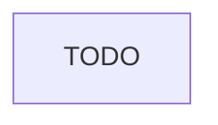

# Agent Lifecycle Management

> **One-line intent:** The trust ladder tells you what an agent CAN do; the lifecycle tells you how they get there and how you course-correct when they drift.

## Pattern in 60 Seconds

_The entire pattern distilled into something anyone can read in under a minute. No jargon, no code. A CEO, an engineer, and an entrepreneur should all understand this section._

**The problem:** Organizations deploy AI agents with a trust level and a capability set — but no documented path from onboarding to autonomous operation, and no mechanism for course-correcting when the agent drifts or underperforms.

**The insight:** Agents have a lifecycle, just like employees. They onboard, they operate under supervision, they earn greater autonomy, they get performance-reviewed, and sometimes they get demoted. Documenting this lifecycle explicitly creates the structure for trust to accumulate safely.

**The key structure:**
- **Stage 1 — Onboarding:** Agent reads identity docs (soul, user context, operating manual); initial capability set defined; Mode 2 (draft + approve) by default
- **Stage 2 — Supervised Operations:** Every action logged; human reviews outcomes; trust ladder starts at minimum
- **Stage 3 — Guided Operations:** Agent proposes, human approves selectively; some Mode 3 (autonomous) actions unlocked
- **Stage 4 — Autonomous Operations:** Full Mode 3 for qualified action types; Mode 2 retained for high-stakes comms
- **Review & Calibration:** Periodic trust ladder audits; demotion path documented alongside promotion path

**What broke when we got this wrong:** Agents were deployed with capability sets but no lifecycle framework — no formal onboarding, no supervised phase, no review cadence. When drift occurred (wrong data in emails, skipped verification steps), there was no structured response other than "fix the prompt."

---

## Classification

| Property | Value |
|----------|-------|
| **Category** | Agentic Architecture |
| **Difficulty** | Intermediate |
| **Also Known As** | Agent Trust Ladder, Agent Onboarding Framework, Supervised-to-Autonomous Progression |

---

## Motivation

On April 9, 2026, while reviewing how the Cloud Nirvana AIOS had evolved over the prior two months, a gap became visible: the system had a trust ladder (Mode 1 / Mode 2 / Mode 3 — what the agent could do autonomously), but no documentation of how agents were supposed to get from onboarding to autonomous operation. There was no supervised phase spec, no performance review cadence, no demotion trigger. The agent had been promoted to certain autonomous behaviors through informal accumulation of "it worked last time" rather than structured trust verification.

This matters because AI agents, like new employees, need a ramp. You wouldn't give a new hire signing authority on day one. You'd start them with read-only access, watch their judgment, expand their authority as trust accumulated. But most agent deployments skip this entirely — the agent either has the capability or it doesn't. There's no concept of "you're authorized to draft emails but I read every one for the first month."

The lifecycle pattern makes this explicit. It separates the question of "what is the agent capable of technically" from "what is the agent authorized to do given current trust level." It creates a path from onboarding through supervised, guided, and autonomous operation — with explicit criteria for each transition and a documented demotion path for when things go wrong. The Prelude/Score document (analogous to an employee's onboarding kit) becomes the entry point. Performance reviews become the governance mechanism. The trust ladder becomes a living document, not a set-and-forget config.

Without this pattern, trust accumulation is invisible and trust loss is handled ad hoc. With it, you have a structured answer to "how did this agent earn autonomous email sending" and "what happens now that it made a mistake."

---

## Applicability

Use this pattern when:
- TODO

Do NOT use this pattern when:
- TODO

---

## Structure



_TODO: diagram caption_

---

## Participants

| Participant | Role | Example |
|------------|------|---------|
| TODO | TODO | TODO |

---

## How It Works

TODO

### Code / Configuration Example

```yaml
# TODO
```

---

## Consequences

### Benefits
- TODO

### Liabilities
- TODO

### What Broke in Practice
- No lifecycle = no supervised phase = agents deployed directly into quasi-autonomous operation without structured trust accumulation
- When drift occurred (wrong data in emails, skipped CRM verification), response was ad hoc prompt patching rather than structured trust recalibration
- No demotion path documented — "demotion" happened informally, inconsistently, without criteria

---

## Implementation Notes

TODO

### Variations
- TODO

### Common Pitfalls
- TODO

---

## Security Implications

TODO

### Attack Surface
- TODO

### Data Sensitivity
- TODO

### Failure Modes
- TODO

### Mitigations
- TODO

---

## Known Uses

| Organization | Context | Scale |
|-------------|---------|-------|
| Cloud Nirvana | AIOS agent trust ladder (Mode 1/2/3) with documented progression log — informal lifecycle, pattern formalizes it | Team |

---

## Related Patterns

| Pattern | Relationship |
|---------|-------------|
| Memory vs. Authority Boundary | Verification discipline is a lifecycle requirement at each trust tier |
| Checkpoint-Gated Autonomy for Stateless Agents | Checkpoint pattern enables async approval within the lifecycle's supervised phase |
| Cron as Task Runner, Not Task Definer | Task routing decoupled from agent identity — lifecycle manages the agent, not the task |

---

## Metadata

| Property | Value |
|----------|-------|
| **Contributor** | Sean Erikson, Cloud Nirvana |
| **Production Environment** | Cloud Nirvana AIOS, macOS, small team |
| **First Published** | 2026-05-29 |
| **Last Updated** | 2026-05-29 |
| **Cloud Nirvana Event** | TBD |
| **License** | CC BY 4.0 |

---

## Revision History

| Date | Change | Author |
|------|--------|--------|
| 2026-05-29 | Inception stub — origin story, 60 seconds, classification, motivation | Lou / Sean Erikson |
