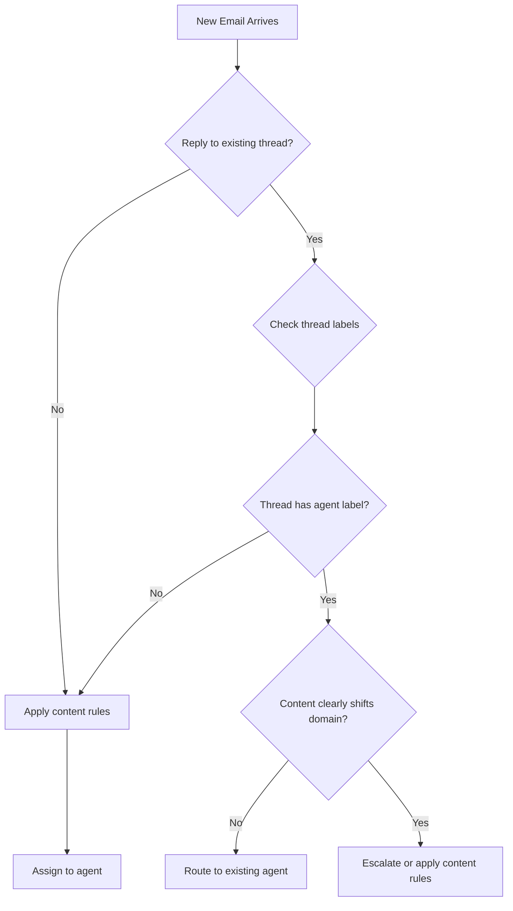

# Thread Continuity Routing

> **One-line intent:** Route email replies to match thread's existing agent assignment, not just keyword matching, preserving conversation context across multi-message exchanges.

## Pattern in 60 Seconds

**The problem:** Keywords in a reply can trigger wrong routing when the conversation already belongs to a different agent.

**The insight:** Threads have routing memory. The first message establishes context; replies should inherit it unless content clearly shifts domains.

**The key structure:**
- Check thread's existing labels before applying content rules
- If thread has agent label → route reply to same agent
- Override only if reply comes from new sender changing topic entirely

**What broke when we got this wrong:** Patent attorney's reply containing "referral" was routed to Partnerships agent because keyword matched, but the thread was CEO's patent attorney search. Broke conversation continuity, created duplicate work.

---

## Classification

| Property | Value |
|----------|-------|
| **Category** | Agentic Architecture |
| **Difficulty** | Intermediate |
| **Also Known As** | Conversation Continuity, Thread-Aware Routing, Sticky Thread Assignment |

---

## Motivation

You're building a multi-agent email system. Each agent handles a domain: partnerships, events, speakers, finance, etc. You route incoming emails using keyword matching and domain rules.

It works great for the first message in a conversation. Then this happens:

Your CEO is searching for a patent attorney. He emails a contact asking for referrals. The reply comes back: "I'd recommend Bryan Jeffries. Here's his referral link."

Your routing system sees "referral" in the body. It routes the email to your Partnerships agent (because "referral" matches partnership keyword rules). The Partnerships agent has no context about patent attorneys, drafts a confused response, and the CEO gets a notification about a partnership draft when he was expecting patent attorney contact info.

The thread context was clear: this is a CEO personal matter about finding a patent attorney. But the routing system treated each message independently.

**The failure mode:** Content-based routing without thread awareness treats every message as a new conversation, breaking continuity and creating misrouted work.

---

## Applicability

Use this pattern when:
- Multi-agent systems route based on keywords/content
- Conversations span multiple messages
- Agent assignment should persist across a thread
- Users expect context preservation (not starting fresh each time)

Do NOT use this pattern when:
- Single-message interactions only (support tickets, notifications)
- Explicit re-routing is expected behavior (forwarding to different department)
- Thread context is unreliable (mailing lists, forwards with quoted history)

---

## Structure



**Flow:** Thread continuity check fires BEFORE content rules. If thread already has agent assignment and content doesn't clearly shift, preserve the assignment.

---

## Participants

| Participant | Role | Example |
|------------|------|---------|
| **Triage Agent** | Reads thread history, checks existing labels | Lou (orchestrator) |
| **Thread Store** | Persists conversation metadata across messages | Gmail thread API, email headers (In-Reply-To, References) |
| **Routing Rules** | Content-based classification fallback | EMAIL-ROUTING.md priority chain |
| **Agent Labels** | Mark which agent owns a thread | Gmail labels: AIOS/Mic, AIOS/Scout, AIOS/CEO-Escalations |

---

## How It Works

1. **New message arrives** → Triage agent fetches full thread (not just latest message)
2. **Check thread labels** → If any agent label exists, thread has established ownership
3. **Read thread context** → Review previous messages to understand conversation arc
4. **Evaluate content shift** → Does this reply change the topic enough to warrant re-routing?
   - Same sender continuing conversation → preserve routing
   - Reply from different party on same topic → preserve routing
   - New sender introducing unrelated topic → override and re-route
5. **Apply routing:**
   - If preserving: add same label to new message
   - If shifting: escalate to orchestrator or apply content rules
6. **Document decision** → Log why routing was preserved or overridden (audit trail)

### Configuration Example

**Priority Chain (EMAIL-ROUTING.md):**

```markdown
## Processing Order

1. Is it starred? → STOP. Don't touch it.
2. **Thread continuity check** → If thread has agent label and content doesn't shift, preserve routing
3. Domain rule match? → Route per domain table
4. Content rule match? → Route per content table
5. Still unsure? → CEO Escalations
```

**Thread Continuity Rule:**

```python
def check_thread_continuity(message, thread):
    # Get existing labels from thread
    thread_labels = get_thread_labels(thread.id)
    agent_labels = [l for l in thread_labels if l.startswith("AIOS/")]
    
    if not agent_labels:
        return None  # No established routing, fall through to content rules
    
    # Check if content clearly shifts domain
    if content_shifts_domain(message, thread):
        return "ESCALATE"  # Needs human review or re-triage
    
    # Preserve existing routing
    return agent_labels[0]  # Return established agent label

def content_shifts_domain(message, thread):
    # Heuristics for domain shift:
    # - New sender not in thread history
    # - Subject line changed significantly
    # - Body contains explicit routing request ("Hey Agent X")
    # - Content keywords don't match thread topic
    return False  # Conservative: default to preserving continuity
```

---

## Consequences

### Benefits
- **Preserves conversation context** — Agent sees full thread, can draft coherent replies
- **Reduces duplicate work** — No two agents competing to answer same thread
- **Matches user expectations** — Conversations stay with one agent, not bouncing around
- **Simplifies escalations** — When agent can't handle new twist in thread, escalate to orchestrator

### Liabilities
- **Can miss legitimate domain shifts** — Reply about event logistics in a partnership thread might get stuck with wrong agent
- **Requires thread storage/API** — Need to fetch full thread history, not just latest message
- **Harder to test** — Thread-level behavior requires multi-message test scenarios

### What Broke in Practice

**Bryan Jeffries patent attorney case (March 26, 2026):**
- Thread: CEO emailed contact asking for patent attorney referral
- Reply contained word "referral" 
- Content rules routed to Partnerships agent (keyword match)
- Partnerships agent had zero context, created confused draft
- **Fix:** Added thread continuity check before content rules. Now checks if thread already has CEO-Escalations label, preserves it regardless of keywords.

**First implementation was too aggressive:**
- Applied thread continuity to ALL replies, even when sender shifted topic
- Partner replied to event thread asking about different event → stuck in wrong event context
- **Fix:** Added "content shifts domain" heuristic. If subject changes, sender is new to thread, or body contains explicit routing request, allow re-triage.

---

## Implementation Notes

### Variations

**Strict Continuity:**
- Thread routing NEVER changes once established
- All topic shifts escalate to orchestrator
- Best for: personal email, executive assistants, low-volume high-context scenarios

**Hybrid Continuity (recommended):**
- Preserve routing by default
- Override on clear domain shifts (subject change, new sender, explicit agent request)
- Best for: multi-agent systems, business email, mixed personal/operational

**Time-based expiration:**
- Thread routing "expires" after N days of inactivity
- Fresh reply after expiration gets re-triaged
- Best for: long-running support threads, community email

### Common Pitfalls

**Treating conversation view as thread:**
- Gmail conversation view groups by subject, NOT true email threading
- Use `In-Reply-To` and `References` headers for true threading
- Subject-based grouping can merge unrelated conversations

**Ignoring forwarded emails:**
- Forwarded email contains quoted history that looks like thread context
- Check `From` header against thread participants before applying continuity
- Forwards are NEW conversations, not replies

**No escape hatch:**
- Users need way to force re-routing (forward to different agent, explicit request)
- Always provide override mechanism (manual label change, "Hey [Agent]" keyword)

---

## Security Implications

### Attack Surface
- Malicious actor could reply to high-privilege thread (CEO Escalations) to inherit routing and bypass content filters
- Quoted/forwarded content could inject context that looks like legitimate thread history

### Data Sensitivity
- Thread history reveals conversation participants and topics
- Agent label on thread indicates who has access to sensitive content
- Cross-contamination risk if thread routing wrong (finance data leaking to events agent)

### Failure Modes
- If thread continuity breaks, sensitive reply might route to wrong agent
- Wrong agent sees PII, financial data, or strategic info outside their scope
- Blast radius: one misrouted message in established thread

### Mitigations
- **Verify sender identity:** Check `From` header is known participant before preserving routing
- **Audit thread routing decisions:** Log why continuity was preserved or overridden
- **Escalate ambiguous cases:** When in doubt, route to orchestrator, not lowest-privilege agent
- **Time-box continuity:** Consider expiring thread routing after 30-90 days
- **Manual override:** Let users force re-routing with explicit agent mention

---

## Known Uses

| Organization | Context | Scale |
|-------------|---------|-------|
| Cloud Nirvana AIOS | 11-agent email orchestration system | ~100-200 emails/week, 7 active threads/day |
| (Seeking contributions) | | |

---

## Related Patterns

| Pattern | Relationship |
|---------|-------------|
| Email Triage Priority Chain | Thread Continuity fires FIRST in the priority chain, before content rules |
| Hub-and-Spoke Orchestration | When thread shifts domain, escalate to hub (Lou) for coordination |
| Files Over Databases | Thread routing state can be stored in per-thread markdown files or labels |
| Ladder of Trust | Thread continuity requires agent earned trust to handle evolving conversation |

---

## Metadata

| Property | Value |
|----------|-------|
| **Contributor** | Sean Erikson, CEO, Cloud Nirvana |
| **Production Environment** | Gmail + OpenClaw, 11 agents, Mac Mini local |
| **First Published** | 2026-04-05 (draft) |
| **Last Updated** | 2026-04-05 |
| **Cloud Nirvana Event** | AI Tinkerers Columbus (demo), 2026-04-07 |
| **License** | CC BY 4.0 |
| **Status** | Draft — backlog, not published to Open Patterns repo yet |

---

## Revision History

| Date | Change | Author |
|------|--------|--------|
| 2026-04-05 | Initial draft for backlog | Sean Erikson / Lou |
