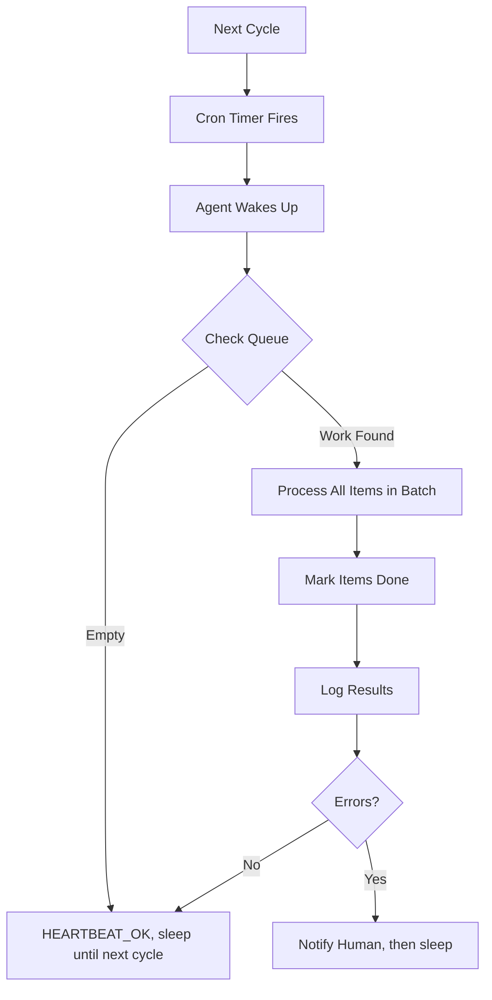

# Cron-Driven Agent Execution

> **One-line intent:** Agents execute on schedule (cron), not on-demand, to batch work, prevent race conditions, and enable autonomous operations without human triggers.

## Pattern in 60 Seconds

**The problem:** On-demand agent execution creates race conditions, burns API costs on redundant checks, and requires human triggers for routine work.

**The insight:** Scheduled batch execution at fixed intervals naturally rate-limits API calls, eliminates race conditions (one agent processes queue at a time), and enables true autonomy.

**The key structure:**
- One cron per agent (not per task)
- Staggered timing across the hour
- Agent checks queue → processes all work → marks done → waits for next cycle

**What broke when we got this wrong:** 169 cron runs/day across agents burned tokens on redundant inbox checks. Reduced to 69/day (hourly instead of every 15 min) saved 60% cost with zero quality loss.

---

## Classification

| Property | Value |
|----------|-------|
| **Category** | Cost & Operations |
| **Difficulty** | Intermediate |
| **Also Known As** | Scheduled Agent Execution, Batch Agent Processing, Timer-Based Agents |

---

## Motivation

You've built a multi-agent email system. Each agent handles a domain: speakers, partnerships, events, etc. Your first implementation: agents trigger on every new email arrival.

**Week 1:** Works great. Feels responsive. Agents jump on emails immediately.

**Week 2:** You notice duplicate drafts. Two agents both processed the same email because they fired simultaneously. You add locking.

**Week 3:** API bill arrives. You're polling Gmail every 60 seconds across 10 agents. That's 14,400 API calls/day, most returning "no new emails."

**Week 4:** You add smarter polling. But now agents miss emails because polling intervals don't align with delivery times. Users complain about delays.

You need batching, but you don't want to sacrifice responsiveness. You need predictable timing, but you don't want race conditions.

**The realization:** Most email work isn't urgent. Responding in 15 minutes vs 60 minutes makes zero difference to the recipient. Batch processing at fixed intervals gives you cost control, eliminates races, and simplifies monitoring.

---

## Applicability

Use this pattern when:
- Work arrives in unpredictable bursts (email, webhooks, file uploads)
- Processing latency of 15-60 min is acceptable
- Multiple agents might process the same item (race condition risk)
- API rate limits or costs are a concern
- Autonomous operation without human triggers is desired

Do NOT use this pattern when:
- Real-time response required (chat bots, live support)
- Work is event-driven with dependencies (order processing pipeline)
- Single-threaded processing guaranteed by platform (queue with exclusive consumer)
- Human approval needed before ANY action (supervised-only agents)

---

## Structure



**Key insight:** Queue is the shared state. Cron is the synchronization mechanism. Each agent processes its entire queue in one batch, then sleeps.

---

## Participants

| Participant | Role | Example |
|------------|------|---------|
| **Cron Scheduler** | Fires agent at fixed intervals | OpenClaw cron, systemd timer, Kubernetes CronJob |
| **Agent** | Processes all queued work in batch | Mic (speaker QA), Scout (partnerships), Vega (events) |
| **Queue** | Holds unprocessed work | Gmail label (AIOS/Mic minus Done), filesystem directory, database table |
| **Done Marker** | Prevents reprocessing | Gmail label (AIOS/Done), `.processed` file, `status=complete` column |

---

## How It Works

### Cron Definition

Each agent gets ONE cron job. Not task-specific; agent-specific.

**Example (speaker QA agent):**
```yaml
schedule:
  kind: cron
  expr: "0 */1 6-18 * * *"  # Every hour, 6 AM - 6 PM ET
  tz: "America/New_York"

payload:
  kind: agentTurn
  message: |
    Check your queue (AIOS/Mic folder, emails without Done label).
    Process all speaker submissions. For each:
    1. Review against QA criteria
    2. Draft feedback email
    3. Write to PENDING-APPROVALS.md
    4. Notify Sean via Telegram
    
    If queue is empty, reply HEARTBEAT_OK.

delivery:
  mode: announce
  channel: telegram
  to: sean@cloudnirvana.org
  bestEffort: true
```

### Agent Execution Flow

1. **Cron fires** → Agent session starts with task prompt
2. **Query queue:**
   ```bash
   gog gmail messages list \
     --label "AIOS/Mic" \
     --exclude-label "AIOS/Done" \
     --max-results 50
   ```
3. **Batch process:**
   - For each message: read, evaluate, take action
   - Natural rate limiting (one agent, sequential processing)
   - No race conditions (Done label prevents duplicate work)
4. **Mark done:**
   ```bash
   gmail-msg-modify.sh <msg_id> --add "AIOS/Done"
   ```
5. **Report results:**
   - If work done → announce summary
   - If queue empty → `HEARTBEAT_OK` (silent)
   - If errors → notify with details
6. **Session ends** → Agent sleeps until next cron

### Staggered Timing

**Problem:** All agents firing at :00 creates API burst, potential rate limits.

**Solution:** Stagger across the hour.

```
:00 — Email triage (Lou)
:15 — Mic (speakers)
:30 — Scout (partnerships)
:45 — Vega (events)
Next hour :00 — Triage again
```

**Result:** Smooth API usage, no contention, easier monitoring (errors are time-isolated).

---

## Consequences

### Benefits
- **Cost control:** API calls proportional to cron frequency, not email volume
- **No race conditions:** One agent per queue, sequential processing
- **Predictable timing:** Easy to reason about "when will this be processed?"
- **Natural rate limiting:** Agent can't overwhelm APIs (batches naturally throttle)
- **Autonomous operation:** No human trigger needed for routine work
- **Simplified monitoring:** Cron failures are obvious (job didn't run), performance issues are time-boxed

### Liabilities
- **Latency:** Work waits until next cron cycle (15-60 min typical)
- **Batch failures:** If agent crashes mid-batch, entire queue waits until next cycle
- **Cron sprawl:** Many agents = many cron jobs to manage
- **Testing complexity:** Can't trigger agent on-demand, must wait for cron or manually invoke

### What Broke in Practice

**Token burn (Feb-Mar 2026):**
- Started with every-15-min crons for all agents (169 runs/day)
- Most runs: "no new emails" → wasted tokens on model load
- **Fix:** Reduced to hourly (69 runs/day). 60% cost savings, zero user-visible impact.
- **Lesson:** Responsiveness illusion. 15 min vs 60 min SLA doesn't matter for email work.

**Race condition (pre-cron):**
- Event-driven execution: new email → trigger all agents
- Two agents drafted responses to same multi-domain email
- **Fix:** Cron-based execution. Only one agent processes queue at a time. Done label prevents duplicate work.

**Cron frequency mismatch:**
- Email triage every 15 min, agent processing every 60 min
- Emails sat in agent folders for 45+ min after triage
- **Fix:** Aligned frequencies. Triage at :00, agents at :15/:30/:45. Max latency now 15 min.

---

## Implementation Notes

### Variations

**High-Frequency (every 5-15 min):**
- For time-sensitive work (support tickets, live events)
- Cost: higher token usage
- Use case: customer-facing responsiveness

**Low-Frequency (hourly, daily):**
- For batch analytics, reports, cleanup
- Cost: minimal
- Use case: background maintenance, non-urgent coordination

**Event-Driven Hybrid:**
- Cron for routine checks
- Webhook for urgent items that need immediate processing
- Best of both: autonomous + responsive

**Time-Windowed:**
- Cron only runs during business hours (6 AM - 6 PM)
- Outside window: queue grows, processes next morning
- Use case: work-life balance, cost optimization

### Common Pitfalls

**Too frequent:**
- Every 5 min feels responsive but burns tokens
- Most runs return empty queue
- **Fix:** Start hourly, measure actual latency impact, only increase frequency if users complain

**Too infrequent:**
- Daily cron for urgent work creates bad UX
- 24-hour SLA when users expect same-day
- **Fix:** Align frequency with user expectations, not cost optimization alone

**No heartbeat differentiation:**
- Agent announces "queue empty" every cycle → spam
- **Fix:** Use `HEARTBEAT_OK` for empty queue (silent), only announce when work done or errors

**Cron without Done marker:**
- Agent processes same item every cycle (no idempotency)
- **Fix:** Always mark work complete. File flag, database status, label, whatever persists.

---

## Security Implications

### Attack Surface
- Scheduled execution can't be paused mid-attack (no "stop the presses" button)
- Compromised cron job runs with full agent permissions
- Predictable timing → attacker knows when agent will wake up

### Data Sensitivity
- Agent processes entire queue in batch → sees all data at once
- Failed cron run → data sits unprocessed, potentially leaking context in logs
- Cron output might include PII in error messages

### Failure Modes
- Cron doesn't fire → work queues indefinitely
- Agent crashes mid-batch → partial processing, inconsistent state
- Done marker fails → duplicate processing, duplicate emails sent

### Mitigations
- **Idempotency:** Design agents to safely reprocess items (Done marker is primary defense)
- **Cron monitoring:** Alert if job doesn't run or fails repeatedly
- **Queue size limits:** Cap batch size to prevent OOM or timeout
- **Graceful degradation:** If agent can't process item, mark for human review, don't block queue
- **Audit logging:** Track what was processed when, for forensics

---

## Known Uses

| Organization | Context | Scale |
|-------------|---------|-------|
| Cloud Nirvana AIOS | 11 agents, email orchestration + CRM maintenance | 69 cron runs/day, ~100-200 emails/week processed |
| (Seeking contributions) | | |

---

## Related Patterns

| Pattern | Relationship |
|---------|-------------|
| [Context Cost Control](../memory-context/context-cost-control.md) | For memory cost control via retrieval tuning and distillation |
| Email Triage Priority Chain | Cron-driven triage populates agent queues, agents process on their schedule |
| Files Over Databases | Queue can be filesystem directory; cron agent lists files, processes, moves to `done/` |
| REM Cycle | Nightly cron is specialized case: maintenance work during idle time |
| Hub-and-Spoke Orchestration | Hub (Lou) runs on cron, coordinates specialist agents who also run on cron |
| Local LLM Classification Layer | Cron can invoke local LLM for classification, then queue work for cloud agent |

---

## Metadata

| Property | Value |
|----------|-------|
| **Contributor** | Sean Erikson, CEO, Cloud Nirvana |
| **Production Environment** | OpenClaw + Gmail, Mac Mini M4, 11 agents |
| **First Published** | 2026-04-05 (draft) |
| **Last Updated** | 2026-04-05 |
| **Cloud Nirvana Event** | AI Tinkerers Columbus (demo), 2026-04-07 |
| **License** | CC BY 4.0 |
| **Status** | Draft — backlog, not published to Open Patterns repo yet |

---

## Revision History

| Date | Change | Author |
|------|--------|--------|
| 2026-04-05 | Initial draft for backlog | Sean Erikson / Lou |
