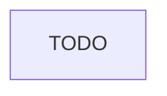

# Fit-for-Purpose Model Routing

> **One-line intent:** Classify task complexity first, then route to the minimum-viable model — using a frontier model for email triage is 100x the cost for zero quality gain.

## Pattern in 60 Seconds

_The entire pattern distilled into something anyone can read in under a minute. No jargon, no code. A CEO, an engineer, and an entrepreneur should all understand this section._

**The problem:** Teams default to their best (most expensive) model for every task. Triage runs on Opus. Classification runs on Sonnet. Every operation costs frontier-model rates regardless of whether the task needed it.

**The insight:** Task complexity and model capability need to match. A three-tier routing model — local LLM for classification/triage, mid-tier for drafting/research, frontier for strategy/architecture — cuts costs dramatically while maintaining quality where it matters.

**The key structure:**

| Tier | Model | Cost | Tasks |
|------|-------|------|-------|
| Local | Ollama Qwen 3 8B (or similar) | $0/call | Classification, triage, routing, labeling, extraction |
| Mid-tier | Claude Sonnet / GPT-4o | Low | Drafting, research, summarization, structured generation |
| Frontier | Claude Opus / o1 | High | Strategy, architecture, complex reasoning, novel synthesis |

**What broke when we got this wrong:** Cloud Nirvana AIOS initially ran all email triage on a frontier model. Every "is this spam or a partner email?" decision cost frontier rates. Switching triage to local Ollama Qwen 3 8B cut per-email cost to $0 with identical routing quality.

---

## Classification

| Property | Value |
|----------|-------|
| **Category** | Cost & Operations |
| **Difficulty** | Intermediate |
| **Also Known As** | Model Tiering, Task-Complexity Routing, LLM Cost Optimization, Minimum-Viable-Model Selection |

---

## Motivation

When Cloud Nirvana built its AIOS email pipeline, the initial implementation used a single model for everything — the best available at the time. The reasoning was straightforward: better model, better results, lower risk of mistakes. This logic holds when tasks are uniformly complex. It breaks down entirely when tasks vary by two orders of magnitude in cognitive demand.

Email triage — "is this a partner inquiry, a speaker application, a newsletter, or noise?" — is a classification task. It requires reading a short text and assigning a category from a fixed list. A local 8-billion-parameter model running on a Mac mini does this as well as a frontier model. The difference in answer quality is unmeasurable. The difference in cost is 100x. When triage runs hundreds of times per week, this isn't a rounding error — it's the difference between a sustainable operational cost and an unsustainable one.

The insight that makes this pattern work is separating task classification from model selection. Before routing a task to a model, the system first asks: what kind of task is this? Classification tasks go local. Drafting and research tasks go mid-tier. Tasks requiring genuine strategic reasoning, novel synthesis, or complex multi-step judgment go frontier. The routing decision itself is cheap — a simple classifier or rule set. The savings compound across every task in the pipeline.

This pattern also prevents a subtler failure mode: model capability anxiety. Teams that default to frontier models for everything are often doing so because they're uncertain about quality thresholds — "what if the cheaper model gets it wrong?" The answer is to measure. Run the same task across tiers and compare outputs. For classification and triage, local models consistently match frontier quality at a fraction of the cost. The pattern forces that measurement conversation and replaces anxiety-driven model selection with evidence-driven routing.

---

## Applicability

Use this pattern when:
- TODO

Do NOT use this pattern when:
- TODO

---

## Structure



_TODO: diagram caption_

---

## Participants

| Participant | Role | Example |
|------------|------|---------|
| TODO | TODO | TODO |

---

## How It Works

TODO

### Code / Configuration Example

```python
# TODO
```

---

## Consequences

### Benefits
- TODO

### Liabilities
- TODO

### What Broke in Practice
- All email triage initially ran on frontier model — identical quality achievable at $0/call with local Ollama Qwen 3 8B
- No measurement baseline meant "better model = safer choice" thinking persisted longer than it should have
- Task complexity classification step was missing — routing happened by feel, not by explicit task type

---

## Implementation Notes

TODO

### Variations
- TODO

### Common Pitfalls
- TODO

---

## Security Implications

TODO

### Attack Surface
- TODO

### Data Sensitivity
- TODO

### Failure Modes
- TODO

### Mitigations
- TODO

---

## Known Uses

| Organization | Context | Scale |
|-------------|---------|-------|
| Cloud Nirvana | AIOS email pipeline — triage on Ollama Qwen 3 8B, drafting on Sonnet, strategy on Opus | Team |

---

## Related Patterns

| Pattern | Relationship |
|---------|-------------|
| Agent Lifecycle Management | Trust tier and model tier should align — supervised agents may warrant more expensive verification |
| Memory vs. Authority Boundary | Verification queries (SoR lookups) are classification tasks — route to local or mid-tier |
| Cron as Task Runner, Not Task Definer | Task type metadata from WMS can inform model routing decision |

---

## Metadata

| Property | Value |
|----------|-------|
| **Contributor** | Sean Erikson, Cloud Nirvana |
| **Production Environment** | Cloud Nirvana AIOS, macOS, Ollama local + Anthropic API, small team |
| **First Published** | 2026-05-29 |
| **Last Updated** | 2026-05-29 |
| **Cloud Nirvana Event** | TBD |
| **License** | CC BY 4.0 |

---

## Revision History

| Date | Change | Author |
|------|--------|--------|
| 2026-05-29 | Inception stub — origin story, 60 seconds, classification, motivation | Lou / Sean Erikson |
