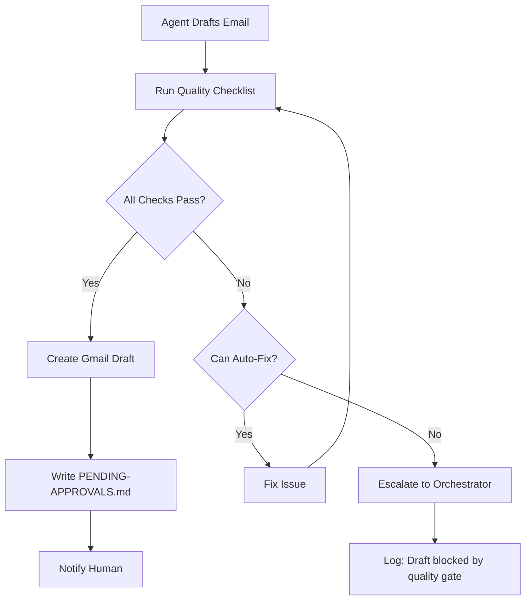

# Quality Gate Checkpoint

> **One-line intent:** All agents verify drafts against shared quality checklist before notifying human, preventing low-quality drafts from reaching review queue.

## Pattern in 60 Seconds

**The problem:** Agents create drafts with preventable mistakes (wrong CC, stale logos, missing context, bad tense), wasting human review time.

**The insight:** Most quality issues follow patterns. Agents can self-check against a checklist before requesting approval.

**The key structure:**
- Shared quality checklist (8-10 items)
- Agent runs checklist after drafting, before notification
- Failed check → fix or escalate, don't send draft
- Passed check → create draft + notify human

**What broke when we got this wrong:** Early agent drafts had CC preservation failures, broken logo URLs, wrong tense ("tomorrow's meeting" in 4-day-old email), missing thread context. Human had to reject drafts, explain issue, wait for redraft.

---

## Classification

| Property | Value |
|----------|-------|
| **Category** | Production Readiness |
| **Difficulty** | Intermediate |
| **Also Known As** | Pre-Approval Quality Check, Draft Validation Gate, Self-Review Pattern |

---

## Motivation

You've built agents that draft emails. They read incoming messages, compose replies, create Gmail drafts, notify you for approval. It works.

Then you start noticing patterns:

**Week 1:** Agent forgot to CC the original CC recipients. You have to tell it "always preserve CC." It resubmits.

**Week 2:** Agent used a recalled logo URL instead of reading the canonical source file. Broken image in email. You reject the draft.

**Week 3:** Agent replied to a 4-day-old email with "I'll see you at tomorrow's meeting" (meeting already happened). Wrong tense. Reject.

**Week 4:** Agent drafted response to multi-domain email without checking if other agents already handled their piece. Duplicate work.

Each mistake is preventable. Each mistake burns your time reviewing and rejecting. The agent has all the information to self-check, it just doesn't.

**The realization:** You don't need perfect drafts. You need drafts that pass basic quality gates BEFORE they hit your review queue. Shift quality left—from human review to agent self-check.

---

## Applicability

Use this pattern when:
- Agents draft content for human approval (emails, docs, social posts)
- Recurring quality issues follow predictable patterns
- Human review time is expensive/limited
- Agents have access to ground truth for validation (files, APIs, thread context)

Do NOT use this pattern when:
- Content is highly subjective (creative writing, marketing copy where "quality" is taste)
- Quality gates are computationally expensive (running full test suite for every draft)
- Agents lack information to self-validate (need human judgment on tone, appropriateness)
- Approval process is instantaneous anyway (no review queue backlog)

---

## Structure



**Key principle:** Quality gate runs AFTER drafting but BEFORE notification. Failed checks never reach human unless agent can't resolve them.

---

## Participants

| Participant | Role | Example |
|------------|------|---------|
| **Agent** | Drafts content, runs self-check | Mic (speaker QA), Scout (partnerships), Vega (events) |
| **Quality Checklist** | Shared validation rules | `docs/operations/QUALITY-GATE-STEP.md` |
| **Source of Truth** | Ground truth for validation | EMAIL-SIGNATURES.md (current logo), thread API (CC list), CRM (event dates) |
| **Orchestrator** | Handles escalations for unfixable issues | Lou |

---

## How It Works

### Quality Checklist (Example from Cloud Nirvana AIOS)

**Step 5b: Quality Gate (before creating draft)**

Before writing to PENDING-APPROVALS.md or creating a Gmail draft, verify:

1. **CC Preservation**
   - Read entire thread (not just latest message)
   - Extract CC list from original message
   - Ensure draft CC includes all original recipients
   - If unsure → escalate

2. **Calendar Placeholder**
   - If email requests meeting/call times
   - Draft includes `[SEAN: INSERT AVAILABLE TIMES]` placeholder
   - Never invent meeting times (work calendar not visible)

3. **Voice Match**
   - If drafting as Sean → use Sean's signature + agent attribution
   - If agent's own voice → use agent signature
   - Never mix (don't sign Sean's name with agent voice)

4. **Logo/Asset Freshness**
   - If including logo/signature
   - Read canonical source file (`EMAIL-SIGNATURES.md`)
   - Never use recalled URL or cached value
   - **Source of Truth over Recall**

5. **Thread Context**
   - Read full thread, not just latest message
   - Draft references prior context appropriately
   - If reply is >24h delayed, acknowledge the delay

6. **Date/Time Accuracy**
   - Compare email date to today's date
   - Use correct tense (past/future)
   - Never say "tomorrow" for past events or "yesterday" for future

7. **Cross-Agent Coordination**
   - If multi-domain email, check if other agents already drafted
   - Read done-logs for this email
   - If draft would duplicate, coordinate with orchestrator

8. **Template Compliance**
   - If using email template (event confirmation, partnership welcome)
   - Verify all required fields populated
   - No `[PLACEHOLDER]` or `TBD` in final draft

### Agent Self-Check Code

```python
def quality_gate_check(draft, context):
    """
    Runs quality checklist before creating Gmail draft.
    Returns: (passed: bool, issues: list)
    """
    issues = []
    
    # 1. CC Preservation
    thread_cc = get_thread_cc_list(context.thread_id)
    draft_cc = parse_cc_from_draft(draft)
    if not set(thread_cc).issubset(set(draft_cc)):
        issues.append("CC list incomplete: missing " + 
                     str(set(thread_cc) - set(draft_cc)))
    
    # 2. Calendar Placeholder
    if needs_meeting_time(context.email):
        if '[SEAN: INSERT AVAILABLE TIMES]' not in draft:
            issues.append("Meeting request without calendar placeholder")
    
    # 3. Voice Match
    expected_voice = get_expected_voice(context.agent_id, draft)
    if not voice_matches(draft.signature, expected_voice):
        issues.append(f"Voice mismatch: expected {expected_voice}")
    
    # 4. Logo/Asset Freshness
    if contains_logo(draft):
        canonical_logo = read_file('docs/operations/EMAIL-SIGNATURES.md')
        if get_logo_url(draft) != extract_logo_url(canonical_logo):
            issues.append("Stale logo URL - read EMAIL-SIGNATURES.md")
    
    # 5. Thread Context
    if not references_prior_messages(draft, context.thread):
        issues.append("Draft doesn't reference thread context")
    
    # 6. Date/Time Accuracy
    email_age_hours = (now() - context.email.date).hours
    if email_age_hours > 24 and uses_relative_time(draft):
        issues.append("Relative time in delayed reply (>24h old)")
    
    # 7. Cross-Agent Coordination (multi-domain emails)
    if context.is_multi_domain:
        other_drafts = check_done_logs(context.email_id)
        if other_drafts:
            issues.append(f"Other agents already drafted: {other_drafts}")
    
    # 8. Template Compliance
    if uses_template(draft):
        placeholders = find_placeholders(draft)
        if placeholders:
            issues.append(f"Unfilled placeholders: {placeholders}")
    
    return (len(issues) == 0, issues)

# In agent workflow:
draft = compose_email_draft(context)
passed, issues = quality_gate_check(draft, context)

if not passed:
    if can_auto_fix(issues):
        draft = fix_issues(draft, issues)
        # Re-run check after fixes
        passed, issues = quality_gate_check(draft, context)
    
    if not passed:
        escalate_to_orchestrator(
            message=f"Draft blocked by quality gate: {issues}",
            context=context
        )
        return  # Don't create draft or notify
    
# All checks passed
create_gmail_draft(draft)
write_pending_approvals(draft, context)
notify_human(context.agent_id, context.email_id)
```

---

## Consequences

### Benefits
- **Fewer rejected drafts:** Human review queue gets higher-quality submissions
- **Faster approval cycle:** Less back-and-forth for preventable issues
- **Scalable quality:** Checklist enforces standards across all agents
- **Early detection:** Issues caught before draft created, not during review
- **Self-documenting:** Checklist is the quality standard, agents and humans reference same doc

### Liabilities
- **Can't catch subjective issues:** Tone, appropriateness, strategic fit still need human judgment
- **Checklist maintenance:** New issue types require updating all agents
- **False positives:** Overly strict checks might block valid drafts
- **Execution time:** Running 8+ checks adds latency (typically <5s, but still)

### What Broke in Practice

**CC preservation failure (March 2026):**
- Agent read only latest message, not thread
- Missed CC recipients from original email
- Draft sent without CC → recipient complained
- **Fix:** Added thread-level CC check to quality gate. Prevented recurrence.

**Stale logo URL (March 27, 2026):**
- Agent recalled logo URL from memory/previous draft
- Logo file updated with new URL
- Draft had broken image
- **Fix:** Added "Logo/Asset Freshness" check. Forces reading EMAIL-SIGNATURES.md every time.

**Wrong tense in delayed reply (March 30, 2026):**
- Agent replied to 4-day-old email
- Draft: "I'll see you at tomorrow's meeting"
- Meeting already happened
- **Fix:** Added "Date/Time Accuracy" check. Compares email date to today, flags relative time in >24h delays.

**Multi-domain duplicate drafts (March 6, 2026):**
- Partnership+Events email
- Scout drafted partnership response
- Vega drafted events response
- Both notified Sean simultaneously
- **Fix:** Added "Cross-Agent Coordination" check. Reads done-logs before drafting.

---

## Implementation Notes

### Variations

**Blocking vs Warning:**
- **Blocking (recommended):** Failed check prevents draft creation
- **Warning:** Create draft anyway, flag issues in notification
- Use blocking for critical issues (CC, security), warnings for style/preferences

**Auto-Fix vs Escalate:**
- Some issues auto-fixable (read canonical file, reformat date)
- Others need human judgment (tone, appropriateness)
- Agent tries auto-fix first, escalates if can't resolve

**Tiered Checklists:**
- **Critical:** Must pass (CC, security, legal compliance)
- **Important:** Should pass (logo, tense, context)
- **Nice-to-have:** Preferences (formatting, style)

**Per-Agent Customization:**
- Shared checklist for all agents
- Agent-specific additions (e.g., speaker QA agents check rubric scoring)

### Common Pitfalls

**Checklist as bottleneck:**
- Too many checks → agents slow, approval delayed
- **Fix:** Focus on recurring issues with high human cost. Don't gold-plate.

**Stale checklist:**
- New issue types emerge, checklist not updated
- Agents keep making same mistake
- **Fix:** Review checklist monthly. Add new patterns as they appear.

**Over-automation:**
- Agent auto-fixes issues incorrectly
- Human has to review fix and original issue
- **Fix:** Conservative auto-fix. When in doubt, escalate.

**Quality gate drift:**
- Agents implement checklist inconsistently
- One agent has latest version, others don't
- **Fix:** Centralized checklist file. Agents read from single source of truth.

---

## Security Implications

### Attack Surface
- Quality checks might leak sensitive data in error messages (logging full CC list, email content)
- Auto-fix could introduce vulnerabilities (incorrect escaping, template injection)
- Checklist logic is attack surface (malicious email crafted to bypass checks)

### Data Sensitivity
- Quality gate sees full draft content + metadata (thread, CC, context)
- Failed checks logged → might include PII, strategic info
- Auto-fix might cache/store sensitive data temporarily

### Failure Modes
- Quality gate crashes → no draft created, work blocked
- False negative (bad draft passes checks) → human approves low-quality content
- False positive (good draft blocked) → human frustration, checklist ignored

### Mitigations
- **Minimal logging:** Log check results (pass/fail), not full content
- **Fail-open for non-critical:** If check can't run (API down), create draft with warning
- **Human override:** Let human approve draft even if quality gate failed (escape hatch)
- **Rate limiting:** If quality gate blocks >10 drafts/day, alert for review (possible attack or misconfiguration)
- **Audit trail:** Track which checks failed when, for pattern analysis

---

## Known Uses

| Organization | Context | Scale |
|-------------|---------|-------|
| Cloud Nirvana AIOS | 11 agents, email drafting for partnerships, events, speakers | ~20-30 drafts/week, quality gate deployed March 24, 2026 |
| (Seeking contributions) | | |

---

## Related Patterns

| Pattern | Relationship |
|---------|-------------|
| [Context Lifecycle Management](../memory-context/context-lifecycle-management.md) | Pre-distillation validation: verify extraction quality before archiving |
| Ladder of Trust | Quality gate is enforcement for Guided tier (execute with guardrails) |
| Memory vs Persistence Boundary | "Source of Truth over Recall" principle—read canonical file, don't recall |
| Hub-and-Spoke Orchestration | Failed quality checks escalate to hub (Lou) for resolution |
| Files Over Databases | Quality checklist stored in file (docs/operations/QUALITY-GATE-STEP.md) |
| Cron-Driven Agent Execution | Quality gate runs during agent cron, before creating draft |

---

## Metadata

| Property | Value |
|----------|-------|
| **Contributor** | Sean Erikson, CEO, Cloud Nirvana |
| **Production Environment** | Gmail + OpenClaw, 11-agent AIOS |
| **First Published** | 2026-04-05 (draft) |
| **Last Updated** | 2026-04-05 |
| **Cloud Nirvana Event** | AI Tinkerers Columbus (demo), 2026-04-07 |
| **License** | CC BY 4.0 |
| **Status** | Draft — backlog, not published to Open Patterns repo yet |

---

## Revision History

| Date | Change | Author |
|------|--------|--------|
| 2026-04-05 | Initial draft for backlog | Sean Erikson / Lou |
