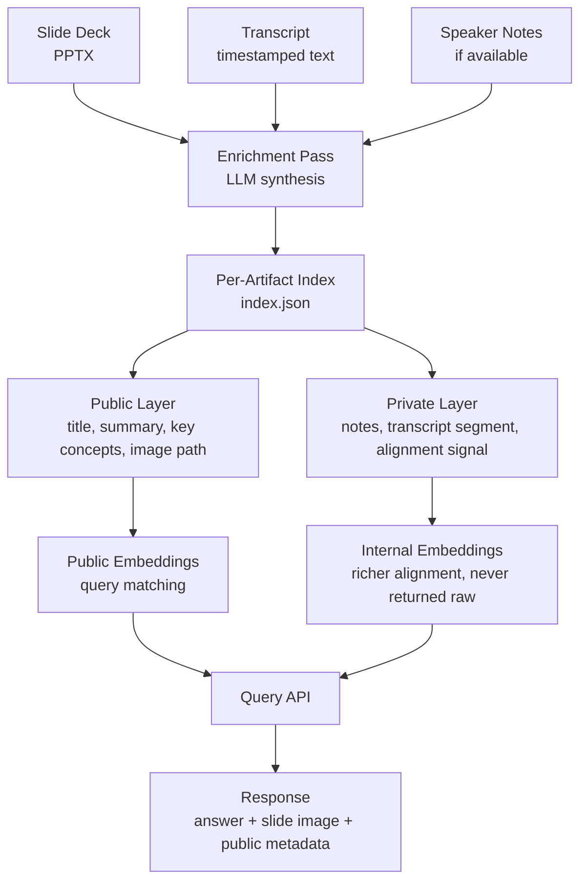

# Cross-Source Ingestion Enrichment

> **One-line intent:** Synthesize across heterogeneous source artifacts at ingestion time to produce rich, structured per-artifact metadata — so query recall is deep, response is fast, and privacy boundaries are structural rather than enforced by policy.

**Status:** `draft`
**Origin:** Reverb design session, May 30, 2026
**Implementation:** Cloud Nirvana AIOS — Reverb knowledge intelligence platform (slide + transcript enrichment pipeline)

---

## Pattern in 60 Seconds

**The problem:** Knowledge systems built from a single source type (text only, slides only, transcripts only) miss the richer story that emerges when sources are read together. And if you defer synthesis to query time, every query pays the cost.

**The insight:** Multiple source artifacts describing the same event — a presentation deck and its transcript, a video and its captions, a document and its meeting notes — can be synthesized once at ingestion time into structured per-artifact metadata that is faster to query, richer in context, and cleaner to govern than raw content alone.

**The key structure:**

| Stage | What Happens | Cost |
|-------|-------------|------|
| Ingestion (once) | LLM synthesizes across sources, generates per-artifact metadata | Paid once per artifact |
| Index build (once) | Embeddings built from enriched metadata, not raw content | Paid once per artifact |
| Query time (every request) | Search pre-built index, return pre-computed metadata | Near-zero synthesis cost |

**What broke when we got this wrong:** We designed Reverb's slide layer assuming speaker notes would carry the alignment signal. Then the question came: "What do we do with slides that have no notes?" The answer — leave them less discoverable than slides with notes — creates inconsistent retrieval quality across the corpus. The enrichment pass solves this by normalizing all artifacts to the same metadata quality floor, regardless of how much raw annotation they arrived with.

---

## Classification

| Property | Value |
|----------|-------|
| **Category** | RAG & Knowledge |
| **Difficulty** | Intermediate |
| **Also Known As** | Ingestion-Time Synthesis, Pre-Enriched Artifact Index, Cross-Modal Alignment |

---

## Motivation

You have a library of conference presentations. Each talk produced two artifacts: a slide deck and a transcript. Some decks have detailed speaker notes; others have none. The transcripts are 40–60 minutes of spoken language with no natural slide boundaries.

A community member asks: "What did Mike Doel say about managing context in LLM applications?" You want to return not just the relevant transcript excerpt but the actual slide that was on screen when he said it.

The naive approach — semantic search on transcript text, semantic search on slide text, hope they surface the same moment — works poorly. Transcript language is conversational; slide language is sparse bullet points. The two describe the same idea in structurally different ways. Direct embedding comparison misses the alignment.

The deeper problem: if you defer this synthesis to query time, every single query pays LLM latency and cost to figure out which slide matches which transcript segment. At scale, this is untenable. And it's unnecessary — the relationship between a slide and its corresponding transcript segment doesn't change. It's a fact about the corpus, not the query.

The right answer: do the synthesis work once, at ingestion, and bake the results into the artifact index. When a query arrives, the alignment is already there. Return it immediately.

Cloud Nirvana hit this directly while designing Reverb's slide layer (May 30, 2026). The question "what do we do with slides that have no notes?" forced the decision: accept inconsistent metadata quality across the corpus, or build an enrichment pass that normalizes quality for every artifact regardless of source completeness.

---

## Applicability

Use this pattern when:
- You have multiple source artifacts describing the same event or topic (slides + transcript, video + captions, document + notes)
- Source artifacts vary in annotation completeness (some have rich metadata, others have none)
- You need consistent retrieval quality across all artifacts regardless of source quality
- Query latency matters — synthesis cost must not be paid per query
- Privacy separation is required between internal-use content (speaker notes, raw alignment data) and public-facing content

Do NOT use this pattern when:
- Your source artifacts are uniform in type and quality (enrichment adds no normalization value)
- Corpus is small enough and static enough that per-query synthesis is acceptable
- You need real-time ingestion with no enrichment latency budget
- Sources are too divergent in subject matter to cross-reference meaningfully

---

## Structure



*The enrichment pass synthesizes across all available sources once at ingestion. The resulting index carries both a public layer (safe to return to any user) and a private layer (used internally for retrieval quality, never exposed). Query time touches only pre-computed artifacts.*

---

## Participants

| Participant | Role | Example |
|------------|------|---------|
| Source Artifacts | Raw inputs from different modalities | PPTX deck, timestamped transcript, speaker notes |
| Enrichment Engine | LLM pass that synthesizes across sources, runs once at ingestion | Claude synthesizing slide content + transcript segment into structured metadata |
| Enriched Index | Per-artifact JSON with public/private separation | `index.json` in `reverb/slides/{speaker}-{event}/` |
| Privacy Boundary | Structural separation in the data schema — not a runtime policy | `public` and `private` keys in each artifact record; query layer returns `public` only |
| Rendered Artifacts | Pre-generated display-ready versions of source content | Slide PNGs at `frames/slide_007.png` |
| Query Layer | Searches enriched embeddings at query time; assembles and returns only public metadata + rendered artifacts | Reverb MCP query endpoint |

---

## How It Works

1. **Ingest source artifacts.** The ingestion script receives all available sources for an event: the slide deck, the transcript, any existing speaker notes.

2. **Extract per-slide raw content.** For a slide deck: extract title, body text, and notes (if present) per slide using `python-pptx`. Render each slide as a PNG using LibreOffice headless.

3. **Chunk the transcript.** Split the transcript into time-bounded segments. For conference talks, natural pause points and topic transitions work well.

4. **Run the enrichment pass.** For each slide, send to the LLM:
   - Slide title + body text
   - Existing speaker notes (if any)
   - The full transcript (or the top-N most semantically similar transcript chunks as a pre-filter)

   The LLM returns structured metadata:
   - `summary`: What the speaker communicated on this slide, in their voice
   - `key_concepts`: Extractable topic tags for retrieval
   - `transcript_segment`: The timestamp range and text of the transcript most aligned with this slide
   - `speaker_voice`: Characterization of rhetorical intent (first-person lesson, framework introduction, case study, etc.)

5. **Build the enriched index.** Write `index.json` with one record per slide. Each record carries:
   - `public`: title, body text, summary, key concepts, image path — safe to return to any user
   - `private`: original notes, transcript segment, alignment signal — internal use only

6. **Generate embeddings.** Two embedding vectors per slide:
   - `public_embedding`: from public fields only
   - `internal_embedding`: from public fields + private fields (richer, better alignment)

   Store in the vector index. Query matching uses `internal_embedding` for recall; responses return `public` fields only.

7. **At query time:** Search the vector index → retrieve matching slide records → assemble response with answer + slide image(s) + public metadata. No synthesis happens at query time.

### Implementation Example

```python
# ingestion script pseudocode
def enrich_slide(slide_num, slide_content, transcript_chunks, llm):
    prompt = f"""
    You are enriching a conference slide for a knowledge index.
    
    Slide {slide_num}:
    Title: {slide_content['title']}
    Body: {slide_content['body']}
    Speaker notes: {slide_content['notes'] or 'none'}
    
    Most relevant transcript segments:
    {format_chunks(transcript_chunks)}
    
    Return JSON with:
    - summary: what the speaker communicated on this slide (2-3 sentences, in speaker's voice)
    - key_concepts: list of 3-6 topic tags
    - transcript_segment: {{start, end, text}} of the best-matching transcript passage
    - speaker_voice: one of [lesson, framework, case_study, data_point, call_to_action, transition]
    """
    enrichment = llm.complete(prompt, response_format="json")
    
    return {
        "slide_num": slide_num,
        "public": {
            "title": slide_content['title'],
            "body": slide_content['body'],
            "summary": enrichment['summary'],
            "key_concepts": enrichment['key_concepts'],
            "speaker_voice": enrichment['speaker_voice'],
            "image_path": f"frames/slide_{slide_num:03d}.png"
        },
        "private": {
            "notes_original": slide_content['notes'],
            "transcript_segment": enrichment['transcript_segment'],
        }
    }
```

---

## Consequences

### Benefits
- **Consistent retrieval quality regardless of source completeness.** Slides with no notes get the same metadata depth as slides with detailed notes. The enrichment pass normalizes the floor.
- **Query time is fast.** All LLM synthesis happens once at ingestion. Per-query cost is embedding lookup only.
- **Privacy is structural.** The public/private split is in the data schema. The query layer can't accidentally leak private content because it only reads the `public` key. Policy enforcement at the schema level is orders of magnitude more reliable than runtime filtering.
- **Richer embeddings without exposing source material.** Internal embeddings are built from private content (notes, raw transcript alignment) and therefore match queries more accurately — but the content that generated them is never returned.
- **Alignment as a byproduct.** Transcript-to-slide alignment — which would have been "Flavor 2" (harder, requires timestamp data) — falls out naturally from the enrichment pass. You get it for free.

### Liabilities
- **Ingestion latency increases.** LLM enrichment per artifact adds time. For a 40-slide deck this is seconds to minutes — acceptable for a batch pipeline, not for real-time.
- **Enrichment quality depends on LLM quality.** Bad transcript segmentation or a weak LLM prompt produces bad metadata. The index is only as good as the enrichment pass.
- **Re-enrichment on prompt changes.** If you improve the enrichment prompt significantly, you may want to re-run it on existing artifacts. Build your ingestion script to support idempotent re-runs.

### What Broke in Practice
- **The notes assumption.** First design assumed speaker notes would carry the primary alignment signal. When the question "what about slides with no notes?" surfaced, the architecture would have produced an inconsistent corpus. Explicit enrichment pass was the fix, not a workaround.
- **Single-source embeddings miss cross-modal meaning.** Early instinct was to embed slide text directly and embed transcript chunks directly, then match at query time. This fails because "token budget" in a slide bullet and "I learned the hard way that you need to be very explicit about how many tokens you allow in the context window" in spoken transcript describe the same thing but share almost no vocabulary. Enrichment-generated summaries bridge the modality gap at ingestion.

---

## Implementation Notes

### Variations
- **Document + meeting notes:** Same pattern applies when ingesting documents (design docs, RFCs) alongside meeting transcripts that discussed them. Enrich each document section with relevant meeting discussion.
- **Video + slides:** If recordings are available, slide timestamps from screen capture can seed the enrichment pass with precise alignment before the LLM refines it.
- **Podcast episodes:** Enrich transcript chunks with structured metadata (topic, guest voice characterization, rhetorical type) even when the only source is the transcript itself. The LLM still improves retrieval quality over raw text.
- **Tiered enrichment:** Run a fast, cheap enrichment pass first (topic tags only). Run a full enrichment pass later for high-value artifacts. The index supports both.

### Common Pitfalls
- **Enriching without chunking first.** Sending a 60-minute transcript to the LLM for a single slide alignment is expensive and produces worse results than sending the top 5 pre-filtered chunks. Pre-filter with cheap semantic search before the enrichment LLM call.
- **Mutating source files.** Don't write enrichment back into the original PPTX or transcript. Source files are the ground truth; the index is derived. Keep them separate.
- **Single embedding for both use cases.** Build two embeddings per artifact: one from public fields only (for public-facing search), one from all fields (for internal alignment quality). Using one vector for both leaks private content into public retrieval or degrades alignment quality.

---

## Security Implications

### Attack Surface
- The enrichment index contains two tiers of data at different sensitivity levels. Any path that returns raw index records rather than the `public` layer only is a data leak.
- The rendering pipeline (LibreOffice headless, image storage) adds a file-system attack surface if not sandboxed.

### Data Sensitivity
- **Private layer:** Speaker notes, raw transcript segments with speaker attribution, alignment confidence scores. Not for community consumption.
- **Public layer:** Summaries and key concepts generated from private content — check that LLM summarization doesn't inadvertently reproduce private phrasing verbatim.
- **Rendered images:** Slides may contain content the speaker considers proprietary. Establish speaker consent as a prerequisite for ingestion.

### Failure Modes
- Query layer bug returns `private` key alongside `public`. Mitigation: query layer explicitly selects only `public` fields by schema; never returns the full record.
- Enrichment LLM prompt injection via malicious slide content. Mitigation: treat slide content as untrusted input; sanitize before passing to LLM.

### Mitigations
- Schema-level privacy: query API is built against a view or serializer that only projects `public` fields. Private fields are not reachable from the API surface regardless of query construction.
- Speaker consent flag in the index. Artifacts without consent flag `ingested: false` and are excluded from all query results until consent is confirmed.

---

## Known Uses

| Organization | Context | Scale |
|-------------|---------|-------|
| Cloud Nirvana | Reverb knowledge intelligence platform — enriching conference talk slide decks against speaker transcripts for community-facing retrieval | ~40 talks, 4 years of CN events |

---

## Related Patterns

| Pattern | Relationship |
|---------|-------------|
| Metadata-Separated RAG Architecture | Complementary — this pattern defines what enriched metadata looks like; that pattern defines where it lives (vector store vs. relational store) |
| Checkpoint-Gated Autonomy | Structural parallel — both patterns do expensive, stateful work once and preserve the result; this pattern does it at ingestion, Checkpoint-Gated does it at agent decision time |

---

## Metadata

| Property | Value |
|----------|-------|
| **Contributor** | Lou (AIOS), Cloud Nirvana |
| **Production Environment** | Cloud Nirvana Reverb platform |
| **First Published** | 2026-05-30 |
| **Last Updated** | 2026-05-30 |
| **Cloud Nirvana Event** | Originated in Reverb design session |
| **License** | CC BY 4.0 |

---

## Revision History

| Date | Change | Author |
|------|--------|--------|
| 2026-05-30 | Initial draft | Lou (AIOS) |
