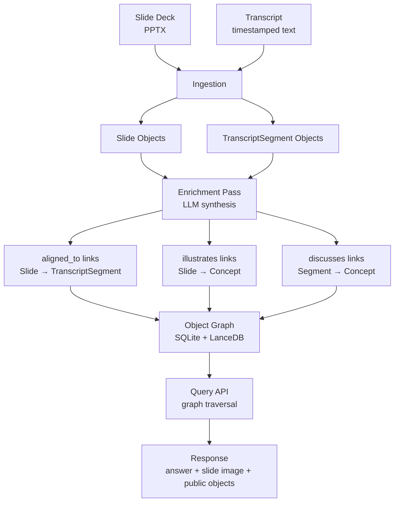

# Cross-Source Ingestion Enrichment

> **One-line intent:** Synthesize across heterogeneous source artifacts at ingestion time to create typed links between ontology objects — so query recall is deep, response is fast, and privacy boundaries are structural rather than enforced by policy.

**Status:** `draft`
**Origin:** Reverb design session, May 30, 2026
**Implementation:** Cloud Nirvana AIOS — Reverb knowledge intelligence platform (slide + transcript enrichment pipeline)

---

## Pattern in 60 Seconds

**The problem:** Knowledge systems built from a single source type (text only, slides only, transcripts only) miss the richer story that emerges when sources are read together. And if you defer synthesis to query time, every query pays the cost.

**The insight:** Multiple source artifacts describing the same event can be synthesized once at ingestion time. The synthesis doesn't produce metadata properties on documents — it creates **typed links between first-class objects in an ontology**. A Slide linked to a TranscriptSegment via `aligned_to` is a queryable relationship that exists once and is traversed for free at query time.

**The key structure:**

| Stage | What Happens | Cost |
|-------|-------------|------|
| Ingestion (once) | Objects created: Slides, TranscriptSegments, Concepts | Paid once |
| Enrichment (once) | LLM creates links: `aligned_to`, `illustrates`, `discusses` | Paid once per object |
| Index build (once) | Embeddings built from enriched objects, not raw content | Paid once |
| Query time (every request) | Traverse pre-built object graph, return public objects | Near-zero synthesis cost |

**What broke when we got this wrong:** First design used a flat `index.json` per slide deck — one file per deck containing slide metadata as JSON array elements. Cross-deck queries ("all slides about context management from any speaker") required iterating every file. That's a file cabinet, not a knowledge system. Modeling slides as first-class objects with typed links makes the same query a single graph traversal.

---

## Classification

| Property | Value |
|----------|-------|
| **Category** | RAG & Knowledge |
| **Difficulty** | Intermediate |
| **Also Known As** | Ingestion-Time Synthesis, Ontological Enrichment at Ingestion, Cross-Modal Link Creation |

---

## Motivation

You have a library of conference presentations. Each talk produced two artifacts: a slide deck and a transcript. Some decks have detailed speaker notes; others have none. The transcripts are 40–60 minutes of spoken language with no natural slide boundaries.

A community member asks: "What did Mike Doel say about managing context in LLM applications?" You want to return not just the relevant transcript excerpt but the actual slide that was on screen when he said it.

The naive approach — semantic search on transcript text, semantic search on slide text, hope they surface the same moment — works poorly. Transcript language is conversational; slide language is sparse bullet points. The two describe the same idea in structurally different ways. Direct embedding comparison misses the alignment.

The deeper problem: if you defer this synthesis to query time, every single query pays LLM latency and cost to figure out which slide matches which transcript segment. At scale, this is untenable. And it's unnecessary — the relationship between a slide and its corresponding transcript segment doesn't change. It's a fact about the corpus, not the query.

The right answer: do the synthesis work once, at ingestion, and create the relationship as a typed link in the object graph. When a query arrives, traverse the link. No synthesis, no iteration, no per-query LLM calls.

Cloud Nirvana hit two design failures building Reverb (May 30, 2026):
1. "What do we do with slides that have no notes?" — the enrichment pass solves this by normalizing quality regardless of source completeness.
2. "How do we query across all decks at once?" — the flat `index.json` approach couldn't. Modeling Slides as ontology objects with links can.

---

## Applicability

Use this pattern when:
- You have multiple source artifacts describing the same event or topic (slides + transcript, video + captions, document + notes)
- Source artifacts vary in annotation completeness (some have rich metadata, others have none)
- You need cross-entity queries that span multiple artifacts or source types
- Query latency matters — synthesis cost must not be paid per query
- Privacy separation is required between internal-use content and public-facing content

Do NOT use this pattern when:
- Your source artifacts are uniform in type and quality (enrichment adds no normalization value)
- Corpus is small enough and static enough that per-query synthesis is acceptable
- You need real-time ingestion with no enrichment latency budget
- Sources are too divergent in subject matter to cross-reference meaningfully

---

## Structure



*Ingestion creates objects. The enrichment pass creates links. The object graph answers queries by traversal — no per-query LLM synthesis.*

---

## Participants

| Participant | Role | Example |
|------------|------|---------|
| Source Artifacts | Raw inputs from different modalities | PPTX deck, timestamped transcript, speaker notes |
| Ingestion Pipeline | Creates first-class objects from raw sources | Slide objects (one per slide), TranscriptSegment objects (~500 token chunks) |
| Enrichment Engine | LLM pass that synthesizes across objects, creates typed links | Claude aligning Slides to TranscriptSegments, extracting Concepts |
| Object Graph | Ontology storage — objects + typed link tables | SQLite for objects/links; LanceDB for embeddings keyed by object_id |
| Privacy Boundary | Structural split in object schema — public object vs. private companion object | `Slide` (public) + `SlidePrivate` (internal only, same ID, never returned by API) |
| Rendered Assets | Pre-generated display-ready versions | Slide PNGs named by slide_id, stored in flat directory |
| Query Layer | Traverses object graph; returns only public objects + assets | Reverb MCP query endpoint |

---

## How It Works

1. **Ingest source artifacts.** Extract Slide objects from the deck (title, body text per slide; render PNG). Chunk the transcript into TranscriptSegment objects (~500 tokens, preserving timestamps where available). Store speaker notes in `SlidePrivate` companion objects — same ID as their Slide, never returned via API.

2. **Pre-filter for enrichment.** For each Slide, use cheap semantic search to identify the top-N TranscriptSegments most likely to align. This bounds LLM input size without sacrificing recall.

3. **Run the enrichment pass.** For each Slide, send to the LLM:
   - Slide title + body text
   - Speaker notes (if any) — used as alignment signal, not exposed
   - Top-N candidate TranscriptSegments

   The LLM returns:
   - Which TranscriptSegment(s) to link via `aligned_to`
   - Which Concepts to link via `illustrates`
   - Enrichment summary (stored in `SlidePrivate`)

4. **Create the links.** Write link records to the database:
   - `slide_segment_links` (aligned_to)
   - `slide_concept_links` (illustrates)
   - `segment_concept_links` (discusses)

   These are database rows, not JSON properties. They are queryable directly.

5. **Generate embeddings.** Two vectors per Slide and TranscriptSegment:
   - `public_embedding`: from public fields only (title, body, text)
   - `internal_embedding`: from public fields + SlidePrivate content (notes, summary, linked concept names)

   Store in LanceDB keyed by object_id. Query matching uses `internal_embedding`; responses return public object fields only.

6. **At query time:** Vector search on `internal_embedding` → retrieve matching objects → traverse `aligned_to` links to get paired Slides/Segments → traverse `illustrates`/`discusses` to get related Concepts → assemble response with answer + slide image(s) + public object data. No LLM calls at query time.

### Implementation Example

```python
# enrichment pass pseudocode — creates links, not metadata
def enrich_slide(slide: Slide, candidate_segments: list[TranscriptSegment], llm, db):
    prompt = f"""
    Slide {slide.slide_num}: {slide.title}
    Body: {slide.body_text}
    Notes: {slide.private.notes_original or 'none'}
    
    Candidate transcript segments:
    {format_segments(candidate_segments)}
    
    Return JSON:
    - aligned_segment_ids: list of segment IDs this slide aligns to
    - concept_names: list of 3-6 concept names this slide illustrates
    - summary: what the speaker communicated on this slide (2-3 sentences)
    - speaker_voice: lesson | framework | case_study | data_point | call_to_action | transition
    """
    result = llm.complete(prompt, response_format="json")
    
    # Create links — database rows, not JSON properties
    for seg_id in result['aligned_segment_ids']:
        db.execute(
            "INSERT INTO slide_segment_links (slide_id, segment_id, link_type) VALUES (?, ?, 'aligned_to')",
            (slide.id, seg_id)
        )
    
    for concept_name in result['concept_names']:
        concept = db.get_or_create_concept(concept_name)
        db.execute(
            "INSERT INTO slide_concept_links (slide_id, concept_id, link_type) VALUES (?, ?, 'illustrates')",
            (slide.id, concept.id)
        )
    
    # Store enrichment summary in private companion object — never returned by API
    db.execute(
        "UPDATE slide_private SET enrichment_summary = ?, speaker_voice = ?, enriched_at = ? WHERE slide_id = ?",
        (result['summary'], result['speaker_voice'], now(), slide.id)
    )
```

---

## Consequences

### Benefits
- **Cross-entity queries work natively.** "All slides about context management from any speaker" is a single join on `slide_concept_links` where `concept_id = X`. No file iteration.
- **Consistent retrieval quality regardless of source completeness.** Slides with no speaker notes get the same link depth as slides with detailed notes. The enrichment pass normalizes the floor.
- **Query time is fast.** All LLM synthesis happens once at ingestion. Per-query cost is graph traversal only.
- **Privacy is structural.** The `Slide` / `SlidePrivate` object split means the API cannot accidentally return private content — it only has access to the public object schema. Policy at the schema level is orders of magnitude more reliable than runtime filtering.
- **Transcript-to-slide alignment as a byproduct.** Precise alignment falls out of the enrichment pass without requiring timestamp data from video recording.

### Liabilities
- **Ingestion latency increases.** LLM enrichment per object adds time. Acceptable for batch pipelines; not for real-time.
- **Enrichment quality depends on LLM quality.** Bad prompts or poor transcript chunking produce weak links. The object graph is only as good as the enrichment pass.
- **Re-enrichment on prompt changes.** Improving the enrichment prompt may warrant re-running it on existing objects. Build for idempotent re-runs — same object IDs, links deleted and recreated.

### What Broke in Practice
- **The flat file assumption.** First design used `index.json` per deck — structured metadata as JSON array elements. Works for a single deck. Falls apart for cross-deck queries. The ontology object model was the fix, not a workaround.
- **Single-source embeddings miss cross-modal meaning.** Embedding slide text and transcript text separately then matching at query time fails because "token budget" (slide) and "I learned the hard way that you need to be explicit about how many tokens..." (transcript) share almost no vocabulary. Enrichment-generated summaries bridge the modality gap before embeddings are built.
- **Notes as the only alignment signal.** Early design assumed speaker notes would carry alignment. Slides without notes would be systematically under-linked. The enrichment pass removes this dependency entirely.

---

## Implementation Notes

### Variations
- **Document + meeting notes:** Same pattern. Enrich document sections with `discussed_in` links to MeetingSegments from meetings that referenced the document.
- **Podcast episodes:** Transcript only, no slides. Still worth enriching — TranscriptSegment `discusses` Concept links enable cross-episode concept queries without slides.
- **Video + slides:** If screen recordings are available, slide timestamps can seed the enrichment pass with high-confidence alignment before LLM refinement.

### Common Pitfalls
- **Enriching without pre-filtering.** Sending a 60-minute transcript to the LLM for each slide is expensive and produces worse results than the top-5 pre-filtered candidates. Always pre-filter with cheap semantic search first.
- **Mutating source files.** Source PPTX and transcript files are ground truth. Never write enrichment back into them. The object graph is derived; source files are canonical.
- **One embedding for both use cases.** Build two embeddings per object: public-only (for community-facing search) and internal (for alignment quality). Using one vector for both leaks private content into public retrieval or degrades recall.
- **Flat file storage for objects.** This is the index.json anti-pattern. Objects belong in a database with proper link tables — not JSON files on disk.

---

## Security Implications

### Attack Surface
- The object graph contains two tiers of objects at different sensitivity levels (`Slide` and `SlidePrivate`). Any query path that returns `SlidePrivate` records is a data leak.
- The rendering pipeline (LibreOffice headless, image storage) adds a file-system attack surface if not sandboxed.

### Data Sensitivity
- **SlidePrivate:** Speaker notes, raw enrichment summaries. Not for community consumption.
- **Public Slide objects:** Summaries generated from private content — verify LLM summarization doesn't inadvertently reproduce private phrasing verbatim.
- **Rendered images:** Slides may contain content the speaker considers proprietary. Speaker consent is a prerequisite for ingestion.

### Failure Modes
- Query layer bug returns `SlidePrivate` objects alongside `Slide` objects. Mitigation: query layer operates on a view or serializer that explicitly projects only public object schemas. `SlidePrivate` is not reachable from the API surface.
- Prompt injection via malicious slide content. Mitigation: treat all slide content as untrusted input; sanitize before passing to enrichment LLM.

### Mitigations
- Schema-level privacy: community API is built against a view that only includes `Slide`, `TranscriptSegment`, `Concept`, and their public link types. `SlidePrivate` is physically inaccessible from the API layer.
- Speaker consent flag on `Talk` object. Talks without confirmed consent are excluded from all community-tier query results.

---

## Known Uses

| Organization | Context | Scale |
|-------------|---------|-------|
| Cloud Nirvana | Reverb knowledge intelligence platform — enriching conference talk slide decks against speaker transcripts for community-facing retrieval | ~120 decks, ~40 talks, 4 years of CN events |

---

## Related Patterns

| Pattern | Relationship |
|---------|-------------|
| Metadata-Separated RAG Architecture | Complementary — this pattern defines what enriched objects and links look like; that pattern defines the storage split (vector store vs. relational store) |
| Checkpoint-Gated Autonomy | Structural parallel — both do expensive stateful work once and preserve the result as a first-class artifact; this pattern at ingestion time, Checkpoint-Gated at agent decision time |

---

## Metadata

| Property | Value |
|----------|-------|
| **Contributor** | Lou (AIOS), Cloud Nirvana |
| **Production Environment** | Cloud Nirvana Reverb platform |
| **First Published** | 2026-05-30 |
| **Last Updated** | 2026-05-30 |
| **Cloud Nirvana Event** | Originated in Reverb design session |
| **License** | CC BY 4.0 |

---

## Revision History

| Date | Change | Author |
|------|--------|--------|
| 2026-05-30 | Initial draft | Lou (AIOS) |
| 2026-05-30 | Revised: enrichment creates ontology links, not metadata properties; index.json anti-pattern documented; ontological framing throughout | Lou (AIOS) |
