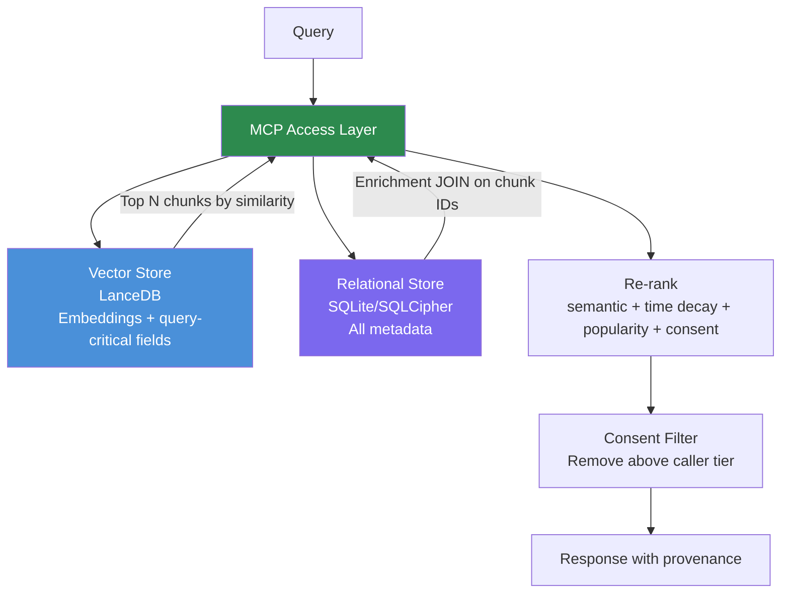

# Metadata-Separated RAG Architecture

> **One-line intent:** Store vector embeddings and metadata in separate systems so metadata can evolve freely without re-embedding the corpus.

**Status:** `draft`
**Origin:** Reverb design session, May 29, 2026
**Implementation:** Cloud Nirvana AIOS — Reverb knowledge intelligence platform

---

## Pattern in 60 Seconds

**The problem:** RAG systems often store everything — embeddings and metadata — together. When you need to add a new metadata field (popularity score, quality rating, consent flag), you're forced to re-index the entire corpus.

**The insight:** Vectors are semantic fingerprints of text. They never need to change when metadata changes. Separate the two systems and you get infinite metadata extensibility at zero re-embedding cost.

**The key structure:**

| Store | Holds | Changes When |
|-------|-------|-------------|
| Vector store (LanceDB) | Embeddings + query-critical fields | Text or embedding model changes |
| Relational store (SQLite) | All other metadata | Anytime — ALTER TABLE, done |
| Access layer (MCP) | Joins them at query time | New ranking signals added |

**What broke when we got this wrong:** We hadn't made this separation explicit in the design. When Sean asked "what if we want to add podcast popularity scores six months from now?" — the answer would have been "re-ingest everything." With this pattern, it's a two-line SQL operation.

---

## Classification

| Property | Value |
|----------|-------|
| **Category** | RAG & Knowledge |
| **Difficulty** | Intermediate |
| **Also Known As** | Split-Store RAG, Hybrid RAG Storage, Vector-Metadata Separation |

---

## Motivation

You've built a knowledge system. You've ingested 100 podcast episodes, 40 conference transcripts, 200 meeting recordings. Embeddings are generated. Semantic search works beautifully.

Six months later, someone asks: "Can we weight results by how popular each podcast episode was? Spotify numbers, RSS downloads, audience engagement?" Good idea. But if your metadata lives alongside your vectors in one store, adding a `popularity_score` field means touching the schema that governs your embeddings. Some vector databases require a full re-index. Others support schema migration but it's painful. Either way, you're in operational debt for a metadata question.

Or: you realize you need speaker consent levels on each chunk — not just on documents. Or topic tags. Or a quality score for flagging low-value content. Every new metadata requirement creates re-indexing risk.

This is the wrong default. Vectors are append-only semantic artifacts. They should be treated as immutable once generated. Everything else — the who, when, how popular, how relevant, who consented — is metadata that lives in a relational store and evolves freely.

Cloud Nirvana hit this decision point explicitly while designing Reverb (May 29, 2026). The question "how do we add popularity scoring later?" forced the architectural choice: keep metadata alongside vectors and accept re-indexing as the cost of evolution, or separate them and make evolution free.

---

## Applicability

Use this pattern when:
- Your knowledge corpus is large enough that re-embedding is expensive (cost, time, or both)
- Metadata requirements are likely to evolve (they always do)
- You need multiple ranking signals (recency, popularity, quality, consent tier)
- Different consumers need different metadata enrichment without changing the corpus

Do NOT use this pattern when:
- Your corpus is tiny and re-embedding is trivial
- Metadata is 100% stable and will never change
- Latency requirements make a join at query time unacceptable

---

## Structure



*Vector store handles retrieval. Relational store handles enrichment. MCP joins them. Adding a new ranking signal = update relational store + update MCP re-ranking. Corpus untouched.*

---

## Participants

| Participant | Role | Example |
|------------|------|---------|
| Vector store | Semantic retrieval only — embeddings + minimal query-critical fields | LanceDB with chunk_id, text, date, decay_class, forward_looking, vector |
| Relational store | All metadata — freely extensible, never re-embedded | SQLCipher: documents, chunks, speakers, topics, consent_records, popularity_score |
| Access layer (MCP) | Joins the two stores at query time, applies re-ranking | `mcp-server/reverb query "AI governance" --tier internal` |
| Ranking signals | Pluggable weights for any metadata field | `--weight semantic=0.5 recency=0.3 popularity=0.2` |

---

## How It Works

1. Query arrives at the MCP access layer
2. MCP embeds the query and runs vector similarity search (LanceDB)
3. Top N chunks returned by semantic similarity score
4. MCP fetches enrichment from relational store — JOIN on chunk IDs
5. Re-ranking applied: `final_score = semantic * w1 + time_decay * w2 + popularity * w3`
6. Consent filter removes chunks above caller's access tier
7. Results returned with full provenance (source doc, speaker, date, scores)

### Adding a new metadata field — zero re-embedding

```sql
-- Six months after initial ingestion:
ALTER TABLE documents ADD COLUMN popularity_score REAL DEFAULT 0.0;

-- Populate from external source (Spotify, RSS, manual):
UPDATE documents SET popularity_score = 0.87
WHERE id = 'rev-podcast-ep042-kalen-howell';
```

Then update MCP re-ranking weights — done. Corpus never touched.

### Adding a new ranking signal to MCP

```python
# Before: semantic + recency only
final_score = semantic_similarity * 0.7 + time_decay_score * 0.3

# After: add popularity signal — no schema change to vector store
final_score = (
    semantic_similarity * weights.get('semantic', 0.5) +
    time_decay_score    * weights.get('recency', 0.3) +
    popularity_score    * weights.get('popularity', 0.2)
)
```

---

## Consequences

### Benefits
- Metadata evolves freely — no re-embedding cost for new fields
- New ranking signals added at any time via SQL + MCP weight update
- Different consumers can use different enrichment without corpus changes
- Relational store supports complex queries vectors can't (joins, filters, aggregations)
- Cost predictability — re-embedding only when text or model changes, never for metadata

### Liabilities
- Query requires two round-trips (vector search + SQL join) — adds latency
- Two stores to maintain, back up, and monitor
- Join logic lives in MCP — must be kept in sync with schema

### What Broke in Practice
- Not breaking: we caught this in design before first ingestion, not after
- The failure mode we avoided: storing popularity_score in LanceDB would have locked us into re-indexing every time a new ranking signal is added
- Historical failure pattern: teams that don't separate these stores end up with "frozen" knowledge bases — technically working but impossible to evolve without expensive re-ingestion

---

## Implementation Notes

### What Goes in the Vector Store
Only fields needed during the vector search itself — before the SQL join:
- `id`, `text`, `vector` (obviously)
- `chunk_date`, `decay_class`, `forward_looking` (for time-decay scoring during retrieval)
- `consent_level`, `content_type`, `city`, `quarter` (for pre-filter)

Everything else: relational store.

### What Goes in the Relational Store
Everything you might want to query, filter, or update independently:
- Speaker identity (name, company, title, CRM link)
- Topic tags (auto-detected or curated)
- Consent records and opt-out history
- Popularity scores, quality scores, custom rankings
- Access audit log
- Any field added after initial ingestion

### When You DO Need to Re-Embed
- Changing embedding model (e.g. text-embedding-3-small → future model)
- Changing chunking strategy (chunk size, split logic)
- Source document corrected or updated
- Never for: metadata additions, new ranking signals, consent changes

### Variations
- **Cloud variant:** Vector store in Pinecone/Weaviate, metadata in Postgres
- **Serverless variant:** Vector store in SQLite-vec, metadata in SQLite (same file, different tables)
- **Multi-tier variant:** Separate relational stores per access tier for strict data isolation

### Common Pitfalls
- Putting too much in the vector store "for convenience" — pay for it at re-index time
- Not propagating document-level metadata to chunks — forces expensive joins at query time
- Forgetting to log access to the relational store — loses your audit trail

---

## Security Implications

### Attack Surface
- Two stores = two attack surfaces. Vector store is read-heavy; relational store holds PII (speaker names, consent records)
- MCP is the single gate — no direct DB access, no exceptions

### Data Sensitivity
- Vector embeddings are derived from speaker content — not PII themselves but directionally sensitive
- Relational store holds speaker identity, consent decisions, access logs — treat as PII
- Encrypt relational store at rest (SQLCipher in CN's implementation)

### Failure Modes
- Compromised relational store exposes speaker PII and consent records — consent layer must be enforced in MCP even if relational store is read directly
- Vector store compromise exposes chunk text — mitigate with field-level encryption for sensitive content types
- MCP bypass exposes raw data without consent filtering — MCP must be the only access path, enforced by file permissions

### Mitigations
- Encrypt relational store (SQLCipher, passphrase in secrets manager)
- MCP as sole access gate (file permissions block direct DB access)
- Access log in relational store with caller + tier + timestamp on every query
- Separate encryption keys per store

---

## Known Uses

| Organization | Context | Scale |
|-------------|---------|-------|
| Cloud Nirvana | Reverb knowledge intelligence platform — conference transcripts, podcasts, meetings | ~80-100 hours of content, 3 cities, 2 years |

*More known uses to be added as pattern is validated across additional implementations.*

---

## Related Patterns

| Pattern | Relationship |
|---------|-------------|
| Temporal Relevance Weighting | Uses the relational store's chunk_date + decay_class fields for time-decay scoring |
| Ladder of Trust | Consent tier enforcement is implemented at the MCP join layer |
| Hub-and-Spoke Agent Orchestration | AIOS agents query Reverb through MCP, never directly |

---

## Metadata

| Property | Value |
|----------|-------|
| **Contributor** | Sean Erikson, CEO, Cloud Nirvana |
| **Production Environment** | Mac mini, OpenClaw, LanceDB + SQLCipher |
| **Status** | `draft` — implemented, pending community review |
| **First Documented** | May 29, 2026 |
| **Origin** | Design session: "what if we want to add popularity scoring six months from now?" |
| **License** | CC BY 4.0 |

---

## Revision History

| Date | Change | Author |
|------|--------|--------|
| 2026-05-29 | Initial draft — pattern discovered during Reverb design | Lou (Cloud Nirvana AIOS) |
