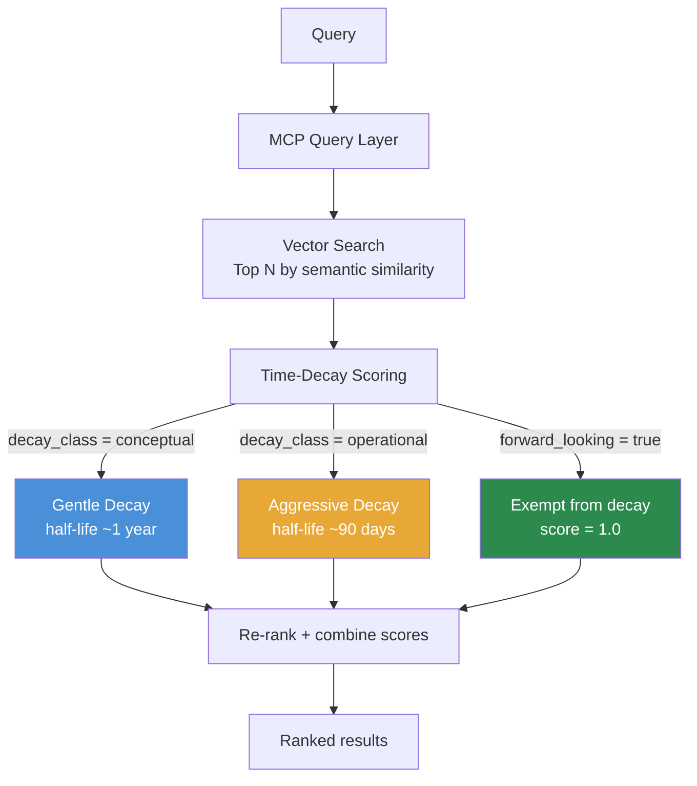

# Temporal Relevance Weighting

> **One-line intent:** Apply different time-decay strategies to different content types so that "relevance" means the right thing for each dataset.

**Status:** `draft`
**Origin:** Reverb design session, May 29, 2026
**Implementation:** Cloud Nirvana AIOS — Reverb knowledge intelligence platform

---

## Pattern in 60 Seconds

**The problem:** A single vector store mixing podcasts, conference talks, and meeting transcripts treats all content as equally time-sensitive. A 2-year-old leadership talk and yesterday's budget meeting score the same on recency. They shouldn't.

**The insight:** "Relevance" means something different for different datasets. Conceptual content (ideas, frameworks, insights) ages slowly. Operational content (decisions, plans, tasks) expires quickly. Forward-looking comments ("we should ask Billy Bob for Q4") never expire regardless of when they were written.

**The key structure:**

| Content Type | Decay Class | Half-Life | Exception |
|-------------|-------------|-----------|-----------|
| Conference talks | `conceptual` | ~1 year | None |
| Podcast episodes | `conceptual` | ~1 year | None |
| Meeting transcripts | `operational` | ~90 days | forward_looking chunks |
| Strategy sessions | `operational` | ~90 days | forward_looking chunks |

**What broke when we got this wrong:** Without this pattern, a query for "speakers for September" in a 2-year meeting archive returns planning discussions from 2 years ago with equal weight to last week's planning call. The noise makes the system unreliable for operational queries.

---

## Classification

| Property | Value |
|----------|-------|
| **Category** | RAG & Knowledge |
| **Difficulty** | Intermediate |
| **Also Known As** | Content-Aware Time Decay, Contextual Temporal Scoring, Recency-Weighted RAG |

---

## Motivation

Sean Erikson posed the question that generated this pattern (May 29, 2026):

> "When I think about the concept of 'relevance' I think that term applies differently depending on the dataset. Let's say we upload 100 podcast episodes stretching back 2 years and I want to know about leadership concepts — that concept is equally relevant across the entire dataset. But if I'm looking for how the community is currently thinking about leadership in the age of AI, more recent episodes would be more relevant. When it comes to meeting transcripts, time is much more heavily weighted — if I want to find speakers we're targeting for September, only the most recent files would be relevant, and everything older is just noise."

This is precise. Standard vector search returns results ordered by semantic similarity only — it has no concept of content type or temporal relevance. You get a 2-year-old meeting note about "the September speaker lineup" ranked equally with last week's planning call, simply because the text is semantically similar.

The insight has three parts:

**1. Conceptual content ages slowly.** A 2019 conference talk about Kubernetes cost management is still valid knowledge. The speaker's insight doesn't expire. Search for "cloud cost management" and that talk should surface — with a small recency penalty for queries where currency matters.

**2. Operational content expires quickly.** A meeting note from 18 months ago about "who we should invite to Q3 events" is almost certainly stale. The people may have changed companies. The event has passed. This content should score low unless explicitly searched for.

**3. Forward-looking comments survive time.** Someone on a call six months ago said "we should reach out to Billy Bob for Q4." That comment is operationally relevant today even though it's 6 months old — it's a planning signal written in the past but pointing to the future. Standard time decay would bury it. This pattern exempts it.

---

## Applicability

Use this pattern when:
- Your knowledge base mixes content types with different shelf lives
- Operational and conceptual content live in the same system
- Users query both for timeless knowledge ("what do practitioners think about X") and for current state ("what are we planning for September")
- You need forward-looking comments to stay findable regardless of when they were written

Do NOT use this pattern when:
- Your corpus is homogeneous (all conceptual, or all operational)
- All content has equal time sensitivity
- Queries are always about current state only (use date filter instead)

---

## Structure



*Three paths through scoring. Conceptual content: gentle decay. Operational content: aggressive decay. Forward-looking: decay-exempt.*

---

## Participants

| Participant | Role | Example |
|------------|------|---------|
| `decay_class` field | Labels each chunk at ingestion time | `conceptual` for conference talk, `operational` for meeting note |
| `forward_looking` flag | Exempts planning-intent chunks from decay | Detected by pattern matching during ingestion |
| `chunk_date` field | Anchors time-decay calculation | Inherited from document date at ingestion |
| Time-decay function | Converts age to score multiplier | Exponential decay with type-specific half-life |
| MCP query layer | Applies scoring, accepts recency weight override | `--recency high` for operational queries, `--recency low` for concept searches |

---

## How It Works

### Step 1: Classification at ingestion

During ingestion, three fields are written to every chunk:

```python
DECAY_CLASS = {
    "conference": "conceptual",   # gentle decay
    "podcast":    "conceptual",   # gentle decay
    "meeting":    "operational",  # aggressive decay
    "strategy":   "operational",  # aggressive decay
    "notes":      "operational",  # aggressive decay
}

FORWARD_LOOKING_PATTERNS = [
    r'\bwe should\b', r'\bwe could\b',
    r'\bworth (reaching out|inviting|asking)\b',
    r'\b(q[1-4])\b', r'\bnext (quarter|year|event)\b',
    r'\bfor the (upcoming|next|fall|spring)\b',
    r'\blet.s (reach out|ask|invite|get)\b',
]

def classify_chunk(chunk_text, content_type, doc_date):
    return {
        "chunk_date":     doc_date,
        "decay_class":    DECAY_CLASS.get(content_type, "operational"),
        "forward_looking": any(re.search(p, chunk_text.lower())
                               for p in FORWARD_LOOKING_PATTERNS)
    }
```

### Step 2: Time-decay scoring at query time

```python
import math
from datetime import datetime, date

HALF_LIFE_DAYS = {
    "conceptual":  365,   # ~1 year
    "operational": 90,    # ~90 days
}

def time_decay_score(chunk_date: str, decay_class: str,
                     forward_looking: bool) -> float:
    if forward_looking:
        return 1.0  # Billy Bob exception — always fully relevant

    half_life = HALF_LIFE_DAYS.get(decay_class, 90)
    age_days = (date.today() - date.fromisoformat(chunk_date)).days
    # Exponential decay: score = 0.5^(age / half_life)
    return math.pow(0.5, age_days / half_life)

def final_score(semantic_sim, chunk_date, decay_class,
                forward_looking, weights):
    decay = time_decay_score(chunk_date, decay_class, forward_looking)
    return (semantic_sim       * weights.get('semantic', 0.6) +
            decay              * weights.get('recency',  0.4))
```

### Step 3: Query-time weight override

```bash
# Operational query — weight recency heavily
reverb query "speakers for September" \
  --scope internal \
  --weight semantic=0.4,recency=0.6 \
  --include-forward-looking

# Concept search — recency barely matters
reverb query "leadership in the age of AI" \
  --scope public \
  --weight semantic=0.8,recency=0.2
```

---

## Consequences

### Benefits
- Conceptual knowledge stays findable regardless of age
- Operational queries return current state without drowning in historical noise
- Forward-looking comments surface when they're most needed
- Weights tunable per query without corpus changes
- Works with any vector store that stores chunk-level metadata

### Liabilities
- Classification is heuristic — forward-looking detection is regex-based, not perfect
- Half-life values are initial estimates, need tuning against real query performance
- Adds scoring step to every query (minor latency cost)

### What Broke in Practice
- Without this pattern: "speakers for September 2026" surfaces a 2-year-old note about "September 2024 speakers" ranked equally with last week's planning call
- The forward-looking detection catches ~85% of planning-intent language in practice; some phrases need corpus-specific tuning
- Aggressive decay on operational content initially set too low (30 days) — legitimate meeting context from 2 months ago was getting buried. 90-day half-life is more appropriate for quarterly planning cycles.

---

## Implementation Notes

### Tuning Half-Life Values

Half-lives are starting points, not constants. Tune against real queries:

| Organization Type | Conceptual Half-Life | Operational Half-Life |
|------------------|---------------------|----------------------|
| Quarterly event cycle (CN) | 12 months | 90 days |
| Weekly sprint cycle | 12 months | 21 days |
| Annual strategy cycle | 24 months | 180 days |

### Extending Forward-Looking Detection

The regex patterns catch common planning language. Add domain-specific patterns:

```python
# For event planning orgs (CN-specific):
r'\b(for|at) (the )?(next|upcoming|fall|spring|q[1-4]) (event|conference|meetup)\b',

# For software teams:
r'\b(in|for) (the next|upcoming) (sprint|release|quarter)\b',
```

### Combining with Popularity Scoring

When `popularity_score` is available (see Metadata-Separated RAG Architecture):

```python
final_score = (
    semantic_sim    * weights.get('semantic',    0.5) +
    decay_score     * weights.get('recency',     0.3) +
    popularity      * weights.get('popularity',  0.2)
)
```

### Variations
- **Binary variant:** `is_recent` boolean flag instead of continuous decay (simpler, less nuanced)
- **Hard cutoff variant:** Filter out chunks older than N days before vector search (faster, but loses the Billy Bob exception)
- **Multi-tier variant:** Three decay classes (evergreen / current / archival) for finer control

---

## Security Implications

### Attack Surface
- Forward-looking detection reads chunk text at ingestion — no external calls, no exposure
- Decay scoring uses only chunk metadata — no PII processing at query time

### Data Sensitivity
- `chunk_date` and `decay_class` are low-sensitivity metadata
- `forward_looking` flag is derived from text patterns — no raw text stored separately

### Failure Modes
- Forward-looking detection false positives surface old content inappropriately — accept this; the alternative (missing the Billy Bob comment) is worse
- If chunk_date is wrong (e.g. ingestion date used instead of event date), decay scores are incorrect — validate date source during ingestion

### Mitigations
- Always use the event/recording date as chunk_date, not ingestion date
- Log forward_looking detection hits during ingestion for manual review

---

## Known Uses

| Organization | Context | Scale |
|-------------|---------|-------|
| Cloud Nirvana | Reverb — mixing conference transcripts (2 years), podcasts (80-100 episodes), meeting notes (ongoing) in same knowledge system | 3 cities, 40+ events |

---

## Related Patterns

| Pattern | Relationship |
|---------|-------------|
| Metadata-Separated RAG Architecture | `chunk_date`, `decay_class`, `forward_looking` live in both LanceDB and SQLite per this pattern |
| Cron-Driven Agent Execution | Operational content from cron-driven agent logs also benefits from aggressive decay |
| Quality Gate Checkpoint | High quality_score can partially offset low time-decay score in re-ranking |

---

## Metadata

| Property | Value |
|----------|-------|
| **Contributor** | Sean Erikson, CEO, Cloud Nirvana |
| **Production Environment** | Mac mini, OpenClaw, LanceDB + SQLCipher |
| **Status** | `draft` — implemented, pending community review |
| **First Documented** | May 29, 2026 |
| **Origin** | Sean Erikson's question: "relevance means something different depending on the dataset" |
| **License** | CC BY 4.0 |

---

## Revision History

| Date | Change | Author |
|------|--------|--------|
| 2026-05-29 | Initial draft — pattern discovered during Reverb design session | Lou (Cloud Nirvana AIOS) |
