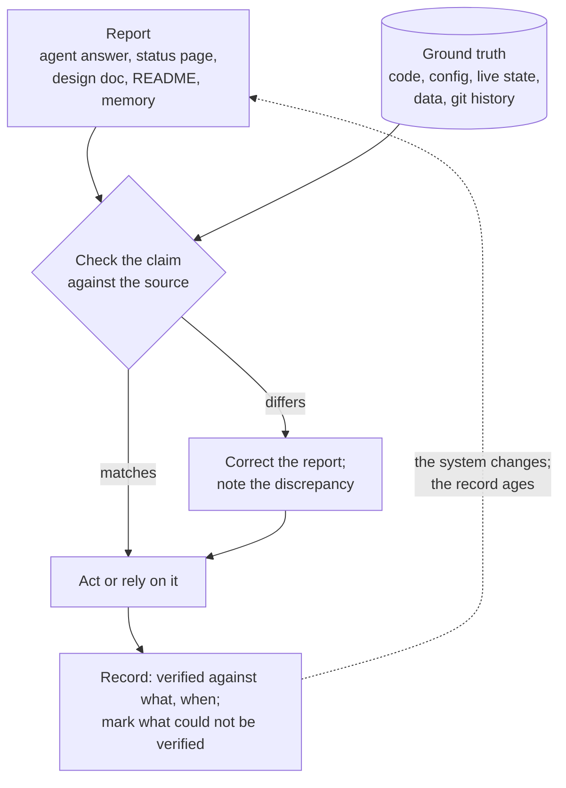

# Ground Truth Over Report

> **One-line intent:** Treat every agent summary, status page, and document as a claim about the system, and check it against the system itself (the code, the config, the live state, the source) before you act on it or rely on it. A document is a report with a date on it, and it starts aging the moment it is written.

## Pattern in 60 Seconds

_The entire pattern distilled into something anyone can read in under a minute. No jargon, no code. A CEO, an engineer, and an entrepreneur should all understand this section._

**The problem:** Agents produce confident reports: summaries, status pages, design docs, answers to your questions. They read as true, so you act on them. But a report is only as true as the last time someone checked it against the real system, and most never are.

**The insight:** The system is the ground truth; everything said about it is a report. You don't trust a report because it is confident, recent-looking, or written by the agent that built the thing. You trust it after you have checked it against the source, and you write down what you checked and when.

**The key structure:**
- **Ground truth:** code, config, live state, data, git history
- **Reports:** agent summaries and answers, status pages and dashboards, design docs, READMEs, runbooks, memory
- **The rule:** check a report against ground truth before it drives a destructive or irreversible action, and before you rely on it to explain the system
- **The record:** every document says what it was verified against and when, and marks what it could not verify

**What broke when we got this wrong:** Our architecture principles said agents get no shell. The live config did not enforce that for one agent. Nobody knew until someone asked the system instead of reading the documents.

---

## Classification

| Property | Value |
|----------|-------|
| **Category** | Trust & Governance |
| **Difficulty** | Foundational |
| **Also Known As** | Verify Before You Trust, Documents Are Reports, The System Is the Source |

---

## Motivation

In September 2026 we set out to document our legacy AI operating system before rebuilding it. We had plenty of documentation: about 150 files of architecture, module designs, operations guides, and decisions. The obvious approach was to tidy those up. Instead we wrote every page from the code and config, and compared each existing doc against what the system actually did.

The documents were confident and mostly wrong. Module READMEs said "UI: not yet built" and "0/10 onboarded" for things that had been built and used. Another said "Built and operational" for a module that had quietly stopped running two months earlier. The nightly maintenance doc named a git branch the job no longer pushed to. Almost every file had been written by an agent at design time, and almost none had been revisited. Git did not help: a single rename sweep had touched 125 files, so stale documents carried fresh dates.

The same was true of live reports. A health monitor reported "ok" and, running in silent mode, never delivered a single alert in its life. Three of the tools our strategic agent used to brief itself always returned empty lists, so it was told "no pending decisions" whatever the real state was. When we asked our agent about its own system, most answers were right, and some confidently were not: it said nightly backups had stopped, when git showed them running on a different branch. Even the research agents helping with the documentation made confident errors, such as calling the one connector actually in use "dead", because they had read the repo copy instead of the running one.

None of this was dishonest. Agents report what they last read or wrote, in the voice of certainty. The failure is the human's, when the operator treats the report as the system. The fix is a habit, backed by a few mechanics: go to the source, check, and record what you checked and when.

---

## Applicability

Use this pattern when:
- An agent's report or a document will drive a destructive, irreversible, or external action (delete, send, publish, change config, retire something)
- You are documenting, auditing, or migrating a system that agents built or described
- A status page, dashboard, or "all clear" is the only evidence that something works
- Documentation is written faster than anyone reviews it, which is always true when agents write it

Do NOT use this pattern when:
- The action is cheap and reversible and the report is only a convenience; checking everything is how attention budgets die
- The ground truth itself is unavailable; then mark the claim as unverified rather than pretending to check it

---

## Structure



_A report is never trusted on its own. It is checked against the source; when it differs, the source wins and the difference is written down. Every verified statement carries the point it was verified against, because the system keeps moving and the report does not._

---

## Participants

| Participant | Role | Example |
|------------|------|---------|
| Ground truth | What the system actually is | The live `openclaw.json`, the code at a commit, the database, git history |
| Report | A claim about the system | An agent's answer, a README, a status page, a design doc, a memory entry |
| Operator | Decides what to check and acts on the result | Sean, before retiring docs or changing access |
| Checker | Compares the report with the source; may be a person, a script, or an agent working from the source | A grep of the code, a curl that prints only status codes, a read-only question to the agent that can see the live config |
| Record | Where the result is kept, with its provenance | A page stamped "Verified against commit c49c953", an "Answered" table with source and date |

---

## How It Works

1. **Separate ground truth from reports.** Make a list for your system: what counts as the source (code, config, live state, data) and what is a report about it (docs, summaries, dashboards, memory). Agent-written documents are reports, however authoritative they look.
2. **Check before high-stakes actions.** Any report that will drive a destructive, irreversible, or external action is verified against the source first. "The agent said it was dead code" is not a reason to delete it.
3. **When the source and the report disagree, the source wins, and the disagreement is recorded.** Don't silently fix the report. The gap is information: it tells you where the system drifted from what you believed.
4. **Stamp every verified statement.** "Verified against commit c49c953 on 2026-09-30", "per the live config, reported by Lou, 2026-09-30". A claim without a stamp is unverified by default.
5. **Mark unknowns as unknown.** "To confirm with Lou" or "not verifiable from the repo" is better than a confident guess. Unknowns become a short list of questions you can actually answer.
6. **Distinguish observation from reasoning.** When an agent answers, label which parts it saw and which parts it inferred. Inferences get checked like any other report.
7. **Keep the old reports as history, and maintain the current truth separately.** Don't edit history into accuracy. Keep the original documents unchanged as the record of what was believed, and keep a separate set of maintained pages for what is true now.
8. **Re-verify when the ground truth changes.** A stamped page goes stale when the code it cites changes. Re-check it then, not on a calendar.

### Code / Configuration Example

```markdown
# A maintained page header: every page says what it was checked against
**Status:** Disabled. Cron last ran 2026-07-07 (Lou, 2026-09-30).
**Verified against:** cloudnirvana-aios @ c49c953 · **Last reviewed:** 2026-09-30

# Unknowns are marked, never guessed
Schedule: to confirm with Lou (open question L1).

# Answers are recorded with source, date, and whether they were observed or inferred
| # | Question | Answer | Source |
| L4 | Is Meter running? | Disabled; last run 2026-07-07; never sent an alert | Lou, live cron list, 2026-09-30 (observed) |
| L11 | Which file does step 14 write? | Per the REM doc's wording | Lou, 2026-09-30 (inferred from a document, not observed) |
```

```bash
# A drift check (proposed, not yet built): flag pages whose cited code has changed
# Each page cites files at a commit, e.g. .../blob/c49c953/mcp-server/crew.py#L423
for page in docs/**/*.md; do
  for cite in $(grep -o 'blob/[0-9a-f]\{7\}/[^#)]*' "$page"); do
    commit=${cite#blob/}; commit=${commit%%/*}; file=${cite#blob/*/}
    if ! git diff --quiet "$commit" HEAD -- "$file"; then
      echo "REVIEW $page: $file changed since $commit"
    fi
  done
done
```

_The header and the answers table are what we used. The drift check is the next step: it turns "re-verify when the code changes" from a habit into a signal._

---

## Consequences

### Benefits
- **You find out what is actually true.** In our case: a permission our principles ruled out but the config allowed, an endpoint that was more exposed than we believed, a monitor that never alerted, a data-loss risk in a storage layer. All were invisible in the documents.
- **Discrepancies become a map of drift.** Where the docs and the system disagree is exactly where the architecture moved without anyone deciding it should.
- **Trust becomes cheap to extend later.** A stamped, sourced page can be relied on until its source changes; an unstamped one has to be rechecked from scratch.
- **History survives.** Keeping the originals unchanged preserves what was believed at each point, including the wrong turns, for lessons and for telling the story.

### Liabilities
- **It costs time.** Writing from the source is slower than editing the documents you already have.
- **It needs access to the ground truth.** Some truth lives only in a running system or a vendor dashboard. Reading it safely (read-only questions, status codes instead of contents) takes care.
- **It can become checking everything.** Without the high-stakes rule, the habit consumes the attention budget it is meant to protect.

### What Broke in Practice
_This section is mandatory. No pattern is accepted without honest failure modes._

- **The principle said one thing; the config said another.** Our architecture principles ("Structural Enforcement Over Instructions… agents get no shell") described a constraint the live config did not enforce for one agent. The documents were the only place the constraint existed. We found it by asking the system, not by reading about it, and are making it structural.
- **Documentation was written at design time and never re-checked.** Of 154 documents describing the legacy system, all but two were first committed by an agent. Module READMEs described built modules as unbuilt and a stopped module as operational. A rename sweep across 125 files gave stale documents fresh dates in git.
- **A monitor reported "ok" and never alerted anyone.** It ran in silent mode its whole life, and nothing checked whether an alert ever reached a human.
- **Tools reported "nothing" by design.** Three briefing tools were stubs that always returned empty lists, so the strategic agent was confidently told there were no pending decisions.
- **Agents' answers about their own system were partly wrong.** Asked about backups, the agent said they had stopped and went to `main`; git showed them running nightly on another branch. It attributed memory entries to a job that had been off for months. Research agents called the connector actually in use "dead" and undercounted unenforced tools by half. Each was caught only because it was checked against the source.

### Honest current state (2026-10)
We practice this pattern for documentation: every maintained page of the legacy system is written from code, stamped with the commit it was verified against, and backed by a record of sourced answers. The originals are kept unchanged as history. The drift check is not built, so re-verification is still a habit, not a signal. Where we found controls that existed only in documents, the fix is to make them structural; the rebuild is where that happens.

---

## Implementation Notes

### Variations
- **Read-only questions to the live system:** when only an agent can see the live state, ask it to look and report, never to change anything, and to separate what it observed from what it inferred.
- **Evidence without exposure:** to check a secret-bearing page, print status codes and counts of variable names, never values.
- **Frozen record plus maintained pages:** keep the original documents unedited as history, and maintain current-state pages alongside them that link back.

### Common Pitfalls
- **Fixing the report silently.** The discrepancy is the finding. Record it.
- **Trusting recency.** A recent commit date is not a recent review. Bulk edits and automated commits make stale files look fresh.
- **Trusting the author.** The agent that built the system is still reporting from memory unless it checked the source.
- **Treating a status page as a check.** "Status: ok" is a report. Check what actually happened (was the alert delivered, did the backup land, is the data there).

---

## Security Implications

### Attack Surface
- **Reports are writable.** Memory, notes, and documents that agents read can be edited or injected. A poisoned report that is never checked against the source becomes the agent's truth.
- **Instruction-only controls.** A constraint that exists only in a document (a charter, a principle, an approved design) is not a control. An attacker who reaches the agent faces the config, not the document.
- **Status endpoints are reconnaissance.** A public status page that reports versions, processes, and schedules is a report an attacker can read too.

### Data Sensitivity
- Checking ground truth often means touching live config and data that contain secrets. Check with methods that reveal shape, not content: status codes, counts, hashes, variable names.

### Failure Modes
- The operator acts on a confident but wrong report, causing irreversible damage (deletion, a send, a config change).
- Documentation drifts until it describes a system that does not exist, and new people (or agents) are onboarded into the fiction.
- Security posture is assessed from documents and believed to be stronger than it is.

### Mitigations
- Verify before any destructive, irreversible, or external action; record the check.
- Stamp verified pages with their source and date; treat unstamped claims as unverified.
- Turn instruction-only controls into structural ones (see Operator Discipline for the interim).
- Re-verify when cited code or config changes (the drift check).

---

## Known Uses

| Organization | Context | Scale |
|-------------|---------|-------|
| Cloud Nirvana | Rebuilding the legacy AIOS documentation (Sept–Oct 2026): every page written from code and config, stamped with the commit it was verified against; live facts from read-only questions to the agent, recorded with source and date; original documents kept unchanged as the historical record | Team |
| Cloud Nirvana | The AIOS2 Knowledge Engine design mechanizes the same idea: a hallucination gate, a verification reader, and a weekly sample (designed, not yet in production) | Team |

---

## Related Patterns

| Pattern | Relationship |
|---------|-------------|
| Operator Discipline | Companion human pattern. Operator Discipline refuses the fast path while the wall is unbuilt; Ground Truth Over Report is how you find out whether the wall exists at all. |
| Attribution Integrity | Both are about provenance: who said this, and what it was checked against. |
| Human Recovery Path | Recovery depends on knowing the real state of the system, not its reported state. |
| Quality Gate Checkpoint | A gate checks an output before it ships; this pattern checks a report before it is believed. |

---

## Metadata

| Property | Value |
|----------|-------|
| **Contributor** | Sean Erikson, Cloud Nirvana (drafted with Claude Code) |
| **Production Environment** | Cloud Nirvana AIOS, macOS, OpenClaw, small team |
| **First Published** | Not yet published (draft) |
| **Last Updated** | 2026-10-01 |
| **Cloud Nirvana Event** | |
| **License** | CC BY 4.0 |
| **Status** | Draft. Named in the AIOS2 Knowledge Engine spec (13A.6) as the fourth human pattern, not yet published. |

---

## Revision History

| Date | Change | Author |
|------|--------|--------|
| 2026-10-01 | First draft, from the legacy AIOS documentation rebuild | Sean Erikson / Claude Code |
