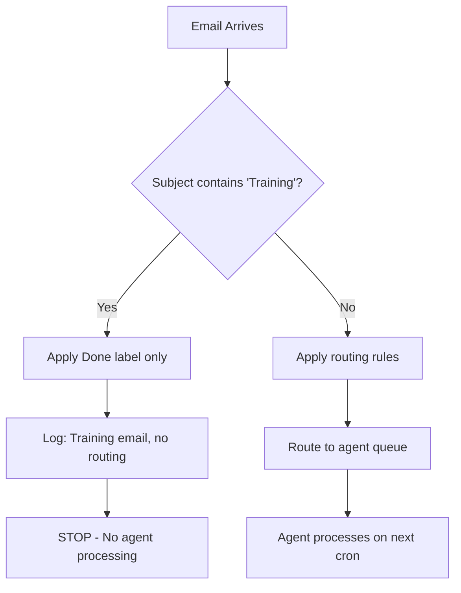

# Training Email Passthrough

> **One-line intent:** Self-addressed emails with "Training" in subject bypass production routing, enabling safe agent training without polluting operational queues or triggering real workflows.

## Pattern in 60 Seconds

**The problem:** No safe way to test multi-agent routing rules without creating real drafts, moving real emails, or triggering production workflows.

**The insight:** Training data should look real but behave differently. Flag it explicitly, agents recognize the flag and treat it as already-handled.

**The key structure:**
- Subject contains "Training" → apply Done label only
- No AIOS folder routing
- No agent processing
- Triage logs the decision, agents skip it

**What broke when we got this wrong:** Testing triage rules by sending real emails to yourself created duplicate drafts, moved emails into agent queues, confused real vs test work. Needed manual cleanup every time.

---

## Classification

| Property | Value |
|----------|-------|
| **Category** | Trust & Governance |
| **Difficulty** | Foundational |
| **Also Known As** | Test Mode Email, Training Flag Pattern, Safe Test Pattern |

---

## Motivation

You're building a multi-agent email system with complex routing rules. You need to test:
- Domain-based routing (partnerships, events, speakers)
- Content-based routing (keywords, subject patterns)
- Thread continuity (replies preserve agent assignment)
- Edge cases (multi-domain emails, ambiguous senders)

**First attempt:** Send yourself a real email with test content. It gets routed to production queue. Agent processes it. Agent drafts a response. You get a Telegram notification. You have to manually delete the draft, remove labels, clean up the mess.

**Second attempt:** Use a separate test Gmail account. Now you have two inboxes to maintain. Real emails sometimes land in test account. Test results don't match production behavior.

**Third attempt:** Add "DO NOT PROCESS" to email body. Agents ignore it (they only read subject and headers for routing). Email gets processed anyway.

You need a flag that:
- Works at triage time (before agents see it)
- Doesn't pollute production queues
- Doesn't require separate infrastructure
- Lets you test real routing logic without side effects

---

## Applicability

Use this pattern when:
- Multi-agent or multi-rule systems need safe testing
- Production and test data flow through same infrastructure
- Manual cleanup after testing is expensive/error-prone
- You want to validate routing WITHOUT triggering downstream actions

Do NOT use this pattern when:
- Separate test environment exists and is realistic
- Test data fundamentally different from production (different schema, sources)
- Testing requires end-to-end validation including agent drafting/sending
- Production system doesn't have explicit routing/queueing stage

---

## Structure



**Key insight:** Training flag is checked FIRST, before any other routing logic. Once flagged, email is marked Done (processed) but never enters agent queues.

---

## Participants

| Participant | Role | Example |
|------------|------|---------|
| **Sender** | Creates training email with flag | Sean sends "Training: Partnership Inquiry" email to himself |
| **Triage Agent** | Detects flag, marks Done, skips routing | Lou's email triage cron |
| **Done Label** | Marks email as processed | Gmail label "AIOS/Done" |
| **Agent Cron** | Sees Done label, skips this email | All agent crons check for Done label |

---

## How It Works

### Email Triage Logic

```python
def triage_email(message):
    subject = message.get('subject', '')
    
    # Training email check (FIRST, before any other rules)
    if 'training' in subject.lower():
        apply_label(message.id, 'AIOS/Done')
        log_triage_decision(message.id, 
                           route='SKIP', 
                           reason='Training email - no routing')
        return 'SKIP'
    
    # ... rest of routing rules
    if matches_domain_rule(message):
        return route_by_domain(message)
    
    if matches_content_rule(message):
        return route_by_content(message)
    
    return 'CEO-Escalations'
```

### Agent Queue Query

Every agent checks for Done label when querying its queue:

```bash
# Agent queries its folder, excludes Done emails
gog gmail messages list \
  --label "AIOS/Mic" \
  --exclude-label "AIOS/Done" \
  --max-results 50
```

**Result:** Training emails never appear in agent queues. Agents don't see them, don't process them.

### Testing Workflow

**Test a partnership routing rule:**

1. Compose email to yourself:
   - **To:** sean@cloudnirvana.org
   - **Subject:** Training: Partnership inquiry from Acme Corp
   - **Body:** Hi, we're interested in Q2 sponsorship. Let's discuss pricing.

2. Send. Triage runs within minutes.

3. Check Gmail:
   - Email has Done label ✅
   - Email NOT in any AIOS folder ✅
   - No agent draft created ✅
   - No Telegram notification ✅

4. Check triage logs:
   ```
   2026-04-05 10:30 | msg_id: 19d5... | route: SKIP | reason: Training email
   ```

5. Validate: If this were real (remove "Training"), it would route to AIOS/Scout based on "partnership" keyword.

**No cleanup needed.** Email sits in inbox with Done label. You can archive it or leave it.

---

## Consequences

### Benefits
- **Zero side effects:** Training emails don't trigger agents, drafts, or notifications
- **Production routing logic tested:** Same triage code runs, just stops before queueing
- **No separate infrastructure:** Uses existing Done label mechanism
- **Fast iteration:** Send test email, check result in seconds, repeat
- **Audit trail:** Training emails logged like real emails, visible in triage history

### Liabilities
- **Doesn't test end-to-end:** Agents never process training emails, so can't validate drafting/sending logic
- **Flag must be explicit:** Easy to forget "Training" prefix, then test email becomes real work
- **Inbox clutter:** Training emails accumulate unless archived/deleted
- **Single keyword risk:** If "Training" appears in real email subject, might skip production routing

### What Broke in Practice

**Early testing (Feb 2026):**
- No training flag. Test emails routed to production queues.
- Agents created drafts for test content ("Partnership inquiry from Fake Corp").
- Sean got Telegram notifications for fake work.
- Manual cleanup: delete draft, remove labels, mark Done.
- **Fix:** Added training flag. Now test emails are invisible to agents.

**False positive (one time):**
- Real email subject: "Re: Speaker training materials"
- Contained "training" keyword → skipped routing
- Email sat unprocessed until Sean noticed
- **Fix:** Changed detection to START with "Training:" not just contain "training"
- Alternative: Use more specific flag like "AIOS-TRAINING" or "[TEST]"

---

## Implementation Notes

### Variations

**Strict prefix match:**
```python
if subject.startswith('Training:'):
    # Only matches if "Training:" is first word
```
- **Pro:** Eliminates false positives
- **Con:** Easier to forget exact format

**Custom flag:**
```python
if '[TEST]' in subject or '[AIOS-TEST]' in subject:
```
- **Pro:** More explicit, less likely to appear in real emails
- **Con:** Harder to remember when composing tests

**Sender-based (self-addressed only):**
```python
if 'training' in subject.lower() and message.from == message.to:
    # Only skip if sender emailed themselves
```
- **Pro:** Extra safety (external emails can't trigger)
- **Con:** Can't test emails from external senders

**Time-limited:**
```python
if 'training' in subject.lower() and message.timestamp > TRAINING_MODE_START:
    # Only active during testing window
```
- **Pro:** Training flag auto-expires after test session
- **Con:** Requires tracking test session state

### Common Pitfalls

**Forgetting the flag:**
- Send test email without "Training" → goes to production
- **Fix:** Template/snippet for training emails. Subject always starts with flag.

**Testing end-to-end:**
- Training flag prevents agent processing
- Can't validate drafting, approval, sending logic
- **Fix:** Use separate pattern for end-to-end tests (staging environment or manual agent invocation)

**Log spam:**
- Every training email logs "SKIP" decision
- Clutters triage logs
- **Fix:** Separate log level for training (INFO not WARN), or dedicated training log file

---

## Security Implications

### Attack Surface
- Malicious actor could send emails with "Training" subject to bypass routing
- If flag detection is case-sensitive, "TRAINING" or "training" might slip through
- Attacker could test routing rules without triggering alerts

### Data Sensitivity
- Training emails might contain real data used for testing (copied from production)
- Done-flagged emails still visible in inbox, could leak context
- Triage logs show training email subjects (might contain test PII)

### Failure Modes
- False negative: Real email contains "Training" → skipped, never processed
- False positive: Test email missing flag → processed as real, creates bad data
- Training email forwarded by user → flag preserved, legitimate forward skipped

### Mitigations
- **Sender validation:** Only skip if self-addressed (from == to)
- **Case-insensitive matching:** Catch "Training", "TRAINING", "training"
- **Audit logging:** Track all skipped emails, review monthly for false positives
- **Time windows:** Only enable training mode during designated test periods
- **Alert on volume:** If >10 training emails/day, flag for review (possible abuse)
- **Scrub PII:** Don't log full training email subjects, just hash or "Training email #N"

---

## Known Uses

| Organization | Context | Scale |
|-------------|---------|-------|
| Cloud Nirvana AIOS | Testing 7-rule triage priority chain | ~5-10 training emails/week during development |
| (Seeking contributions) | | |

---

## Related Patterns

| Pattern | Relationship |
|---------|-------------|
| Email Triage Priority Chain | Training flag fires FIRST, before any triage rules |
| Files Over Databases | Done marker prevents reprocessing, works for files too (`.training` suffix) |
| Ladder of Trust | Training mode is trust level zero (agent never sees these emails) |
| Cron-Driven Agent Execution | Agent crons exclude Done label, so training emails invisible |

---

## Metadata

| Property | Value |
|----------|-------|
| **Contributor** | Sean Erikson, CEO, Cloud Nirvana |
| **Production Environment** | Gmail + OpenClaw, 11-agent AIOS |
| **First Published** | 2026-04-05 (draft) |
| **Last Updated** | 2026-04-05 |
| **Cloud Nirvana Event** | AI Tinkerers Columbus (demo), 2026-04-07 |
| **License** | CC BY 4.0 |
| **Status** | Draft — backlog, not published to Open Patterns repo yet |

---

## Revision History

| Date | Change | Author |
|------|--------|--------|
| 2026-04-05 | Initial draft for backlog | Sean Erikson / Lou |
