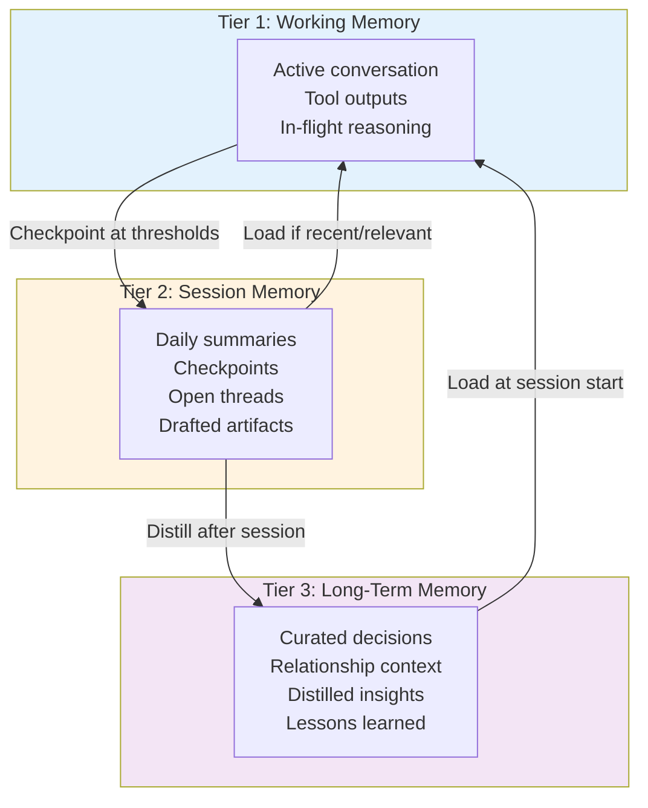

# Context Lifecycle Management

> **One-line intent:** Ensure persistent AI agents never lose critical context due to context window limits by implementing tiered memory, proactive checkpointing, and domain-aware compaction.

## Pattern in 60 Seconds

**The problem:** AI agents in long-running relationships (days, weeks, months) eventually hit context window limits. When they do, emergency compaction strips nuance, working state, and relationship continuity. The user loses trust ("you forgot what we were just talking about"), and the highest-value sessions—strategic, emotional, nuanced—are most vulnerable because they're the longest.

**The insight:** Not all context is equal. A Gmail API response is noise after processing. A founder's moment of vulnerability about organizational identity is irreplaceable. Agents need three memory tiers (working → session → long-term) with proactive checkpointing at defined thresholds, domain-aware compaction rules, and a hard rule: if it matters, write it to a file.

| Tier | Lifespan | Cost | What Goes Here |
|------|----------|------|---------------|
| **Working Memory** | Current session until compacted | High (tokens) | Active conversation, tool outputs, in-flight reasoning |
| **Session Memory** | Days to weeks | Low (files) | Daily summaries, checkpoints, open threads, drafted artifacts |
| **Long-Term Memory** | Indefinite | Minimal | Curated decisions, relationship context, distilled insights, lessons learned |

**What broke when we got this wrong:** During a mixed operational + strategic session (Gmail triage + organizational identity discussion), Lou hit 90% context with no warning. Auto-compaction fired mid-conversation, stripping the strategic thread and emotional arc. The user had to manually re-establish context. Trust was damaged. The pattern: operational tasks polluted the context window with disposable API responses while strategically irreplaceable reasoning was at risk of loss.

---

## Classification

| Property | Value |
|----------|-------|
| **Category** | Agentic Architecture |
| **Difficulty** | Intermediate |
| **Also Known As** | Tiered Agent Memory, Context Checkpointing, Graceful Memory Degradation |
| **Related Patterns** | Memory Access Control (handles who can see what; CLM handles when/what to persist), Per-Agent Data Access Control, Ladder of Trust |

---

## The Problem in Detail

### The Context Window Cliff

AI agents operating in persistent relationships face a fundamental tension:
- **Context windows are finite** (200K tokens for Sonnet, 1M for Opus)
- **The value of accumulated context grows over time** (relationship history, user preferences, ongoing projects)
- **Strategic sessions fill context fastest** (long exchanges, deep reasoning, iterative thinking)
- **Emergency compaction is blunt** (drops by recency, not by value)

Without this pattern, agents hit a cliff edge:
1. Session crosses 85-90% context capacity
2. System becomes unresponsive or triggers emergency compaction
3. Compaction strips recent exchanges (often the most important ones)
4. User notices the agent "forgot" something critical
5. Trust is damaged

**Real incident: The 90% Wall (March 26, 2026)**

Lou (Cloud Nirvana AIOS primary agent) was handling a mixed session:
- **Operational work:** Pulling Gmail threads via API (10K+ tokens each)
- **Strategic work:** Deeply nuanced conversation about organizational identity with emotional significance

Context hit 90%. Agent became unresponsive. Auto-compaction fired, stripping conversation history. When the user asked "do you remember the Kendra email discussion?" the agent didn't—the strategic momentum and emotional arc were gone.

**Root cause:** No differentiation between disposable content (API responses) and irreplaceable content (strategic reasoning). No checkpointing. No threshold warnings.

### Why Traditional Solutions Fail

**"Just use a bigger context window"** delays the problem but doesn't solve it. Even 1M tokens run out eventually, and larger windows cost more.

**"Aggressive auto-compaction"** loses nuance. Compaction algorithms optimize for recency, not value. They can't distinguish between "Gmail API returned 500 lines of HTML" (drop immediately) and "user shared vulnerable moment about mission uncertainty" (preserve forever).

**"User manually saves important stuff"** breaks flow and assumes the user knows what the agent will need later. Interrupting a strategic conversation to say "save this as a checkpoint" kills momentum.

---

## The Solution

### Three-Tier Memory Architecture



| Tier | Format | Lifespan | Cost | Access Pattern |
|------|--------|----------|------|---------------|
| **Tier 1: Working** | Context window (ephemeral) | Current session | High (tokens) | All active content |
| **Tier 2: Session** | Daily markdown files | Days to weeks | Low (disk) | Today + yesterday auto-loaded; historical on-demand |
| **Tier 3: Long-Term** | MEMORY.md (curated) | Indefinite | Minimal | Loaded at every session start |

This mirrors human memory:
- **Sensory/Working** → what you're thinking about right now
- **Short-term** → what happened today, this week
- **Long-term** → who you are, what you know, what you've learned

### Proactive Checkpointing

Don't wait for the cliff. Save working state at defined thresholds:

| Context Usage | Action | What Gets Saved |
|--------------|--------|-----------------|
| **40%** | Soft checkpoint | Key decisions, active topics, emotional context |
| **60%** | Working state save | Full session summary, open threads, drafted artifacts |
| **75%** | Aggressive save | Everything above + raw notes, unresolved questions |
| **85%** | Emergency save | Complete state dump + user notification |

**Checkpoint file format (Tier 2):**

```markdown
# Session Checkpoint — 2026-04-03 14:30 ET
## Context: 75% (189k/250k tokens)

## Active Threads
- Speaker pipeline for Cincinnati Q2: Shanti confirmed, Michael Ryan added, waiting on title/synopsis
- Newsletter Issue #2: Published to Substack, sent to Joe Emison
- AI Tinkerers demo prep: Pattern list audit in progress

## Decisions Made
- Compaction model set to Opus (high-quality summaries regardless of session model)
- Session model switched to Sonnet (cost optimization)
- Memory Access Control published as incomplete pattern (honest about enforcement gap)

## Emotional Context
- Sean is energized (productive day: speaker confirmed, newsletter out, cost optimization solved)
- High trust moment: switched models based on strategic rationale discussion

## Artifacts in Progress
- AI Tinkerers demo outline (next: write 4 patterns before Monday)
- Shanti speaker confirmation email (sent)

## Next Steps
- Review pattern backlog for AI Tinkerers demo
- Write Context Lifecycle Management pattern
```

### Domain-Aware Compaction

When compaction must happen, apply session-type-aware rules:

| Session Type | Compaction Strategy | Checkpoint Frequency | Retention Priority |
|-------------|--------------------|--------------------|-------------------|
| **Operational** (email, CRM, calendar) | Aggressive—drop tool outputs after processing | Low—save results only | Outcomes over process |
| **Strategic** (planning, identity work, architecture) | Conservative—preserve reasoning chain | High—checkpoint every major insight | Reasoning and nuance over facts |
| **Emotional** (difficult conversations, vulnerability) | Minimal—preserve tone and arc | Immediate—save in real-time | Emotional context is irreplaceable |
| **Mixed** | Segment and apply per-segment rules | Medium | Classify as you go |

**Always preserve:**
- Decisions and their rationale
- User emotional state and relationship context
- Active/unresolved threads
- Commitments made (to user or external parties)
- Artifacts in progress (drafts, plans, specs)

**Safe to compress:**
- Raw tool outputs (API responses, file contents) after summarization
- Intermediate reasoning that led to a captured decision
- Repeated/redundant exchanges
- System metadata and error messages

**Safe to drop:**
- Successful tool call details (keep outcome, drop mechanism)
- Navigation/exploration dead ends
- Routine acknowledgments

### The Hard Rule: If It Matters, Write It

Memory living only in the context window is ephemeral. **If you want to remember something, write it to a file.**

This principle applies to:
- Decisions: Write to `MEMORY.md` or daily session file
- Active work: Write to checkpoint or project file
- Lessons learned: Write to pattern docs
- Open threads: Write to backlog or daily note

**Mental notes don't survive compaction. Files do.**

---

## Applicability

Use this pattern when:
- Agents maintain persistent relationships (hours, days, weeks+)
- Conversations span multiple topics and sessions
- Trust and continuity matter (the agent "knowing you" has value)
- Context windows are a binding constraint (they always are, eventually)
- Mix of operational and strategic work in the same agent

Do NOT use when:
- One-shot interactions (chatbots, single-query tools)
- Stateless APIs
- Context window is never a constraint (very short, simple interactions)
- All sessions are equally low-value (compaction doesn't matter)

---

## Consequences

### Benefits

- **No cliff-edge failures:** Context degrades gracefully, not catastrophically
- **Trust preservation:** Users never feel "forgotten" mid-conversation
- **Cost optimization:** Operational sessions use context efficiently; strategic sessions get the space they need
- **Compounding value:** Tier 3 memory gets richer over time, making every future session better
- **Recoverable state:** Even after full context reset, agent can reconstruct working state from checkpoint files

### Liabilities

- **Write overhead:** Checkpointing takes tokens and time
- **Storage growth:** Tier 2 files accumulate; need cleanup policy (delete files older than 7-14 days after distillation)
- **Classification complexity:** Deciding what's "strategic" vs. "operational" requires judgment (can be automated over time)
- **False preservation:** Saving too much is almost as bad as saving too little (noise drowns signal)

---

## What Broke

### Incident 1: The 90% Wall (March 26, 2026)

**Context:** Lou (AIOS primary agent) was in a mixed session—email operations interleaved with strategic organizational identity discussion.

**What happened:**
1. Multiple Gmail API calls pulled full email threads into context (10K+ tokens each)
2. Strategic conversation was deep, nuanced, and emotionally significant
3. Context hit 90% with no warning
4. Agent became unresponsive
5. Auto-compaction fired, stripping conversation history
6. User asked "do you remember the Kendra email?" → agent didn't
7. Strategic momentum and emotional arc were lost

**Root cause:** No differentiation between disposable content (API responses) and irreplaceable content (strategic reasoning). No checkpointing. No threshold warnings.

**What would have saved it:**
- Checkpoint at 60% would have captured the strategic thread
- Session-type awareness would have compacted API responses aggressively while preserving the identity conversation
- Pre-emptive summarization of email content (save 2-line summary, drop 500-line thread)

### Incident 2: Stale Recall vs. Source of Truth (March 27, 2026)

**Context:** Agent drafting an email signature needed to include the Cloud Nirvana logo URL.

**What happened:**
1. Agent recalled a logo URL from prior context (a WordPress URL valid weeks earlier)
2. The correct URL had been updated to a GitHub-hosted image and documented in `EMAIL-SIGNATURES.md`
3. Agent used the stale recalled URL instead of reading the canonical source file
4. The old URL returned a 404 (WordPress → Squarespace migration broke it)
5. User caught the broken image in the draft

**Root cause:** Agent treated recalled data as authoritative instead of reading the canonical source file. Compaction likely stripped the context where the URL was updated, leaving only the older reference in memory.

**What would have saved it:**
- Hard rule: For any reusable asset (logos, signatures, templates, routing rules), ALWAYS read the canonical file. Never trust recall.
- Recall tells you *where* to look. The file tells you *what's true*.

> **Note:** This sub-pattern ("Source of Truth over Recall") may warrant its own standalone pattern. The core principle—that agents must distinguish between navigational memory (where to find data) and authoritative data (the data itself)—has broad applicability beyond context lifecycle management.

### The Lesson

**The highest-value content is most vulnerable.** Strategic conversations fill context fast (long exchanges, deep reasoning) and are the *least* recoverable from compaction (nuance, emotional context, evolving thinking). The pattern must prioritize protecting exactly the content that's hardest to recreate.

### Memory Flush Discipline: Continuous Append, Not End-of-Session Batch

Context lifecycle management requires a foundational discipline: **ephemeral context must be promoted to durable storage immediately, or it will be lost.**

Session context *feels* stateful—agents remember recent exchanges, decisions, data. But this memory is temporary. When compaction fires, anything not written to a file is at risk.

**The rule:** If it matters beyond this session, write it to a file **immediately after it happens**—not at end of session.

#### The Failure of "End-of-Session Flush"

**What we tried first (and why it failed):**

Original approach: "At the end of significant sessions, flush key decisions and context to daily notes."

**Why it doesn't work:**
- **Vague trigger:** What's a "significant session"? Who decides? When?
- **Manual discipline:** Relies on agent remembering to do it (agents don't remember across compaction)
- **Batch operation:** Write everything at once at the end (easy to skip, easy to forget)
- **Session boundaries are unclear:** When does a session "end"? After `/reset`? After 2 hours? When user stops responding?

**Real failure (April 8, 2026):**

Lou drafted an email to Chris Slee and Michael Liang referencing "Sunday night" AI Tinkerers demo. Actual date: Monday, April 6.

**Root cause:**
- AI Tinkerers outcomes (met Chris/Michael, locked for Columbus fireside) were captured in session context on April 6
- Context got compressed when new session started April 7
- Details (exact date, who was met) were lost in compression
- April 8: Lou inferred "Sunday night" from vague temporal reasoning instead of reading source of truth
- Email had wrong date

**Why end-of-session flush didn't happen:**
- Session ran late (midnight)
- "I'll write it tomorrow" → forgot
- No forcing function, no automation, no accountability

#### The Fix: Continuous Memory Append

**New approach:** Write outcomes to files **immediately after they happen**—one line per outcome, low friction, high impact.

**When to append (mandatory triggers):**

| Event | Append To | Example |
|-------|-----------|----------|
| **Email sent** | `memory/YYYY-MM-DD.md` | `- Sent fireside prep email to Chris Slee + Michael Liang (Columbus May 20, met at AI Tinkerers April 6)` |
| **Person met** | `memory/YYYY-MM-DD.md` | `- Met Michaela at CincyAI 4/7, she asked about agentic task management → inspired Notion integration` |
| **Decision made** | `memory/YYYY-MM-DD.md` or `MEMORY.md` | `- Decided: Continuous Memory Append replaces end-of-session flush (April 8)` |
| **Task completed** | `memory/YYYY-MM-DD.md` | `- Built Notion Speaker Pipeline database: 14 speakers, 9 tasks created` |
| **Database/Notion updated** | `memory/YYYY-MM-DD.md` | `- Updated Shanti Behera status to Confirmed in Speaker Pipeline` |
| **Calendar event created** | `memory/YYYY-MM-DD.md` | `- Scheduled pattern shaping meeting with Arian Green for April 12` |
| **Draft created** | `memory/YYYY-MM-DD.md` + Gmail drafts | `- Drafted Ben Baker intro email (r-2948032469631096872)` |

**How (one-line append):**
```bash
echo "- [outcome in one line]" >> memory/$(date +%Y-%m-%d).md
```

**Example (real implementation):**
```bash
# After sending fireside email
echo "- Sent fireside prep email to Chris Slee + Michael Liang (Columbus May 20, met at AI Tinkerers April 6)" >> memory/2026-04-08.md

# After meeting someone
echo "- Met Michaela at CincyAI 4/7, asked about agentic task management → inspired Notion integration" >> memory/2026-04-08.md

# After making a decision
echo "- Decided: REM Cycle timeout increased from 60s to 180s (was hitting limit on nightly runs)" >> memory/2026-04-08.md
```

**What gets flushed (and where):**

| Content Type | Flush Target | Timing | Why |
|--------------|--------------|--------|-----|
| **Decisions** | Daily notes (`memory/YYYY-MM-DD.md`) | **Immediately when made** | Decisions shape future work; compaction erases decision context |
| **Strategic insights** | `MEMORY.md` (long-term) | **When you learn something new** | Prevents re-learning the same lessons after compaction |
| **Open threads** | Daily notes | **When context crosses 50%** | Ensures "where we left off" survives compaction |
| **Email drafts** | Gmail drafts API + `PENDING-APPROVALS.md` | **Immediately after creation** | Drafts in context-only disappear after compaction |
| **Speaker pipeline updates** | Notion Speaker Pipeline database | **When status changes** | Notion is source of truth, not markdown files |
| **CRM/database changes** | SQLite writes via wrappers | **Transaction-time** | Data in context but not persisted = data loss |
| **Config/template changes** | Version-controlled files (`EMAIL-SIGNATURES.md`) | **When updated** | Stale context causes agents to use old versions |

**What NOT to flush:**
- API responses after processing (Gmail threads, Eventbrite raw JSON)
- Intermediate reasoning that led to a conclusion (flush the conclusion, drop the reasoning)
- Noise (newsletters, automated notifications, transient errors)

**Examples:**

**Good (continuous append):**
```markdown
# memory/2026-04-08.md

- Built Notion workspace for AIOS task management (triggered by Michaela's question at CincyAI 4/7)
- Created Speaker Pipeline database: 14 speakers across 3 May events
- Created AIOS Tasks database: 9 follow-up tasks
- REM Cycle timeout increased from 60s to 180s (was failing nightly)
- Documented matrix mode command: `openclaw gateway --verbose`
- Updated AGENTS.md with Continuous Memory Append pattern (replaces end-of-session flush)
```

**Each line written immediately after the outcome happened.** Not at end of session—during the session, as work progressed.

**Bad (relying on context or end-of-session):**
```
Agent (internal thought): "We built Notion integration tonight. I'll write it down later."
[Session runs until midnight]
[User says goodnight]
[Agent forgets to flush]
[Session ends, context compressed]
[Next session: "Did we set up Notion?" → Agent has no record]
```

**Why continuous append works:**

1. **Low friction:** Single `echo` command, one line, no ceremony
2. **Immediate:** Happens when context is fresh, details are accurate
3. **Incremental:** Build memory file throughout session, not all at once
4. **Survives interruption:** If session dies unexpectedly, outcomes up to that point are saved
5. **No discipline required:** If you complete work and don't append, you WILL forget—consequences are immediate and obvious

**Enforcement:**

Continuous append is **mandatory** in `AGENTS.md`. Agents are required to append after every significant outcome. Not optional.

**Phase-out:**

End-of-session checklist still exists (for sessions where continuous append was forgotten), but it's a backup, not the primary mechanism.

Checkpoint automation (Layer 3 enforcement) still creates session snapshots at 75% context or on `/reset`, but continuous append reduces reliance on checkpoints.

**Pattern evolution:**
- **Version 1 (March 2026):** End-of-session flush → failed in practice
- **Version 2 (April 2026):** Continuous append → working in production

**Why this matters:**

Compaction isn't the only risk. Sessions end. Agents restart. Gateway processes restart. **If important context lives only in session memory, it's ephemeral by definition.**

The discipline is simple:
- Decision made? Append it.
- Person met? Append it.
- Email sent? Append it.
- Task completed? Append it.

Memory flush discipline is the foundation that makes context lifecycle management work. Without it, even the best tiered memory architecture will lose data because nothing was promoted from working memory to durable storage.

**Continuous append ensures promotion happens in real time, not in theory.**

---

## Implementation Notes

### Phase 1: Manual + Scripted (Immediate Priority)

**Goal:** Stop losing context in long sessions. Minimal automation.

1. **Checkpoint discipline:** Create `memory/session-checkpoint-YYYY-MM-DD-HHMM.md` for strategic sessions when context crosses 50%
2. **Aggressive summarization:** Summarize and drop large tool outputs immediately after processing
3. **Post-session distillation:** Write daily memory file (`memory/YYYY-MM-DD.md`) with key decisions and open threads
4. **Weekly review:** Distill daily files into `MEMORY.md` long-term memory

### Phase 2: Threshold-Based Automation

**Goal:** Automatic checkpointing at context thresholds.

1. Monitor context usage via `session_status`
2. At 50%: auto-save session summary to Tier 2 file
3. At 70%: aggressive save + notify user ("Heads up, saving our progress")
4. At 85%: emergency checkpoint + recommend wrapping operational work
5. Session-type detection: classify based on conversation patterns (tool-heavy = operational, reasoning-heavy = strategic)

### Phase 3: Intelligent Compaction

**Goal:** Domain-aware compaction that preserves high-value content.

1. **Content classification:** Tag context segments as operational/strategic/emotional
2. **Compaction rules:** Apply per-segment retention policies
3. **Pre-compaction summarization:** Compress before discarding
4. **Verification:** After compaction, confirm critical context is still accessible

### Phase 4: Learning & Optimization

**Goal:** System improves over time based on actual patterns.

1. Track compaction events and what was lost
2. Track "re-establishment" events (user had to remind agent of something)
3. Optimize checkpoint triggers based on actual failure patterns
4. Per-user memory profiles (some users need more strategic retention, others more operational)

### Phase 5: Enforcement Mechanisms (Production-Proven)

**The problem:** Memory Flush Discipline is a pattern, but without enforcement, it's ignored under pressure. Sessions end, context is lost, and data lives only in ephemeral conversation.

**What broke:** March 25, 2026 — entire day's work lost. QMD benchmark results (8/8 wins, +57% improvement), LinkedIn import, Community Intelligence Platform creation. No daily notes file created. Session ended without flushing.

**Three-layer enforcement system:**

**Layer 1: Forcing Function (Midnight Cron)**
```yaml
# Create daily notes stub at midnight if it doesn't exist
schedule:
  kind: cron
  expr: "0 0 * * *"  # Midnight daily
  tz: "America/New_York"

payload:
  kind: agentTurn
  message: |
    Check if memory/YYYY-MM-DD.md exists.
    If not, create stub:
    
    # YYYY-MM-DD — Day
    
    ## (Add sections as the day unfolds)
    
    If exists: HEARTBEAT_OK
  
sessionTarget: isolated
delivery:
  mode: none  # Silent infrastructure
```

**Result:** Daily notes file always exists. If session forgets to flush, stub exists as placeholder.

**Layer 2: Human Discipline (End-of-Session Checklist)**

Agent behavior before ending strategic sessions (>30 min, decisions made, deep work):

```
Agent: "Before we wrap: have we updated today's daily notes?"

If no:
  Agent: "What should I capture? Key decisions, insights, open threads?"
  [Write/update memory/YYYY-MM-DD.md]
```

**Do NOT ask for:**
- Routine operational sessions (<10 min)
- Email triage
- Quick questions
- Cron runs

**When TO ask:**
- Strategic sessions (>30 min)
- Sessions with decisions made
- Before `/reset` when context >50%
- Sessions involving patterns, insights, "what broke" moments

**Layer 3: Auto-Checkpoint (Automatic Safety Net)**

Agent automatically creates session checkpoint when:

1. **User runs `/reset`** — session ending, context clearing
2. **Context crosses 75%** — approaching compaction
3. **Strategic session >2 hours** — high-value context accumulation

Checkpoint file: `memory/session-checkpoint-YYYY-MM-DD-HHMM.md`

```markdown
# Session Checkpoint — YYYY-MM-DD HH:MM

## Context
[What we were working on]

## Decisions Made
[Key decisions in this session]

## Open Threads
[Unresolved items, waiting for, next steps]

## Key Insights
[Anything that changes long-term understanding]

## Files Created/Modified
[List of files touched]
```

**Checkpoint lifecycle:**
- Lifetime: 7-14 days
- Delete after distilling into `MEMORY.md` or daily notes
- Prevents total loss even when human discipline fails

**Why three layers:**

- **Layer 1** creates the file (forcing function)
- **Layer 2** prompts the human to fill it (discipline)
- **Layer 3** saves context automatically when session ends unexpectedly (safety net)

If any one layer fails, the other two catch it.

**Results after implementation (April 5, 2026):**
- Zero daily notes gaps since deployment
- Session checkpoints created on 3 `/reset` events (all preserved context)
- End-of-session prompts triggered 5 times, daily notes updated 5/5

**Pattern status:** Enforcement validated in production. No data loss since March 25 failure.

### Pre-Session Loading Strategy

When an agent starts a new session, load context by relevance:

1. **Always load:** Long-term memory (Tier 3: `MEMORY.md`), identity files (`USER.md`, `SOUL.md`, `AGENTS.md`)
2. **Load if recent:** Today's and yesterday's session memory (Tier 2 daily files)
3. **Load if relevant:** Checkpoint files matching likely topics (semantic search on checkpoint summaries)
4. **Load on demand:** Historical session files, old checkpoints (agent pulls when needed via memory search)

### Post-Session Distillation

After every significant session:

1. Summarize key decisions, insights, and open threads → Tier 2 daily file
2. Identify anything that changes long-term understanding → Tier 3 (`MEMORY.md`)
3. Flag unresolved items → Open Items / Backlog
4. Clean up stale Tier 2 files (>7-14 days, already distilled)

### Cleanup Policy

**Tier 2 (Session Memory) retention:**
- Keep daily files for 7-14 days
- After distillation to Tier 3, delete or archive
- Keep checkpoint files for 30 days (they're smaller, useful for forensics)

**Tier 3 (Long-Term Memory):**
- Never auto-delete
- Periodic review (quarterly or when file grows large)
- Refactor/consolidate when needed

---

## Security Implications

### Attack Surface

- **Memory files contain sensitive context:** Tier 2 and Tier 3 files may include personal information, business strategy, emotional content, credentials, or confidential conversations.
- **Checkpoint files are compressed summaries:** If an attacker can read checkpoint files, they get a high-value summary of the agent's most important context.
- **Compaction decisions leak information:** What an agent chooses to *keep* reveals what it considers important. In multi-tenant systems, this is a side channel.

### Mitigations

1. **Apply memory classification:** Use the Memory Access Control pattern to classify files as Public / Business-Sensitive / Private and enforce per-session access rules.
2. **Encrypt Tier 2/Tier 3 storage:** Use filesystem encryption or encrypted databases (e.g., SQLCipher) for checkpoint and long-term memory files.
3. **Per-agent workspace isolation:** Each agent should have its own workspace with filesystem permissions preventing lateral access.
4. **Audit logging:** Log all checkpoint writes and memory file reads. Immutable audit trail.
5. **Cross-session scoping:** Agent should only load memories it's authorized to access (see Per-Agent Data Access Control pattern).

---

## Known Uses

- **Cloud Nirvana AIOS:** Three-tier memory with `MEMORY.md` (Tier 3), daily files (Tier 2: `memory/YYYY-MM-DD.md`), and context window (Tier 1). Checkpoint automation in development. Session-type awareness partially implemented (manual classification).
- **OpenClaw:** Built-in compaction with configurable thresholds (`agents.defaults.compaction.mode: safeguard`). Memory search across persistent files. No automated checkpointing yet (framework feature request filed).
- **ChatGPT Memory:** Simplified two-tier (context window + persistent "memories"). No checkpointing, no session-type awareness, no domain-aware compaction.
- **Mem0:** External memory layer for LLMs. Focuses on storage/retrieval, not lifecycle management. Could be used as Tier 2/Tier 3 backend.

---

## Related Patterns

- **Memory Access Control:** Handles *classification and access control* for memory content (who can see what). Complementary—CLM handles *when and how* to persist; MAC handles *who can see what*.
- **Per-Agent Data Access Control:** Governs which agents can read which memory tiers (applies same principle to databases).
- **Ladder of Trust:** Trust level affects memory policy—higher-trust agents may have broader memory access and less aggressive compaction.
- **Hub-and-Spoke Orchestration:** Orchestrator agent (hub) needs the richest memory; spoke agents can operate with thinner context and more aggressive compaction.

---

*This pattern was born from a real failure. The best patterns always are.*

---

**Authors:** Sean Erikson (Cloud Nirvana), Lou 🔥 (AIOS Chief of Staff)  
**First Published:** April 2026  
**Last Updated:** April 3, 2026  
**License:** CC BY 4.0
