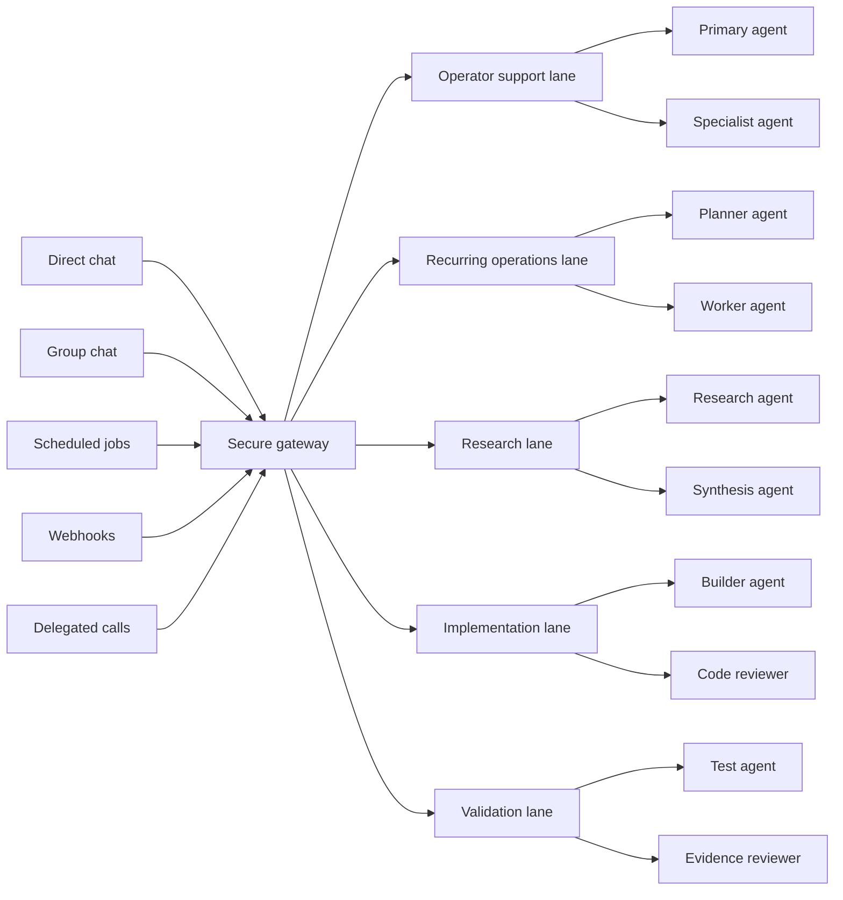
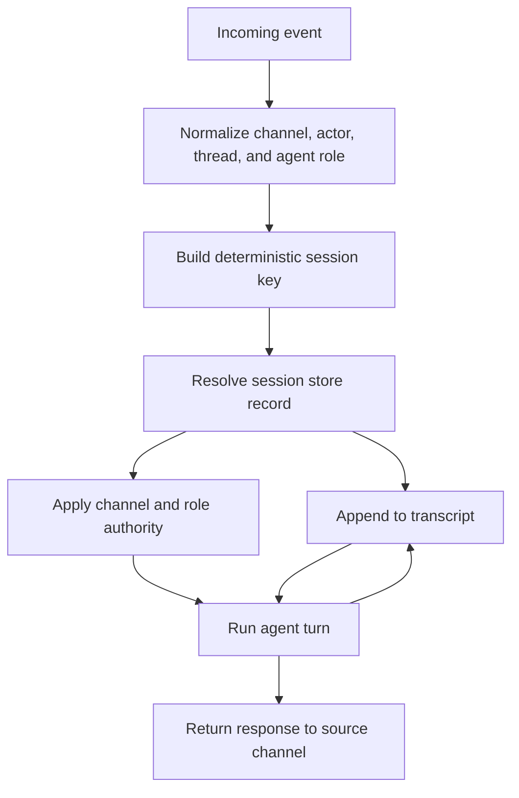

# Deterministic Session-Key Routing for Multi-Channel Agents

> **One-line intent:** Route every incoming agent event through a deterministic session key so channel, agent, user, thread, authority, and transcript state stay separate and recoverable.

## Plain-Language System Setup

This pattern assumes a system with one secure gateway and multiple agent lanes.

The gateway is the front door. It receives work from channels such as direct chat, group chat, scheduled jobs, webhooks, and delegated agent calls. The gateway should authenticate the source, normalize the event, choose the right lane, and attach the work to the right session and transcript.

The lanes are the operating paths behind that gateway. A lane might handle direct operator support, recurring operations, research, implementation, validation, or delegated background work. Within one lane, there may be more than one agent role, such as an orchestrator, worker, reviewer, or specialist.

That means the hard problem is not just "which agent should answer?" The harder problem is "which channel, lane, agent role, session, transcript, memory scope, and authority boundary should this event use?"



The secure gateway is the only front door. It routes work into the right lane, and the lane can involve one or more agent roles. Session-key routing makes that choice explicit and recoverable.

## Pattern in 60 Seconds

**The problem:** A multi-channel agent runtime can receive direct messages, group messages, background jobs, and delegated agent work through one gateway, which can blend context if each event does not resolve to the right session.

**The insight:** Session routing should be deterministic infrastructure, not conversational guesswork. The route from incoming event to agent identity, session state, transcript, and authority boundary should be computed the same way every time.

**The key structure:**

| Routing element | Purpose |
|-----------------|---------|
| Channel | Names where the work entered, such as direct chat, group topic, webhook, or scheduled job |
| Actor | Names the user, system job, or agent that initiated the work |
| Thread | Keeps group topics, conversations, or delegated jobs separate |
| Agent role | Routes work to the right runtime identity or lane |
| Session record | Stores the current session identifier and mutable counters |
| Transcript | Preserves the append-only record used for replay, compaction, and recovery |

**What broke when we got this wrong:** Runtime incidents became harder to diagnose because the operator could not quickly tell whether a no-reply or memory failure came from a broken gateway, the wrong session path, stale context, or a channel collision.

---

## Classification

| Property | Value |
|----------|-------|
| **Category** | Agentic Architecture |
| **Difficulty** | Intermediate |
| **Also Known As** | Deterministic Session Routing, Channel-Scoped Agent Sessions, Event-to-Transcript Routing |

---

## Motivation

At small scale, an agent can look like one chat window. The user sends a message, the agent replies, and all context appears to belong to one conversation.

That model breaks once the agent becomes shared work infrastructure. The same runtime may handle a private direct message, a group-topic message, a scheduled follow-up, a webhook, and delegated background work. Those events may reach the same gateway, but they should not share the same memory, transcript, authority, or recovery path.

The failure is subtle. The agent may still answer, but from the wrong context. A group topic can inherit direct-message context. A scheduled job can append to the wrong transcript. A delegated worker can lose the parent lane that requested the work. When a reply fails, the operator may not know whether the issue is gateway health, model availability, auth, session lookup, transcript compaction, or a routing collision.

Deterministic session-key routing turns that hidden guess into an explicit contract. Every event has a repeatable path into session state, transcript history, and authority boundaries.

---

## Applicability

Use this pattern when:

- one agent runtime receives work from more than one channel or surface
- direct messages, group threads, webhooks, scheduled jobs, or delegated agents share a gateway
- conversations persist beyond one turn
- transcripts are used for debugging, replay, compaction, audit, or recovery
- different channels or agent lanes should carry different memory and tool authority
- operators need to answer which context a reply used

Do NOT use this pattern when:

- the system is a one-shot stateless application programming interface (API)
- the agent has one user, one channel, and no durable transcript
- every message can safely share one context and one authority level
- the platform already provides enforced session isolation that you can inspect and test

---

## Structure



The gateway computes a stable session key before the agent turn starts. That key resolves mutable session state, append-only transcript history, and the authority posture for the current channel and role.

---

## Participants

| Participant | Role | Example |
|-------------|------|---------|
| Event source | Sends work into the runtime | Direct chat, group topic, webhook, scheduled job, delegated worker |
| Gateway | Normalizes the event and owns session lookup | OpenClaw Gateway as the authority for session state |
| Session key | Stable routing identifier | A key built from channel, account, actor, thread, and agent role |
| Session store | Mutable state for the route | `sessions.json` mapping a `sessionKey` to the current session identifier and counters |
| Transcript store | Append-only record for the session | `<sessionId>.jsonl` conversation tree with compaction summaries |
| Authority policy | Limits memory and tools for the route | Direct chat, group chat, and background jobs receive different posture |
| Agent runtime | Performs the model turn | Primary agent, delegated worker, or scheduled job lane |

---

## How It Works

1. Receive an event from a channel, job runner, webhook, or delegated agent.
2. Normalize the event into stable fields: channel, account, actor, thread, agent role, and work lane.
3. Build a deterministic session key from those fields.
4. Resolve the session key in the session store.
5. Create a new session record only when the key is new or rollover policy requires it.
6. Attach the event to the transcript for that resolved session.
7. Apply the channel and role authority policy before loading memory or tools.
8. Run the agent turn.
9. Append the response and tool events to the same transcript.
10. Return the response to the original source channel.

### Code / Configuration Example

This example is intentionally generic. The exact field names should match the runtime that adopts the pattern.

```yaml
session_routing:
  key_fields:
    - channel_type
    - channel_account
    - actor_id
    - thread_id
    - agent_role
  fallback_thread_id: direct
  stores:
    session_index: sessions.json
    transcript_dir: transcripts/
    authority:
    direct:
      memory_scope: owner
      tools: operator_approved_tools
    group_topic:
      memory_scope: team
      tools: limited_operator_tools
    scheduled_job:
      memory_scope: job_payload
      tools: allowlisted_job_tools
```

```javascript
function buildSessionKey(event) {
  const channelType = normalize(event.channelType);
  const channelAccount = normalize(event.channelAccount);
  const actorId = normalize(event.actorId || "system");
  const threadId = normalize(event.threadId || "direct");
  const agentRole = normalize(event.agentRole || "primary");

  return [
    channelType,
    channelAccount,
    actorId,
    threadId,
    agentRole
  ].join(":");
}
```

The configuration states which fields define isolation. The function makes the routing rule inspectable and testable. A team can add fields, but it should avoid removing fields without a migration plan because that can merge previously separate sessions.

---

## Consequences

### Benefits

- Reduces accidental context blending across channels, topics, and delegated work.
- Makes no-reply, forgetting, and compaction failures easier to investigate.
- Gives each transcript a clear route back to the event source that produced it.
- Lets security and sandbox posture depend on channel and role.
- Supports future channel expansion without treating every surface as the same trust boundary.

### Liabilities

- Requires a stable key schema and migration discipline.
- Adds operational overhead because session indexes and transcripts must be inspectable.
- Can create too many sessions if the key uses unstable fields.
- Does not solve memory permissions by itself. It must be paired with access control.
- Can expose private identifiers if keys are logged without redaction.

### What Broke in Practice

- Early multi-channel operation made it too easy to treat channel delivery as user interface plumbing instead of session infrastructure.
- No-reply and session-history incidents required operators to inspect gateway-side session files and transcript state, not just model behavior.
- Topic-level history isolation became necessary once group-channel work moved beyond one direct conversation.
- Compaction had to be treated as a persistent transcript event because recovery depends on what the gateway recorded, not what a local clone appears to remember.

---

## Implementation Notes

### Variations

- **Channel-only routing:** Works for simple systems, but it fails when one channel contains many users or topics.
- **Actor-and-thread routing:** Good for group topics and shared channels where a topic or thread must stay isolated.
- **Role-aware routing:** Useful when one user can invoke multiple agents or work lanes from the same channel.
- **Authority-aware routing:** Adds security policy lookup after session resolution.

### Common Pitfalls

- Building keys from display names or mutable labels.
- Treating direct messages and group topics as the same route.
- Letting scheduled jobs load full direct-message memory.
- Appending compaction summaries somewhere other than the session transcript.
- Logging raw identifiers where support staff or unrelated agents can read them.
- Changing the key schema without a migration and replay plan.

### Testing Checklist

- Send two direct messages from different users and confirm they resolve to different keys.
- Send two group-topic messages in the same group and confirm topic separation.
- Start a scheduled job from a direct-message request and confirm it receives only the intended payload.
- Force compaction and confirm the compaction summary lands in the same transcript.
- Simulate a no-reply incident and confirm the operator can identify the session key, session record, and transcript path.

---

## Security Implications

### Attack Surface

- Session keys can become sensitive metadata because they may encode channel, account, actor, or thread information.
- A forged webhook or job payload could try to claim a higher-trust route.
- A weak key schema can let low-trust channels collide with high-trust sessions.
- Logs, traces, and support tools may expose session identifiers.

### Data Sensitivity

- Session records point to transcript history and may reveal who communicated with the agent.
- Transcripts can include user messages, tool outputs, memory summaries, and compaction events.
- Channel and actor identifiers should be treated as operationally sensitive.

### Failure Modes

- A routing collision can blend private and shared context.
- A missing thread field can collapse group topics into one session.
- A delegated worker can lose parent context if its route does not include the originating lane.
- A migration can orphan transcripts if old and new keys are not mapped.

### Mitigations

- Use immutable internal identifiers, not display names.
- Authenticate the event source before computing authority.
- Keep a versioned key schema and migration plan.
- Redact or hash sensitive key fields in logs.
- Run collision tests whenever adding a channel or agent role.
- Pair routing with memory access control and per-agent tool policy.

---

## Known Uses

| Organization | Context | Scale |
|--------------|---------|-------|
| OpenClaw / SuperQ | Practitioner-run local-first agent runtime where chat surfaces route through a gateway that owns session state, session records, transcripts, and memory tiering | Individual operator plus delegated agent lanes |

---

## Related Patterns

| Pattern | Relationship |
|---------|--------------|
| Context Lifecycle Management | Complements this pattern by defining how session history survives context-window limits and compaction |
| Multi-Source Memory Architecture | Complements this pattern by separating live context, session history, durable memory, and retrieval indexes |
| Memory Access Control by Session Type | Complements this pattern by enforcing what memory each routed session may load |
| Per-Agent Data Access Control | Extends the same boundary idea to individual agent roles and tools |
| Ladder of Trust | Provides the operating model for increasing autonomy only after the route and controls are proven |

---

## Metadata

| Property | Value |
|----------|-------|
| **Contributor** | Kalen Howell Sr |
| **Production Environment** | Local-first agent gateway with operator workflows, chat ingress, delegated work lanes, file-backed sessions, and transcript storage |
| **First Published** | 2026-04-19 |
| **Last Updated** | 2026-04-19 |
| **Cloud Nirvana Event** | Not yet presented |
| **License** | CC BY 4.0 |

---

## Revision History

| Date | Change | Author |
|------|--------|--------|
| 2026-04-19 | Initial publication | Kalen Howell Sr |
