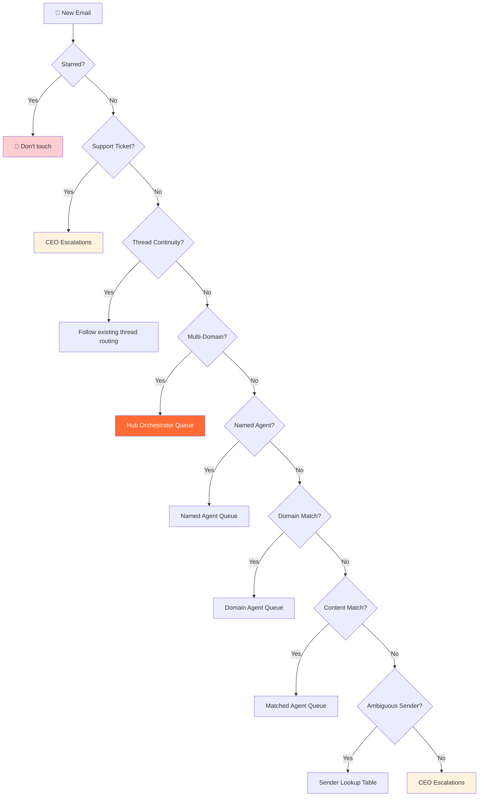

# Email Triage Priority Chain

> **One-line intent:** Route incoming emails to the right AI agent using a deterministic rule hierarchy that short-circuits on first match, preventing duplicate handling and conflicting agent responses.

## Pattern in 60 Seconds

**The problem:** You have multiple AI agents, each responsible for a domain (partnerships, events, speakers, finance). Email arrives that could match multiple domains. If you route based on content analysis alone, the same email gets labeled for two agents. Both agents draft responses. The responses contradict each other. Worse, some emails fall through the cracks because no rule matches confidently.

**The insight:** Don't analyze content first. Build a priority chain of deterministic rules that fire in order and short-circuit on the first match. Put high-confidence, no-ambiguity rules at the top (sender domain, support ticket patterns). Put fuzzy content analysis at the bottom. Most emails get routed by rule 2 or 3 without any LLM reasoning at all.

| Priority | Rule Type | Example | Confidence |
|----------|-----------|---------|------------|
| 1 | **Starred** | Never touch starred items | 100% |
| 2 | **Support Ticket** | Subject contains "Ticket #" or sender is support@ | 100% |
| 3 | **Named Agent** | Body says "Hey Lou" or "Question for Sage" | 100% |
| 4 | **Sender Domain** | @slantics.com → Content agent. Always. | 95%+ |
| 5 | **Multi-Domain Check** | Matches 2+ agent domains → Orchestrator queue | 90% |
| 6 | **Content Analysis** | Subject/body keywords match agent domains | 70-85% |
| 7 | **Ambiguous Sender** | Known contact who spans domains → lookup table | 85% |
| 8 | **Escalation** | No confident match → CEO/human queue | 100% |

**What broke when we got this wrong:** The first version of email triage used content analysis as the primary routing method. An email from a potential speaker who worked at a partner company got labeled for both the speakers agent AND the partnerships agent. Both agents drafted responses independently. One invited the person to speak; the other opened a sponsorship conversation. The CEO found two conflicting drafts and had to manually reconcile.

---

## Classification

| Property | Value |
|----------|-------|
| **Category** | Agentic Architecture |
| **Difficulty** | Intermediate |
| **Also Known As** | Rule-Based Email Routing, Deterministic Triage, Priority Waterfall, Agent Dispatch Chain |
| **Related Patterns** | Hub-and-Spoke Orchestration (multi-domain emails route to hub), Ladder of Trust (escalation thresholds), Per-Agent Data Access Control (agents only see their queue) |

---

## The Problem in Detail

### Email Is the Hardest Routing Problem

Email looks simple. It isn't. A single message can:
- Touch multiple business domains simultaneously (speaker who is also a partner)
- Come from someone who plays different roles in different threads (board member who is also a speaker)
- Be part of a thread where the topic shifted mid-conversation
- Be a support ticket reply that looks like a vendor email
- Be a personal email masquerading as business (CPA sending tax docs)
- Be a newsletter that's actually worth reading vs. one that's noise

Most teams solve this with an LLM: "Read the email and decide which agent should handle it." This works 80% of the time. The other 20% causes duplicate handling, missed emails, and conflicting responses.

### Why LLM-First Routing Fails

**Ambiguity is the enemy.** When an email could plausibly belong to two domains, the LLM either:
1. Picks one (50% chance it's wrong)
2. Picks both (creates duplicate handling)
3. Escalates everything (defeats the purpose of automation)

**Inconsistency across runs.** The same email, presented to the same model twice, may route differently depending on context window state, temperature, and preceding conversations.

**Cost at scale.** If every email requires an LLM call for routing, you're spending tokens on a classification problem that's better solved by deterministic rules for 80% of cases.

---

## The Solution

### The Priority Chain

The chain fires rules in strict order. The first rule that matches wins. Execution stops. No fallthrough.



### Rule Definitions

**Rule 1: Starred Items**
```
IF email.starred == true → STOP. Never touch.
```
The CEO reserves starring. It means "I want this here." No agent moves, labels, or processes starred emails. Period.

**Rule 2: Support Tickets**
```
IF sender matches support patterns (support@, noreply@, help@)
   OR subject matches ticket patterns (Case:, Ticket #, Request #)
   → Route to CEO Escalations
```
Support tickets require the context of the original request. Agents don't know what was asked, what tone is appropriate, or how far to push with a vendor. Always escalate.

**Rule 3: Thread Continuity**
```
IF email is a reply in an existing thread
   AND thread already has agent labels
   → Follow existing routing (unless sender/topic completely changed)
```
Replies in an established thread should maintain routing continuity. A patent attorney's follow-up should stay in the CEO queue even if the reply contains the word "referral" (which would normally trigger the partnerships agent).

**Rule 4: Multi-Domain Detection**
```
IF email would match 2+ agent domains based on content/sender
   → Route exclusively to Hub Orchestrator queue
   → Do NOT apply individual agent labels
```
This prevents the conflicting-drafts problem. One email, one owner. The hub queries specialists and synthesizes a unified response. (See Hub-and-Spoke Orchestration pattern.)

**Rule 5: Named Agent**
```
IF subject or greeting explicitly names an agent ("Hey Lou", "Question for Sage")
   → Route to named agent exclusively
```
The sender made an intentional choice about who they want to talk to. Respect it. No multi-labeling.

**Rule 6: Sender Domain**
```
IF sender domain matches known routing table
   → Route per domain table
```
High-confidence, deterministic routing. `@slantics.com` is always the content/marketing agent. `@ramp.com` is always the finance agent. No content analysis needed.

**Rule 7: Content Analysis**
```
IF subject/body keywords match agent domain patterns
   → Route to matched agent
```
This is where most people start (and where most problems originate). By putting it at priority 7 instead of priority 1, it only handles the cases that deterministic rules couldn't resolve. The remaining emails are genuinely ambiguous, so content analysis has fewer ways to fail.

**Rule 8: Ambiguous Sender Lookup**
```
IF sender is a known contact who spans multiple domains
   → Check lookup table for content-based disambiguation
```
Some people play multiple roles. The same person might be a board member, a speaker, and a partner. A lookup table maps known contacts to routing rules based on content context.

**Rule 9: Escalation (Default)**
```
IF no rule matched confidently → Route to CEO/human queue
```
Over-escalate rather than misroute. A human sorting one email is cheaper than two agents creating conflicting drafts.

### The Done Label

After an agent processes an email, it applies a `Done` label. The email stays in the agent's folder (for reference) but is marked as processed. The triage system skips emails that already have the Done label.

```
Email lifecycle:
  INBOX → Agent label applied, INBOX removed → Agent processes → Done label added
```

**Why keep the email in the agent's folder?** Audit trail. You can always check which agent handled which email. The Done label is the "processed" flag; the agent label is the "who handled it" flag.

### Processing Semantics: Message-Level, Not Thread-Level

Critical for users who disable Gmail conversation view: triage operates at the **message level**, not the thread level. Different messages in the same thread can route to different agents.

```
Thread: "Partnership Discussion with Acme Corp"
  Message 1 (from partner): → Scout (partnership)
  Message 2 (from partner's speaker): → Mic (speaker pipeline)
  Message 3 (from partner, about invoice): → Ledger (finance)
```

This requires message-level label operations, not thread-level. Most Gmail automation tools default to thread-level operations—verify your tooling supports message-level labeling.

---

## Applicability

Use this pattern when:
- Multiple agents share an email inbox (or any shared queue: tickets, messages, tasks)
- Cross-domain items are common (10%+ of incoming items touch multiple domains)
- Duplicate or conflicting handling is a real risk
- You need deterministic, auditable routing decisions
- Volume justifies automation (>20 items/day)

Do NOT use when:
- Single agent handles all email (no routing needed)
- All emails are clearly one domain (no ambiguity)
- Real-time response is critical (deterministic rules add latency vs. direct LLM routing)
- Email volume is very low (<5/day; manual routing is fine)

---

## Consequences

### Benefits

- **No duplicate handling:** Multi-domain check catches cross-domain emails before they reach individual agents
- **Deterministic and auditable:** Rules 1-6 produce the same result every time. No LLM inconsistency.
- **Cost efficient:** 80%+ of emails route via deterministic rules with zero LLM calls
- **Graceful degradation:** If content analysis (Rule 7) fails, escalation (Rule 9) catches it
- **Incremental refinement:** Add new domain rules as patterns emerge. Each addition makes the chain stronger.

### Liabilities

- **Rule maintenance:** Domain tables and ambiguous sender lookups need updating as the organization evolves
- **Over-escalation early on:** New senders default to escalation until you learn their patterns
- **Thread continuity is fragile:** Topic shifts mid-thread can cause stale routing
- **Message-level operations are harder:** Most email APIs default to thread-level; message-level requires custom tooling
- **Rule ordering matters:** A rule in the wrong position can shadow rules below it. Testing the chain end-to-end is essential.

---

## What Broke

### Incident 1: The Conflicting Drafts (March 2026)

**Context:** Email arrived from a person who was both a potential speaker and employed by a partner company.

**What happened:**
1. Content analysis matched two domains: speakers (Mic) and partnerships (Scout)
2. Triage applied both labels (pre-multi-domain rule)
3. Both agents ran their cron pipelines independently
4. Mic drafted a speaker evaluation and follow-up
5. Scout drafted a partnership exploration email
6. CEO found two conflicting drafts in Gmail for the same person

**Root cause:** No multi-domain detection rule. Content analysis applied all matching labels instead of recognizing the conflict and routing to the orchestrator.

**Fix:** Added Rule 4 (Multi-Domain Detection). If an email would match 2+ agent domains, it routes exclusively to the hub orchestrator. No individual agent labels applied.

### Incident 2: The Thread That Jumped Agents (March 2026)

**Context:** A patent attorney referral thread was in CEO Escalations. The attorney replied with language that included "referral" and "partnership opportunity."

**What happened:**
1. Reply arrived in an established CEO Escalations thread
2. Content analysis matched "referral" and "partnership" keywords
3. Triage rerouted the reply to Scout (partnerships)
4. Scout had no context on the patent search and drafted an inappropriate response
5. CEO caught it and manually moved it back

**Root cause:** No thread continuity rule. Each message was triaged independently without checking the thread's existing routing.

**Fix:** Added Rule 3 (Thread Continuity). Replies in an established thread follow existing routing unless the sender/topic completely changed.

### Incident 3: The Invisible Emails (March 2026)

**Context:** Agent cron jobs queried for emails using `label:AIOS/{AgentName} label:INBOX`.

**What happened:**
1. Triage correctly routed email to agent folder AND removed INBOX label
2. Agent cron job searched for `label:AIOS/Mic label:INBOX`
3. No results — because the INBOX label was already removed during triage
4. Email sat unprocessed in the agent's folder indefinitely
5. Multiple speaker inquiries went unanswered for days

**Root cause:** Agent query pattern required `label:INBOX`, but triage removed INBOX as part of routing. The email was correctly labeled but invisible to the agent's query.

**Fix:** Agent query pattern changed to `label:AIOS/{AgentName} -label:AIOS/Done`. Query for the presence of the agent label and absence of the Done label. Don't require INBOX.

---

## Implementation Notes

### Building the Domain Table

Start with high-volume, unambiguous senders:

```
# Phase 1: Known domains (week 1)
@slantics.com       → Content (marketing agency)
@ramp.com           → Finance (corporate card)
@docusign.com       → CEO (legal documents)
@namecheap.com      → Noise (domain registrar)

# Phase 2: Learned patterns (weeks 2-4)
# Watch escalation queue for repeated senders
# Each time you manually route, ask: "Can this be a domain rule?"

# Phase 3: Ambiguous senders (ongoing)
# Build the lookup table for contacts who span domains
```

### Noise Detection

Not every email needs an agent. Build a noise list:
- Automated notifications with no action needed
- Newsletters the user didn't subscribe to
- Marketing emails from vendors
- Calendar accept/decline notifications
- Transactional receipts for known platforms

**Important:** Direct replies from real people to emails the user personally sent are NEVER noise, even if casual or short. These are relationship signals.

### Testing the Chain

Before deploying, test with a representative sample:

1. Pull 50-100 recent emails
2. Run each through the priority chain manually
3. Compare against actual routing decisions
4. Check for:
   - False escalations (emails that should have matched a rule but didn't)
   - Wrong routing (email matched the wrong rule)
   - Shadowed rules (a higher-priority rule caught something a lower rule should have)
   - Multi-domain misses (cross-domain emails that slipped through to individual agents)

### Evolving the Chain

The priority chain is a living document. Evolution pattern:

1. **Watch the escalation queue.** Emails that hit Rule 9 (default escalation) are candidates for new rules.
2. **Watch the error log.** Emails that routed wrong reveal rule gaps.
3. **Promote patterns.** If you manually route the same sender domain 3+ times, add it to the domain table.
4. **Demote stale rules.** Remove domain rules for contacts you no longer communicate with.

---

## Security Implications

### Attack Surface

- **Rule manipulation:** If an attacker can modify the domain table or priority chain, they can reroute emails to agents of their choice (or to Noise, causing emails to be silently dropped).
- **Spoofed sender domains:** Domain rules trust the sender address. Email spoofing could route malicious content to a specific agent.
- **Noise as an attack vector:** An attacker who gets their domain added to the Noise list can send emails that are silently ignored.
- **Cross-agent information leakage:** If routing rules are visible to all agents, a compromised agent knows which domains route to which queues.

### Mitigations

1. **Version-control the routing rules.** Changes to the priority chain should be tracked in git with human review.
2. **Validate sender domains.** Check DKIM/DMARC when available before trusting domain-based routing.
3. **Audit the Noise list.** Periodically review what's being sent to Noise. An attacker hiding in the Noise queue is invisible.
4. **Principle of least privilege.** Each agent only sees its own queue. Agent query patterns should scope to their own labels only.
5. **Human review of new domain rules.** Don't let agents autonomously add domains to the routing table.

---

## Known Uses

- **Cloud Nirvana AIOS:** 8-rule priority chain routing to 11 agents + Noise + CEO Escalations. Message-level Gmail operations. 100+ emails/week processed. Custom bash scripts for message-level label operations.
- **Enterprise email triage systems:** ServiceNow, Zendesk, and similar platforms use rule-based routing with priority ordering, though typically at the ticket level rather than email level.
- **Apache Camel / Spring Integration:** Message routing patterns (Content-Based Router, Message Filter, Recipient List) solve the same problem in enterprise integration. The priority chain is a Content-Based Router with ordered evaluation.
- **Network firewall rules:** iptables/nftables process rules in order, first match wins, with a default policy at the end. Same architectural pattern applied to email instead of packets.

---

## Related Patterns

- **Hub-and-Spoke Orchestration:** Multi-domain emails (Rule 4) route to the hub. The hub queries relevant spokes and synthesizes a unified response.
- **Ladder of Trust:** Escalation thresholds (when to auto-route vs. when to escalate to human) align with trust levels. Higher trust = more autonomous routing.
- **Per-Agent Data Access Control:** Each agent only queries its own label queue. Agents can't see or process emails in other agents' queues.
- **Files Over Databases:** Routing rules stored in markdown files (version-controlled, human-readable) rather than database tables.

---

*Over-escalate rather than misroute. A human sorting one email is cheaper than two agents creating conflicting drafts.*

---

**Authors:** Sean Erikson (Cloud Nirvana), Lou 🔥 (AIOS Chief of Staff)
**First Published:** April 2026
**Last Updated:** April 3, 2026
**License:** CC BY 4.0
