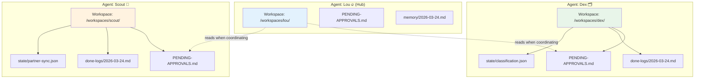
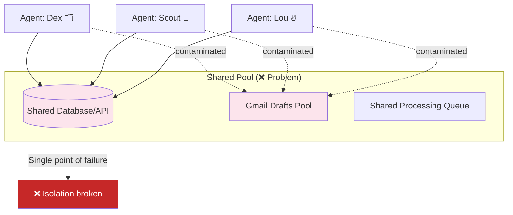

# Files Over Databases for Agent State

> **One-line intent:** Store agent working state in isolated markdown files per agent workspace instead of shared databases to prevent contamination and preserve independence.

## Pattern in 60 Seconds

**The problem:** Multiple agents need to track working state (pending approvals, processed items, coordination data). Where should this state live?

**The insight:** Shared databases create a shared point of failure for isolation. Markdown files in each agent's workspace keep agents independent. Each agent owns and reads its own files. The hub agent reads across workspaces when coordination is needed.

**The key structure:**

| Storage Type | Working State (pending approvals, temp data) | System of Record (CRM, financials) |
|--------------|---------------------------------------------|-----------------------------------|
| **File-based** | ✅ PENDING-APPROVALS.md, done-logs, classification state | ❌ |
| **Database** | ❌ | ✅ Encrypted, queryable, referential integrity |

**What broke when we got this wrong:** We used a shared Gmail drafts API for agent coordination. Agents contaminated each other's draft queues. One agent's pending approval appeared in another agent's processing list. The shared pool became a single point of failure for isolation.

**What survived:** Each agent gets its own `PENDING-APPROVALS.md` file and done-logs in its isolated workspace. The hub agent reads these files when coordination is needed. Simple, isolated, debuggable. No cross-agent contamination possible.

---

## Classification

| Property | Value |
|----------|-------|
| **Category** | Agentic Architecture |
| **Difficulty** | Foundational |
| **Also Known As** | Workspace Isolation, File-Based Agent State, Markdown Over Databases |

---

## Motivation

You've built a multi-agent system. One agent processes emails. Another manages partnerships. A third handles community outreach. Each agent needs to track its own state: what's pending approval, what's been processed, what needs follow-up.

The obvious solution is a shared database. Add a `pending_approvals` table, an `agent_id` column, and you're done. Each agent queries its own rows. Clean, structured, and familiar.

But then reality hits. Agent A marks an item as approved. Agent B's query accidentally picks it up because of a WHERE clause bug. Agent C's bulk update hits rows it shouldn't touch. You add more WHERE clauses, more defensive checks, more "don't touch other agents' data" logic. The database becomes a minefield.

Worse: the database is now a shared dependency. If the schema changes, every agent's queries need updating. If the database is temporarily unavailable, every agent stops working. The database is a single point of failure for coordination.

Files Over Databases solves this by inverting the model: instead of agents sharing a database with per-agent filters, each agent gets its own workspace with its own files. The hub agent (if coordination is needed) reads across workspaces. Contamination becomes impossible because agents literally cannot write to each other's files.

---

## Applicability

Use this pattern when:
- Multiple agents need independent working state (pending items, temp data, session context)
- Cross-agent contamination is a risk (shared pools, global queues)
- Agents should operate independently (not tightly coupled through shared state)
- Human operators need to inspect or modify agent state directly (markdown is easier than SQL)
- The data is narrative, temporary, or agent-specific (not system-of-record data)

Do NOT use this pattern when:
- You need real-time cross-agent queries ("show me all pending approvals across all agents")
- The data has relationships requiring foreign keys
- Multiple agents need concurrent write access to the same record
- You need complex querying, aggregation, or joins
- The data is system-of-record (see companion pattern: Memory vs Persistence Boundary)

---

## Structure

### Isolated Workspaces (Files Over Databases)



Each agent has an isolated workspace. Files cannot leak across boundaries.

### Shared Database (What We Moved Away From)



All agents share a single pool. WHERE clauses and filters are the only protection. One bug breaks isolation.

---

## Participants

| Participant | Role | Example |
|------------|------|---------|
| **Agent Workspace** | Isolated directory per agent containing all agent-specific files | `/workspaces/scout/`, `/workspaces/dex/` |
| **PENDING-APPROVALS.md** | Markdown file tracking items awaiting human approval | Draft emails, proposed calendar events, pending sends |
| **Done-logs** | Daily markdown files logging completed actions | `done-logs/2026-03-24.md` with timestamped entries |
| **State Files** | JSON or markdown files tracking agent-specific working state | `state/classification.json`, `state/last-sync.json` |
| **Hub Agent** | Coordinator that reads across workspaces when needed | Lou (hub) reading Dex's and Scout's pending approvals |

---

## How It Works

### 1. Each Agent Writes to Its Own Workspace

When an agent needs to track state, it writes to a file in its workspace:

```bash
# Agent: scout
WORKSPACE=/workspaces/scout
echo "## Pending: Partner Outreach Email" >> $WORKSPACE/PENDING-APPROVALS.md
echo "**Draft:** Hi, I'd like to schedule..." >> $WORKSPACE/PENDING-APPROVALS.md
echo "**Created:** 2026-03-24 14:32" >> $WORKSPACE/PENDING-APPROVALS.md
```

No database. No shared API. Just a file the agent owns.

### 2. Agent Reads Its Own Files

When resuming work, the agent reads from its own workspace:

```bash
# Agent: scout (on next session)
cat $WORKSPACE/PENDING-APPROVALS.md
# Sees only its own pending items
```

No WHERE clause. No `agent_id` filter. The file system provides isolation.

### 3. Hub Agent Reads Across Workspaces (When Needed)

If the hub agent needs to see all pending approvals across agents:

```bash
# Agent: lou (hub)
for agent_dir in /workspaces/*/; do
    agent_name=$(basename "$agent_dir")
    if [ -f "$agent_dir/PENDING-APPROVALS.md" ]; then
        echo "=== Agent: $agent_name ==="
        cat "$agent_dir/PENDING-APPROVALS.md"
    fi
done
```

The hub actively reads. There's no global query. This is intentional: it forces explicit coordination.

### 4. Approvals Clear from Agent's Own File

When a human approves an item, the agent removes it from its PENDING-APPROVALS.md and logs it to its done-log:

```bash
# Agent: scout
echo "✅ 2026-03-24 15:10 — Sent partner outreach email to Alice" >> done-logs/2026-03-24.md
# Then remove from PENDING-APPROVALS.md
```

### Workspace Layout (Configuration Example)

```yaml
# workspace-config.yaml
workspaces:
  base_path: /workspaces
  
  agents:
    dex:
      path: /workspaces/dex
      files:
        - PENDING-APPROVALS.md
        - state/classification.json
        - done-logs/
      
    scout:
      path: /workspaces/scout
      files:
        - PENDING-APPROVALS.md
        - state/partner-sync.json
        - state/last-outreach.json
        - done-logs/
      
    lou:
      path: /workspaces/lou
      files:
        - PENDING-APPROVALS.md
        - memory/
        - MEMORY.md
      can_read_other_workspaces: true  # Hub privilege
```

### File Format Example

```markdown
# PENDING-APPROVALS.md (Agent: scout)

## Pending: Partner Outreach Email to Alice Chen

**To:** alice@example.com  
**Subject:** Cloud Nirvana Partnership Opportunity  
**Draft:**

Hi Alice,

I'd like to schedule a call to discuss how Cloud Nirvana and your organization could collaborate on practitioner-first cloud education.

Best,
Sean

**Created:** 2026-03-24 14:32  
**Agent:** scout  
**Action Required:** Approval to send

---

## Pending: Calendar Event Creation

**Event:** Partner sync call with Bob  
**Time:** 2026-03-26 2:00 PM EST  
**Created:** 2026-03-24 15:00  
**Agent:** scout  
**Action Required:** Calendar access permission
```

Simple, readable, greppable, human-editable.

---

## Consequences

### Benefits
- **Isolation by default.** Agents cannot contaminate each other's state. The file system enforces boundaries; no application logic required.
- **Debuggable.** Humans can `cat` a file and see exactly what an agent is tracking. No SQL queries. No schema knowledge needed.
- **Simple.** Markdown files with a text editor. No ORM. No migrations. No connection pooling.
- **Resilient.** If one agent's workspace is corrupted, other agents are unaffected. No shared database that brings everyone down.
- **Version-controllable.** Workspaces can be git repos. Every state change is traceable.

### Liabilities
- **No cross-agent queries.** You can't SQL query "show me all pending approvals across all agents." The hub agent has to read each file explicitly.
- **No referential integrity.** Files don't enforce foreign keys. If an agent references a partner ID that doesn't exist, you won't know until runtime.
- **Coordination overhead.** If agents need to coordinate frequently, the hub agent becomes a bottleneck (it has to actively read files).
- **Concurrency challenges.** If multiple processes write to the same file simultaneously, you need file locking or conflict resolution.

### What Broke in Practice

**Gmail drafts as shared state:** We tried using the Gmail API's drafts endpoint as a shared coordination point. Each agent would create a draft for pending approvals. The hub agent would list drafts and coordinate.

Within two days, agents contaminated each other's draft queues. One agent's approved draft appeared in another agent's list. A bulk "mark as done" operation cleared drafts across multiple agents. The shared pool was a single point of failure.

**Root cause:** The Gmail API provides filtering (labels, search), but agents constructed filters differently. A missing label check, a typo in a search string, and contamination happened. The API had no enforcement; it trusted agents to get their queries right.

**What we learned:** Shared pools (databases, APIs, queues) require perfect WHERE clauses. File-based isolation requires no WHERE clause at all. The file system is your WHERE clause.

**Sponsor data in markdown:** We stored sponsor details in a shared markdown file (`SPONSORS.md`). Multiple agents read and updated it. Within a week, the file had duplicate entries, stale data, and conflicting information. One agent thought Sponsor A was "confirmed." Another thought "pending."

**Root cause:** No schema. No constraints. No single source of truth. Markdown is great for narrative, terrible for structured data that changes frequently.

**Fix:** Migrated sponsor data to the encrypted CRM database. Markdown remained for narrative context ("Sponsor A expressed concern about timing"). Database became system of record. Clear boundary restored.

### What Survived in Practice

**PENDING-APPROVALS.md per agent:** Four weeks into production, zero cross-agent contamination. Each agent writes to its own file. The hub agent reads when needed. Simple, isolated, debuggable.

**Done-logs per agent:** Daily markdown files (`done-logs/2026-03-24.md`) with timestamped entries. Agents append only. Never overwrite. Human-readable audit trail. When someone asks "did we send that email?" you grep the done-log. Instant answer.

**State files for sync tracking:** `state/last-sync.json` per agent. Stores timestamps, cursors, and counters for external API syncing (Gmail, calendar, CRM). No shared state. If one agent's sync breaks, others are unaffected.

---

## Implementation Notes

### Variations

**JSON instead of Markdown:** Use structured JSON files for state that agents query programmatically. Markdown for human-readable logs and approvals. Both work with file-based isolation.

**Shared Read, Isolated Write:** All agents can read a shared reference file (e.g., `BRIGHT-LINES.md`), but only the hub agent can write to it. Useful for policies and configurations.

**Hub as Aggregator:** The hub agent doesn't just read files; it consolidates them into a summary view (e.g., "5 pending approvals across 3 agents"). The hub becomes the coordination layer; spoke agents stay isolated.

**Workspace Templates:** New agents clone a template workspace structure. Ensures consistency and reduces setup time.

### Common Pitfalls

- **Storing system-of-record data in files.** Files are for working state, not authoritative data. If multiple agents need to query and update the same data (contacts, invoices, partners), use a database. See companion pattern: Memory vs Persistence Boundary.
- **Not locking files during writes.** If two agents write to the same file simultaneously (rare but possible), you need file locking (`flock` on Linux, similar on other platforms).
- **Forgetting to log actions.** If an agent completes an action but doesn't log it to the done-log, the action is invisible. Make logging part of the workflow.
- **Hub agent bypassing isolation.** The hub can read other workspaces, but it shouldn't write to them. That violates isolation and creates hidden dependencies.

### Migration Path

| Stage | State Storage | Trade-offs |
|-------|---------------|------------|
| **1. Shared Database** | All agents query same table with `agent_id` filter | Simple to implement; contamination risk high |
| **2. Files for Working State** | Agents use files for pending/temp data; database for system-of-record | Isolation restored; no cross-agent queries |
| **3. Hub Coordination** | Hub agent reads across workspaces; spoke agents stay isolated | Explicit coordination; scales to dozens of agents |

Most teams start at Stage 1 (shared database). Move to Stage 2 when contamination happens. Stage 3 emerges when the hub agent's coordination role becomes clear.

---

## Security Implications

### Attack Surface
- **File system permissions matter.** If agents run under different user accounts, the OS enforces isolation. If they share a user, file permissions must be configured correctly (`chmod 700` on workspaces).
- **Hub agent has elevated read access.** A compromised hub agent can read all agent workspaces. Limit hub agent privileges to read-only for other workspaces.

### Data Sensitivity
- **Files are plaintext by default.** If an agent's workspace contains sensitive data (API keys, passwords, PII), consider encrypting files at rest or storing secrets elsewhere (see Per-Agent Data Access Control pattern).
- **Workspaces reveal operational details.** Pending approvals, done-logs, and state files show what the system is doing. Treat workspace contents as operationally sensitive.

### Failure Modes
- **Workspace corruption.** If an agent writes malformed data, its own workspace is affected. Other agents are isolated. This is the correct failure mode.
- **Hub agent failure.** If the hub agent crashes, spoke agents continue working independently. Coordination stops, but operations don't.
- **File deletion.** If an agent accidentally deletes its PENDING-APPROVALS.md, pending work is lost. Backups and version control (git) mitigate this.

### Mitigations
- **File system permissions:** Each agent workspace owned by a separate user or group. Hub agent has read-only access to other workspaces.
- **Backups:** Workspaces backed up regularly. Git-based workspaces provide automatic history.
- **Encryption:** Use encrypted file systems (LUKS, FileVault, BitLocker) or application-level encryption for sensitive files.
- **Audit trail:** Agents log file writes to a separate audit log. Detect unusual write patterns (agent writing to another agent's workspace).

---

## Known Uses

| Organization | Context | Scale |
|-------------|---------|-------|
| Cloud Nirvana | Multi-agent system with 11 agents, each with isolated workspace | Small team, 2,000+ community members |
| [Your implementation here] | [How you applied this pattern] | [Your scale] |

---

## Related Patterns

| Pattern | Relationship |
|---------|-------------|
| **Memory vs Persistence Boundary** | Defines when to use files (working state) vs databases (system-of-record). Complementary decision framework. |
| **Hub-and-Spoke Orchestration** | The hub agent coordinates by reading across spoke agent workspaces. This pattern provides the isolation mechanism. |
| **Per-Agent Data Access Control** | For system-of-record data (CRM, financials), use databases with authorization wrappers. This pattern is for working state. |
| **Ladder of Trust** | Agents earn trust levels independently. File-based isolation prevents trust violations from spreading across agents. |

---

## Metadata

| Property | Value |
|----------|-------|
| **Contributor** | Sean Erikson, CEO & Co-Founder, Cloud Nirvana |
| **Production Environment** | Multi-agent agentic AI system |
| **First Published** | March 2026 |
| **Last Updated** | March 24, 2026 |
| **Cloud Nirvana Event** | Seed pattern (pre-Q2 2026) |
| **License** | CC BY 4.0 |

---

## Revision History

| Date | Change | Author |
|------|--------|--------|
| 2026-03-24 | Initial publication | Sean Erikson / Lou 🔥 |
