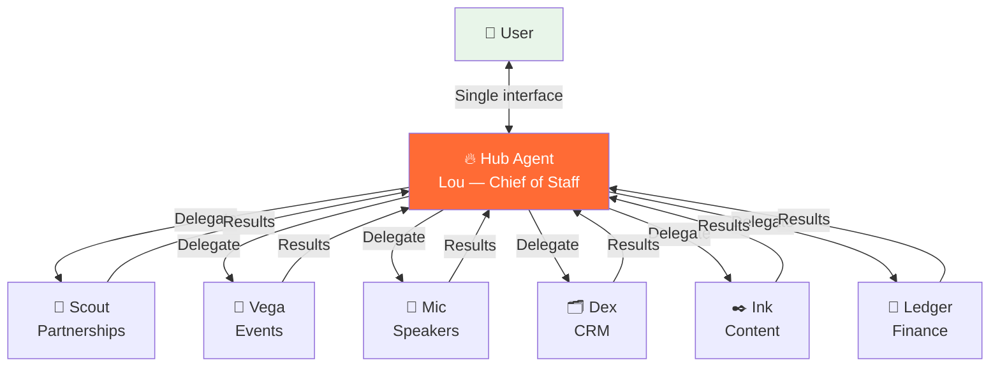

# Hub-and-Spoke Agent Orchestration

> **One-line intent:** Coordinate multiple AI agents through a single orchestrator hub, eliminating lateral communication chaos and giving users one interface instead of many.

## Pattern in 60 Seconds

**The problem:** You have multiple AI agents, each owning a domain (email, CRM, speakers, events, content). They need to collaborate on tasks that cross domains. If agents talk to each other directly (mesh topology), coordination explodes: 11 agents = 55 possible connections. Nobody knows who's doing what. Users don't know which agent to talk to. Conflicting actions happen.

**The insight:** Don't let agents talk to each other. Route everything through a hub agent that understands the full picture, delegates to specialists, and synthesizes results into one coherent response. The user talks to one agent. That agent coordinates the rest.

| Component | Role | Example |
|-----------|------|---------|
| **Hub** | Orchestrator — receives requests, delegates, synthesizes | Lou (Chief of Staff) |
| **Spokes** | Specialists — own their domain, respond to hub only | Mic (Speakers), Vega (Events), Dex (CRM), Scout (Partnerships) |
| **User** | Talks to the hub exclusively | CEO, team members |

**What broke when we got this wrong:** Before hub-and-spoke, agents independently drafted responses to the same email thread. Scout drafted a partnership reply. Mic drafted a speaker reply. Both were technically correct but contradicted each other in tone and commitments. The user found two conflicting drafts in Gmail and lost confidence in the system.

---

## Classification

| Property | Value |
|----------|-------|
| **Category** | Agentic Architecture |
| **Difficulty** | Intermediate |
| **Also Known As** | Agent Orchestrator, Star Topology, Single-Interface Multi-Agent, Coordinator Pattern |
| **Related Patterns** | Ladder of Trust (trust levels per spoke), Context Lifecycle Management (hub needs richest memory), Per-Agent Data Access Control (scope spoke access), Email Triage Priority Chain (routing to spokes) |

---

## The Problem in Detail

### Multi-Agent Coordination Is Harder Than It Looks

Building one AI agent is straightforward. Building five that work together is an order of magnitude harder. Building eleven that coordinate without chaos is an architectural problem that most teams underestimate.

**The naive approach (mesh topology):**

```
Agent A ↔ Agent B ↔ Agent C
  ↕         ↕         ↕
Agent D ↔ Agent E ↔ Agent F
```

Every agent can talk to every other agent. Sounds flexible. In practice:

- **N agents = N×(N-1)/2 connections.** 11 agents = 55 bidirectional channels to manage.
- **No single source of truth.** Agent A tells Agent B one thing; Agent C tells Agent B something different. Which wins?
- **Conflicting actions.** Two agents draft responses to the same email. Two agents update the same CRM record. Two agents schedule conflicting calendar events.
- **User confusion.** "Which agent do I talk to about this?" If the answer requires understanding the agent architecture, the system has failed.
- **Debugging nightmare.** When something goes wrong, tracing the chain of agent-to-agent communication is nearly impossible.

**Real incident (March 2026):**

An email from a potential speaker landed in the inbox. It touched two domains: speaker pipeline (Mic's territory) and partnership (Scout's territory). Both agents picked it up. Both drafted replies. Scout's draft committed to a sponsorship conversation. Mic's draft invited the person to apply as a speaker. The user found both drafts and realized the system could make contradictory promises to the same person.

### Why Not Just Use One Big Agent?

Tempting, but it doesn't scale:

- **Context window limits.** One agent handling email, CRM, speakers, events, content, finances, and community engagement burns through context in a single session.
- **Prompt complexity.** The system prompt for an everything-agent becomes unmanageable (thousands of lines of instructions, edge cases, domain rules).
- **Cost.** Running every task through your most capable (expensive) model wastes money on routine work.
- **Blast radius.** One bad prompt or hallucination affects everything, not just one domain.

---

## The Solution

### Hub-and-Spoke Topology



**Key rules:**

1. **Users talk to the hub.** Always. No exceptions. If a team member needs CRM data, they ask Lou. Lou queries Dex.
2. **Spokes never talk to each other.** Mic doesn't message Vega. Scout doesn't message Dex. All cross-domain coordination flows through the hub.
3. **Spokes never talk to users.** Users see one agent, one voice, one interface. Spokes are invisible.
4. **The hub synthesizes.** When a task touches multiple domains, the hub queries each relevant spoke, reconciles conflicting information, and delivers one coherent response.

### Hub Responsibilities

The hub is not a router. It's a strategist.

| Responsibility | What It Means | Example |
|---------------|---------------|---------|
| **Triage** | Determine which spokes are needed for a request | "This email mentions a speaker AND a sponsorship → query Mic AND Scout" |
| **Delegation** | Send domain-specific questions to spokes | "Mic, evaluate this person as a speaker candidate. Scout, check if their company is a partner." |
| **Synthesis** | Combine spoke responses into one coherent answer | "Mic says strong speaker. Scout says their company is a prospect. Draft one email that addresses both." |
| **Conflict resolution** | When spokes disagree, the hub decides | "Scout wants to invite them as a sponsor. Mic wants them as a speaker. These aren't mutually exclusive — draft an email that positions both." |
| **Context preservation** | Maintain the full picture across all domains | Hub has richest memory; spokes have thinner, domain-specific context |
| **Quality gate** | Review spoke outputs before they reach the user | "Mic's draft uses the wrong email signature. Fix it before presenting to user." |

### Spoke Responsibilities

Spokes are specialists, not generalists.

| Responsibility | What It Means | Example |
|---------------|---------------|---------|
| **Domain expertise** | Deep knowledge of their area | Mic knows speaker QA criteria, event formats, past speakers |
| **Task execution** | Perform domain-specific work when asked by hub | Query CRM, evaluate speaker fit, draft domain-specific content |
| **Result reporting** | Return structured results to hub | "Speaker score: 7/10. Strengths: practitioner background. Gaps: no AI experience." |
| **Staying in lane** | Don't attempt work outside their domain | Mic doesn't draft partnership emails. Dex doesn't evaluate speaker quality. |

### Communication Protocol

Hub-to-spoke communication follows a structured pattern:

**Hub → Spoke (delegation):**
```
Context: [What the hub knows about the situation]
Task: [Specific question or action for this spoke]
Constraints: [Boundaries, deadlines, format requirements]
Return: [What the hub needs back]
```

**Spoke → Hub (results):**
```
Assessment: [Spoke's domain-specific evaluation]
Recommendation: [What the spoke thinks should happen]
Data: [Any relevant data points, scores, records]
Caveats: [Uncertainties, missing information, edge cases]
```

**Hub → User (synthesis):**
```
[One coherent response that incorporates all spoke inputs,
resolves conflicts, and presents a clear recommendation
with next steps]
```

---

## Applicability

Use this pattern when:
- You have 3+ agents that need to coordinate on shared work
- Tasks regularly cross domain boundaries
- Users shouldn't need to understand your agent architecture to get work done
- Conflicting agent actions are a real risk (shared resources: email drafts, CRM records, calendar)
- You need an audit trail of who decided what and why

Do NOT use when:
- You have 1-2 agents with clearly separated domains (no coordination needed)
- All agents work on completely independent tasks (no shared resources)
- Latency is critical and the hub becomes a bottleneck
- Agents need real-time, high-frequency communication (hub can't keep up)
- You want agents to autonomously discover and collaborate without central control (swarm pattern instead)

---

## Consequences

### Benefits

- **Single interface:** Users talk to one agent. Complexity is hidden.
- **No conflicting actions:** The hub coordinates, so two agents never draft contradictory responses to the same email.
- **Clear accountability:** Every action traces back through the hub. You know who decided what.
- **Incremental deployment:** Add spokes one at a time. The hub adapts.
- **Cost optimization:** Hub runs on expensive model (needs strategic reasoning). Spokes run on cheaper models (domain-specific tasks).
- **Trust scaling:** Users trust one agent (the hub). The hub trusts the spokes. Users don't need to learn 11 agent personalities.

### Liabilities

- **Hub is a single point of failure.** If the hub is down or confused, everything stops.
- **Hub context pressure.** The hub needs the richest context (all domains, all history). This makes it most vulnerable to context window limits (see Context Lifecycle Management).
- **Latency.** Every cross-domain request adds a round trip: user → hub → spoke → hub → user. For simple single-domain tasks, this overhead is unnecessary.
- **Hub complexity creep.** As spokes multiply, the hub's orchestration logic grows. The hub can become the "everything agent" you were trying to avoid.
- **Spoke underutilization.** Spokes sit idle waiting for hub delegation. They don't proactively surface insights (trade-off vs. mesh topology).

---

## What Broke

### Incident 1: Conflicting Drafts (March 2026)

**Context:** An email arrived from a person who was both a potential speaker and employed by a potential partner company.

**What happened:**
1. Email triage applied two labels: `AIOS/Mic` (speakers) and `AIOS/Scout` (partnerships)
2. Both Mic and Scout ran their cron pipelines independently
3. Mic drafted a speaker evaluation and follow-up email
4. Scout drafted a partnership exploration email
5. Both drafts landed in Gmail drafts folder
6. User found two conflicting drafts for the same person — one focused on speaking, one on sponsorship

**Root cause:** Multi-label emails (touching multiple domains) were processed by each agent independently with no coordination. There was no hub synthesizing a unified response.

**Fix:** Emails that match multiple agent domains now route exclusively to the hub (Lou). The hub queries each relevant spoke, synthesizes their input, and creates one draft. Multi-label emails never go directly to individual agents.

**Rule established:** If an email triggers more than one agent label, it goes to the hub. Single-label emails can go directly to the responsible spoke's queue.

### Incident 2: Team Trust Scaling (April 2026)

**Context:** Cloud Nirvana core team (7 people) needed to interact with the AIOS for speaker pipeline coordination.

**What happened:**
1. Initial plan: team members would interact with specialist agents directly (Mic for speakers, Vega for events)
2. Problem: team members didn't know which agent owned which task
3. Problem: team members didn't trust unfamiliar agents ("who is Mic?")
4. Team members naturally gravitated toward asking Lou (the agent they already knew)

**Insight:** Don't ask users to trust 11 agents. Ask them to trust one agent that coordinates the other 10.

**Result:** Team → Lou → Specialists became the official workflow. Lou coordinates behind the scenes. Team sees one agent, one voice, one Telegram thread. Jim Gehring replied to Lou within an hour of the first team email — first real back-and-forth between a team member and the AIOS. It worked because Jim was talking to Lou, not to an unfamiliar specialist.

### Incident 3: Hub Bottleneck During Email Storms (March 2026)

**Context:** Monday morning after a weekend of incoming emails. 40+ emails needed triage and routing.

**What happened:**
1. All emails hit Lou's triage queue
2. Lou processed them sequentially (one at a time)
3. Simple single-domain emails (clearly just Noise, or clearly just one agent's domain) waited behind complex multi-domain emails
4. Triage took over an hour instead of minutes

**Lesson:** The hub shouldn't process everything. Simple, unambiguous routing should be handled by rules (deterministic triage), not by the hub agent. The hub should only handle ambiguous or multi-domain cases.

**Fix:** Implemented the Email Triage Priority Chain (see related pattern) — a deterministic 5-rule hierarchy that handles 80% of emails without invoking the hub. The hub only processes the remaining 20% that require judgment.

---

## Implementation Notes

### Model Selection by Role

| Role | Recommended Model | Rationale |
|------|------------------|-----------|
| **Hub** | Most capable (e.g., Opus) | Needs strategic reasoning, synthesis, conflict resolution |
| **Spokes** | Cost-effective (e.g., Sonnet) | Domain-specific tasks, bounded complexity |
| **Triage** | Cost-effective or deterministic rules | High volume, simple decisions |

This mirrors the Ladder of Trust: the hub operates at a higher trust level (Autonomous/Strategic) while spokes operate at Guided level.

### File-Based Coordination

In the Cloud Nirvana implementation, hub-spoke communication uses files, not API calls:

```
Hub workspace:
  PENDING-APPROVALS.md     ← Spoke writes draft details here
  MEMORY.md                ← Hub's full context
  
Spoke workspace:
  PENDING-APPROVALS.md     ← Spoke's outbox to hub
  memory/speaker-qa-done-log.md  ← Spoke's completed work log
```

**Why files over message queues:**
- Files survive agent restarts and compaction
- Files are inspectable (human can read PENDING-APPROVALS.md anytime)
- Files are version-controlled (git history)
- No infrastructure dependencies (no Redis, no RabbitMQ, no message broker)

See the Files Over Databases pattern for the full rationale.

### Cron-Driven Orchestration

Spokes run on cron schedules, not real-time event triggers:

```
Speaker QA (Mic):    Every hour at :30, 6am-6pm ET
Email Triage (Lou):  Every hour at :00, 6am-6pm ET
Partnership (Scout): Every hour at :15, 6am-6pm ET
```

**Advantages:**
- Predictable execution windows
- Cost-controlled (fixed number of runs per day)
- No race conditions (each cron run is a complete transaction)
- Easy to debug (check the cron log for a specific time)

**Disadvantages:**
- Latency (up to 1 hour between email arrival and response)
- No real-time response for time-sensitive items
- Cron frequency becomes a cost/responsiveness trade-off

### Scaling: When Hub-and-Spoke Isn't Enough

Hub-and-spoke works well up to ~10-15 spokes. Beyond that, consider:

- **Hierarchical hubs:** Hub delegates to sub-hubs that each coordinate a cluster of spokes (e.g., "Operations Hub" coordinates Events, Speakers, Logistics; "Growth Hub" coordinates Partnerships, Content, Community)
- **Event-driven triggers:** Add real-time triggers for urgent items while keeping cron for routine work
- **Spoke autonomy elevation:** Mature spokes graduate to higher trust levels and handle their domain without hub involvement for routine tasks (Ladder of Trust progression)

---

## Security Implications

### Attack Surface

- **Hub compromise = full system compromise.** The hub has access to all spokes and all context. An attacker who controls the hub controls the entire system.
- **Spoke impersonation.** If a spoke's output is trusted without verification, a compromised spoke can inject malicious content into the hub's synthesis.
- **Cross-domain data leakage.** The hub sees everything. If the hub's memory isn't properly classified (see Memory Access Control), sensitive data from one domain can leak into another domain's response.

### Mitigations

1. **Hub gets highest security:** Strongest model, most restrictive access controls, most thorough audit logging.
2. **Spoke output validation:** Hub should verify spoke outputs match expected format and scope before synthesizing.
3. **Per-spoke access scoping:** Each spoke should only have access to its domain's data (Per-Agent Data Access Control pattern).
4. **Audit trail:** Log every hub → spoke delegation and every spoke → hub response. Immutable.
5. **Bright lines on the hub:** Certain actions (financial transactions, external communications, data deletion) require human approval even from the hub (Ladder of Trust).

---

## Known Uses

- **Cloud Nirvana AIOS:** Lou (Opus) as hub coordinating 10 spokes (Sonnet) across email, CRM, speakers, events, content, finance, community. File-based coordination, cron-driven execution. 6 weeks in production.
- **Microsoft AutoGen:** Multi-agent framework with orchestrator pattern. Agents communicate through a central conversation manager.
- **CrewAI:** "Manager" agent pattern that delegates tasks to crew members and synthesizes results.
- **LangGraph:** Supervisor node pattern for multi-agent workflows with conditional routing.
- **Traditional microservices:** API Gateway pattern (single entry point routing to backend services) is the infrastructure equivalent of hub-and-spoke for agents.

---

## Related Patterns

- **Ladder of Trust:** Governs what each spoke can do autonomously vs. what requires hub approval. Hub typically operates at Autonomous/Strategic level; spokes at Guided level.
- **Context Lifecycle Management:** Hub needs the richest memory (sees all domains). Apply aggressive memory management to prevent the hub from hitting context limits.
- **Email Triage Priority Chain:** Deterministic routing rules that handle simple cases without invoking the hub, reducing hub load.
- **Files Over Databases:** File-based hub-spoke coordination (PENDING-APPROVALS.md) instead of message queues or databases.
- **Per-Agent Data Access Control:** Scope each spoke's data access to its domain. Prevents a compromised spoke from accessing other domains.
- **Memory Access Control:** Hub sees all context but must classify it by audience when responding in different contexts (direct chat vs. team chat).

---

*Don't ask users to trust 11 agents. Ask them to trust one agent that coordinates the other 10.*

---

**Authors:** Sean Erikson (Cloud Nirvana), Lou 🔥 (AIOS Chief of Staff)
**First Published:** April 2026
**Last Updated:** April 3, 2026
**License:** CC BY 4.0
