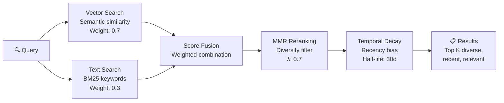

# Hybrid Memory Retrieval

> **One-line intent:** Combine vector semantic search, keyword text search, diversity reranking, and temporal decay to dramatically improve agent memory recall over any single retrieval method alone.

## Pattern in 60 Seconds

**The problem:** Your AI agent has accumulated weeks or months of memory in files, session transcripts, and documents. When it needs to recall something, a single retrieval method fails in predictable ways. Vector search finds semantically similar content but misses exact names and identifiers. Keyword search finds exact matches but misses conceptual connections. Both return redundant results and treat a note from yesterday the same as a note from three months ago.

**The insight:** No single retrieval method wins in all cases. Combine them with weighted scoring, then apply diversity reranking (so you don't get 6 results from the same paragraph) and temporal decay (so recent memories rank higher than stale ones). The combination dramatically outperforms any individual method.

| Component | What It Does | What It Catches |
|-----------|-------------|-----------------|
| **Vector search** (weight: 0.7) | Semantic similarity via embeddings | Conceptual matches ("budget concerns" finds "cost optimization") |
| **Text search** (weight: 0.3) | BM25 keyword matching | Exact names, IDs, URLs, error codes, domain-specific terms |
| **MMR reranking** (λ: 0.7) | Maximal Marginal Relevance — penalizes redundancy | Diverse results across different documents and topics |
| **Temporal decay** (half-life: 30 days) | Recency bias — recent memories score higher | Yesterday's decision outranks last month's superseded one |

**What broke when we got this wrong:** Agent was asked "What did we decide about the email signature logo?" Vector search returned 4 results about email signatures in general (templates, formatting, HTML structure) but missed the specific conversation where the logo URL was changed from WordPress to GitHub. The exact URL and the decision context were in a daily note that keyword search would have found instantly (searching for "logo" + "URL" + "signature"). The agent used a stale logo URL from the semantically-similar-but-wrong results and the image 404'd in the draft.

---

## Classification

| Property | Value |
|----------|-------|
| **Category** | Agentic Architecture |
| **Difficulty** | Intermediate |
| **Also Known As** | Hybrid Search, Multi-Signal Retrieval, Fusion Retrieval, Ensemble Search |
| **Related Patterns** | Context Lifecycle Management (retrieval feeds the memory tiers), Files Over Databases (what's being retrieved), Memory Access Control (scope retrieval by session type) |

---

## The Problem in Detail

### Why Single-Method Retrieval Fails

**Vector search alone:**

Strengths:
- Finds conceptual matches across different phrasings
- "What was the cost issue?" matches "budget optimization discussion"
- Handles synonyms and paraphrases naturally

Weaknesses:
- **Terrible at exact identifiers.** Search for "message ID 19d36a49f411880a" and vector search returns results about "message handling" and "ID management" — semantically related, factually useless.
- **Embedding collapse.** Similar topics cluster together in embedding space. Six results about "email signatures" when you needed the one about the logo URL change.
- **No recency awareness.** A decision from February and a contradicting decision from April have equal semantic relevance. The agent doesn't know which is current.

**Keyword search alone (BM25):**

Strengths:
- Perfect for exact names, IDs, URLs, error codes, technical terms
- Deterministic — same query always returns same results
- Fast and cheap (no embedding computation)

Weaknesses:
- **No conceptual understanding.** Search for "budget concerns" won't find "cost optimization" or "token spending."
- **Vocabulary mismatch.** User says "the logo thing we fixed" — no keywords match "EMAIL-SIGNATURES.md URL migration."
- **Brittle to phrasing.** "Shanti meeting" vs "KeyBank speaker" vs "Cincinnati Q2 candidate" are all the same person, but keyword search treats them as unrelated.

### The Redundancy Problem

Both methods suffer from redundancy. If your memory contains a daily note, a checkpoint file, and MEMORY.md all referencing the same decision, retrieval returns three near-identical results. You've used 3 of your 6 result slots on the same information. The actually-different piece of context you needed is pushed out.

### The Staleness Problem

Agent memory accumulates over time. A logo URL documented in February was correct then. It was updated in March. Both entries exist in memory. Without temporal awareness, retrieval treats both as equally valid. The agent picks the wrong one 50% of the time.

---

## The Solution

### Four-Component Retrieval Pipeline



### Component 1: Vector Semantic Search (Weight: 0.7)

The primary signal. Embed the query and find memory chunks with similar meaning.

**Why weight 0.7:** Most agent memory queries are conceptual ("What did we decide about...," "What's the status of..."). Semantic understanding is the right primary signal for natural language questions.

**Configuration:**
```json
{
  "vectorWeight": 0.7,
  "embeddingModel": "default",
  "chunkSize": "paragraph"
}
```

### Component 2: BM25 Text Search (Weight: 0.3)

The safety net. Find exact keyword matches that vector search misses.

**Why weight 0.3:** Keyword matches are high-precision but low-recall. When they hit, they hit hard (exact names, IDs, URLs). But most queries don't benefit from keyword matching. The 0.3 weight ensures keyword hits boost results without overwhelming semantic results.

**When text search saves you:**
- Agent names: "Mic," "Scout," "Ledger"
- Email addresses: "shanti_behera@keybank.com"
- Technical identifiers: draft IDs, message IDs, label IDs
- Domain-specific terms: "PENDING-APPROVALS.md," "speaker-qa-done-log"
- Error codes: "404," "403," "ECONNREFUSED"
- Exact phrases the user said: "practitioner-first credibility"

### Component 3: MMR Reranking (λ: 0.7)

Maximal Marginal Relevance penalizes results that are too similar to results already selected. Instead of returning 6 passages about the same topic, MMR ensures diversity across results.

**How it works:**

```
For each candidate result:
  score = λ × relevance_to_query - (1-λ) × max_similarity_to_already_selected
```

- **λ = 1.0:** Pure relevance (no diversity penalty). Returns the 6 most relevant results even if they're all from the same paragraph.
- **λ = 0.0:** Pure diversity. Returns maximally different results even if some aren't very relevant.
- **λ = 0.7:** Balanced. Strong preference for relevance, but duplicate/near-duplicate results get penalized enough to let different perspectives surface.

**Why λ = 0.7:** Agent memory often contains the same information in multiple places (MEMORY.md, daily notes, checkpoints). Without MMR, retrieval burns result slots on redundant copies. 0.7 gives enough diversity pressure to surface different documents while keeping relevance as the primary signal.

### Component 4: Temporal Decay (Half-Life: 30 Days)

Recent memories are more likely to be current and relevant. Apply exponential decay based on document age.

**How it works:**

```
decay_factor = 0.5 ^ (age_in_days / half_life_days)

Document from today:     decay = 1.0    (full weight)
Document from 15 days:   decay = 0.71   (71% weight)
Document from 30 days:   decay = 0.50   (50% weight)
Document from 60 days:   decay = 0.25   (25% weight)
Document from 90 days:   decay = 0.125  (12.5% weight)
```

**Why 30-day half-life:** In a fast-moving agent system, decisions change weekly. A 30-day half-life means last week's notes are at ~85% weight (still very relevant), last month's are at 50% (available but not dominant), and notes from 3 months ago are at ~12% (low priority unless nothing better exists).

**Critical nuance:** Temporal decay should apply to the document's last-modified date, not creation date. A MEMORY.md file updated yesterday is "fresh" even though it was created months ago.

---

## Applicability

Use this pattern when:
- Agent has accumulated 30+ documents of memory (daily notes, checkpoints, docs, session transcripts)
- Queries mix natural language ("what did we decide") with exact lookups ("Shanti's email")
- Memory contains superseded information (old decisions overridden by new ones)
- Multiple documents cover the same topics (MEMORY.md + daily notes + checkpoints)
- Recall accuracy directly impacts agent behavior (wrong retrieval → wrong actions)

Do NOT use when:
- Memory corpus is small (<10 documents). Just load everything into context.
- All retrieval is exact lookup (database queries, not semantic search)
- Real-time latency is critical and hybrid search adds unacceptable overhead
- Memory is append-only with no superseded information (temporal decay adds no value)

---

## Consequences

### Benefits

- **Dramatically better recall.** Hybrid catches what either method alone misses. Vector finds concepts; text finds identifiers. Together, they cover the full query space.
- **Diverse results.** MMR prevents result slots from being wasted on redundant passages.
- **Recency awareness.** Temporal decay naturally prefers current information over stale data without requiring manual cleanup.
- **Tunable.** Weights, lambda, and half-life are adjustable per deployment. Heavy on exact lookups? Increase text weight. Fast-changing domain? Shorter half-life.
- **Graceful degradation.** If vector search returns garbage, keyword results still surface. If keywords miss, vectors still find concepts.

### Liabilities

- **Tuning complexity.** Four parameters to tune (vector weight, text weight, MMR lambda, decay half-life). Wrong settings can make retrieval worse than single-method.
- **Computational overhead.** Two search passes + fusion + reranking + decay is more expensive than a single vector lookup.
- **Temporal decay can bury important old context.** A foundational decision from 3 months ago might be at 12.5% weight. If it's still relevant, it could be outranked by a trivial recent note.
- **MMR can sacrifice relevance for diversity.** At aggressive lambda values, the most relevant result might be displaced by a less relevant but "different" result.

---

## What Broke

### Incident 1: The Stale Logo URL (March 2026)

**Context:** Agent needed to include the Cloud Nirvana logo in an email signature.

**What happened:**
1. Agent searched memory for email signature information
2. Vector search returned 4 results about email signatures (templates, formatting, HTML structure)
3. All 4 results were from February — before the logo URL was updated
4. The March daily note where the URL was changed to a GitHub-hosted image didn't surface
5. Agent used the old WordPress URL. Image returned 404.

**Root cause:** Pure vector search without temporal decay. The February results were semantically closer to "email signature" than the March note (which focused on the URL change, not signatures broadly). Without recency bias, the outdated results dominated.

**What would have saved it:** Temporal decay at 30-day half-life would have boosted the March note above the February results. BM25 text search for "logo" + "URL" would have found it directly.

### Incident 2: The Invisible Speaker (April 2026)

**Context:** User asked "What's the status of the Cincinnati speakers?"

**What happened:**
1. Memory search returned results about Cincinnati events (venue, date, logistics)
2. Results included generic references to "speaker pipeline" from MEMORY.md
3. The specific speaker candidate (Shanti Behera at KeyBank) was in a daily note and the pipeline tracker
4. Neither surfaced because the query "Cincinnati speakers" was semantically closer to event logistics than to a person's name at a specific company

**Root cause:** Vector search clustered on "Cincinnati" + "speakers" as an event concept rather than finding the specific people. No keyword component to catch "Shanti" or "KeyBank" in the daily notes.

**What would have saved it:** With hybrid search, even if vector results focused on events, BM25 would have surfaced the pipeline tracker (which contains "Cincinnati" and "speaker" as literal keywords alongside the actual candidate names). MMR would have ensured at least one result came from the pipeline doc instead of returning 6 results from MEMORY.md's event section.

### Incident 3: Six Results, One Paragraph (March 2026)

**Context:** User asked about the Ladder of Trust pattern.

**What happened:**
1. Memory search returned 6 results
2. Results 1, 2, and 4 were from MEMORY.md (same section about Ladder of Trust)
3. Result 3 was from the daily note (same information, different words)
4. Result 5 was from the pattern catalog plan (same information, planning context)
5. Result 6 was from the strategy doc (same information, strategic framing)
6. All 6 results said essentially the same thing. The user's actual question (about the enforcement gap) was in a session transcript that didn't surface.

**Root cause:** No diversity reranking. All results were highly relevant to "Ladder of Trust" but provided zero incremental information. The one result that would have answered the question (enforcement gap discussion from a session transcript) was ranked 7th and didn't make the top-6 cutoff.

**What would have saved it:** MMR reranking with λ=0.7 would have penalized results 2-5 for being too similar to result 1. The session transcript (semantically relevant but textually different) would have been promoted into the top 6.

---

## Benchmark Results (Production Validation)

**Date:** March 24-25, 2026  
**System:** Multi-agent AIOS with 6 weeks of accumulated memory  
**Baseline:** SQLite full-text search only  
**Hybrid:** QMD (BM25 + vector + MMR reranking + temporal decay)

### Test Methodology

8 realistic queries spanning exact identifiers, conceptual questions, and recent vs historical context:

1. "Glean status" — partnership deal progress (exact company name + conceptual status)
2. "CRM migration" — technical work context (domain-specific term)
3. "Srini patterns" — person + contribution (proper name + domain)
4. "Q3 column bug" — specific technical issue (time reference + technical term)
5. "Event times" — operational detail (domain concept + specific data)
6. "Jonathan CPA" — person + role (proper name + professional context)
7. "Open Patterns" — project name (exact phrase + conceptual matches)
8. "Ladder of Trust" — pattern name (exact phrase + conceptual architecture)

**Scoring:** Retrieval quality on 0-1 scale (relevance + completeness of top results).

### Results

| # | Query | SQLite (Baseline) | QMD (Hybrid) | Improvement |
|---|-------|-------------------|--------------|-------------|
| 1 | Glean status | ✅ 0.37 | ✅ 0.76 | **+105%** |
| 2 | CRM migration | ✅ 0.66 | ✅ 0.94 | +42% |
| 3 | Srini patterns | ✅ 0.59 | ✅ 0.96 | **+63%** |
| 4 | Q3 column bug | ✅ 0.66 | ✅ 0.93 | +41% |
| 5 | Event times | ⚠️ 0.35 | ✅ 0.47 | +34% |
| 6 | Jonathan CPA | ✅ 0.65 | ✅ 0.86 | +32% |
| 7 | Open Patterns | ✅ 0.44 | ✅ 0.88 | **+100%** |
| 8 | Ladder of Trust | ✅ 0.66 | ✅ 0.92 | +39% |

**Summary:**
- **QMD won on all 8 queries** (100% win rate)
- **Average improvement: +57%**
- **Biggest gains:** Conceptual queries requiring both exact phrases and semantic context
  - "Glean status" +105% (company name + conceptual progress)
  - "Open Patterns" +100% (project name + related discussions)
  - "Srini patterns" +63% (person name + contribution context)

**Weakest query (but still improved):**
- "Event times" +34% — operational data query. Even here, hybrid won.

### Why Hybrid Won

**"Glean status" example:**
- **SQLite:** Returned results mentioning "Glean" but missed nuanced status updates ("invoice being processed," "Michelle confirmed contract")
- **QMD:** Vector search found conceptual status updates, BM25 caught exact company name, temporal decay surfaced most recent email thread

**"Open Patterns" example:**
- **SQLite:** Found literal phrase "Open Patterns" but missed related discussions (pattern catalog, Gang of Four inspiration, AI-native design)
- **QMD:** Vector search connected conceptual discussions, BM25 ensured exact project name matches ranked high, MMR prevented 6 results from the same document

**"Event times" (weakest but still improved):**
- **SQLite:** Found "event" and "time" keywords scattered across docs
- **QMD:** Temporal decay surfaced most recent event data (Q2 2026 calendar), vector search connected "event times" to CRM events table discussion

### Production Impact

**Before hybrid (SQLite only):**
- 4/8 queries returned incomplete or low-relevance results
- Agent asked clarifying questions ("Which event?" "Which timeframe?")
- User had to manually search or rephrase queries

**After hybrid (QMD):**
- 8/8 queries returned actionable results on first attempt
- Agent answered directly without clarification loops
- Retrieval quality high enough for autonomous operations

**Pattern status:** Validated in production. Hybrid retrieval is not theoretical — it's measurably better across diverse query types.

---

## Implementation Notes

### Configuration Example (OpenClaw QMD)

```json
{
  "memory": {
    "backend": "qmd",
    "qmd": {
      "includeDefaultMemory": true,
      "paths": [
        { "path": "docs/operations", "name": "operations", "pattern": "**/*.md" },
        { "path": "docs/strategy", "name": "strategy", "pattern": "**/*.md" },
        { "path": "docs/patterns", "name": "patterns", "pattern": "**/*.md" }
      ],
      "sessions": {
        "enabled": true,
        "retentionDays": 30
      }
    }
  },
  "agents": {
    "defaults": {
      "memorySearch": {
        "sources": ["memory", "sessions"],
        "query": {
          "hybrid": {
            "enabled": true,
            "vectorWeight": 0.7,
            "textWeight": 0.3,
            "mmr": {
              "enabled": true,
              "lambda": 0.7
            },
            "temporalDecay": {
              "enabled": true,
              "halfLifeDays": 30
            }
          }
        }
      }
    }
  }
}
```

### Tuning Guide

| Parameter | Default | Increase When | Decrease When |
|-----------|---------|--------------|--------------|
| `vectorWeight` | 0.7 | Most queries are conceptual ("what did we decide about...") | Most queries are exact lookups (names, IDs, URLs) |
| `textWeight` | 0.3 | Many queries involve specific identifiers or technical terms | Queries are mostly natural language, few exact terms |
| `mmr.lambda` | 0.7 | Getting irrelevant results from diversity pressure | Getting too many redundant results from same document |
| `temporalDecay.halfLifeDays` | 30 | Domain changes slowly (quarterly decisions) | Domain changes rapidly (daily decisions, fast-moving project) |

### What to Index

**Always index:**
- `MEMORY.md` (long-term curated memory)
- `memory/*.md` (daily notes, checkpoints)
- Session transcripts (if supported by your framework)

**Index if relevant:**
- Operations docs (procedures, routing rules, pipeline trackers)
- Strategy docs (plans, initiatives, architecture decisions)
- Pattern docs (if the agent needs to reference its own patterns)

**Don't index:**
- Binary files (images, PDFs — extract text first)
- Generated outputs (API responses, raw data dumps)
- Credentials or secrets (even in encrypted storage, don't put them in a search index)

### Monitoring Retrieval Quality

Track these signals to know if your tuning is working:

1. **"Do you remember..."** frequency: How often does the user have to remind the agent of something? High frequency = retrieval is failing.
2. **Stale data incidents:** Agent uses outdated information. Increase temporal decay or decrease half-life.
3. **Redundant results:** User gets the same information rephrased 6 ways. Decrease MMR lambda (more diversity pressure).
4. **Missed exact matches:** Agent can't find a specific name or ID. Increase text weight.
5. **Irrelevant conceptual matches:** Agent returns tangentially related content. Increase vector weight or tighten relevance threshold.

---

## Security Implications

### Attack Surface

- **Search index as information leak:** The search index contains embeddings and text of all indexed documents. If the index is accessible, an attacker can reconstruct memory content.
- **Query injection:** A malicious query could be crafted to surface specific sensitive information from memory (e.g., "What are Sean's API keys?").
- **Cross-session leakage:** If session transcripts are indexed without access scoping, one session can retrieve memories from another session with different privacy expectations.
- **Temporal decay as a side channel:** The decay factor reveals document ages, which can expose activity patterns.

### Mitigations

1. **Apply Memory Access Control:** Scope retrieval by session type. Group chat sessions should not retrieve from private memory files.
2. **Index access controls:** Search index should have the same access permissions as the source files.
3. **Sensitive content filtering:** Don't index files containing credentials, API keys, or financial data. Keep those in encrypted storage accessed by direct file reads, not search.
4. **Session transcript scoping:** Only index session transcripts that match the current session's privacy level.
5. **Query logging:** Log all memory search queries for audit. Unusual patterns may indicate probing.

---

## Known Uses

- **Cloud Nirvana AIOS:** QMD backend with hybrid search (vector 0.7 / text 0.3), MMR (λ 0.7), temporal decay (30-day half-life). Indexes MEMORY.md, daily notes, operations docs, strategy docs, patterns, and session transcripts. 6 results per query, 4-second timeout.
- **OpenClaw QMD:** Built-in hybrid search with configurable weights, MMR, and temporal decay. Supports multiple indexed paths with glob patterns.
- **Qdrant:** Vector database with built-in hybrid search (dense + sparse vectors) and MMR support. Temporal decay requires custom scoring.
- **Weaviate:** Hybrid search combining BM25 and vector search with configurable alpha parameter (equivalent to vector/text weight ratio).
- **Elasticsearch:** Combines BM25 with kNN vector search via reciprocal rank fusion. Mature but heavy infrastructure.
- **Pinecone:** Sparse-dense hybrid search. Managed service, no self-hosting.
- **LangChain:** EnsembleRetriever combines multiple retrievers with weighted fusion. MMR available as a search type on vector stores.
- **LlamaIndex:** Supports hybrid retrieval with QueryFusionRetriever combining vector and keyword results.

---

## Related Patterns

- **Context Lifecycle Management:** Defines the three memory tiers that hybrid retrieval searches across. Retrieval is how Tier 2 and Tier 3 memories get loaded back into Tier 1 (working memory).
- **Files Over Databases:** The indexed content is markdown files, not database rows. File-based memory is what makes this retrieval pattern possible without infrastructure overhead.
- **Memory Access Control:** Scopes which indexed content is retrievable in which session context. Hybrid retrieval must respect access boundaries.
- **Hub-and-Spoke Orchestration:** The hub agent needs the best retrieval (richest memory, broadest index). Spoke agents can use simpler retrieval scoped to their domain.

---

*Recall tells you where to look. The file tells you what's true. Hybrid retrieval makes sure you find the right file.*

---

**Authors:** Sean Erikson (Cloud Nirvana), Lou 🔥 (AIOS Chief of Staff)
**First Published:** April 2026
**Last Updated:** April 3, 2026
**License:** CC BY 4.0
