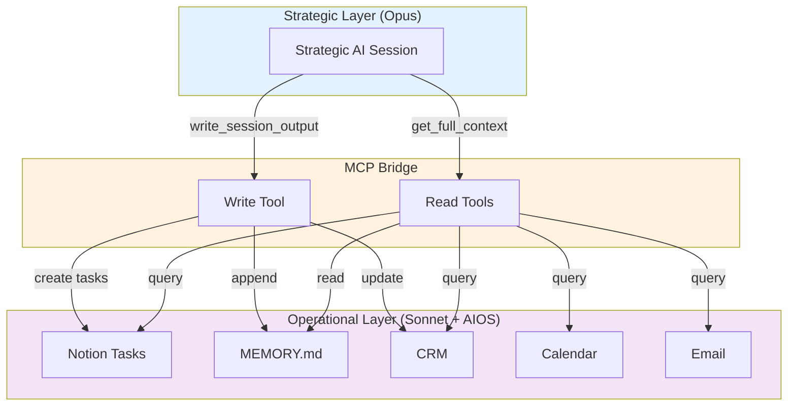

# Strategic Session Bridge

> **One-line intent:** Enable cost-efficient dual-mode AI operations by synchronizing operational context (cheap model) with strategic reasoning (expensive model) through automated bidirectional data flow, eliminating the human bottleneck.

## Pattern in 60 Seconds

**The problem:** Running an AIOS on expensive models (Opus) for all work = cost explosion. Running everything on cheap models (Sonnet) = strategic mediocrity. Manually bridging context between operational and strategic sessions = human becomes the bottleneck, context gets lost, trust erodes.

**The insight:** The operational layer (AIOS) maintains durable state (CRM, memory, calendar, tasks). The strategic layer borrows context, performs deep reasoning, and returns deltas (decisions, action items, memory updates). An MCP-based tool interface makes this automatic: Strategic AI calls operational tools to read context and write results. No human clipboard required.

| Layer | Model | Cost | Role | State Persistence |
|-------|-------|------|------|-------------------|
| **Operational** | Sonnet (cheap) | Low | Execute, maintain state, provide context | Durable (filesystem, databases) |
| **Strategic** | Opus (expensive) | High | Deep reasoning, planning, complex decisions | Ephemeral (session only) |
| **Bridge** | MCP tools | Negligible | Sync context, write results | Stateless (protocol only) |

**What broke when we got this wrong:** Sean manually copied operational context (tasks, calendar, recent decisions) into Claude Projects for strategic sessions with Opus. After deep work, he manually transferred action items back to Operational Lou for Notion task creation. Two failure modes: (1) Context got stale/incomplete because manual transfer is error-prone. (2) Sean became a bottleneck—couldn't start strategic work without first preparing context, couldn't finish without transferring outputs. Trust eroded when action items sat in limbo.

---

## Classification

| Property | Value |
|----------|-------|
| **Category** | Agentic Architecture |
| **Difficulty** | Intermediate |
| **Also Known As** | Dual-Mode Coordination, Operational-Strategic Handoff, Cost-Optimized Context Sync |
| **Related Patterns** | Context Lifecycle Management (memory tier discipline), Ladder of Trust (authorization model), Cost Operations (model selection), Hub-and-Spoke Orchestration (AIOS as hub) |

---

## The Problem in Detail

### The Cost-Capability Tradeoff

AI operations face a fundamental tension:

| Dimension | Cheap Model (Sonnet) | Expensive Model (Opus) |
|-----------|---------------------|----------------------|
| **Cost per token** | ~$3/1M input | ~$15/1M input (5× Sonnet) |
| **Reasoning depth** | Good for operational work | Excellent for strategic work |
| **Nuance/pushback** | Adequate | Strong |
| **Long context handling** | Efficient | Expensive but better quality |
| **Use case fit** | Email triage, CRM queries, task management | Quarterly planning, organizational strategy, complex tradeoff analysis |

**Running everything on Opus:** A 10-agent AIOS processing 500 emails/day, managing 200 tasks, handling calendar/CRM queries would burn ~$500-1000/day. Unsustainable for most operations.

**Running everything on Sonnet:** Operational work is cost-efficient, but strategic sessions lack depth. Subtle organizational dynamics missed, tradeoffs oversimplified, pushback weakened. The CEO asks "should we franchise Cleveland?" and gets a competent but not brilliant analysis.

**The naive solution:** Run operational work on Sonnet, switch to Opus for strategic sessions. But how does Opus get operational context? And how do strategic outputs (12 action items, 3 memory updates, 5 decisions) flow back to Sonnet for execution?

### The Human Clipboard Anti-Pattern

**What teams typically do:**

1. **Operational AI (Sonnet)** runs day-to-day (email, tasks, CRM)
2. **CEO needs strategic thinking** → opens separate Opus session
3. **CEO manually copies context:** "Here's our current partner pipeline [paste 2000 words], here are upcoming events [paste calendar], here are open decisions [paste from memory]"
4. **Strategic AI (Opus)** does deep work, produces output
5. **CEO manually transfers results:** Copy action items → paste to Operational AI → "create these tasks in Notion"

**Failure modes:**

- **Context staleness:** Manual copy happens once at session start. If session runs 2 hours, operational state has changed (new email, task completed, calendar updated). Strategic AI reasons on stale data.
- **Context incompleteness:** Human forgets to include a critical detail (recent partner conversation, pending decision). Strategic reasoning lacks key input.
- **Output transfer errors:** Action items with 12 fields each (task, owner, priority, timeline, depends_on, rationale...) get transcribed wrong. Notion task doesn't match strategic intent.
- **Human bottleneck:** CEO can't start strategic work until context is assembled. Can't finish until outputs are transferred. Adds 15-30 minutes of overhead per session.
- **Trust erosion:** When an action item sits in limbo (CEO forgot to transfer it), Strategic AI thinks it's in progress, Operational AI has never heard of it. Next strategic session is based on wrong assumptions.

**Real incident (pre-pattern):**

Cloud Nirvana Q2 events completed. Sean needed strategic analysis of partnership model, competitive positioning, and go-forward strategy. Operational Lou compiled a 3000-word operational report (attendee data, partner details, revenue, feedback). Sean copied this into Claude Projects, worked with Strategic Lou for 6 hours, produced a strategic framework document with 47 action items. Sean manually created 12 Notion tasks that night. The other 35 sat in the document. Two weeks later, Strategic Lou referenced a "decision" that Operational Lou had never heard about. Context was forked.

---

## The Solution

### MCP-Based Tool Interface

The operational AI exposes its state via **MCP tools**. The strategic AI calls these tools directly from its session (Claude Projects, ChatGPT with plugins, etc.). Human is removed from the transport layer.



### Tool Surface Design

**Read tools (narrow, composable):**

| Tool | Returns | Token Cost | Use Case |
|------|---------|------------|----------|
| `get_active_initiatives()` | Current in-flight work | ~500 tokens | Quick status check |
| `get_pending_decisions()` | Open decisions awaiting approval | ~300 tokens | Decision pipeline review |
| `get_calendar_14d()` | Next 14 days events | ~400 tokens | Time-sensitive context |
| `get_recent_decisions()` | Last 7 days decisions | ~600 tokens | Recent context continuity |
| `get_blockers()` | Stalled items | ~200 tokens | Identify intervention points |
| `get_threads()` | People/conversations with strategic weight | ~400 tokens | Relationship context |
| `get_questions_for_strategic()` | Specific questions operational layer wants answered | ~300 tokens | Bidirectional guidance |
| `get_full_context(include=[])` | Convenience tool, calls multiple above | ~3000 tokens (default) or all (~8000 tokens) | Session start |

**Why narrow tools win:**
- Token efficiency (pull only what you need)
- Incremental loading (start with calendar, pull more if needed)
- Mid-session queries (check calendar again without re-pulling decisions)
- Self-documenting (tool name declares intent)

**Write tool (fat, atomic):**

| Tool | Accepts | Behavior | Use Case |
|------|---------|----------|----------|
| `write_session_output(payload)` | Decisions, action items, memory updates, context corrections | Atomic write to all systems, structured reconciliation response | Session end or mid-session checkpoint |

**Why one fat write tool wins:**
- Atomicity (all-or-nothing, or clear partial failure reporting)
- Reconciliation (single response covers all writes)
- Reduces auth surface (one write token, not per-operation)

**Input schema:**
```json
{
  "session_metadata": {
    "date": "2026-05-24",
    "primary_domain": "partnership_strategy",
    "session_length": "2h"
  },
  "decisions": [
    {
      "decision": "Approve franchise model for Cleveland",
      "rationale": "...",
      "confidence": "high",
      "reversibility": "medium"
    }
  ],
  "action_items": [
    {
      "task": "Draft franchise agreement",
      "owner": "Lou",
      "priority": "P1",
      "timeline": "2026-06-01",
      "depends_on": null
    }
  ],
  "memory_promotions": [
    {
      "content": "Franchise model decision: Cleveland as pilot",
      "section": "Decisions & Preferences",
      "rationale": "Strategic direction change"
    }
  ],
  "context_updates": [
    {
      "type": "corrected_fact",
      "old": "Jim unavailable for operations",
      "new": "Jim confirmed availability",
      "source": "Strategic session 2026-05-24"
    }
  ],
  "open_questions": [
    {
      "question": "What's current Cleveland attendance trend?",
      "for": "operational_reality_check"
    }
  ]
}
```

**Reconciliation response:**
```json
{
  "status": "success" | "partial" | "failed",
  "memory_promotions": {
    "attempted": 3,
    "succeeded": 3,
    "items": [{"content": "...", "written_to": "MEMORY.md:L156"}]
  },
  "action_items": {
    "attempted": 12,
    "succeeded": 11,
    "failed": [{"task": "...", "reason": "Notion API timeout", "retry": true}],
    "notion_ids": ["..."]
  },
  "context_updates": {"attempted": 2, "succeeded": 2},
  "warnings": [],
  "summary": "Processed 24 items: 3 memory promotions, 11 tasks created, 2 context updates.",
  "timestamp": "2026-05-24T10:30:15Z"
}
```

**Key property: Structured reconciliation.** Strategic AI can parse the response and show the human exactly what landed and what didn't, without guessing.

### Transport & Security

**External access via Cloudflare Tunnel:**
- Operational AI (Mac Mini, residential network) doesn't need port forwarding
- Cloudflare provides HTTPS endpoint, DDoS protection, rate limiting
- Stable subdomain (no URL rotation like ngrok free tier)

**Authentication: Two-tier bearer tokens**
- `READ_TOKEN` → grants access to all `get_*` tools
- `WRITE_TOKEN` → grants access to `write_session_output`
- Blast radius containment: if READ leaks, attacker gets read-only access; if WRITE leaks, writes are logged and auditable

**Authorization per tool:**
```python
TOOL_AUTH = {
    "get_active_initiatives": "read",
    "write_session_output": "write"
}
```

**No OAuth complexity needed for single-user v1.0.** Bearer tokens are sufficient. Upgrade to OAuth if multi-user support needed.

### Data Flow Discipline

**Operational → Strategic (read tools):**
- Real-time queries (no caching in v1.0)
- Token budget: ≤8K tokens per `get_full_context()` call
- Current state + pending only (no history duplication—history lives in MEMORY.md, already loaded in Strategic session)
- Pointers over content (e.g., "See email thread labeled AIOS/Partners/CBTS" not the full 500-line thread)

**Strategic → Operational (write tool):**
- Synchronous with 30-second timeout (fail fast, not silent failure)
- Structured response enables reconciliation
- Idempotent where possible (duplicate call with same payload should be safe)

**Memory tier integration:**
- Operational layer maintains durable state (Tier 2: session files, Tier 3: MEMORY.md)
- Strategic layer borrows context (loads MEMORY.md at session start, calls MCP tools for fresh data)
- Strategic layer returns deltas (memory promotions, not full re-writes)
- Operational layer appends deltas to appropriate memory tier

This pattern **depends on** Context Lifecycle Management for memory discipline. Without tiered memory and continuous append, operational state becomes stale and unreliable.

---

## Applicability

Use this pattern when:

- **Cost-capability tradeoff matters:** Cheap model adequate for operations, expensive model needed for strategy
- **Operational and strategic work are separable:** Email triage vs. quarterly planning, not blended
- **State lives in operational layer:** CRM, tasks, calendar, memory maintained by AIOS
- **Strategic sessions are episodic:** Weekly/monthly deep thinking, not constant
- **Human bottleneck is real:** Context transfer takes >10 minutes, happens frequently

Do NOT use when:

- **All work fits one model:** If Sonnet handles everything (no strategic depth needed) or budget allows Opus for everything
- **Operational layer is stateless:** If there's no durable context to bridge
- **Strategic and operational are tightly coupled:** Every operational decision needs strategic input (bridge overhead dominates)
- **Human wants to stay in the loop:** Some orgs require human review of all AI-to-AI transfers (defeats automation goal)

---

## Consequences

### Benefits

- **Cost optimization:** Run 90% of work on cheap model, 10% on expensive model. Cloud Nirvana AIOS: $50/day operational + $20/week strategic = ~$60/day average, vs. $500+/day all-Opus.
- **No human bottleneck:** Strategic sessions start instantly (one tool call for context), finish instantly (one tool call writes results).
- **Context accuracy:** Real-time operational data (not stale manual copy). Structured writes (not transcription errors).
- **Trust preservation:** Action items land in Notion immediately. Next strategic session sees accurate state.
- **Audit trail:** Every tool call logged. Every write reconciled. If something breaks, full visibility.
- **Incremental improvement:** Start with basic tools, add narrow tools as needed. Start with batch writes, add incremental writes later.

### Liabilities

- **Infrastructure complexity:** MCP server, Cloudflare Tunnel, auth tokens, monitoring. More moving parts than "one AI does everything."
- **Tool interface maintenance:** Schema changes require coordination (update server + update strategic AI expectations).
- **Failure modes shift:** Instead of "human forgot to copy," now "MCP server is down" or "Notion API timed out." Need monitoring and graceful degradation.
- **Testing overhead:** Integration tests across operational layer + bridge + strategic layer. Can't test strategic AI in isolation (needs real or mocked MCP server).
- **Security surface:** External endpoint needs auth, rate limiting, monitoring. Bearer tokens must be rotated, secured.

**Mitigation strategies:**
- Start simple (few tools, no caching, synchronous writes)
- Stub tools with mock data for early testing (validate transport before logic)
- Graceful degradation (if Notion fails, write to file; if real-time fails, return cached data with staleness warning)
- Structured logging (every tool call, every write, every auth failure)

---

## What Broke

### Incident: Manual Context Fork (May 2026)

**Context:** Cloud Nirvana Q2 events complete. Sean worked with Strategic Lou for 6 hours on go-forward strategy, produced 47 action items in a Google Doc.

**What happened:**
1. Sean manually copied operational report (3000 words) into Claude Projects
2. Strategic Lou produced strategic framework with 47 action items
3. Sean manually created 12 Notion tasks that night (high-priority ones)
4. The remaining 35 tasks stayed in the Google Doc
5. Two weeks later: Strategic Lou asked "Have we finalized the Cleveland franchise agreement?" (action item #18, never created in Notion)
6. Operational Lou: "I don't have that task. What franchise agreement?"
7. Context was forked. Strategic layer thought work was in progress. Operational layer had never heard of it.

**Root cause:** Manual transfer is error-prone and incomplete. Human fatigue at 11 PM after 6-hour strategic session = 35 tasks left behind.

**What would have saved it:**
- `write_session_output()` with 47 action items → Operational Lou creates all 47 Notion tasks atomically → reconciliation confirms all succeeded → no orphaned work

### Incident: Stale Context in Strategic Session (April 2026)

**Context:** Sean manually prepared operational context for strategic session on partnership model.

**What happened:**
1. 9:00 AM: Sean copied partner pipeline, calendar, recent decisions into Claude Projects
2. 9:15 AM - 12:30 PM: Deep strategic work with Strategic Lou
3. 10:30 AM (mid-session): Critical partner email arrived (Big Kitty Labs contract signed)
4. Strategic Lou didn't know about the new contract (working on 9:00 AM snapshot)
5. Strategic recommendations included "prioritize Big Kitty Labs outreach" (already done)
6. Sean caught it in review, had to correct the strategy manually

**Root cause:** Manual context copy happens once at session start. No refresh mechanism.

**What would have saved it:**
- Strategic Lou could call `get_active_initiatives()` mid-session → see Big Kitty Labs contract signed → adjust recommendations in real-time

---

## Implementation Guide

### Phase 1: Design the Protocol

**Participants:** Operational AI + Strategic AI design the tool interface together. Human acts as editor and final approver.

**Questions to answer:**
1. What operational context does strategic work need most often?
2. What output format makes operational execution easiest?
3. What's the token budget for context (how much can strategic AI digest)?
4. How should errors be reported (structured vs. prose)?

**Output:** Tool schemas (input/output), authentication model, transport choice.

**Time investment:** 1-2 hours of conversation between the two AIs. (In our case: 45 minutes of Lou ↔ Strategic Lou direct design, Sean as bridge.)

### Phase 2: Scaffold the Bridge

**Build minimal MCP server with stubbed tools (mock responses).**

**Stack:**
- Python + FastAPI (or Node.js + Express)
- Bearer token auth
- OpenAPI spec generation (auto-discovered by Claude)

**Deploy:**
- Cloudflare Tunnel for external access
- Generate bearer tokens (UUIDs), store as env vars
- Start server, expose endpoint

**Test:**
- Strategic AI adds MCP connector in Claude Projects (or ChatGPT)
- Strategic AI calls `get_active_initiatives()` → receives mock data
- Success = tool call works end-to-end, no auth errors

**Time investment:** 4-6 hours (tunnel setup, server scaffold, mock tools, basic auth).

### Phase 3: Wire Real Data

**Replace mocks with real operational queries.**

**Integrations:**
- Notion API for tasks
- Google Calendar API for events
- Filesystem reads for memory files
- CRM queries for context

**Test each tool individually:**
- Call `get_calendar_14d()`, verify real calendar data returned
- Call `get_active_initiatives()`, verify real Notion tasks returned

**Time investment:** 8-12 hours (depends on existing integrations).

### Phase 4: Implement Write Tool

**`write_session_output()` executes writes and returns reconciliation response.**

**Write targets:**
- MEMORY.md (append memory promotions)
- Notion (create tasks via API)
- CRM (update facts, add notes)
- Daily notes file (log session summary)

**Reconciliation logic:**
```python
def write_session_output(payload):
    results = {
        "memory_promotions": write_memory(payload["memory_promotions"]),
        "action_items": write_notion_tasks(payload["action_items"]),
        "context_updates": update_crm(payload["context_updates"])
    }
    status = "success" if all_succeeded(results) else "partial"
    return {
        "status": status,
        "memory_promotions": results["memory_promotions"],
        "action_items": results["action_items"],
        "context_updates": results["context_updates"],
        "summary": generate_summary(results)
    }
```

**Test:**
- Strategic AI calls `write_session_output()` with 3 tasks, 1 memory promotion
- Verify tasks appear in Notion, memory added to MEMORY.md
- Verify reconciliation response matches reality

**Time investment:** 8-12 hours (write logic, error handling, reconciliation).

### Phase 5: End-to-End Testing

**Strategic AI uses bridge in real session.**

**Test case:**
1. Strategic session starts → calls `get_full_context()`
2. Receives operational data (tasks, calendar, decisions)
3. Strategic work produces decisions + 12 action items
4. Calls `write_session_output()` with full payload
5. Operational AI confirms: 12 tasks in Notion, memory updated, reconciliation clean

**Success criteria:**
- No manual context transfer by human
- All action items land in operational systems
- Reconciliation response is accurate
- Strategic AI reports "bridge is invisible" (no friction)

**Time investment:** 4-6 hours (end-to-end test, bug fixes).

### Phase 6: Production Hardening

**Add error handling, monitoring, documentation.**

- Retry logic for transient API failures
- Cached data fallback if real-time query fails
- Logging (every tool call, every write, auth failures)
- Monitoring (optional: alert on write failure rate >10%)
- Documentation (README for server, runbook for token rotation)

**Time investment:** 4-8 hours.

### Total Time Investment

**For a team with existing AIOS infrastructure:**
- Design: 1-2 hours
- Scaffold: 4-6 hours
- Integration: 16-24 hours
- Testing: 4-6 hours
- Hardening: 4-8 hours
- **Total: 29-46 hours (1-2 developer-weeks)**

**For a team starting from scratch (no AIOS):**
- Add AIOS build time first (~4-8 weeks depending on scope)

---

## Variations

### Variation 1: Webhook-Based Push (vs. Pull)

**Instead of Strategic AI calling read tools on-demand, Operational AI pushes context updates via webhook.**

**When to use:**
- Strategic sessions are always-on (not episodic)
- Operational changes need immediate strategic attention (e.g., critical email arrives → notify Strategic AI)

**Tradeoffs:**
- **Pro:** Real-time updates without polling
- **Con:** Strategic AI context window fills with updates (context bloat)
- **Con:** Webhook infrastructure more complex than simple MCP tools

**Our choice:** Pull-based (Strategic AI calls read tools on-demand) because strategic sessions are episodic (weekly), not always-on.

### Variation 2: Shared Database (vs. MCP Tools)

**Instead of MCP tools, both AIs read/write to shared PostgreSQL or Redis.**

**When to use:**
- Both AIs have database access built-in (e.g., custom agent frameworks with native SQL)
- Need transactional consistency (both AIs write to same table, race conditions possible)

**Tradeoffs:**
- **Pro:** Simpler than HTTP API (no server, no tunnel)
- **Con:** Database schema coupling (both AIs must understand same schema)
- **Con:** No structured reconciliation (just DB success/failure, no per-item breakdown)
- **Con:** Security harder (both AIs need DB credentials, fine-grained auth difficult)

**Our choice:** MCP tools because (1) Strategic AI (Claude Projects) has no native DB access, (2) reconciliation response format is critical, (3) auth scoping (read vs. write tokens) is cleaner with HTTP.

### Variation 3: File-Based Bridge (vs. Real-Time MCP)

**Operational AI writes context to file, Strategic AI reads file. Strategic AI writes results to file, Operational AI reads file.**

**When to use:**
- No external network access (all local filesystem)
- Strategic AI has filesystem access (e.g., local LLM, not Claude Projects)
- Latency doesn't matter (async workflow acceptable)

**Tradeoffs:**
- **Pro:** Zero infrastructure (no server, no tunnel, no auth)
- **Con:** Polling required (how often does Strategic AI check for file updates?)
- **Con:** No structured reconciliation (file format must encode success/failure per item)
- **Con:** Staleness (file might be seconds or minutes old)

**Our choice:** Real-time MCP because (1) Strategic AI is Claude Projects (cloud-based), (2) synchronous writes with immediate reconciliation needed, (3) infrastructure overhead acceptable.

---

## Meta-Pattern: Agent-to-Agent Protocol Design

**Insight from this build:** Two AIs designed the protocol between them, with human as editor.

**Process:**
1. Operational Lou drafted initial proposal (4 questions for Strategic Lou)
2. Strategic Lou critiqued and refined (tool surface, transport, auth)
3. Human (Sean) approved final design
4. Operational Lou builds implementation

**Why this worked:**
- Strategic Lou knows what context format helps him most
- Operational Lou knows what's feasible to query and what write patterns are robust
- Human doesn't need to invent the protocol—just approve it

**Reusable pattern:** For any agent-to-agent integration, have the agents design the contract. Human role: editor and final approver, not architect.

**Related:** This is a specialized case of "interface negotiation" in distributed systems, applied to AI agents.

---

## Related Patterns

### Context Lifecycle Management

**Dependency:** Strategic Session Bridge assumes operational AI has durable memory (MEMORY.md, daily notes, Notion). Without memory discipline, context is stale and unreliable.

**Integration point:** Memory promotions from strategic output flow into Context Lifecycle Management's Tier 3 (long-term memory).

### Ladder of Trust

**Intersection:** Strategic AI writes might require human approval depending on trust level.

**Example:** If strategic AI generates action items that involve external communication (email sends), those might need human approval before operational AI executes. The write tool returns "approval required" status, operational AI presents for approval, human approves, write completes.

**Pattern composition:** Strategic Session Bridge (transport) + Ladder of Trust (authorization) = governed AI-to-AI collaboration.

### Hub-and-Spoke Orchestration

**Relationship:** Operational AI is the hub (maintains state). Strategic AI is a specialized spoke (deep reasoning). Other spokes might include: Financial AI (CFO decisions), Marketing AI (content strategy), Engineering AI (architecture decisions).

**Scaling:** The same MCP bridge pattern applies to any hub-spoke relationship. Build once, reuse for multiple specialized AIs.

### Cost Operations

**Motivation:** This pattern exists because of cost-capability tradeoffs. Cost Operations pattern provides the economic framework (when to use cheap vs. expensive models). Strategic Session Bridge provides the implementation (how to bridge them).

---

## Known Limitations

1. **Single operational hub assumption:** If operational state is distributed (multiple AIOS instances), each needs its own bridge or a federated bridge design. Not addressed in v1.0.

2. **Schema versioning:** If tool schemas change (e.g., add new field to action items), strategic AI might send old format. Need backward compatibility or versioned tools. Not addressed in v1.0.

3. **Conflict resolution:** If strategic AI and operational AI both try to update the same memory section simultaneously, last-write-wins. No CRDT or merge logic. Acceptable for episodic strategic sessions; would need improvement for concurrent sessions.

4. **Rate limiting:** If strategic AI calls read tools in a tight loop, might hit API rate limits (Notion, Google Calendar). Caching layer would help but adds complexity. Not implemented in v1.0.

5. **Multi-user:** v1.0 is single-user (one strategic AI, one operational AI, one human). Multi-user would need OAuth, per-user state isolation, audit logs by user. Future work.

---

## Success Metrics

**Quantitative:**
- Manual context transfer time: 15-30 min → 0 min
- Action item transfer errors: 10-20% → 0%
- Strategic session start latency: 5-15 min → 30 sec
- Cost: All-Opus ($500/day) → Hybrid ($60/day) = 88% reduction

**Qualitative:**
- Human reports: "I no longer dread strategic sessions because of setup overhead"
- Strategic AI reports: "Context is always fresh and accurate"
- Operational AI reports: "No orphaned action items"

**Leading indicator:** If strategic sessions happen more frequently (weekly → daily) after pattern adoption, it's working.

---

## Conclusion

The Strategic Session Bridge pattern solves a real cost-capability-bottleneck tradeoff that every AIOS eventually faces. By using MCP tools to synchronize operational state (cheap model) with strategic reasoning (expensive model), you eliminate the human clipboard, preserve context accuracy, and optimize costs.

**Core realization:** The "no Projects API" constraint we thought was immovable wasn't a constraint at all. Anthropic's MCP support means custom tools work everywhere (Projects web, Desktop, mobile). The hard part wasn't transport—it was protocol design. By having the two AIs negotiate the contract directly, we designed something that actually works for both sides.

**What makes it a pattern:** The problem (cost-capability tradeoff) is universal. The solution architecture (MCP bridge with narrow reads + fat write) is reusable. The implementation is concrete enough to ship in 1-2 weeks. The consequences (benefits + liabilities) are well-understood. And it failed before we fixed it (real incidents, not hypothetical).

**Next evolution:** Multi-hub federations (multiple AIOS instances), webhook push updates, incremental writes, multi-user OAuth. But v1.0 ships this week, solves the immediate problem, and proves the pattern works.
