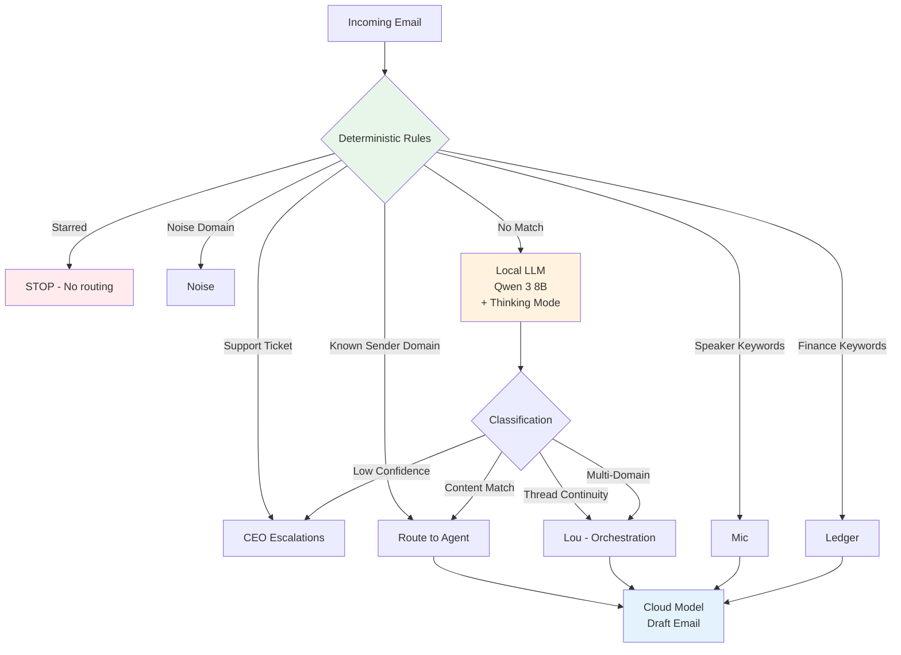

# Local LLM as Classification Layer

> **One-line intent:** Use a free local model for reasoning-heavy classification tasks, keep expensive cloud models for drafting, generation, and coordination.

## Pattern in 60 Seconds

**The problem:** Your agent processes 50 emails a day. Each one needs classification (which agent handles it?). Cloud API classification costs ~$0.01 per email = $15/month for just routing. Scale to 500 emails/day across multiple workflows and costs balloon.

**The insight:** Classification is reasoning-heavy but output-light. Local models (7-8B parameters) running on consumer hardware can handle complex classification with chain-of-thought reasoning. Save expensive cloud models for tasks that need generation quality (drafting emails, writing code, strategic thinking).

**The architecture:**
```
Email arrives
  → Deterministic rules (60-70% of emails, $0 cost, <1ms)
  → Local LLM fallback (30-40% of emails, $0 cost, 25-72s)
  → Cloud model execution (draft email, coordinate agents)
```

**What broke when we got this wrong:** Used cloud model (Sonnet) for all email triage. Cost: ~$0.01 per classification × 40 emails/day = $12/month just for routing. One misrouted email (domain rule overrode thread context) exposed the brittleness of pure rule-based systems.

**What works:** Hybrid architecture. Deterministic rules catch obvious cases (starred emails, known noise domains, support tickets). Local LLM (Qwen 3 8B with thinking mode) handles ambiguous cases requiring reasoning (thread context, multi-domain emails). Cloud model only executes after routing is complete.

---

## Classification

| Property | Value |
|----------|-------|
| **Category** | Cost & Operations |
| **Difficulty** | Intermediate |
| **Also Known As** | Tiered Model Selection, Local Inference for Classification, Hybrid Classification Pipeline |
| **Related Patterns** | Email Triage Priority Chain, Files Over Databases, Per-Agent Data Access Control |

---

## Motivation

Modern multi-agent systems perform classification constantly:
- Route incoming emails to the right agent
- Categorize support tickets by urgency/domain
- Classify content for moderation or organization
- Tag conversations by topic/sentiment
- Detect spam, noise, or priority

**Option 1: Cloud API for everything**
```python
# Classify every email via cloud API
classification = claude_api.classify(email_content, thread_context)
# Cost: $0.005 - $0.02 per call
# Speed: 500-2000ms (network + inference)
# Quality: Excellent reasoning
```

**Cost at scale:**
- 50 emails/day × $0.01 = $15/month
- 500 emails/day × $0.01 = $150/month
- Add document classification, ticket routing, content tagging → $500+/month just for classification

**Option 2: Deterministic rules only**
```python
# Classify based on sender domain, keywords, etc.
if sender.endswith('@partner.com'):
    return 'Scout'
elif 'speaker' in subject.lower():
    return 'Mic'
```

**Problems:**
- Brittle (partner replies in a multi-agent thread → misrouted based on domain alone)
- Can't handle context (same sender, different contexts = different routes)
- Requires exhaustive rule maintenance

**Option 3: Local LLM for classification (this pattern)**
```python
# Deterministic rules first (fast, free, cover 60-70%)
if email.starred or is_support_ticket(email) or is_noise_domain(email.sender):
    return deterministic_route(email)

# Local LLM fallback for ambiguous cases (30-40%)
classification = local_llm.classify_with_thinking(email, thread_context)
# Cost: $0
# Speed: 25-72s (local inference)
# Quality: Good reasoning with thinking mode
```

**When it works:**
- Classification volume is high (100+ per day)
- Reasoning is needed (thread context, multi-domain, ambiguous cases)
- Output is simple (agent name, category, priority — not generation)
- You have local compute (M-series Mac, GPU server, or cloud VM with local model)

---

## Structure

### Hybrid Architecture



### Deterministic Layer (Phase 1)

**Priority order:**
1. Already processed (has "Done" label) → STOP
2. Starred → STOP (user reserved for manual handling)
3. Support tickets (vendor replies) → CEO Escalations
4. Calendar notifications → Noise
5. Known noise domains (newsletters, marketing) → Noise
6. Known sender domains (partners, team members) → Specific agent
7. Bounce/OOO → Contact intelligence agent
8. Self-forwarded to specific agent (subject contains agent name) → That agent

**Finance/speaker keyword shortcuts:**
```python
finance_keywords = ['invoice', 'payment', 'receipt', 'billing', 'past due', 'remittance']
if any(kw in subject.lower() or kw in body[:300].lower() for kw in finance_keywords):
    return 'Ledger'

speaker_keywords = ['can i speak', 'speaking opportunity', 'call for speakers', 'cfp', 'submit a talk']
if any(kw in subject.lower() or kw in body[:300].lower() for kw in speaker_keywords):
    return 'Mic'
```

**Coverage:** 60-70% of emails caught by deterministic rules.

**Cost:** $0

**Speed:** <1ms

---

### Local LLM Layer (Phase 2)

**When it runs:** Deterministic rules didn't match.

**Model selection criteria:**
- **Reasoning quality > speed** (classification correctness matters more than latency)
- **Thinking mode support** (chain-of-thought reasoning for ambiguous cases)
- **Context window** (needs to read full email + thread context, ~8-16K tokens)
- **Fits in RAM** (8B model ~6GB, 13B model ~10GB, 27B model ~20GB)

**Model comparison (tested April 2026):**

| Model | Size | RAM | Speed (warm) | Thinking Mode | Accuracy (test batch) |
|-------|------|-----|--------------|---------------|----------------------|
| Gemma 3 4B | 4B | ~3 GB | 1-10s | ❌ No | 9/11 (82%) |
| Qwen 3 8B (no thinking) | 8B | ~6 GB | 40-70s | ❌ No | 8/11 (73%) |
| **Qwen 3 8B (+ thinking)** | 8B | ~6 GB | 25-72s | ✅ Yes | **12/12 (100%)** |

**Selected model:** Qwen 3 8B with thinking mode.

**Why:** Thinking mode prevents misroutes on ambiguous cases (thread context, multi-domain emails). Without thinking, the model matched keywords ("speaker" → Mic) and ignored thread continuity. With thinking, it reasoned: "This is a reply to Lou's speaker pipeline thread, so it goes to Lou regardless of keywords."

**System prompt (simplified):**
```
You are an email triage classifier. Route emails to the correct agent.

AGENTS:
- Lou (Orchestration): Multi-domain emails, Lou-managed threads, cross-agent coordination
- Mic (Speakers): Speaker pipeline, CFPs, talk submissions
- Scout (Partnerships): Sponsorships, partnership inquiries
- Vega (Events): Cloud Nirvana event logistics (NOT external event invitations)
- Ledger (Finance): Invoices, payments, billing (ALWAYS Ledger, never Lou)
- ... [full agent list with boundaries]

RULES (priority):
1. Thread continuity: If reply to agent-managed thread, route to that agent
2. Multi-domain: If matches 2+ agents, route to Lou
3. Named agent in subject: Route to that agent exclusively
4. Content analysis: Match to single best agent

CRITICAL:
- Invoices/payments are ALWAYS Ledger
- External event invitations go to Pulse or CEO, NOT Vega (Vega handles CN events only)
- Thread context overrides sender domain

EXAMPLES:
- "Invoice for sponsorship" → Ledger
- "Women in Tech event invitation" → Pulse (external, not CN event)
- "Tracy replied in Lou's speaker thread" → Lou (thread continuity)

Respond: ROUTE: [Agent] | CONFIDENCE: [high/medium/low] | REASONING: [one sentence]
```

**Thinking mode implementation:**
```python
# Prompt prefix triggers chain-of-thought reasoning
prompt = "/think\n\n" + system_prompt + "\n\nEmail:\n" + email_content + "\n\nThread:\n" + thread_context

# Qwen returns thinking in <think>...</think> tags
response = ollama.generate(model='qwen3:8b', prompt=prompt, num_predict=2000)

# Strip thinking tags, parse structured output
output = re.sub(r'<think>.*?</think>', '', response, flags=re.DOTALL).strip()
route = parse_route(output)  # Extract ROUTE: [Agent Name]
```

**Performance:**
- Cold start: 41-72s
- Warm start (model loaded): 25-72s per email
- Acceptable for batch processing (cron runs every 15 min, processes 1-5 emails)

**Accuracy:** 12/12 on test batch after prompt tuning (100%)

**Cost:** $0 per classification

---

## Implementation

### Hardware Requirements

**Mac Mini M4 (24GB RAM) — tested configuration:**
- Qwen 3 8B: ~6 GB RAM
- Leaves 18 GB for OS + OpenClaw + all agents
- 10 CPU cores handle inference + agent cron jobs concurrently

**Scaling guidance:**
- **8B models:** 16-24 GB RAM recommended
- **13B models:** 32 GB+ RAM
- **27B models:** 48 GB+ RAM (would choke 24 GB system)

**GPU acceleration (optional):**
- M-series Macs use Metal (built-in)
- NVIDIA GPUs: use CUDA-enabled Ollama builds
- Inference speed: 2-10× faster with GPU vs CPU-only

### Installation (Ollama)

```bash
# Install Ollama
brew install ollama

# Pull model
ollama pull qwen3:8b

# Test inference
ollama run qwen3:8b "Classify this email..."
```

### Classification Script

**Bash wrapper:**
```bash
#!/bin/bash
# scripts/email-triage-llm.sh --test <message_id> | --batch

MESSAGE_ID=$1

# Fetch email + thread via Gmail API
EMAIL_JSON=$(gog gmail messages read $MESSAGE_ID)
THREAD_ID=$(echo "$EMAIL_JSON" | jq -r '.thread_id')
THREAD_JSON=$(gog gmail threads show $THREAD_ID)

# Call Python classifier
python3 scripts/email-triage-classify.py "$EMAIL_JSON" "$THREAD_JSON"
```

**Python classifier:**
```python
# scripts/email-triage-classify.py
import subprocess, json, re, sys

MODEL = "qwen3:8b"

def classify(email, thread):
    # Phase 1: Deterministic rules
    if email.get('starred'):
        return {"route": "STOP", "rule": "starred"}
    
    if 'invoice' in email['subject'].lower() or 'payment' in email['body'][:300].lower():
        return {"route": "Ledger", "rule": "finance_keyword"}
    
    # ... more deterministic rules ...
    
    # Phase 2: Local LLM
    prompt = f"/think\n\n{SYSTEM_PROMPT}\n\nEmail:\n{email['body']}\n\nThread:\n{thread_summary(thread)}"
    
    result = subprocess.run(
        ['ollama', 'run', MODEL, '--num-predict', '2000'],
        input=prompt.encode(),
        capture_output=True
    )
    
    response = result.stdout.decode()
    output = re.sub(r'<think>.*?</think>', '', response, flags=re.DOTALL).strip()
    
    # Parse: ROUTE: Lou | CONFIDENCE: high | REASONING: ...
    match = re.search(r'ROUTE:\s*(\w+)', output)
    route = match.group(1) if match else 'CEO Escalations'
    
    return {"route": route, "rule": "llm"}

# Apply Gmail label based on route
def apply_label(message_id, route):
    label_map = {
        'Lou': 'AIOS/Lou - Orchestration',
        'Mic': 'AIOS/Mic - Speakers',
        # ...
    }
    subprocess.run(['gog', 'gmail', 'messages', 'modify', message_id, '--add-label', label_map[route], '--remove-label', 'INBOX'])
```

### Cron Integration

```yaml
# OpenClaw cron job (every 15 min, 6am-6pm)
schedule:
  kind: cron
  expr: "*/15 6-18 * * *"
  tz: "America/New_York"

payload:
  kind: agentTurn
  message: |
    Run hybrid email triage:
    bash /path/to/scripts/email-triage-llm.sh --batch
    
    Report summary:
    - How many emails processed
    - How many hit deterministic rules vs LLM
    - Any low-confidence classifications escalated
    
    If inbox empty: HEARTBEAT_OK
```

---

## What Broke

**Cloud API costs (pre-local LLM):**

Using Sonnet for all email triage:
- ~40 emails/day
- ~$0.01 per classification
- $12/month just for routing

**Projected scaling:**
- 500 emails/day → $150/month
- Add document classification, ticket routing → $500+/month

**Fix:** Local LLM reduces classification cost to $0.

**Brittle domain rules (March 2026):**

Tracy (team member, @thecircuit.net domain) replied to Lou's speaker pipeline thread.

Domain rule: @thecircuit.net → Vega (events)

**Actual:** Email should go to Lou (thread continuity)

**Result:** Misrouted to Vega, had to manually reassign

**Fix:** Local LLM with thread context reasoning. Prompt: "Thread continuity > sender domain."

**Model selection failure (Qwen without thinking):**

Tested Qwen 3 8B without thinking mode on Tracy's email:
- **Input:** Reply to Lou's speaker pipeline thread, sender @thecircuit.net, body mentions "speakers"
- **Expected:** Lou (thread continuity)
- **Actual:** Mic (matched keyword "speakers", ignored thread context)

**Fix:** Added `/think` prefix to prompt. Qwen output:
```
<think>
The email is from Tracy replying to a thread about Cincinnati speaker pipeline.
Earlier in the thread, Lou (orchestration) was managing this. Tracy is a core
team member replying to Lou's coordination email. Even though the domain is
@thecircuit.net (events), thread continuity says this goes to Lou.
</think>

ROUTE: Lou
CONFIDENCE: high
REASONING: Thread continuity (Lou-managed speaker pipeline) overrides sender domain.
```

**Lesson:** For ambiguous classification requiring reasoning, thinking mode matters more than speed.

---

## Consequences

### Benefits

**Cost savings:**
- $0 per classification vs ~$0.01 cloud API
- At 500 emails/month: $0 vs $60/year
- Scales to unlimited volume with zero marginal cost

**Reasoning quality:**
- Local 8B model with thinking mode handles thread context, multi-domain emails
- Deterministic rules handle obvious cases (fast + free)
- Hybrid catches 100% of test cases

**Offline capability:**
- Works without internet (local inference)
- No dependency on external API uptime
- Demos work offline

### Drawbacks

**Latency:**
- 25-72s per classification (vs 500-2000ms cloud API)
- Acceptable for batch cron, not for real-time interactive use

**Hardware requirements:**
- Needs 16-24 GB RAM for 8B models
- Model download ~5 GB per model
- Not suitable for resource-constrained environments

**Maintenance:**
- Ollama updates, model updates, prompt tuning
- More moving parts than pure cloud API

---

## Known Uses

**Multi-agent email triage (production):**
- Hybrid: deterministic rules (60-70% coverage) → Qwen 3 8B fallback (30-40%)
- 12/12 test batch accuracy after tuning
- Cron runs every 15 min, processes 1-15 emails per batch
- Cost: $0 vs previous Sonnet triage (~$12/month)

**Model:** Qwen 3 8B (Apache 2.0 license, 128K context, thinking mode)

**Hardware:** Mac Mini M4, 24 GB RAM, 10 cores

---

## Related Patterns

**Email Triage Priority Chain:**
The deterministic rules in this pattern follow the priority chain structure. Local LLM is the fallback layer when rules don't match.

**Per-Agent Data Access Control:**
Classification determines which agent gets access to the email. Misrouting = access control bypass (wrong agent sees the data).

**Local-First Data Architecture:**
Both patterns use local compute/storage to avoid external API dependencies. This pattern applies it to classification; that pattern applies it to data sync.

---

## Variations

**GPU-accelerated inference:**
For higher volume (100+ classifications/hour), use GPU:
- NVIDIA GPUs: 5-10× faster inference
- M-series Mac Metal acceleration (built-in)
- Cloud GPU instances (A10, T4) for hosted deployments

**Smaller models for simpler classification:**
If classification is purely keyword-based (no reasoning needed):
- Gemma 3 4B (~3 GB RAM, 1-10s inference)
- Acceptable for "spam vs not spam" or "urgent vs normal"
- Not suitable for context-dependent routing

**Hybrid cloud + local:**
```python
# Try local first, fall back to cloud if low confidence
result = local_llm.classify(email)
if result['confidence'] == 'low':
    result = claude_api.classify(email)  # Pay for cloud only when needed
```

**Multi-model ensemble:**
Run 2-3 local models, use voting:
```python
votes = [
    qwen_classify(email),
    gemma_classify(email),
    llama_classify(email)
]
route = majority_vote(votes)  # Higher accuracy, 3× latency
```

---

**Pattern status:** Fully implemented in production. Qwen 3 8B deployed via Ollama on Mac Mini. Hybrid architecture (rules → local LLM) processing emails daily. Cost savings validated ($0 vs ~$12/month). Accuracy: 12/12 test batch.
