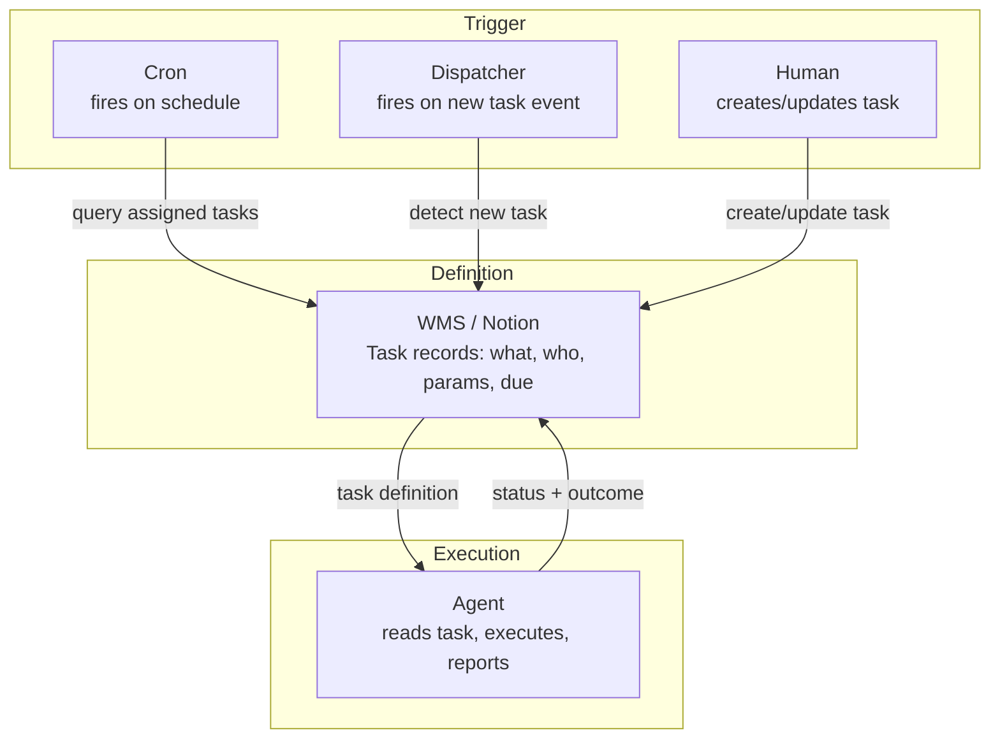

# Cron as Task Runner, Not Task Definer

> **One-line intent:** Work definition lives in the WMS (Notion), trigger logic lives in cron, execution lives in the agent — crons are generic runners, not hardcoded task prompts.

## Pattern in 60 Seconds

_The entire pattern distilled into something anyone can read in under a minute. No jargon, no code. A CEO, an engineer, and an entrepreneur should all understand this section._

**The problem:** Teams define agent tasks directly in cron configs — hardcoded prompts like "every morning at 8am, draft a briefing email." When task definitions change, someone has to find and edit cron configs. The work definition is buried in infrastructure.

**The insight:** Cron should be a dumb runner. It fires at a schedule, asks "what work is assigned to me?", and executes whatever the WMS (work management system) says. Task definitions live in Notion (or equivalent). Cron is just the trigger. The agent is just the executor.

**The key structure:**

| Layer | Responsibility | Example |
|-------|---------------|---------|
| WMS (Notion) | Defines what work exists, assigned to whom, with what parameters | Task: "Draft Columbus event invite" → assigned to Lou-i, due Monday |
| Cron | Fires on schedule, queries WMS for assigned tasks, passes to agent | `0 8 * * *` → query Notion → spawn agent with task list |
| Agent | Reads task definition from WMS, executes, reports outcome back to WMS | Reads task params, drafts email, marks Done |

**Three trigger patterns:**
- **Scheduled:** Cron fires on cadence, agent checks WMS for work
- **Event-Driven:** Dispatcher spawns agent when new work appears in WMS
- **Human-Initiated:** Human creates task in Notion; agent picks up on next run

**What broke when we got this wrong:** A task prompt was hardcoded in a cron config. The task requirements changed. Nobody updated the cron. The agent kept executing the old task definition for a week before anyone noticed.

---

## Classification

| Property | Value |
|----------|-------|
| **Category** | Operations & Orchestration |
| **Difficulty** | Intermediate |
| **Also Known As** | WMS-Driven Execution, Decoupled Task Orchestration, Scheduler-Runner Separation |

---

## Motivation

On April 10, 2026, while auditing the Cloud Nirvana AIOS cron configuration, a pattern became visible that felt immediately wrong: several cron jobs had hardcoded task prompts embedded in their config. One job said, in effect, "every morning, tell the agent to do X." Another said "every Monday, generate Y." These were reasonable tasks at the time they were written. But task requirements evolve. The "X" had changed. The cron hadn't.

The deeper problem wasn't the stale prompt — it was the architectural coupling. When task definitions live in cron configs, they're invisible to the people who manage work. A project manager updates the task in Notion. The cron is never touched. The agent keeps executing the old definition. The WMS says one thing; the actual execution does another. This divergence is silent and dangerous, especially for recurring operational tasks like weekly digests, event reminders, or campaign sends.

The fix is to invert the relationship between scheduling and work definition. Cron becomes a generic trigger: it fires, queries the WMS for tasks assigned to the current agent/schedule, and passes those tasks to the agent for execution. The task definition — what to do, with what parameters, for which recipients, by when — lives entirely in the WMS. Changing a task means updating Notion, not editing a cron file. Adding a new task means creating a Notion record, not provisioning infrastructure.

This pattern also enables three distinct trigger models from the same architecture. Scheduled triggers are the cron case: predictable cadence, WMS query on each fire. Event-driven triggers skip the cron entirely — when a new task appears in the WMS, a dispatcher notices and spawns an agent immediately. Human-initiated triggers are the most common: a person creates or updates a task record in Notion, and the agent picks it up on the next scheduled run. All three models work with the same agent and the same WMS. Only the trigger mechanism differs. This makes the system composable: the same agent that runs on a schedule can also respond to ad-hoc human requests, without any code changes.

---

## Applicability

Use this pattern when:
- You have recurring agent work whose definition changes more often than its schedule
- Non-engineers (project managers, operators) need to change what an agent does without touching infrastructure
- The same agent needs to serve scheduled, event-driven, and human-initiated work from one codebase
- You want a single, auditable answer to "what is this agent supposed to be doing right now?"

Do NOT use this pattern when:
- The task is genuinely fixed and will never change (a pure hygiene job like log rotation — the schedule *is* the definition)
- You have no work management system and introducing one costs more than the coupling it removes
- Latency is so critical that a WMS query per trigger is unacceptable (rare for operational agent work)

---

## Structure



_Cron, dispatcher, and human are interchangeable triggers. None of them define the work. The WMS holds the definition; the agent executes it and writes the outcome back, so the WMS is always the single source of truth for both intent and status._

---

## Participants

| Participant | Role | Example |
|------------|------|---------|
| WMS (Notion) | Holds every task definition, assignment, parameter, and status. The single source of truth for "what work exists." | A Notion "Tasks" database with rows assigned to specific agents |
| Cron | A generic, task-agnostic scheduler. Fires on cadence and asks the WMS what to run. Contains no task logic. | `0 8 * * *` entry that runs the same query-and-dispatch script every day |
| Dispatcher (optional) | Watches the WMS for newly created work and spawns an agent immediately, for work that shouldn't wait for the next cron tick. | A watcher that triggers on a new "Ready" task row |
| Agent | Reads the task definition fresh from the WMS on each run, executes, and writes status back. Holds no task definition of its own. | Lou-i reads task params, drafts the email, marks the row Done |

---

## How It Works

1. **A task is defined in the WMS.** A human (or another agent) creates a record: what to do, which agent owns it, with what parameters, by when. The definition lives here and nowhere else.
2. **A trigger fires.** Usually cron on a schedule; optionally a dispatcher on a new-task event, or a human saving a record. The trigger carries no task content — it only knows "it's time to check for work."
3. **The trigger queries the WMS** for tasks assigned to this agent/schedule that are ready to run.
4. **The agent reads each task definition fresh** and executes it. Because it reads on every run, a definition changed five minutes ago is honored on the next tick — no infrastructure edit required.
5. **The agent writes the outcome back to the WMS** — status, result, any errors — so the WMS remains the single source of truth for both intent and result.

### Code / Configuration Example

```yaml
# WRONG — task definition hardcoded in the trigger.
# Changing the task means editing infrastructure, and the WMS never knows.
# crontab
0 8 * * *  agent run --prompt "Draft the Monday Columbus event invite to all partners"

# RIGHT — cron is a generic runner. The task lives in the WMS.
# crontab
0 8 * * *  agent run --for lou-i --source notion-tasks
```

```python
# The generic runner the cron calls. It contains no task content.
def run(agent_id: str):
    tasks = wms.query_tasks(assignee=agent_id, status="Ready")
    for task in tasks:
        result = agent.execute(task)          # task defn read fresh from WMS
        wms.update(task.id, status="Done", result=result)
```

_The cron line is identical no matter how many tasks exist or how often they change. All variation lives in the WMS records the runner reads._

---

## Consequences

### Benefits
- **One source of truth.** "What is this agent doing?" has a single answer, in the WMS, readable by non-engineers.
- **Change without deploys.** Editing a task is a Notion edit, not an infrastructure change and redeploy.
- **Three trigger models, one codebase.** Scheduled, event-driven, and human-initiated work all flow through the same agent and WMS.
- **Auditability.** Because status is written back, the WMS shows not just intent but what actually happened, and when.

### Liabilities
- **A WMS dependency.** The WMS becomes load-bearing; if it's down, triggers fire but find no work. You need to monitor the WMS itself.
- **A query per trigger.** Each fire costs a WMS read. Negligible for operational cadences, but real at very high frequency.
- **Indirection.** A new engineer can't read a cron file and know what runs; they have to look in the WMS too. The single source of truth moved, it didn't disappear.

### What Broke in Practice
_This section is mandatory. No pattern is accepted without honest failure modes._

- Hardcoded task prompt in a cron config → requirements changed → cron not updated → agent ran the stale definition for a week, silently, before anyone noticed.
- No single source of truth for "what is this agent supposed to be doing" — it was split between Notion and cron configs, and the two drifted apart.
- Adding a new task required an infrastructure change (editing cron) rather than creating a WMS record, which put routine work changes behind an engineering gate they didn't need.

---

## Implementation Notes

### Variations
- **Pull vs. push.** Pull: cron polls the WMS on a cadence (simplest, slight latency). Push: a dispatcher reacts to WMS change events (lower latency, more moving parts). Start with pull; add push only where latency matters.
- **Status vocabulary.** Keep the WMS status set small and explicit (e.g. Ready → In Progress → Done → Blocked). The agent should refuse to guess when a task is in an unexpected state and escalate instead.

### Common Pitfalls
- **Leaking definition back into the trigger.** The moment a cron line grows a `--prompt` or a task-specific flag, the pattern is broken. Keep triggers content-free.
- **No write-back.** If the agent executes but doesn't update the WMS, you lose the audit trail and the WMS stops being the source of truth for status.
- **Unmonitored WMS.** A silent WMS outage looks identical to "no work to do." Monitor the WMS as a first-class dependency.

---

## Security Implications

### Attack Surface
- The WMS becomes a control surface: whoever can write a task record can direct an agent. Task creation must respect the same authorization as any other agent instruction.

### Data Sensitivity
- Task parameters may carry sensitive data (recipient lists, contact details). Treat WMS records at the sensitivity of the data they carry, not as mere scheduling metadata.

### Failure Modes
- A malformed or malicious task record could direct an agent to act outside its intended scope.
- A stale "Ready" task that was never meant to re-run could re-execute on a later tick.

### Mitigations
- Validate task records against a schema before execution; refuse malformed tasks and escalate.
- Scope which agents may execute which task types; the agent should verify assignment, not assume it (pairs with **Agentic Identity & Lifecycle** for tier-appropriate authorization).
- Read task parameters as System of Record on every run, never from session memory (pairs with **Memory vs. Authority Boundary**).

---

## Known Uses

| Organization | Context | Scale |
|-------------|---------|-------|
| Cloud Nirvana | AIOS cron architecture — Lou-i (operational agent) queries Notion Tasks for assigned work on each scheduled run | Team |

---

## Related Patterns

| Pattern | Relationship |
|---------|-------------|
| Agentic Identity & Lifecycle | Task assignment in the WMS should respect the agent's current trust tier — lifecycle governs what the agent is authorized to execute |
| Checkpoint-Gated Autonomy | WMS task status can serve as the approval signal that triggers the execution-phase session |
| Cron-Driven Agent Execution | Complementary: that pattern governs *when* agents run (schedule vs on-demand, for cost and race control); this one governs *where the task definition lives* |
| Memory vs. Authority Boundary | Task parameters from the WMS are System of Record — the agent reads them fresh each run, never from session memory |

---

## Metadata

| Property | Value |
|----------|-------|
| **Contributor** | Sean Erikson & Lou, Cloud Nirvana |
| **Production Environment** | Cloud Nirvana AIOS, macOS, OpenClaw, Notion WMS, small team |
| **First Published** | 2026-05-29 |
| **Last Updated** | 2026-09-12 |
| **Cloud Nirvana Event** | Q3 2026 — Transformation at Scale |
| **License** | CC BY 4.0 |

---

## Revision History

| Date | Change | Author |
|------|--------|--------|
| 2026-05-29 | Inception stub — origin story, 60 seconds, classification, motivation | Lou / Sean Erikson |
| 2026-09-12 | Completed applicability, structure, participants, how-it-works, consequences, implementation, security; promoted from draft for Q3 | Lou / Sean Erikson |
