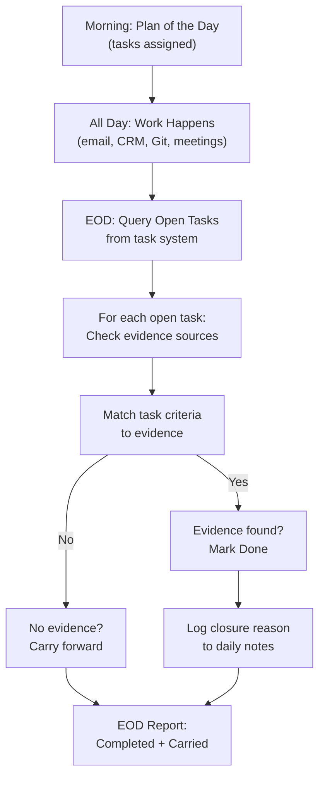

# EOD Reconciliation

> **One-line intent:** Bridge the gap between work that happened and task status by cross-referencing open tasks against evidence sources at end of day.

## Pattern in 60 Seconds

**The problem:** Work happens through conversations, emails, and side channels that don't update the task system. Tasks pile up as "open" even when the work is done, creating phantom overdue lists.

**The insight:** The task system and the work system are loosely coupled. Rather than forcing tight coupling (which adds friction to every action), add a reconciliation step that checks evidence sources against open tasks and closes the loop.

**The key structure:**

| Component | Role | Evidence Source |
|-----------|------|----------------|
| Task System | Declares what work should be done | Notion Tasks, Jira, Linear, Asana |
| Work System | Where work actually happens | Email, CRM, Calendar, Git, Chat |
| Reconciliation | Bridges the gap daily | Automated queries at EOD |

**What broke when we got this wrong:** Cloud Nirvana had 33 overdue tasks in Notion, but many were already done. Speaker prep calls completed yesterday still showed "Not Started." Pattern submission deadlines for a process that didn't even exist remained open for 11 days. The morning briefing reported all 33 as urgent, destroying trust in the planning system.

---

## Classification

| Property | Value |
|----------|-------|
| **Category** | Operations & Orchestration |
| **Difficulty** | Intermediate |
| **Also Known As** | Evidence-Based Task Closure, Done Detection, Implicit Completion |

---

## Motivation

Your team is crushing it. Emails sent, meetings held, code shipped, deals closed. Everyone's moving fast.

But your task board tells a different story. Yesterday's high-priority items still show "In Progress." Last week's quick wins are marked "Not Started." The system thinks you're behind when you're actually ahead.

The gap isn't laziness. It's friction. Updating the task system after completing work feels like paperwork. "I'll do it later." Later never comes.

So your morning briefing shows 33 overdue tasks. Your manager asks why nothing's getting done. Your team loses trust in the planning system. And the real tragedy: you start ignoring the task board entirely because it's always wrong.

This pattern solves it by automating the reconciliation loop. Instead of demanding humans update two systems (do the work AND mark it done), it checks evidence sources at end of day and closes tasks that have verifiable proof of completion.

---

## Applicability

Use this pattern when:

- Work happens across multiple systems (email, CRM, Git, Slack) but planning happens in one (Notion, Jira, Linear)
- Your team completes work faster than they update task status
- Your task board shows phantom overdue items that are actually done
- Morning reports lose credibility because they flag completed work as blocked
- You need to detect implicit completion without adding workflow friction

Do NOT use this pattern when:

- All work happens in the task system (rare, but exists for some dev workflows)
- Completion is ambiguous and requires human judgment (use reviews, not automation)
- Evidence sources are unreliable or unavailable
- The cost of a false positive (marking incomplete work as done) exceeds the benefit of automation

---

## Structure



---

## Participants

| Participant | Role | Example |
|-------------|------|---------|
| **Task System** | Source of truth for what should be done | Notion Tasks, Jira, Linear, Asana |
| **Evidence Sources** | Proof that work happened | Email logs, CRM state, Git commits, calendar events, file existence |
| **Reconciliation Agent** | Queries open tasks + evidence sources, closes matches | Lou's EOD sweep (Cloud Nirvana), cron job, GitHub Action |
| **Completion Criteria** | Defines what evidence proves a task is done | Defined per task type in task metadata or runbook |
| **Daily Log** | Audit trail of reconciliation decisions | memory/YYYY-MM-DD.md, audit table, changelog |

---

## How It Works

1. **Morning:** Tasks are assigned with completion criteria ("done when X email is sent" or "done when CRM field Y updates").

2. **All day:** Work happens. Emails sent, meetings held, CRM updated. Task status may or may not be updated.

3. **End of day (9 PM):** Reconciliation agent queries the task system for all open tasks assigned today.

4. **Evidence check:** For each open task, the agent checks the specified evidence source:
   - Email sent → query email logs for sent message
   - CRM record updated → query CRM for state change
   - Calendar event created → query calendar API
   - File created → check file existence
   - Code shipped → query Git log

5. **Match:** If evidence matches the completion criteria, mark the task Done and log the closure reason.

6. **Carry forward:** If no evidence is found, the task remains open and carries to tomorrow's plan.

7. **Report:** The EOD report shows both categories: tasks completed (with evidence) and tasks carried forward (with reasons).

### Code / Configuration Example

**Task definition with completion criteria:**

```yaml
# Notion task metadata or runbook definition
- id: send-attendee-list-to-partners
  template: "Send attendee list to partners for {event_name}"
  assigned_to: Scout
  due_date: 2026-05-16
  done_when:
    type: email_sent
    to_domain: ["expedient.com", "bigkittylabs.com", "thecircuit.net"]
    subject_contains: "attendee list"
    body_contains: "{event_name}"
  evidence_command: "gog gmail search 'to:expedient.com OR to:bigkittylabs.com subject:attendee after:2026/05/16'"
```

**Reconciliation script (simplified Python):**

```python
import subprocess
import json
from datetime import date

def reconcile_tasks():
    """Run EOD reconciliation: close tasks with evidence."""
    
    # Step 1: Get all open tasks from Notion
    open_tasks = query_open_tasks()
    
    closures = []
    carryovers = []
    
    for task in open_tasks:
        # Step 2: Check if task has done_when criteria
        if not task.get("done_when"):
            carryovers.append((task, "No completion criteria defined"))
            continue
        
        # Step 3: Run evidence command
        evidence_cmd = task["done_when"].get("evidence_command")
        if not evidence_cmd:
            carryovers.append((task, "No evidence command"))
            continue
        
        result = subprocess.run(evidence_cmd, shell=True, capture_output=True, text=True)
        
        # Step 4: Parse evidence
        if result.returncode == 0 and result.stdout.strip():
            # Evidence found
            mark_task_done(task["id"], evidence=result.stdout)
            closures.append((task, f"Evidence: {result.stdout[:100]}"))
        else:
            # No evidence
            carryovers.append((task, "No evidence found"))
    
    # Step 5: Log results
    log_reconciliation(closures, carryovers)
    
    # Step 6: Return summary
    return {
        "date": str(date.today()),
        "closed": len(closures),
        "carried": len(carryovers),
        "closures": closures,
        "carryovers": carryovers
    }

def query_open_tasks():
    """Query Notion for today's open tasks."""
    # Notion API query (simplified)
    return [
        {
            "id": "task-123",
            "name": "Send attendee list to partners for Columbus",
            "done_when": {
                "type": "email_sent",
                "evidence_command": "gog gmail search 'to:expedient.com subject:attendee after:2026/05/16'"
            }
        }
    ]

def mark_task_done(task_id, evidence):
    """Update Notion task to Done."""
    print(f"Marking {task_id} done. Evidence: {evidence[:50]}...")
    # Notion API update

def log_reconciliation(closures, carryovers):
    """Append to daily notes."""
    with open(f"memory/{date.today()}.md", "a") as f:
        f.write("\n## EOD Reconciliation\n")
        for task, reason in closures:
            f.write(f"- ✅ Closed: {task['name']} — {reason}\n")
        for task, reason in carryovers:
            f.write(f"- ⏩ Carried: {task['name']} — {reason}\n")

if __name__ == "__main__":
    summary = reconcile_tasks()
    print(f"Closed {summary['closed']} tasks, carried {summary['carried']}")
```

**Integration with existing workflows:**

```bash
# Cron at 9 PM ET
0 21 * * * cd /path/to/workspace && python3 scripts/eod-reconciliation.py
```

---

## Consequences

### Benefits

- **Eliminates phantom overdue tasks.** The morning briefing shows only real blockers, not ghosts of completed work.
- **Restores trust in planning.** When the task board matches reality, the team trusts the system again.
- **Zero workflow friction.** Teams do the work once; the system detects completion automatically.
- **Audit trail.** Every closure is logged with evidence, making it reviewable and reversible.
- **Catches implicit completion.** Work done through conversations or ad hoc actions gets credited.

### Liabilities

- **False positives possible.** If evidence criteria are too loose, incomplete work may be marked done.
- **Evidence source dependency.** If email logs are unavailable or CRM API is down, reconciliation fails.
- **Requires upfront criteria definition.** Tasks without `done_when` criteria can't be auto-closed.
- **Edge cases need human review.** Some work is genuinely ambiguous and shouldn't be auto-closed.

### What Broke in Practice

- **Overly broad email matching.** Early implementation matched any email to a domain, not specific recipients. Closed a task because an unrelated email was sent to the same company. **Fix:** Added recipient name matching, not just domain.
  
- **Speaker prep call false positive.** Task was "Schedule prep call with Speaker X." Email evidence found: "Sent calendar invite." But the invite was sent to the wrong speaker (copy-paste error). Task was auto-closed as done. The error was caught only when the correct speaker asked why they hadn't received an invite. **Fix:** Evidence criteria now include verifying the speaker name appears in the email body or calendar invite details, not just checking that *an* invite was sent.

- **CRM query timing.** Reconciliation ran at 9 PM, but a CRM sync job ran at 9:15 PM. Tasks were carried forward because the CRM data wasn't yet updated, even though the work was done. **Fix:** Added a 30-minute delay option for evidence checks that depend on batch syncs.

- **No evidence command defined.** 40% of tasks lacked `done_when` criteria in the first week. Reconciliation couldn't close them even when obviously complete. **Fix:** Made `done_when` a required field in task templates. If missing, the task template is invalid and rejected at POD generation.

---

## Implementation Notes

### Variations

**Per-task-type evidence sources:**

| Task Type | Evidence Source | Query |
|-----------|----------------|-------|
| Send email | Email logs | `gog gmail search 'to:EMAIL subject:KEYWORD after:DATE'` |
| CRM update | CRM state | `./mcp-server/crm-verify verify RECORD_ID` |
| Calendar event | Calendar API | `gog calendar list --after DATE --contains NAME` |
| File created | File system | `test -f /path/to/file.txt` |
| Code shipped | Git log | `git log --since="DATE" --grep="KEYWORD"` |
| Meeting held | Calendar + transcript | Check calendar event + check transcript file exists |

**Confidence levels:**

Not all evidence is equally strong. Consider tagging closures with confidence:

- **High confidence:** CRM state change, Git commit SHA, calendar event with confirmed attendees
- **Medium confidence:** Email sent (could be draft, could be wrong recipient)
- **Low confidence:** File existence (could be wrong file)

Low-confidence closures could be flagged for human review the next morning.

**Human override:**

Add a review step before finalizing closures:

```
Reconciliation runs at 9 PM → produces tentative closure list
Lou reviews at 9:05 PM → confirms or rejects each closure
Approved closures finalized → rejected closures carry forward
```

This adds 5 minutes of overhead but catches edge cases.

### Common Pitfalls

- **Trusting evidence blindly.** Email sent ≠ email sent to the right person with the right content. Verify specifics, not just existence.
- **Not logging closure reasons.** "Task was closed automatically" tells you nothing when you need to audit later. Always log the evidence command output.
- **Running reconciliation too late.** If reconciliation runs after the team has gone home, they can't correct false positives until tomorrow.
- **Ignoring carryover reasons.** "Task carried forward" is useless feedback. "Task carried forward: no evidence of email sent" tells the agent what to do tomorrow.

---

## Security Implications

### Attack Surface

- **Evidence source compromise.** If an attacker can manipulate email logs, CRM state, or Git history, they can cause tasks to be incorrectly closed, hiding incomplete work.
- **Reconciliation agent privilege.** The agent needs read access to email, CRM, calendar, Git, and task system. Compromising this agent exposes multiple data sources.

### Data Sensitivity

- **Evidence logs contain operational intelligence.** The daily log shows what work was done, by whom, and when. This is sensitive if the work involves confidential deals, personnel actions, or strategic plans.
- **Email content in evidence.** If the reconciliation log includes email snippets, PII or confidential data may leak into the audit trail.

### Failure Modes

- **False positive (high severity).** Incomplete work is marked done, causing missed deadlines or dropped commitments. Blast radius: reputation damage, customer trust loss.
- **False negative (low severity).** Completed work isn't detected, so it carries forward. Blast radius: annoyance, duplicate effort, but no external harm.
- **Evidence source unavailable.** If the CRM API is down during reconciliation, all CRM-dependent tasks carry forward even if done. Creates a backlog that needs manual triage.

### Mitigations

- **Require explicit evidence.** Don't close tasks without verifiable proof. If evidence is ambiguous, carry forward and flag for human review.
- **Log everything.** Immutable audit trail of closures with evidence, timestamps, and agent identity.
- **Rate-limit closures.** If >50% of tasks are auto-closed in one run, flag for review before finalizing. Could indicate a bug or attack.
- **Separate reconciliation from execution.** The agent that closes tasks should NOT be the same agent that executes them. Prevents an agent from marking its own incomplete work as done.
- **Human review for high-stakes tasks.** Financial transactions, legal commitments, or public announcements should always require human confirmation, even if evidence exists.

---

## Known Uses

| Organization | Context | Scale |
|-------------|---------|-------|
| Cloud Nirvana AIOS | Multi-agent operational system with 11 agents, daily POD, Notion task board. Reconciliation runs at 9 PM ET daily, checks email logs (Gmail), CRM state (SQLCipher + MCP), calendar (Google Calendar), and session transcripts. Reduced phantom overdue tasks from 33 to <5 in one week. | Production, 60+ days |

---

## Related Patterns

| Pattern | Relationship |
|---------|-------------|
| **REM Cycle** | Complementary. REM handles system health (file integrity, index freshness, distillation reminders). EOD Reconciliation handles task health (completion detection, evidence verification). Run both nightly. |
| **Plan of the Day** | Prerequisite. EOD Reconciliation closes tasks from the morning POD, feeding back into the next day's planning. |
| **Runbook-Driven Agent Cadence** | Parent pattern. EOD Reconciliation is a time-slot task in the runbook: "9 PM: Reconcile open tasks against evidence." |
| **Escalation Chain with SLA** | Related. If a task has no evidence and has been carried forward for 3+ days, auto-escalate as a potential unraised blocker. |
| **Verification Checkpoints** | Enforcement mechanism. EOD Reconciliation is a checkpoint: verify actual state (evidence) against claimed state (task status). |

---

## Metadata

| Property | Value |
|----------|-------|
| **Contributor** | Sean Erikson & Lou, Cloud Nirvana |
| **Production Environment** | Multi-agent AIOS, macOS, OpenClaw runtime |
| **First Published** | May 2026 |
| **Last Updated** | May 16, 2026 |
| **Cloud Nirvana Event** | To be presented at Columbus Q2 2026 |
| **License** | CC BY 4.0 |

---

## Revision History

| Date | Change | Author |
|------|--------|--------|
| 2026-05-16 | Initial publication | Lou 🔥 & Sean Erikson |
