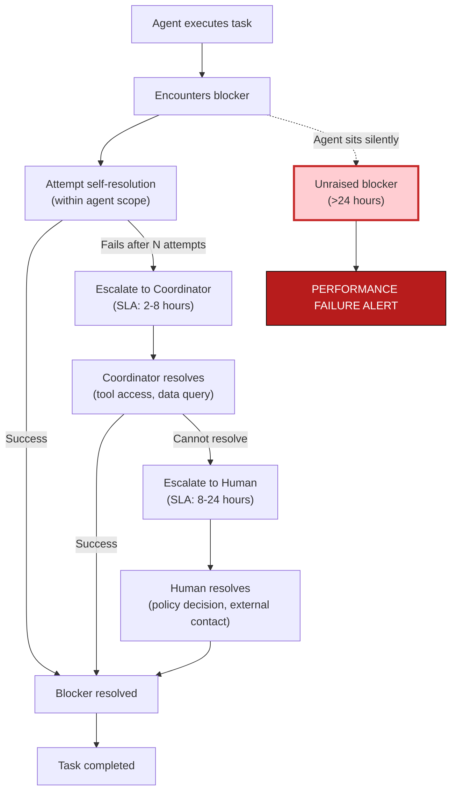

# Escalation Chain with SLA

> **One-line intent:** Ensure AI agents surface blockers within a time-bound window instead of silently stalling, retrying, or hallucinating workarounds.

## Pattern in 60 Seconds

**The problem:** AI agents encounter blockers and either sit on them indefinitely, retry the same failing approach, or hallucinate a workaround. Humans don't know something is stuck until it's too late.

**The insight:** Unraised blockers are worse than raised ones. An agent sitting silently on a problem wastes an entire day. Define explicit escalation chains with SLAs. Track unraised blockers as the most serious performance failure.

**The key structure:**

| Escalation Level | Who | SLA | Response |
|-----------------|-----|-----|----------|
| **L1: Agent** | Agent encounters blocker | 0-2 hours | Attempts self-resolution within scope |
| **L2: Coordinator** | Agent escalates to ops officer | 2-8 hours | Coordinator attempts resolution or elevates |
| **L3: Human** | Coordinator escalates to human | 8-24 hours | Human resolves or redirects |
| **Unraised** | Agent sits on blocker silently | >24 hours | **Performance failure** |

**What broke when we got this wrong:** Echo (podcast agent) stalled for 8 days on episode publishing without escalating. Nobody knew until the EOD report caught it. The episode was supposed to go live the previous week. If the escalation chain had existed, Lou would have known on day 1.

---

## Classification

| Property | Value |
|----------|-------|
| **Category** | Operations & Orchestration |
| **Difficulty** | Intermediate |
| **Also Known As** | Blocker SLA, Agent Escalation Protocol, Failure Surfacing |

---

## Motivation

You've deployed an agent to manage your podcast production workflow. Every Friday, it should:
1. Export the edited episode from Descript
2. Upload to podcast hosting (Transistor)
3. Schedule publication
4. Announce on social media

Week 1: works perfectly. Week 2: the Descript export hangs. The agent retries three times. All three attempts fail.

**What happens next?**

**Option A (no escalation):** The agent logs the error, moves on to other work, and waits for the next heartbeat cycle. Friday passes. Saturday passes. The following Thursday, you ask "Where's last week's episode?" and discover it never published. A week of potential listeners lost.

**Option B (retry loop):** The agent retries indefinitely. Every hour, it attempts the export. Every hour, it fails. The system churns CPU and API quota for seven days accomplishing nothing.

**Option C (hallucinated workaround):** The agent can't export from Descript, so it invents a substitute. It finds an old draft file in the workspace, assumes it's the right episode, and publishes that instead. You discover the error when listeners complain they got last month's episode again.

**Option D (escalation chain):** After three failed attempts, the agent escalates to the operations officer (Lou). Lou sees the blocker, investigates, discovers the Descript API token expired, regenerates it, resolves the blocker, and the agent completes the workflow within 2 hours of the original failure.

This is the difference between an agent that fails gracefully and one that fails silently. The Escalation Chain with SLA pattern ensures that blockers surface quickly, resolution attempts follow a clear chain of authority, and silent failures are treated as performance violations.

---

## Applicability

Use this pattern when:
- Agents execute multi-step workflows where any step can fail
- The cost of a silent failure is high (missed deadlines, incorrect data, reputation damage)
- Agents operate with partial autonomy but humans are still accountable for outcomes
- You have a coordination layer (operations officer, orchestrator agent, human supervisor) that can receive escalations
- SLA commitments matter (publishing schedules, partner deliverables, time-sensitive tasks)

Do NOT use this pattern when:
- Work is entirely exploratory with no deadlines (research agents, data mining)
- Failures are expected and benign (web scraping that gracefully degrades)
- Humans are always in the loop for every action (the agent never operates unattended)
- The cost of escalation overhead exceeds the cost of occasional silent failures

---

## Structure



---

## Participants

| Participant | Role | Example |
|------------|------|---------|
| **Agent** | Executes work, encounters blockers, attempts self-resolution, escalates when stuck | Echo (podcast agent), Vega (events agent), Mic (speaker agent) |
| **Coordinator** | Receives escalations, attempts resolution within broader tool/data access, escalates to human if needed | Lou (operations officer in AIOS) |
| **Human** | Final escalation tier, makes policy decisions, contacts external parties, resolves system-level blockers | Sean (CEO, strategic decisions), Trent (technical infrastructure) |
| **Escalation Log** | Persistent record of all escalations with timestamps, resolution status, and outcomes | Database table, Notion page, markdown file |
| **SLA Monitor** | Detects escalations exceeding SLA and alerts | Cron job, monitoring service, coordinator agent |
| **Metrics System** | Tracks escalation counts, resolution times, and unraised blocker incidents | `cadence.db` agent_metrics table, dashboard |

---

## How It Works

### Blocker Encountered

Agent is executing a task and encounters a blocker:
- API returns 403 Forbidden (credentials expired)
- Required file doesn't exist
- Dependency task isn't complete yet
- External service is down
- Input data is malformed

### Self-Resolution Attempt (L1)

Agent attempts to resolve within its scope:
- Retry with backoff (for transient failures)
- Check alternative data sources
- Validate preconditions and dependencies

**SLA:** 0-2 hours (configurable per task type)

**Success path:** Blocker resolved → continue task → log resolution
**Failure path:** After N attempts or SLA exceeded → escalate to L2

### Coordinator Resolution (L2)

Agent escalates to coordinator with structured data:

```json
{
  "escalation_id": "esc-2026-05-16-001",
  "agent_id": "echo",
  "task_id": "publish-episode-14",
  "blocker": "Descript API returned 403 Forbidden",
  "attempted": [
    "Retry with backoff (3 attempts)",
    "Check API status page (service operational)",
    "Validate local credentials (token exists)"
  ],
  "recommendation": "API token may have expired. Regenerate from Descript settings.",
  "timestamp": "2026-05-16T14:32:00Z",
  "sla_deadline": "2026-05-16T22:32:00Z"
}
```

Coordinator (Lou) receives escalation, attempts resolution:
- Regenerate API credentials
- Query additional data sources agent can't access
- Adjust task parameters or dependencies
- Grant temporary elevated permissions

**SLA:** 2-8 hours (configurable per task criticality)

**Success path:** Coordinator resolves → notifies agent → agent resumes task
**Failure path:** Coordinator cannot resolve → escalate to L3

### Human Resolution (L3)

Coordinator escalates to human with context:

```
🔴 ESCALATION — Echo: Publish Episode 14

Blocker: Descript API 403 Forbidden
Agent attempted: 3 retries, credentials validated
Lou attempted: Token regeneration (still 403)

Recommendation: Contact Descript support or use manual export workflow

SLA deadline: 8 hours (expires 2026-05-16 22:32 UTC)
```

Human resolves:
- Makes policy decision (skip this workflow, use alternative)
- Contacts external vendor
- Grants new permissions or access
- Redirects task to different agent or human

**SLA:** 8-24 hours (configurable per task criticality)

**Success path:** Human resolves → notifies coordinator → agent resumes
**Failure path:** Human decides to cancel, reassign, or defer task

### Unraised Blocker Detection

If an agent sits on a blocker for >24 hours without escalating, the SLA monitor detects it as a **performance failure**:

```
⚠️ UNRAISED BLOCKER DETECTED

Agent: Echo
Task: Publish Episode 14
Blocker detected: 2026-05-09 (8 days ago)
No escalation raised

This is a performance violation. Agent failed to surface blocker within SLA.
Recommend immediate investigation + agent trust level review.
```

### Code / Configuration Example

**Escalation Definition (Runbook):**
```yaml
task:
  id: publish-episode
  name: "Publish podcast episode {episode_number}"
  raci: { r: Echo, a: Lou }
  escalation:
    chain: [Echo, Lou, Sean]
    sla:
      l1_agent: 2 hours
      l2_coordinator: 8 hours
      l3_human: 24 hours
    unraised_alert: 24 hours
```

**Escalation MCP Command:**
```bash
# Agent raises escalation
cadence task escalate TASK_ID \
  --blocker "Descript API 403 Forbidden" \
  --attempted "Retry 3x, validated credentials, checked status page" \
  --recommendation "API token may have expired"

# Coordinator marks escalation resolved
cadence escalation resolve ESCALATION_ID \
  --resolution "Regenerated Descript API token" \
  --resolved-by Lou
```

**Agent Escalation Logic (Python):**
```python
def execute_task_with_escalation(task):
    max_attempts = 3
    sla_hours = task.escalation_config.get("l1_agent", 2)
    
    for attempt in range(max_attempts):
        try:
            result = perform_work(task)
            return result
        except BlockerException as e:
            log_blocker(task.id, e)
            
            if attempt < max_attempts - 1:
                backoff = 2 ** attempt  # exponential backoff
                time.sleep(backoff * 60)
            else:
                # Exhausted self-resolution attempts
                escalate(
                    task_id=task.id,
                    blocker=str(e),
                    attempted=[f"Retry {attempt+1}" for attempt in range(max_attempts)],
                    recommendation=suggest_resolution(e)
                )
                return None
```

**SLA Monitor (Cron Job):**
```python
def detect_unraised_blockers():
    # Query all open tasks older than 24 hours with no completion and no escalation
    stale_tasks = db.query("""
        SELECT task_id, agent_id, created_at, name
        FROM tasks
        WHERE status != 'done'
          AND created_at < datetime('now', '-24 hours')
          AND task_id NOT IN (SELECT task_id FROM escalations)
    """)
    
    for task in stale_tasks:
        alert(
            level="critical",
            title="UNRAISED BLOCKER DETECTED",
            message=f"Agent {task.agent_id} has task {task.name} open for "
                    f"{days_since(task.created_at)} days without escalation",
            agent=task.agent_id
        )
```

---

## Consequences

### Benefits

- **Blockers surface quickly.** The SLA clock forces agents to escalate instead of sitting silently on problems.
- **Clear chain of authority.** Everyone knows who handles what level of blocker. No ambiguity about who to ask.
- **Resolution speed.** Most blockers resolve at L2 (coordinator) within hours instead of days.
- **Performance accountability.** Unraised blockers are tracked as failures, creating feedback for agent improvement.
- **Prevents hallucination workarounds.** Agents can't invent solutions when the escalation protocol is mandatory.

### Liabilities

- **Escalation overhead.** If too many tasks hit blockers, the coordinator becomes overwhelmed with escalations.
- **SLA pressure.** Aggressive SLAs can create unnecessary urgency. Not every blocker needs 2-hour resolution.
- **False escalations.** Agents might escalate prematurely to avoid SLA violations instead of attempting reasonable self-resolution.
- **Coordinator bottleneck.** If the coordinator is a single person or agent, they become a single point of failure.

### What Broke in Practice

- **Echo 8-day silent stall.** Echo (podcast agent) encountered a Descript export failure on May 8. The episode was due to publish that day. Echo logged the error but didn't escalate. For eight days, the task sat in "open" status with no progress. On May 16, the EOD report flagged it as 8 days overdue. Lou investigated, discovered the blocker, resolved it in 10 minutes (API token expired). **Lesson:** Unraised blockers are worse than raised ones. We implemented the escalation SLA immediately after this incident.

- **Over-escalation from Vega.** Vega (events agent) was configured with a 1-hour L1 SLA for all tasks. Transient network errors triggered escalations every time. Lou received 15 escalations in one day, 14 of which resolved themselves on retry. **Fix:** Tuned SLA per task criticality. T-1 tasks get 1-hour SLA. T-7 tasks get 8-hour SLA. Routine tasks get 24-hour SLA.

- **No resolution tracking.** Early implementation had no persistent escalation log. Escalations were delivered via Telegram and then disappeared. If Lou was offline when the escalation arrived, it got lost. **Fix:** All escalations write to `escalations` table with status tracking. Unresolved escalations resurface in the midday status report.

- **Human SLA violations.** Sean (L3) was traveling for three days. An escalation arrived, exceeded the 24-hour SLA, and sat unresolved for 72 hours. No failover. **Fix:** L3 escalations now route to a backup human (Trent or Jonathan) if Sean is unavailable. Escalation config includes `l3_backup` field.

---

## Implementation Notes

### Variations

**Tiered SLA by criticality:** T-1 tasks (due tomorrow) get 1-hour SLA. T-7 tasks get 8-hour SLA. Routine tasks get 24-hour SLA. Prevents false urgency for low-priority work.

**Auto-escalation after N failed resolutions:** If the coordinator attempts resolution three times and fails, auto-escalate to L3 instead of waiting for SLA expiration.

**Parallel escalation:** For critical tasks, escalate to both coordinator and human simultaneously instead of sequentially. Faster resolution but higher interrupt cost.

**Escalation templates:** Agents fill structured templates instead of free-form escalation messages. Ensures all necessary context is provided.

### Common Pitfalls

- **No SLA tuning.** Using the same SLA for all task types creates either false urgency (routine tasks) or missed deadlines (critical tasks). Tune SLA per task criticality.

- **Escalating without attempting self-resolution.** Agents that immediately escalate on first failure create unnecessary coordinator load. Require at least 2 self-resolution attempts before escalation.

- **No unraised blocker detection.** If you don't actively monitor for agents sitting silently on blockers, the escalation chain only works for compliant agents. Non-compliant agents fail silently.

- **Human L3 as a single point of failure.** If the L3 human is unavailable and there's no backup, escalations stall indefinitely. Define L3 backup contacts.

---

## Security Implications

### Attack Surface

- **Escalation spam.** A malicious or malfunctioning agent could flood the coordinator with fake escalations, creating a denial-of-service on human attention.
- **Escalation hijacking.** If escalation messages aren't authenticated, an attacker could inject fake escalations or mark real ones as resolved.
- **SLA gaming.** An agent could escalate prematurely (before attempting self-resolution) to avoid SLA violations, gaming the performance metrics.

### Data Sensitivity

- **Escalation logs contain context.** Blocker descriptions, attempted resolutions, and recommendations may reveal system architecture, API keys, or business logic. Treat escalation logs as confidential.
- **Unraised blocker alerts expose agent weaknesses.** Publishing which agents frequently fail to escalate could reveal which systems are unreliable.

### Failure Modes

- **Coordinator offline.** If the coordinator is down when an agent escalates, the escalation is lost unless there's a persistent queue.
- **SLA monitor failure.** If the cron job that detects unraised blockers stops running, silent failures go undetected.
- **Escalation log corruption.** If the escalation database is corrupted, resolution status is lost and blockers may be double-handled or forgotten.

### Mitigations

- **Escalation authentication.** Agents must authenticate when raising escalations (session tokens, API keys, signed messages).
- **Rate limiting.** Limit each agent to N escalations per hour to prevent spam attacks.
- **Persistent escalation queue.** Write escalations to a durable queue (database, message broker) before notifying coordinator.
- **SLA monitor health check.** Alert if the unraised blocker detection job hasn't run in 24 hours.
- **Access control on escalation logs.** Only coordinators and L3 humans can read escalation logs. Agents cannot query other agents' escalations.

---

## Known Uses

| Organization | Context | Scale |
|-------------|---------|-------|
| Cloud Nirvana AIOS | 11-agent operational system with Lou as L2 coordinator, Sean as L3 human | 1-5 escalations per week, 60+ days in production (design phase as of May 2026) |

---

## Related Patterns

| Pattern | Relationship |
|---------|-------------|
| **Plan of the Day** | Tasks on the POD that encounter blockers trigger escalations; carryover tasks with escalations age differently than tasks without escalations |
| **RACI-Scoped Notifications** | Escalations route to Accountable (A) role in real-time, Informed (I) role in batched summaries |
| **Ladder of Trust** | Unraised blocker incidents are tracked as performance failures and affect agent trust level progression |
| **Runbook-Driven Agent Cadence** | Runbooks define escalation chains and SLAs per task type |
| **Agent Performance Ladder** | Escalation discipline (raising blockers vs. sitting silently) is a key metric for agent advancement |

---

## Metadata

| Property | Value |
|----------|-------|
| **Contributor** | Sean Erikson, CEO & Co-Founder, Cloud Nirvana; Lou 🔥, Chief of AIOS |
| **Production Environment** | Multi-agent AI operations system, 11 agents, macOS + OpenClaw + Notion + CRM |
| **First Published** | May 16, 2026 |
| **Last Updated** | May 16, 2026 |
| **Cloud Nirvana Event** | TBD (Columbus Q3 2026 candidate) |
| **License** | CC BY 4.0 |

---

## Revision History

| Date | Change | Author |
|------|--------|--------|
| 2026-05-16 | Initial publication from Cadence design docs and Echo 8-day stall incident | Lou 🔥 |
