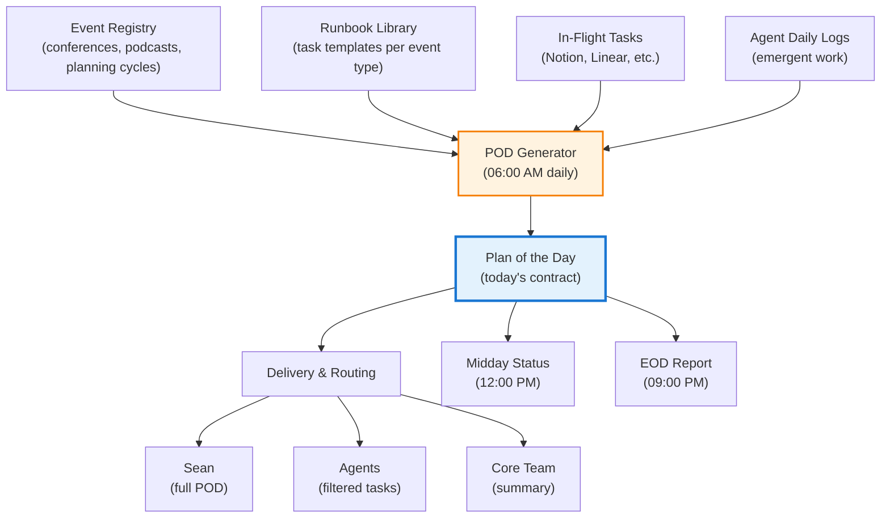

# Plan of the Day

> **One-line intent:** Synthesize multiple business event calendars, runbook playbooks, and in-flight work into a single daily executable plan with RACI ownership for every team member, human and AI.

## Pattern in 60 Seconds

**The problem:** Hybrid human-AI teams start each day without a unified view of what needs to happen. Work is scattered across agent queues, human memory, and multiple tools. Nobody knows what the team is executing against.

**The insight:** A daily synthesis step that reads all active events, evaluates all applicable runbooks, deduplicates against in-flight work, and produces a single Plan of the Day is the contract the team executes against. The day ends when the plan is done.

**The key structure:**

| Component | Responsibility | Output |
|-----------|---------------|---------|
| Morning Generation | Read registries, match runbooks, resolve variables, deduplicate | Structured task list with RACI |
| Delivery | Route to agents and humans based on RACI role | Per-person work queue |
| Midday Check | Progress report, blocker identification, agent nudges | Status update |
| EOD Report | Completion metrics, carryover tracking, memory sweep | Daily scorecard |

**What broke when we got this wrong:** Auto-generated tasks piled up as "overdue" for weeks because nobody closed them and the system had no feedback loop. 33 phantom overdue tasks destroyed trust in the planning system. Without a daily synthesis and completion lifecycle, task generation became noise instead of signal.

---

## Classification

| Property | Value |
|----------|-------|
| **Category** | Operations & Orchestration |
| **Difficulty** | Intermediate |
| **Also Known As** | Daily Operational Plan, Navy POD for AI Teams, Morning Plan with RACI |

---

## Motivation

You've deployed a multi-agent system. Each agent has a queue. Each runbook generates tasks. Each event (conference, podcast episode, partner onboarding) has a timeline with T-minus tasks that need execution.

On Monday, Vega (events agent) needs to export attendee lists for three upcoming conferences. Mic (speaker agent) needs to schedule prep calls with five speakers. Echo (podcast agent) needs to publish last week's episode. Scout (partnerships) needs to send partnership decks to two prospects. Lou (chief of staff) needs to draft the newsletter.

**Who knows the full picture?** Nobody. Each agent sees its own queue. Each human sees their email. The task board shows 147 open items with no clear priority or sequence.

**What gets done first?** Whatever someone remembers or whatever screams loudest.

**What falls through the cracks?** The T-7 task that needed to happen today so the T-3 task can happen on time. The podcast episode that's been "almost ready" for eight days.

This is the chaos that emerges when operational execution is distributed without a daily synthesis step. The Plan of the Day solves this by making the day's work explicit, visible, and owned. Every morning, one process reads the entire operational state, produces the plan, and delivers it to the team. Execution starts from a shared understanding of what "done" means for the day.

Inspired by the U.S. Navy Plan of the Day, which coordinates every division, every watch section, and every sailor on the ship toward the day's mission.

---

## Applicability

Use this pattern when:
- Multiple agents and humans collaborate on time-bound operational work
- Work is driven by business events with predictable timelines (conferences, product launches, content calendars)
- Tasks depend on each other (T-30 enables T-7 enables T-1)
- Stakeholders need visibility into daily execution priorities
- You need to distinguish between planned work (runbook-driven) and emergent work (discovered during the day)

Do NOT use this pattern when:
- Work is entirely reactive (support tickets, customer service queues)
- There are no time-bound events driving task generation
- The team is small enough that everyone fits the entire state in their head
- The cost of daily synthesis exceeds the value of coordination

---

## Structure



---

## Participants

| Participant | Role | Example |
|------------|------|---------|
| **Event Registry** | Source of truth for upcoming business events | CRM events table, podcast schedule YAML, newsletter calendar |
| **Runbook Library** | Task templates per event type, with T-minus timelines and RACI | `runbooks/cn-conference.yaml`, `runbooks/podcast-episode.yaml` |
| **POD Generator** | Synthesis engine that produces the daily plan | MCP command `cadence pod generate`, runs at 06:00 AM |
| **Task Store** | Persistent task database for deduplication and tracking | Notion Tasks database, Linear, Jira |
| **Agent Daily Logs** | Append-only logs where agents record emergent work | `agent-logs/vega-YYYY-MM-DD.md`, `agent-logs/mic-YYYY-MM-DD.md` |
| **Delivery Router** | RACI-based notification system | Telegram for Sean, session messages for agents, group chat for core team |
| **Operations Officer** | Accountable for POD execution and completion | Lou (chief of staff agent) in Cloud Nirvana AIOS |

---

## How It Works

### Morning Generation (06:00 AM)

1. **Scan the horizon:** Query event registry for all events within planning horizon (typically 90 days for conferences, 14 days for newsletters, 7 days for podcasts).

2. **Match runbooks:** For each upcoming event, find the matching runbook by event type.

3. **Evaluate tasks:** For each (event, runbook) pair:
   - Calculate task due dates: `event_date + t_minus`
   - Filter to tasks due today or overdue
   - Check dependency satisfaction (don't generate Task B if Task A isn't done)
   - Resolve variables (`{speaker_name}`, `{event_name}`, etc.) from CRM/data sources

4. **Curate emergent work:** Operations officer reviews agent daily logs from yesterday, identifies work that needs to become tracked tasks, creates Notion tasks for them.

5. **Deduplicate:** Query existing in-flight tasks, skip tasks that already exist and aren't done, re-surface overdue tasks that need to carry forward.

6. **Build RACI matrix:** Aggregate RACI across all today's tasks, create per-person/agent task lists, identify who needs to be consulted or informed.

7. **Deliver the plan:** Route to all stakeholders based on their RACI role.

### Midday Check (12:00 PM)

Operations officer runs `cadence pod status` and delivers:
- X of Y tasks complete
- Blockers and escalations
- Agents falling behind schedule
- Direct nudges to responsible parties

### End-of-Day Report (09:00 PM)

Operations officer delivers completion scorecard:
- Final POD completion rate (percentage of today's tasks done)
- Tasks carried forward with age flags (1 day overdue, 2 days overdue)
- Memory sweep results (implicitly-done tasks closed with evidence)
- Agent metrics snapshot for the day
- Tomorrow's preview (what's coming)

### Code / Configuration Example

**Event Registry (CRM):**
```sql
-- CRM events table
SELECT event_id, city, event_date, event_type, status
FROM events
WHERE event_date >= date('now')
  AND event_date <= date('now', '+90 days')
  AND status != 'cancelled'
ORDER BY event_date;
```

**Runbook (YAML):**
```yaml
---
id: cn-conference
name: Cloud Nirvana Conference
event_source:
  table: events
  filter: { type: conference }
horizon_days: 90
tasks:
  - id: export-attendees
    template: "Export attendee list from Eventbrite for {event_name}"
    t_minus: -4  # 4 days before event
    lead_days: 1
    raci: 
      r: Vega          # Responsible (does the work)
      a: Lou           # Accountable (owns the outcome)
      c: []            # Consulted (input needed)
      i: [Sean]        # Informed (kept in loop)
    depends_on: []
    done_when: "Attendee CSV exported and saved"
    verify: "./mcp-server/eventbrite verify-export {event_id}"
  
  - id: send-attendees-to-partners
    template: "Send attendee list to partners for {event_name}"
    t_minus: -4
    lead_days: 1
    raci: { r: Scout, a: Lou, c: [], i: [Sean, Vega] }
    depends_on: [export-attendees]  # can't send what doesn't exist
    done_when: "Email sent to all partners with attendee count"
    verify: "./mcp-server/gmail-draft verify-sent-subject 'Attendee list for {event_name}'"
```

**POD Generation (MCP):**
```bash
# Daily at 06:00 AM
cadence pod generate

# Output: structured POD with today's tasks
# Creates new Notion tasks for tasks that don't exist
# Flags carryover tasks that are overdue
# Builds RACI-based delivery
```

**POD Output (Delivered at 07:00 AM):**
```
⚓ Plan of the Day — Friday, May 16, 2026

Events on horizon: Columbus (May 20, T-4), Cleveland (May 19, T-3),
                   Cincinnati (May 21, T-5)

━━━━━━━━━━━━━━━━━━━━━━━━━━━━━━━━━━━━━

CLEVELAND (May 19 — T-3)
  □ Confirm final headcount with venue
    R: Vega | A: Lou
  □ Export attendee list from Eventbrite
    R: Vega | A: Lou

COLUMBUS (May 20 — T-4)
  □ Send attendee list to partners
    R: Scout | A: Lou | I: Sean, Vega
    Depends on: Export attendee list (in progress)
  □ Export attendee list from Eventbrite
    R: Vega | A: Lou

NEWSLETTER
  □ Draft Agents in Production — May 16
    R: Lou | A: Lou | C: Sean

━━━━━━━━━━━━━━━━━━━━━━━━━━━━━━━━━━━━━

CARRYOVER (overdue, not yet done)
  ⚠ Publish Noele Williams podcast episode
    R: Echo | A: Lou | Due: May 8 (8 days overdue)
    ESCALATION REQUIRED

━━━━━━━━━━━━━━━━━━━━━━━━━━━━━━━━━━━━━

Today's RACI Summary:
  Vega: 3 tasks (R)
  Scout: 1 task (R)
  Lou: 1 task (R), 5 tasks (A)
  Echo: 1 task (R, carryover)
  Sean: 2 tasks (I), 1 task (C)

━━━━━━━━━━━━━━━━━━━━━━━━━━━━━━━━━━━━━

The plan is the contract. Deviations are escalations or urgent additions.
Let's execute.
```

---

## Consequences

### Benefits

- **Shared reality every morning.** Every team member (human and AI) sees the same plan. No confusion about priorities.
- **Explicit ownership.** RACI makes it clear who does the work, who owns the outcome, who needs to be consulted, and who needs to know.
- **Carryover visibility.** Overdue tasks don't disappear into the noise. They reappear on the POD with age flags until resolved.
- **Dependency management.** T-minus tasks that depend on each other are sequenced correctly. The POD won't generate "send the deck" if "create the deck" isn't done.
- **Emergent work integration.** Agent daily logs feed the POD generation process so unplanned discoveries become tracked tasks instead of getting lost.
- **Completion accountability.** The day ends with a scorecard. Did we do what we said we'd do? If not, why not?

### Liabilities

- **Daily synthesis overhead.** Generating the POD takes compute time and coordination. For a team with hundreds of tasks, this could become slow.
- **Runbook maintenance.** As business processes evolve, runbooks must be updated. Stale runbooks generate wrong tasks.
- **False sense of completeness.** A well-formatted POD can create the illusion that "we have a plan" even if the plan is wrong or incomplete.
- **Human bottleneck.** If too many tasks are assigned to one person (often the operations officer), the POD just highlights the bottleneck without solving it.

### What Broke in Practice

- **33 phantom overdue tasks.** Early implementation generated tasks but had no completion feedback loop. Tasks marked "Done" in agent memory weren't closed in Notion. After three weeks, the task board showed 33 overdue items that were actually complete. Trust in the system collapsed. **Fix:** Memory sweep at EOD where the operations officer reviews what actually happened (emails sent, calls scheduled, files uploaded) and closes tasks with evidence, not just agent claims.

- **Carryover without aging.** Tasks carried forward day after day with no escalation trigger. On day 8, someone noticed a podcast episode that should have published a week ago. **Fix:** Carryover policy with automatic escalation: 1 day = carry forward silently, 2 days = nudge responsible agent, 3 days = escalate to operations officer, 5+ days = require explicit decision (complete, cancel, or reassign).

- **No distinction between planned and emergent.** Agent discovered a critical bug in the attendee export script. Fixed it, but the work was invisible because it wasn't on the POD. Looked like the agent did nothing all day. **Fix:** Agent daily logs where agents append one line per significant action. Operations officer curates these logs during POD generation to surface emergent work worth tracking.

- **Dependency violations.** Early POD generator created "send attendee list" tasks before "export attendee list" was done. Agent tried to execute, discovered the dependency, escalated. **Fix:** Dependency checking in runbooks with `depends_on` field. POD generator skips dependent tasks if prerequisites aren't satisfied.

---

## Implementation Notes

### Variations

**Lightweight POD (Markdown file):** Generate the POD as a markdown file instead of creating Notion tasks. Faster, simpler, but loses task tracking and persistence. Good for small teams or initial validation.

**Per-Agent POD:** Instead of one unified POD, generate individual PODs per agent with only their tasks. Reduces noise but loses the shared reality benefit.

**Rolling POD:** Generate the POD for the next 3 days instead of just today. Gives agents forward visibility but increases complexity (what if something changes?).

**Sprint POD:** Generate a weekly POD instead of daily. Works for teams with longer planning horizons, but loses the daily accountability rhythm.

### Common Pitfalls

- **Overloading the POD.** If the POD consistently has 50+ tasks, it's no longer a plan—it's a wish list. The POD should be what the team can realistically complete in one day. If tasks routinely carry forward, the runbooks are generating too much or the team needs more capacity.

- **Ignoring emergent work.** If the POD only shows runbook-generated tasks and agents spend 70% of their day on unplanned work, the POD becomes theater. Agent daily logs and memory sweeps keep the POD honest.

- **No human integration.** If the POD is only for agents and human team members work from email/Slack/memory, the POD is incomplete. Humans need RACI assignments too.

- **Brittle deduplication.** Early implementations matched tasks by title string matching. Two tasks with slightly different wording ("Export attendees for Columbus" vs "Export Columbus attendee list") created duplicates. Use composite keys: `{runbook_id}:{event_id}:{task_id}[:{entity_id}]`.

---

## Security Implications

### Attack Surface

- **POD tampering:** If the event registry or runbook files are writable by untrusted parties, malicious tasks could appear on the POD. Apply the same access controls to these inputs as to agent configurations.
- **Task injection:** An agent with write access to the task store could create fake tasks that appear on the POD. POD generation should be the only path for task creation.
- **Registry manipulation:** Changing event dates in the registry could cause POD tasks to generate at the wrong time (or not at all). Audit log all registry changes.

### Data Sensitivity

- **POD contains operational intelligence.** The daily plan reveals what the organization is working on, who is responsible, and what's coming. Treat the POD as confidential.
- **Event data leakage.** If the POD includes event names, speaker names, or partner names before they're publicly announced, unauthorized access could leak unreleased information.
- **RACI visibility.** The POD shows who owns what. In hierarchical organizations, this transparency can be politically sensitive.

### Failure Modes

- **POD generation failure.** If the POD generator crashes or produces an empty plan, the team wakes up without direction. Implement monitoring and fallback (yesterday's POD + manual additions).
- **Delivery failure.** If notifications don't reach stakeholders, the plan exists but nobody sees it. Log all deliveries and alert if critical deliveries fail.
- **Runbook bugs.** A malformed runbook could generate hundreds of duplicate tasks or tasks with corrupted data. Validate runbooks before they're used in production.

### Mitigations

- **Read-only runbooks for agents.** Agents can read runbooks but cannot modify them. Only humans (or a designated configuration agent) can edit runbooks.
- **POD generator as MCP.** Enforce that all task creation flows through the POD generator MCP. Agents cannot create tasks directly.
- **Audit trail.** Log every POD generation with inputs (which events, which runbooks, which tasks) and outputs (which tasks created). Enables forensic review if something goes wrong.
- **Access control on delivery.** Route POD content based on role. External contractors see only their assigned tasks, not the full plan.

---

## Known Uses

| Organization | Context | Scale |
|-------------|---------|-------|
| Cloud Nirvana AIOS | 11-agent system coordinating conference operations, podcast production, partnership outreach, and content calendar across Columbus, Cleveland, Cincinnati | 5-10 daily tasks, 3-5 weekly events, 60+ days in production (design phase as of May 2026) |

---

## Related Patterns

| Pattern | Relationship |
|---------|-------------|
| **Runbook-Driven Agent Cadence** | Runbooks are the input to POD generation; the POD is the daily execution of the runbook templates |
| **RACI-Scoped Notifications** | RACI assignments in the POD determine who receives which notifications |
| **Escalation Chain with SLA** | Carryover tasks and blockers on the POD trigger escalations when SLAs are exceeded |
| **Hub-and-Spoke Orchestration** | The operations officer (Lou) acts as the hub, the POD is the work distribution mechanism to spoke agents |
| **Ladder of Trust** | POD completion rate and escalation discipline are inputs to agent trust level evaluations |

---

## Metadata

| Property | Value |
|----------|-------|
| **Contributor** | Sean Erikson, CEO & Co-Founder, Cloud Nirvana; Lou 🔥, Chief of AIOS |
| **Production Environment** | Multi-agent AI operations system, 11 agents, macOS + OpenClaw + Notion + CRM |
| **First Published** | May 16, 2026 |
| **Last Updated** | May 16, 2026 |
| **Cloud Nirvana Event** | TBD (Columbus Q3 2026 candidate) |
| **License** | CC BY 4.0 |

---

## Revision History

| Date | Change | Author |
|------|--------|--------|
| 2026-05-16 | Initial publication from Cadence design docs | Lou 🔥 |
