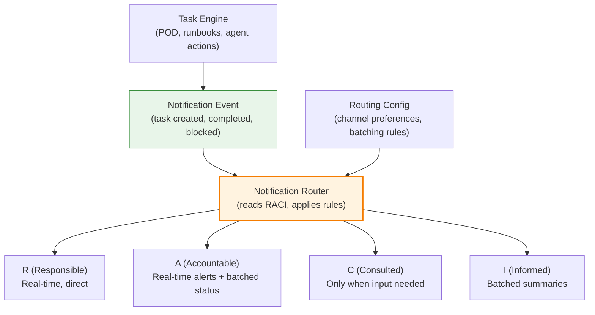

# RACI-Scoped Notifications

> **One-line intent:** Control operational notification volume in multi-agent systems by routing messages based on each person's RACI role per task.

## Pattern in 60 Seconds

**The problem:** 11 agents generating status updates create noise that drowns signal. Either everyone gets spammed with every action, or key stakeholders miss critical updates.

**The insight:** Attach RACI (Responsible, Accountable, Consulted, Informed) to every task. Use the matrix to determine who receives which notifications, at what frequency, through which channel. Loosely couple the notification layer from the task engine.

**The key structure:**

| RACI Role | Receives | Frequency | Channel |
|-----------|---------|-----------|---------|
| **R** (Responsible) | Task assignment, blocker alerts, completion confirmations | Real-time | Direct message/queue |
| **A** (Accountable) | All of R's notifications + status summaries + escalations | Real-time for alerts, batched for status | Direct message + daily digest |
| **C** (Consulted) | Input requests, decision points, draft reviews | Only when input needed | Direct message |
| **I** (Informed) | Summary updates, completion notifications | Batched (daily or weekly) | Group chat or email digest |

**What broke when we got this wrong:** Early AIOS had every agent announcing every action to the main Telegram channel. Sean (who should be Informed on most operational work) couldn't distinguish urgent partner emails from routine label changes. Alert fatigue set in within days. The channel became noise, not signal.

---

## Classification

| Property | Value |
|----------|-------|
| **Category** | Operations & Orchestration |
| **Difficulty** | Intermediate |
| **Also Known As** | Role-Based Notification Routing, RACI Notification Matrix, Attention Scoping |

---

## Motivation

You've deployed a multi-agent operations system. Vega handles event logistics. Mic manages speaker pipelines. Scout runs partnership outreach. Echo produces podcast episodes. Ledger tracks invoices. Pulse monitors community engagement.

Each agent does 10-20 actions per day:
- Vega exports attendee lists
- Mic schedules prep calls
- Scout sends partnership decks
- Echo publishes episodes
- Ledger logs payments
- Pulse analyzes engagement metrics

That's 60-120 notifications per day if every agent announces every action. If all of them land in Sean's Telegram, the channel becomes unusable. If none of them reach Sean, he's blind to operational execution.

The fundamental tension: **operational transparency vs. attention management.** You want visibility without drowning in updates.

Traditional solutions fail:
- **Broadcast everything:** Alert fatigue. Important notifications lost in noise.
- **Broadcast nothing:** Blindness. Critical issues surface too late.
- **Manual filtering:** Agents guess what to announce. Inconsistent. Unreliable.
- **Separate channels per agent:** Fragmentation. Nobody monitors 11 channels.

RACI-Scoped Notifications solves this by making notification routing **a function of organizational role, not agent discretion.**

Every task has RACI assignments. The notification router reads the RACI matrix and delivers messages accordingly:
- The person doing the work (R) gets real-time task assignments and blocker alerts.
- The person owning the outcome (A) gets everything R gets plus status summaries.
- People who need to provide input (C) only get notified when their input is needed.
- People who need to stay informed (I) get batched summaries, not real-time spam.

The key insight: **your attention budget is finite. Notifications must respect that budget or they become worthless.**

---

## Applicability

Use this pattern when:
- Multiple agents or systems generate operational notifications
- Stakeholders have different information needs (operators need real-time, executives need summaries)
- Alert fatigue is a real problem (too many notifications causing people to ignore all of them)
- You have clear accountability structures (you know who's Responsible, Accountable, Consulted, Informed for each task type)
- The cost of missing a critical notification is high (can't just "check when convenient")

Do NOT use this pattern when:
- The team is small enough that everyone can handle all notifications (< 5 people, < 20 notifications/day)
- Work is entirely ad hoc with no predictable RACI (every task requires custom routing)
- Real-time coordination is critical for everyone (war room scenarios where everyone needs the full feed)
- The infrastructure to route notifications based on metadata doesn't exist and building it isn't justified

---

## Structure



### RACI Notification Matrix

| Event Type | R (Responsible) | A (Accountable) | C (Consulted) | I (Informed) |
|------------|----------------|-----------------|---------------|--------------|
| **Task assigned** | Real-time direct message | Real-time direct message | - | Daily digest |
| **Task completed** | Completion confirmation | Completion confirmation | - | Daily digest |
| **Task blocked** | Real-time alert | Real-time alert + escalation | Real-time if their input unblocks | Daily digest (resolution) |
| **Input needed** | - | - | Real-time direct message | - |
| **Status summary** | - | Midday + EOD reports | - | Daily or weekly summary |
| **Escalation** | Real-time alert | Real-time alert | - | Only if resolved |

---

## Participants

| Participant | Role | Example |
|------------|------|---------|
| **Task Engine** | Generates tasks with RACI assignments | Plan of the Day generator, runbook executor, agent work queues |
| **Notification Router** | Reads RACI, applies routing rules, delivers messages | Cadence notification router, custom middleware, Zapier-style automation |
| **Routing Config** | Defines channel preferences, batching windows, and delivery rules | YAML config, database table, admin UI |
| **Responsible (R)** | Person/agent who does the work | Vega exports attendees, Mic schedules calls |
| **Accountable (A)** | Person/agent who owns the outcome | Lou (operations officer) accountable for all POD tasks |
| **Consulted (C)** | Person whose input is needed before action | Sean consulted on partnership tier decisions |
| **Informed (I)** | Person who needs to know outcomes | Core team informed about event logistics, Sean informed about routine completions |

---

## How It Works

### Task Creation with RACI

When a task is created (via POD generation, runbook execution, or manual creation), it includes RACI assignments:

```yaml
task:
  id: "export-attendees-columbus"
  name: "Export attendee list for Columbus"
  event: "columbus-q2-2026"
  raci:
    r: Vega           # Vega does the export
    a: Lou            # Lou owns the outcome
    c: []             # No consultation needed
    i: [Sean, CoreTeam]  # Sean and core team stay informed
```

### Notification Event Triggered

When the task state changes (created, started, blocked, completed), the task engine emits a notification event:

```json
{
  "event_type": "task.created",
  "task_id": "export-attendees-columbus",
  "task_name": "Export attendee list for Columbus",
  "raci": {
    "r": "Vega",
    "a": "Lou",
    "c": [],
    "i": ["Sean", "CoreTeam"]
  },
  "timestamp": "2026-05-16T07:00:00Z"
}
```

### Router Applies Rules

The notification router reads the event and the routing config:

```yaml
routing_rules:
  task.created:
    r: { channel: direct, timing: immediate }
    a: { channel: direct, timing: immediate }
    c: { channel: none, timing: none }
    i: { channel: digest, timing: daily }
  
  task.blocked:
    r: { channel: direct, timing: immediate }
    a: { channel: direct, timing: immediate }
    c: { channel: direct, timing: immediate, condition: "blocker requires c input" }
    i: { channel: digest, timing: daily, condition: "after resolved" }
  
  task.completed:
    r: { channel: direct, timing: immediate }
    a: { channel: direct, timing: immediate }
    c: { channel: none, timing: none }
    i: { channel: digest, timing: daily }
```

### Delivery Execution

The router delivers notifications to the appropriate channels:

**Vega (R):**
```
[Direct message to Vega's session queue]
📋 New task assigned: Export attendee list for Columbus
Due: Today | Event: May 20 | Accountable: Lou
```

**Lou (A):**
```
[Direct message to Lou's Telegram]
📋 Task created: Export attendee list for Columbus
Responsible: Vega | Due: Today | Event: May 20
```

**Sean (I):**
```
[Added to daily digest, delivered at 9 PM]
✅ Tasks created today:
- Export attendee list for Columbus (R: Vega, A: Lou)
- Send attendee list to partners (R: Scout, A: Lou)
- Draft newsletter (R: Lou, A: Lou)
```

### Batching and Aggregation

For Informed (I) roles, notifications are batched:

```
⚓ Daily Operations Digest — May 16, 2026

Events on horizon: Columbus (T-4), Cleveland (T-3), Cincinnati (T-5)

Today's completed work:
✅ Export attendee list for Columbus (Vega)
✅ Send attendee list to partners for Columbus (Scout)
✅ Schedule prep call with Rehgan Bleile (Mic)

Still in progress:
◐ Draft Agents in Production newsletter (Lou)
◐ Publish Noele Williams episode (Echo, 8 days overdue - ESCALATED)

Tomorrow's plan: 8 tasks, 3 events, full POD at 7 AM.
```

### Code / Configuration Example

**Notification Event Emission (Task Engine):**
```python
def create_task(name, raci, event_id):
    task = Task(name=name, raci=raci, event_id=event_id, status="open")
    task.save()
    
    # Emit notification event
    notify({
        "event_type": "task.created",
        "task_id": task.id,
        "task_name": task.name,
        "raci": task.raci,
        "event_id": task.event_id,
        "timestamp": datetime.utcnow()
    })
    
    return task
```

**Notification Router (MCP or standalone service):**
```python
def route_notification(event):
    rules = load_routing_config()
    event_type = event["event_type"]
    raci = event["raci"]
    
    # Route to Responsible
    if raci.get("r"):
        rule = rules[event_type]["r"]
        deliver(raci["r"], event, rule["channel"], rule["timing"])
    
    # Route to Accountable
    if raci.get("a"):
        rule = rules[event_type]["a"]
        deliver(raci["a"], event, rule["channel"], rule["timing"])
    
    # Route to Consulted (conditional)
    if raci.get("c"):
        rule = rules[event_type]["c"]
        if should_notify_consulted(event, rule):
            for person in raci["c"]:
                deliver(person, event, rule["channel"], rule["timing"])
    
    # Route to Informed (batched)
    if raci.get("i"):
        rule = rules[event_type]["i"]
        for person in raci["i"]:
            batch(person, event, rule["channel"], rule["timing"])
```

**Delivery Function:**
```python
def deliver(recipient, event, channel, timing):
    if timing == "immediate":
        send_now(recipient, event, channel)
    elif timing == "daily":
        add_to_digest(recipient, event, deliver_at="21:00")
    elif timing == "weekly":
        add_to_digest(recipient, event, deliver_at="friday-17:00")
```

---

## Consequences

### Benefits

- **Attention management.** Executives get summaries, operators get real-time alerts, contributors get only what they need to act on.
- **Reduced alert fatigue.** Notifications are scoped to organizational role, not broadcast to everyone.
- **Accountability clarity.** RACI makes it explicit who owns what, and notifications reinforce that structure.
- **Flexible delivery.** Same notification event can route to Telegram for one person, email for another, session queue for an agent.
- **Scalable.** Adding a new agent or team member means adding them to RACI assignments; the notification router handles the rest automatically.

### Liabilities

- **RACI overhead.** Every task needs RACI assignments. For small teams, this can feel bureaucratic.
- **Routing complexity.** The notification router becomes a critical dependency. If it fails, the team loses visibility.
- **Configuration drift.** If routing config gets out of sync with actual team structure, notifications go to the wrong people.
- **Delayed visibility for I roles.** Batching means Informed stakeholders don't see updates in real-time. For high-stakes work, this can be a problem.

### What Broke in Practice

- **Broadcast fatigue (week 1).** Every agent announced every action to the main Telegram channel. Sean's phone buzzed 80+ times per day. Within three days, he stopped checking the channel entirely. Critical partner emails got lost in the noise. **Fix:** Implemented RACI-scoped routing. Agents announce to their own queues. Lou (accountable for most operational work) gets real-time alerts. Sean gets daily digests for Informed tasks, real-time only for Consulted or Accountable tasks.

- **Missing escalations.** Early routing config didn't deliver blocker notifications to Accountable roles in real-time. Lou discovered a 3-day-old escalation only when running the midday status check. **Fix:** Blocker events always deliver immediately to both R and A, regardless of batching preferences.

- **Consulted role spam.** Sean was marked Consulted on 15 different task types. Every input request landed in his Telegram in real-time. He became a bottleneck. **Fix:** Review RACI assignments quarterly. Most tasks don't actually need Sean's input; they just felt safer including him. Moved 80% of those to Informed.

- **No channel preferences.** Lou prefers Telegram for urgent alerts, but the routing config didn't support per-person channel preferences. **Fix:** Added channel preference matrix to config: Lou gets Telegram for R/A, email digest for I. Sean gets Telegram for A/C, email digest for I.

---

## Implementation Notes

### Variations

**Static RACI (runbook-level):** Assign RACI per task type in runbooks. Every "export attendees" task has the same RACI regardless of which event. Simple but inflexible.

**Dynamic RACI (task-level):** Allow RACI to vary per task instance. "Export attendees for Columbus" might have different Responsible than "export attendees for Cleveland." More flexible but requires more configuration.

**Escalation RACI:** When a task escalates, the RACI changes. The blocker might elevate Informed roles to Consulted if their input is needed to resolve.

**Channel multiplexing:** Allow one person to receive different notification types through different channels. R/A tasks via Telegram, I tasks via email digest.

### Common Pitfalls

- **Over-assigning Accountable.** If Lou is Accountable for 90% of tasks, Lou becomes a notification firehose. Distribute accountability across the team.

- **Under-using Consulted.** Teams often skip Consulted and go straight to Accountable for input requests. This overloads the Accountable person. Use Consulted for subject matter experts who don't own outcomes.

- **Ignoring channel preferences.** Just because you can deliver via Telegram doesn't mean everyone wants Telegram notifications. Ask stakeholders how they want to receive different notification types.

- **Batching critical alerts.** Some events (security incidents, revenue-impacting outages, partnership reputation risks) should never be batched. Define a "critical" flag that bypasses batching rules.

---

## Security Implications

### Attack Surface

- **Notification spoofing:** If the notification router doesn't validate event sources, a malicious agent could emit fake notifications (e.g., "task completed" when it wasn't). Events should be cryptographically signed or authenticated.
- **RACI tampering:** If agents can modify their own RACI assignments, they could route sensitive notifications to themselves or suppress alerts. RACI should be read-only for agents.
- **Channel hijacking:** If notification delivery doesn't verify recipient identity, messages could be misdirected. Use secure channel identifiers (session keys, verified Telegram IDs, authenticated email addresses).

### Data Sensitivity

- **Notifications contain operational data.** Task names, event names, partner names, speaker names. If notifications are logged or stored insecurely, this data leaks.
- **RACI reveals org structure.** The RACI matrix shows who owns what, who reports to whom, and who has decision authority. Treat routing configs as confidential.
- **Digest timing reveals patterns.** If daily digests always arrive at 9 PM, an attacker monitoring network traffic knows when the team is active.

### Failure Modes

- **Router outage:** If the notification router is down, events are emitted but not delivered. The team operates blind. Implement a fallback (broadcast to a backup channel, queue for later delivery).
- **Config corruption:** A malformed routing config could route everything to one person or drop all notifications. Validate config on load and rollback on errors.
- **Batching indefinitely:** If the digest delivery job fails, batched notifications pile up forever. Implement a max batch size and alert if exceeded.

### Mitigations

- **Event authentication:** Cryptographically sign notification events so the router can verify they came from a trusted source.
- **Config versioning:** Track routing config changes in git. Audit who changed what and when.
- **Delivery confirmation:** Log every notification delivery with timestamp and recipient. Alert if critical deliveries fail.
- **Rate limiting:** Prevent notification spam attacks by rate-limiting event emission per source.

---

## Known Uses

| Organization | Context | Scale |
|-------------|---------|-------|
| Cloud Nirvana AIOS | 11-agent operational system with Lou as operations officer, Sean as CEO/strategic oversight, core team as domain experts | 60-120 notifications/day, 5 human stakeholders, 11 AI agents |

---

## Related Patterns

| Pattern | Relationship |
|---------|-------------|
| **Plan of the Day** | POD tasks include RACI assignments that drive notification routing |
| **Escalation Chain with SLA** | Escalations change RACI (Responsible → Accountable → Consulted) and trigger real-time notifications |
| **Runbook-Driven Agent Cadence** | Runbooks define default RACI per task type |
| **Hub-and-Spoke Orchestration** | The hub (operations officer) is typically Accountable for most tasks, spoke agents are Responsible |
| **Ladder of Trust** | Notification routing respects trust levels (L1 agents don't announce autonomously, L3 agents do) |

---

## Metadata

| Property | Value |
|----------|-------|
| **Contributor** | Sean Erikson, CEO & Co-Founder, Cloud Nirvana; Lou 🔥, Chief of AIOS |
| **Production Environment** | Multi-agent AI operations system, 11 agents, macOS + OpenClaw + Telegram + Notion |
| **First Published** | May 16, 2026 |
| **Last Updated** | May 16, 2026 |
| **Cloud Nirvana Event** | TBD (Columbus Q3 2026 candidate) |
| **License** | CC BY 4.0 |

---

## Revision History

| Date | Change | Author |
|------|--------|--------|
| 2026-05-16 | Initial publication from Cadence design docs | Lou 🔥 |
