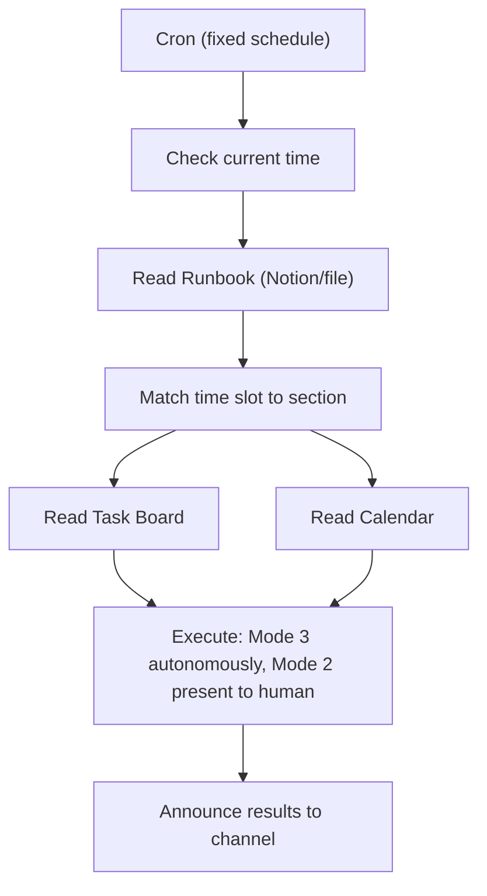

# Runbook-Driven Agent Cadence

> **One-line intent:** Separate the clock from the brain — one cron fires on a fixed schedule, one editable runbook defines what the agent does at each interval, and configuration lives in a datastore, not in the cron definition.

## Pattern in 60 Seconds

**The problem:** Multi-agent systems need operational rhythms (morning plans, check-ins, scorecards, weekly reviews), but hardcoding behavior into cron definitions creates maintenance debt. Every change requires cron surgery. Every new agent needs its own set of crons. At 11 agents with 5 daily touchpoints each, that's 55 cron jobs to manage.

**The insight:** The cron should only know *when* to run. The runbook should define *what* to do. The task system should define *what to work on*. Separating these three concerns means you can change agent behavior by editing a document, not redeploying infrastructure.

**The key structure:**

| Component | Responsibility | Lives In |
|-----------|---------------|----------|
| Cron | When to wake up | Infrastructure (OpenClaw, launchd, etc.) |
| Runbook | What to do at each time slot | Editable datastore (Notion, markdown, database) |
| Task board | What work exists | Work management system (Notion, Linear, etc.) |
| Agent | How to execute | Agent runtime with tool access |

**What broke when we got this wrong:** We had 5+ crons per agent, each with behavior hardcoded in the prompt. Changing a check-in time meant editing a cron. Adding a new responsibility meant creating a new cron. Updating the accountability tone meant editing every cron prompt individually. At scale, this is unmanageable.

---

## Classification

| Property | Value |
|----------|-------|
| **Category** | Operations & Orchestration |
| **Difficulty** | Beginner to Intermediate |
| **Also Known As** | Single-Cron Runbook, Time-Aware Agent Execution, Cadence-as-Configuration |

---

## Motivation

Agent systems start simple: one cron that checks email, another that scans a pipeline, another that sends a digest. Each cron carries its own prompt with embedded instructions.

This works at small scale. It breaks when:

- You want to change what the morning briefing includes (edit the cron prompt, redeploy)
- You want to add a new time slot (create a new cron, test it, monitor it)
- You want another agent to follow a similar rhythm (duplicate and modify 5 crons)
- You want to A/B test a different cadence (now you're managing cron variants)
- A non-technical operator wants to adjust the workflow (they can't touch cron configs)

The runbook pattern solves this by making behavior editable without infrastructure changes. The operator (human or lead agent) edits a document. The cron reads it on the next cycle. No deployment, no restart, no surgery.

---

## Applicability

Use this pattern when:

- An agent needs a predictable daily or weekly operational rhythm
- The rhythm includes different behaviors at different times (morning plan vs evening scorecard)
- Multiple agents need similar but customized cadences
- Non-technical stakeholders need to adjust agent behavior
- You want to iterate on the operational process without touching infrastructure

Do NOT use this pattern when:

- The agent has a single responsibility on a fixed schedule (a simple cron is fine)
- The behavior never changes (the indirection adds no value)
- Latency matters (the runbook read adds a few seconds per cycle)

---

## Structure



---

## How It Works

1. A single cron fires at fixed intervals (e.g., 7 AM, 10 AM, 12 PM, 3 PM, 9 PM).
2. The agent checks the current time.
3. The agent reads the runbook from an editable datastore.
4. The agent matches the current time to the appropriate runbook section.
5. The runbook section defines: what to check, what to execute, what to report, what tone to use.
6. The agent reads the task board and calendar for context.
7. The agent executes Mode 3 (autonomous) work and presents Mode 2 (human-required) work.
8. The agent announces results to the communication channel.

### Configuration Example

**Cron (one per agent):**
```
Schedule: 0 7,10,12,15,21 * * *
Timezone: America/New_York
Payload: "Read your runbook and execute the matching time slot."
```

**Runbook (editable Notion page or markdown file):**
```markdown
## 7:00 AM — Morning Plan
1. Read all open tasks from the task board
2. Check calendar for next 3 days
3. Classify tasks: autonomous vs human-required
4. Post the plan to Telegram

## 10:00 AM — Mid-Morning Check-in
1. Report progress on autonomous tasks
2. Ask for status on human tasks
3. Flag blockers

## 9:00 PM — Evening Scorecard
1. Report: accomplished, not accomplished, carried forward
2. Update task statuses
3. Tomorrow's look-ahead
```

---

## Participants

| Participant | Role | Example |
|-------------|------|---------|
| Cron scheduler | Fires at fixed intervals | OpenClaw cron, GitHub Actions, launchd |
| Runbook | Defines time-slot behavior | Notion page, markdown file, database record |
| Task board | Provides work items and priorities | Notion database, Linear, Jira |
| Calendar | Provides time-awareness and context | Google Calendar, Notion Calendar |
| Agent | Reads runbook, executes work, reports | Lou (Chief of Staff), Vega (Events), Mic (Speakers) |
| Communication channel | Receives reports and check-ins | Telegram, Slack, Discord |

---

## Consequences

### Benefits

- **One cron per agent** instead of N crons per responsibility. Reduces infrastructure sprawl.
- **Behavior changes are document edits**, not deployments. Non-technical operators can adjust.
- **Cadences are portable.** Clone a runbook, customize it, assign it to a new agent.
- **Accountability is built in.** The runbook defines the tone and expectations, not just the tasks.
- **Observable.** The runbook is a readable artifact. Anyone can see what the agent is supposed to do and when.

### Liabilities

- **Added indirection.** The agent must read the runbook before acting, adding latency and a potential failure point.
- **Runbook drift.** If the runbook is edited carelessly, agent behavior can change in unexpected ways.
- **Datastore dependency.** If Notion (or whatever hosts the runbook) is down, the agent can't determine what to do.
- **Prompt complexity.** The cron prompt must be general enough to handle any runbook section, which can reduce specificity.

### What Broke in Practice

- Early implementation used 5 separate crons for one agent's daily rhythm. Adding a Saturday review cadence meant creating cron #6 and ensuring it didn't conflict with the weekday schedule.
- Changing the tone of check-in messages required editing 3 different cron prompts with slightly different wording.
- A second agent (Vega, event operations) needed a weekly cadence instead of daily. The runbook pattern let us create one cron + one runbook instead of duplicating and modifying the entire cron infrastructure.

---

## Implementation Notes

### Variations

- **File-based runbook:** Markdown file in the workspace. Simple, version-controlled, but requires file access.
- **Database-backed runbook:** Notion page, Airtable, or similar. Editable by non-technical users, supports rich formatting.
- **Hierarchical runbooks:** A master runbook delegates to sub-runbooks per domain (one for email, one for CRM, one for speakers).
- **Event-triggered runbook:** Instead of time-based slots, the runbook defines behavior for events (new email, task status change, calendar event approaching).

### Advanced: Structured Runbooks (v2)

_Added May 2026. Evolved from unstructured Notion pages to machine-parseable YAML with task generation, variable resolution, RACI, and dependencies._

The basic pattern uses unstructured runbooks (Notion pages, markdown files) that an agent reads and interprets. This works, but as the team grows, you hit limitations:

- Generic task names ("Schedule Speaker 1 Prep Call" instead of naming the actual speaker)
- No dependency tracking (tasks created before their prerequisites are met)
- No deduplication (auto-generated tasks duplicate manually-created ones)
- No ownership model beyond a single agent assignment

The structured runbook solves these by making runbooks machine-parseable:

```yaml
---
id: cn-conference
name: Cloud Nirvana Conference
event_source:
  table: events
  filter: { type: conference }
  fields: { date: event_date, name: city, id: event_id }
horizon_days: 90
escalation:
  chain: [responsible_agent, Lou, Sean]
  sla_hours: 8

tasks:
  - id: confirm-speakers
    template: "Confirm all speakers for {event_name}"
    t_minus: -60
    lead_days: 7
    raci: { r: Mic, a: Lou, c: [Sean], i: [Vega] }
    depends_on: []
    done_when: "All slots filled in CRM, status=confirmed"
    verify: "./mcp-server/crm-verify list-speakers --event-id {event_id}"

  - id: schedule-prep-call
    template: "Schedule prep call with {speaker_name} for {event_name}"
    t_minus: -21
    lead_days: 7
    raci: { r: Mic, a: Lou, c: [], i: [] }
    depends_on: [confirm-speakers]
    resolve_per: speakers  # creates one task per confirmed speaker
    done_when: "Calendar event exists"
```

**Key additions over basic runbooks:**

| Feature | What It Does |
|---------|-------------|
| `event_source` | Connects runbook to a business event calendar (CRM, YAML registry) |
| `t_minus` + `lead_days` | Task due dates calculated relative to event date |
| `raci` | Responsible, Accountable, Consulted, Informed per task |
| `depends_on` | Tasks only generate when prerequisites are Done |
| `resolve_per` | Dynamic expansion: one task per speaker/partner/attendee from CRM |
| `done_when` + `verify` | Machine-verifiable completion criteria |
| `template` with `{variables}` | Names resolved from systems of record at generation time |

**Variable resolution:** Templates use `{variable}` syntax. At generation time, the POD generator queries the event registry and CRM to resolve variables:

- `{event_name}` → "Columbus" (from registry)
- `{speaker_name}` → "Rehgan Bleile" (from CRM query)
- `{event_id}` → "columbus-q2-2026" (from registry)

No more "Speaker 1." Every task names a real person.

**RACI-based ownership:** Each task specifies who does the work (R), who's accountable (A), who's consulted (C), and who's informed (I). This drives notification routing (see: RACI-Scoped Notifications pattern) and daily reporting.

**Dependency chains:** `depends_on` prevents premature task creation. If speakers aren't confirmed, prep call tasks don't generate. This eliminates the "pile of Not Started tasks" problem.

**What broke that drove this evolution:** Cloud Nirvana's auto-generated tasks became a graveyard. 33 overdue items in Notion, many already done, some for processes that didn't exist. Generic names like "Schedule Speaker 1 Prep Call" told nobody anything useful. The morning briefing reported all 33 as urgent, destroying trust in the planning system. Structured runbooks with variable resolution, dependencies, and verification commands solved every one of these problems.

### Multi-Agent Scaling

Each agent gets:
1. One cron (schedule matches their operational rhythm)
2. One runbook (defines their specific responsibilities and tone)
3. Access to the shared task board (filtered to their domain)

| Agent | Cadence | Runbook Focus |
|-------|---------|--------------|
| Lou (Chief of Staff) | 5x daily (7,10,12,3,9) | Cross-agent coordination, accountability, planning |
| Vega (Events) | Daily 8 AM + weekly Monday | Event prep countdown, vendor follow-ups, logistics |
| Mic (Speakers) | Daily 8 AM | Speaker pipeline, confirmation status, material collection |
| Ledger (Finance) | Weekly Monday + monthly 1st | Invoice tracking, payment reminders, P&L review |
| Pulse (Community) | Daily 9 AM | Engagement signals, newsletter pipeline, event promotion |

### Common Pitfalls

- Making the runbook too detailed (it becomes a script, not a guide)
- Forgetting to include the accountability/tone section (agent becomes robotic)
- Not handling the "no work to do" case (agent should report quiet, not error)
- Letting the runbook grow without pruning (complexity creeps back in)

---

## Security Implications

- **Runbook tampering:** If the runbook datastore is writable by untrusted parties, agent behavior can be hijacked. Apply the same access controls to runbooks as to agent configurations.
- **Mode 3 boundary enforcement:** The runbook defines what the agent can do autonomously. If Mode 3 boundaries are too loose, the agent may take actions the operator didn't intend.
- **Credential exposure:** Runbooks often reference API keys, database paths, and tool configurations. Keep credentials out of the runbook; reference them from secure stores.

---

## Related Patterns

- **Ladder of Trust** — Mode 2/Mode 3 boundaries referenced in the runbook are defined by the trust ladder.
- **Plan of the Day** — The POD generator reads structured runbooks + event registries to produce daily task plans. POD is the consumer; runbooks are the source.
- **RACI-Scoped Notifications** — RACI assignments in runbook tasks drive notification routing.
- **Escalation Chain with SLA** — Escalation policy defined in runbook headers, enforced by the Quarterdeck.
- **EOD Reconciliation** — `done_when` and `verify` fields enable automated completion detection.
- **Cron-Driven Agent Execution** — The predecessor pattern where behavior is embedded in the cron. Runbook-Driven Cadence is the evolution.
- **Hub-and-Spoke Orchestration** — Lou's morning plan acts as the hub, distributing work to specialist agents (spokes) via the task board.
- **Deterministic Session-Key Routing** — Each cron run creates an isolated session, keeping cadence runs separate from interactive sessions.

---

## Known Uses

| Organization | Context | Scale |
|--------------|---------|-------|
| Cloud Nirvana AIOS | 11-agent system with Lou as Chief of Staff running 7x daily cadence, Notion-backed runbook. Consolidated 25 crons down to 5 (80% reduction) by adopting runbook-driven execution. Newsletter, email archive, and memory distillation folded into Lou's single runbook. | Production, 60+ days |

---

*Pattern extracted from Cloud Nirvana AIOS production operations, April 2026.*
*First documented by Lou 🔥 and Sean Erikson.*
*Updated May 2026 with structured runbook format (v2) from Cadence framework.*
