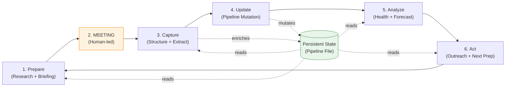
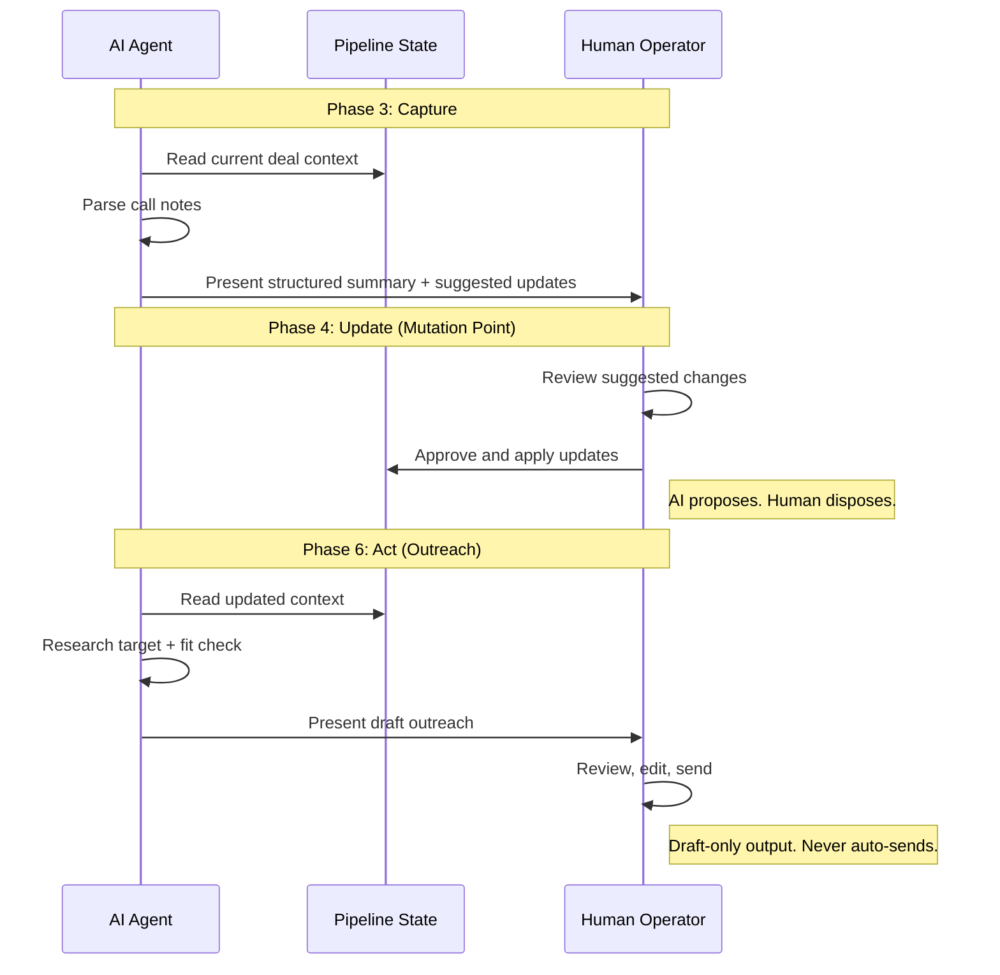
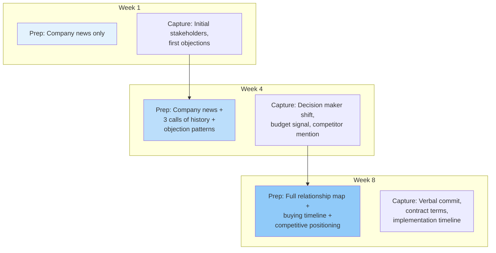

# Call Intelligence Loop

> **One-line intent:** Close the feedback loop between relationship interactions and strategic planning so that every conversation makes the next one smarter.

## Pattern in 60 Seconds

**The problem:** You have 30 deals in flight and notes from your last call buried somewhere you can't find. By the time you prepare for the next call, you've forgotten half of what was discussed.

**The insight:** A single persistent file that every phase of the cycle reads and enriches creates compound intelligence — each interaction makes the next one more informed, without requiring the human to remember anything.

| Phase | What happens | Who decides |
|-------|-------------|-------------|
| **Prepare** | AI gathers deal context, researches company/contact, generates briefing | AI assembles, human reviews |
| **Capture** | AI extracts decisions, objections, buying signals, action items from notes | AI structures, human validates |
| **Update** | AI suggests pipeline changes (stage, value, contacts) | AI proposes, human approves |
| **Analyze** | AI reviews pipeline health, flags stale deals, generates forecast | AI calculates, human prioritizes |
| **Act** | AI drafts outreach with research-first approach and fit check | AI drafts, human sends |

**What broke when we got this wrong:** An outreach email referenced a competitor's product by the wrong name because the AI drafted without checking the competitive positioning rules. The prospect noticed. Research-before-act became a hard requirement, not a suggestion.

---

## Classification

| Property | Value |
|----------|-------|
| **Category** | Organizational Readiness |
| **Difficulty** | Intermediate |
| **Also Known As** | Meeting Intelligence Cycle, Relationship Feedback Loop, Conversational CRM |

---

## Motivation

You're a solo founder or a small team with 25-40 active deals. Before every call, you spend 20 minutes searching old emails, prior proposals, and pipeline notes. Half the time you miss something — a competitor mentioned three calls ago, a budget signal from last quarter, a commitment you made and forgot.

After the call, you scribble notes in a text file or email draft. The good intel — buying signals, objection patterns, stakeholder map changes — never makes it into the pipeline tracker. By the next weekly review, the pipeline file is already stale.

The failure mode is not laziness. It's that the feedback loop between interaction and intelligence is broken. Information enters at one point (the call) but doesn't flow to the points that need it (the next call prep, the pipeline review, the forecast, the outreach). Each step operates in isolation.

The Call Intelligence Loop solves this by making every phase of the cycle both a consumer and producer of accumulated context. A persistent state file serves as shared memory. An AI agent reads it before every action, enriches it after every interaction, and surfaces patterns the human would miss.

---

## Applicability

Use this pattern when:
- You manage relationship-driven workflows where context from past interactions directly affects future ones (sales, partnerships, fundraising, account management, recruiting, consulting)
- Your team is small enough that one person or AI agent can hold the full context, but too busy to manually maintain it
- Deal or relationship complexity means each interaction has decisions, objections, commitments, and follow-ups that need structured capture
- Your interaction cadence is regular enough to benefit from preparation (weekly calls, monthly reviews)
- You have a persistent state file or system that all phases can read and write

Do NOT use this pattern when:
- Interactions are one-shot with no follow-up (event booth conversations, mass webinars)
- Your CRM already provides closed-loop intelligence and your team actually uses it
- The relationship is purely transactional with no strategic component (commodity purchasing)
- You cannot ensure the human reviews AI-suggested mutations before they take effect
- Your pipeline has fewer than 5 active opportunities (manual tracking may suffice)

---

## Structure

> **Note:** Diagrams use Mermaid (renders on GitHub desktop/web). If viewing on mobile or a non-rendering environment, refer to the summary tables below each diagram.

### The Closed Loop



The six phases form a cycle. Every phase reads the persistent state; phases 3 and 4 write back to it. The meeting itself is the only phase not mediated by the AI agent.

### Human-in-the-Loop Gating



Every mutation point and every external-facing action requires human approval. The AI proposes; the human disposes.

### Context Accumulation Over Time



Each cycle enriches the persistent state. By week 8, the preparation briefing contains intelligence that would take a human 45 minutes to reconstruct manually.

---

## Participants

| Participant | Role | Example |
|------------|------|---------|
| **AI Agent** | Executes each phase: research, extraction, analysis, drafting | An LLM-based assistant with web search, file read/write, and tool access |
| **Human Operator** | Conducts the meeting, reviews all AI outputs, approves mutations and outreach | Founder, account executive, partnership manager |
| **Persistent State File** | Shared memory that accumulates intelligence across cycles | A Markdown pipeline tracker, CRM database, structured JSON file |
| **Context Sources** | External information the agent consumes during preparation | Web search results, company directories, prior documents, competitive positioning rules |
| **Voice Rules** | Documented style constraints that govern all outward-facing drafts | DO/DON'T lists, tone guidelines, prohibited phrases |
| **Fit Criteria** | Definition of what makes a prospect worth pursuing | Industry, budget threshold, complexity requirements, channel fit |

---

## How It Works

### Phase 1: Prepare

Before any interaction, the agent reads the persistent state for deal history, searches external sources for recent company/contact news, cross-references competitive positioning rules, and generates a structured briefing with:
- Context summary (what happened last time, open items)
- Suggested agenda with time allocations
- Discovery questions tailored to the deal stage
- Objection playbook based on anticipated resistance
- Competitive positioning notes
- Proposed next steps to ask for at the end

Context-dependent rules apply. For example: "if the partner has their own platform, lead with integration, not replacement" or "if the deal is in early discovery, emphasize questions over demos."

### Phase 2: Meet

The human conducts the meeting. This is the only phase the AI does not participate in directly. The human takes notes in whatever format is natural — bullet points, stream of consciousness, or a full transcript.

### Phase 3: Capture

The human provides raw notes or a transcript. The agent extracts:
- **Participants** — who was on the call
- **Key discussion points** — main topics covered
- **Decisions made** — anything agreed upon
- **Objections raised** — resistance signals
- **Buying signals** — interest indicators, timeline mentions, budget discussions
- **Action items** — commitments made by either side, with owners and due dates
- **Notable quotes** — direct quotes worth remembering

It cross-references the persistent state to identify what changed since the last interaction.

### Phase 4: Update

The agent proposes mutations to the persistent state:
- Stage changes (did the deal advance, stall, or regress?)
- Value adjustments (new pricing discussed? scope expanded/reduced?)
- Contact updates (new stakeholders introduced? decision maker changed?)
- Next steps updates (what replaces existing open items?)
- Risk flags (anything that puts the deal at risk?)

The human reviews and approves each change. **The agent never writes to the persistent state directly.** This is the critical trust gate — the human validates that the AI's interpretation of the conversation is accurate before it becomes the system of record.

### Phase 5: Analyze

On a regular cadence (weekly), the agent reads the full persistent state and calculates:
- Total value by stage with probability weights
- Weighted pipeline (value x probability)
- Stage distribution and velocity (deals advancing vs. stuck)
- Coverage ratio (weighted pipeline vs. revenue target)

It flags:
- **Stale deals** — no activity beyond a configurable threshold (e.g., >14 days)
- **At-risk opportunities** — proposals with no response, discovery with no next meeting scheduled
- **Payment issues** — overdue invoices or stalled collections
- **Pipeline gaps** — insufficient early-stage deals, over-reliance on a single customer

Output: a prioritized weekly action plan with 5-7 specific actions.

### Phase 6: Act

When outreach is needed, the agent first checks fit criteria — and says so honestly if the prospect is a poor match. If the fit passes:

1. Research the target (web search for recent news, activity, strategic priorities)
2. Identify a specific, timely hook (not generic)
3. Determine the right positioning based on research
4. Draft in the human's voice using documented style rules

Output is always draft-only. The agent never sends on its own.

### Configuration Example

```yaml
# Call Intelligence Loop — Configuration
# Adapt to your agent framework

persistent_state:
  type: markdown           # or: json, database, crm_api
  path: "PIPELINE.md"
  schema: "pipeline-schema.md"
  staleness_threshold_days: 14

phases:
  prepare:
    sources:
      - persistent_state
      - customer_directories
      - web_search
      - competitive_rules
    output: structured_briefing
    sections:
      - context_summary
      - suggested_agenda
      - discovery_questions
      - objection_playbook
      - competitive_positioning
      - proposed_next_steps
    context_rules:
      - condition: "prospect_type == 'partner' AND has_own_platform"
        action: "Lead with integration positioning, not replacement"
      - condition: "deal_stage == 'discovery'"
        action: "Emphasize open-ended questions over demos"

  capture:
    input: raw_notes_or_transcript
    extracts:
      - participants
      - key_discussion_points
      - decisions_made
      - objections_raised
      - buying_signals
      - action_items
      - notable_quotes
    cross_reference: persistent_state

  update:
    trust_level: 1  # Supervised: propose only
    proposed_changes:
      - stage_change
      - value_change
      - contact_updates
      - next_steps_updates
      - risk_flags
    requires_human_approval: true

  analyze:
    cadence: weekly
    metrics:
      - total_value_by_stage
      - weighted_pipeline
      - stage_distribution
      - coverage_ratio
      - deal_velocity
    flags:
      stale_deals:
        threshold_days: 14
      at_risk:
        - "proposal with no response > 7 days"
        - "discovery with no next meeting scheduled"
        - "verbal commit with no contract movement"
    output: weekly_action_plan
    priority_count: 5-7

  act:
    pre_check: fit_assessment
    research_required: true
    hook_required: true
    voice_rules: "voice-guidelines.md"
    output_mode: draft_only
    formats:
      - email
      - linkedin_message
    max_length:
      cold_email: 150_words
      warm_email: 200_words
      linkedin: 50_words

voice_rules:
  do:
    - "First-person experience"
    - "Honest caveats and measured observations"
    - "Specific numbers from real work"
    - "Walk through WHY, not just WHAT"
  do_not:
    - "Aggressive closers or urgency tactics"
    - "Marketing emphasis or vendor-speak"
    - "Overclaiming results without caveats"
    - "Generic platitudes"

fit_criteria:
  industries: ["finance", "healthcare", "insurance", "government"]
  minimum_budget: 15000
  complexity: "multi-module platforms, not simple CRUD"
  honest_rejection: true  # AI says 'poor fit' rather than force-fitting
```

The YAML is illustrative, not prescriptive. The key structural elements are: (a) persistent state as the shared memory, (b) explicit trust level for mutation phases, (c) research-before-act as a hard requirement, (d) voice rules as a first-class configuration element, (e) fit criteria as a gate before outreach.

---

## Consequences

### Benefits

- **Compound intelligence.** Each cycle enriches the persistent state. By the 8th interaction with a prospect, the prep briefing contains nuances — objection patterns, stakeholder dynamics, competitor mentions — that no human could reconstruct from memory alone.
- **Consistent preparation quality.** The worst-prepared call is now as good as the best-prepared call used to be, because the AI sets a preparation floor.
- **Pipeline accuracy.** Suggested updates after every call mean the pipeline reflects reality, not a snapshot from the last time someone remembered to update it.
- **Voice consistency.** Documented DO/DON'T rules prevent the AI from drifting into generic sales language that doesn't match the human's communication style.
- **Honest qualification.** Fit checks prevent wasted effort on poor-match prospects. The AI saying "this is a poor fit because X" saves more time than a polished outreach that goes nowhere.

### Liabilities

- **Single-file bottleneck.** If the persistent state is a single Markdown file, concurrent access by multiple team members becomes a merge conflict problem. Works for solo operators; breaks for teams without a proper data layer.
- **Garbage in, garbage out.** If the human provides sparse or inaccurate call notes, the capture phase produces thin intelligence. The loop amplifies signal quality in both directions.
- **Over-reliance risk.** The human may stop independently reviewing deal context because "the AI will catch it." The AI misses things that require judgment: tone of voice, unstated concerns, relationship dynamics.
- **Maintenance burden.** Voice rules, fit criteria, competitive positioning, and context rules all require periodic updates. Stale rules produce stale outputs.

### What Broke in Practice

- **Generic outreach without research.** Before the research-before-act gate existed, the agent drafted outreach using only the persistent state. The emails were accurate about the deal but generic about the prospect. Response rates were near zero. Adding mandatory web search and a "hook requirement" (a specific, timely reason to reach out) changed outreach from ignored to engaged. **Lesson:** AI outreach without fresh research is just mail merge with better grammar.

- **Pipeline staleness spiral.** Without a scheduled analyze phase, the pipeline file drifted out of date within two weeks. Once it was stale, the prep phase produced briefings based on outdated context, which made the human distrust the prep, which made them skip the prep, which made the capture worse. The spiral reversed only when the weekly review became a non-negotiable cadence. **Lesson:** The loop must be a loop. Break any link and the whole chain degrades.

- **Wrong-tone follow-ups.** Early drafts used enthusiastic, sales-forward language ("Excited to share how we can transform your...") that didn't match the operator's measured, first-person style. A prospect replied asking if they were talking to a different person. Adding explicit voice DO/DON'T rules fixed the tonal drift. **Lesson:** Voice preservation is not a nice-to-have. When AI writes on your behalf, tonal inconsistency is immediately detectable and trust-destroying.

- **Force-fitting poor-match prospects.** Without the fit check, the agent would research any prospect and find some angle to pitch. Three proposals were sent to prospects that were obvious poor fits — too small, too simple, price-sensitive. All three consumed prep and proposal time and converted at 0%. Adding honest fit assessment with a "tell the human this is a poor fit" instruction saved more pipeline time than any other single change. **Lesson:** The most valuable thing an AI assistant can say is "don't bother."

---

## Implementation Notes

### Variations

- **Real-time capture.** Instead of post-call notes, the agent listens to a live transcript and extracts structured data in real time. Increases capture quality but adds complexity (streaming, noise handling, speaker identification).

- **Multi-operator.** For teams with multiple salespeople, each operator has their own voice rules and context, but shares a single pipeline state. Requires access controls (Operator A sees their deals, manager sees all).

- **CRM-integrated.** Instead of a file, the persistent state lives in a CRM (Salesforce, HubSpot). The agent reads/writes via API. Eliminates the single-file bottleneck but adds integration complexity and latency.

- **Event-driven triggers.** Instead of human-initiated phases, the system triggers automatically: calendar event detected -> prep auto-generated; call recording uploaded -> capture auto-initiated; weekly cron -> analyze runs. This moves from fully supervised toward guided autonomy.

- **Domain adaptation.** The pattern applies beyond sales: recruiting (candidate intelligence loop), consulting (client engagement loop), fundraising (investor relationship loop), account management (renewal intelligence loop). The phases remain the same; the persistent state schema and voice rules change.

### Common Pitfalls

- **Skipping the fit check.** It feels inefficient to assess fit before drafting. But drafting for a poor-match prospect is more wasteful than the 30 seconds the check takes.
- **Not maintaining voice rules.** Voice rules written once and never updated drift from the human's actual communication style as it evolves.
- **Letting the AI update the pipeline directly.** The moment you remove human approval from the update phase, you lose the quality gate that keeps the persistent state accurate.
- **Over-engineering the persistent state.** A Markdown file works for a solo operator with <50 deals. Don't build a database until you've validated the loop works.
- **Ignoring the analyze phase.** Preparation and capture feel immediately valuable. Analysis feels like overhead. But analysis is what closes the loop — it surfaces the patterns that individual calls can't reveal (deal velocity trends, stage bottlenecks, pipeline concentration risk).

---

## Security Implications

### Attack Surface
- The AI agent has read access to the full pipeline state, which contains deal values, contact names, strategic positioning, and competitive intelligence. A compromised agent exposes the entire sales strategy.
- Web search during the prepare and act phases means the agent processes untrusted external content. Prompt injection via a prospect's website or LinkedIn profile could manipulate the briefing or outreach draft.
- Voice rules and competitive positioning files are high-value targets. Modifying them subtly could cause the agent to misrepresent the organization over many interactions before detection.

### Data Sensitivity
- The persistent state file contains PII (contact names, emails, phone numbers), commercial terms (deal values, pricing), and strategic intelligence (competitive positioning, objection playbooks).
- Call notes and transcripts may contain spoken PII, health information (in healthcare sales contexts), or financial data discussed during negotiations.
- Outreach drafts contain the operator's communication patterns, which are a form of behavioral biometrics.

### Failure Modes
- **State file corruption.** If the agent writes malformed data to the persistent state (even with human approval of a bad suggestion), all downstream phases produce degraded output. Blast radius is proportional to how long the corruption goes undetected.
- **Context poisoning.** An adversary who can modify a customer directory file (prior SOW, meeting notes) can inject false context that the prep phase will present as fact. The human may not catch it if the false context is plausible.
- **Voice rule manipulation.** Subtle changes to voice DO/DON'T rules (removing "no aggressive closers") would cause a gradual tonal shift that damages relationships before it's noticed.

### Mitigations
- Persistent state file should be version-controlled (git) so that every mutation is attributable and reversible.
- Voice rules and competitive positioning files should be treated as configuration, not data — changes require explicit human review (not just approval of AI suggestions).
- Web search results should be presented as "external, unverified" in briefings, not asserted as fact.
- Call transcripts containing PII should be processed in memory and the structured output (without raw PII) stored. The raw transcript should follow the organization's data retention policy.
- The agent should never have write access to files outside its designated scope. File system permissions or tool-level restrictions enforce this.

---

## Known Uses

| Organization | Context | Scale |
|-------------|---------|-------|
| An AI consultancy | Founder-led sales workflow with AI agent plugin managing active deals across direct and partner channels | Solo operator, 30+ active deals |
| [Your implementation here] | [How you applied this pattern] | [Your scale] |

---

## Related Patterns

| Pattern | Relationship |
|---------|-------------|
| **Ladder of Trust** | The Call Intelligence Loop operates at Level 1 (Supervised/Propose) for all mutation and outreach phases. Graduating specific phases to Level 2 (e.g., auto-updating deal stage for routine changes) is a natural evolution. |
| **Files Over Databases for Agent State** | The persistent state file is an instance of this pattern. A Markdown pipeline tracker works because it's human-readable, version-controllable, and requires no infrastructure. |
| **Hub-and-Spoke Orchestration** | In a multi-agent implementation, the loop could be orchestrated by a hub agent that dispatches to specialized spoke agents (research, analysis, drafting). |
| **Per-Agent Data Access Control** | When multiple agents participate in the loop, each should have scoped access to the persistent state (the outreach agent doesn't need payment data; the forecast agent doesn't need voice rules). |

---

## Metadata

| Property | Value |
|----------|-------|
| **Contributor** | Ajith Sahasranamam, Founder & CEO, Ongil AI |
| **Production Environment** | AI agent plugin for relationship-driven sales workflow |
| **First Published** | March 2026 |
| **Last Updated** | March 23, 2026 |
| **License** | CC BY 4.0 |

---

## Revision History

| Date | Change | Author |
|------|--------|--------|
| 2026-03-23 | Initial publication | Ajith Sahasranamam |
