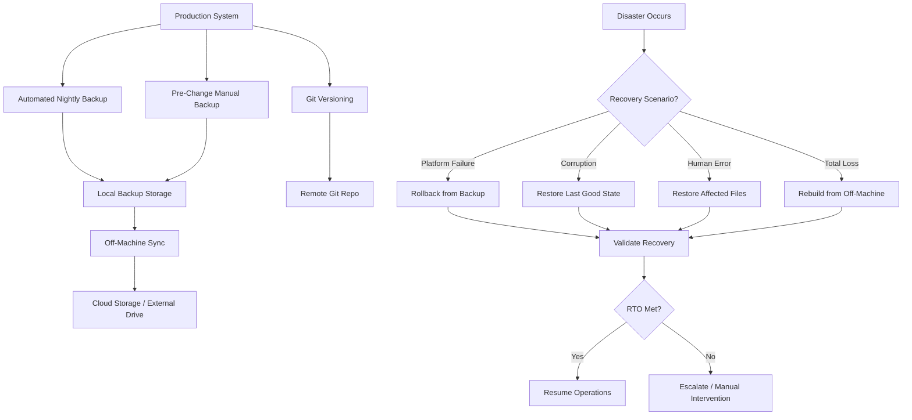

# Business Continuity & Disaster Recovery for Agent Systems

> **One-line intent:** Ensure agent-dependent operations can resume within acceptable timeframes when platform failures, data corruption, or human error cause production outages.

> **⚠️ STATUS: IN PROGRESS** — This pattern documents the framework but lacks real-world disaster recovery validation. We're seeking practitioner contributions: if you've executed a full system restore, recovered from database corruption, or rebuilt after catastrophic failure, please share your experience.

## Pattern in 60 Seconds

**The problem:** When your AI agent system goes down (platform failure, data corruption, accidental deletion), how fast can you recover? What data do you lose?

**The insight:** Prevention is great (System Hygiene). Detection is critical (REM Cycle). But when both fail, recovery speed depends on backups, versioning, and documented procedures you've actually tested.

**The key structure:**
- **Backup strategy:** What to backup, how often, where to store, how long to keep
- **Versioning strategy:** Config snapshots, database versions, dependency pinning
- **Recovery scenarios:** Platform failure, corruption, human error, total loss
- **RTO/RPO:** How fast must you recover? How much data loss is acceptable?
- **Testing:** Quarterly restore drills, validate backups work

**What broke when we got this wrong:** *(Seeking practitioner input — we haven't had a disaster yet, but when we do, this section will be brutally honest.)*

---

## Classification

| Property | Value |
|----------|-------|
| **Category** | Production Readiness |
| **Difficulty** | Advanced |
| **Also Known As** | Backup & Recovery, System Resilience, Operational Continuity |
| **Status** | ⚠️ **IN PROGRESS** — Framework defined, seeking real-world validation |

---

## Motivation

You've built an AI agent system that runs your business. Eleven agents handle email, CRM, calendar, partnerships, events, finance. It works. You trust it.

Then your Mac Mini won't boot. Or the database file is corrupted. Or you accidentally run `rm -rf workspace/` instead of `rm -rf workspace/temp/`. Or an OpenClaw upgrade bricks the system and rollback fails.

**The questions you face:**
- How fast can I get email processing back online?
- What data did I lose?
- Where are my backups?
- Are they encrypted? Can I decrypt them?
- Have I ever tested restoring from backup?
- Can I rebuild on a different machine?
- What dependencies are pinned? What versions were working?

**If you don't have answers, you're inventing disaster recovery while the disaster is happening.**

This pattern exists to force those questions before the crisis. We've documented the framework based on industry best practices and our own architecture, but we haven't lived through a disaster yet. **That's why we need your input.**

---

## Applicability

Use this pattern when:
- AI agents run production workloads (business-critical, customer-facing, revenue-dependent)
- Downtime has real costs (lost productivity, missed opportunities, revenue impact)
- Data loss is unacceptable or has compliance/regulatory implications
- System state is complex (databases, config files, memory, dependencies)
- Recovery requires multiple components working together

Do NOT use this pattern when:
- Experimental/hobby projects where starting over is acceptable
- Agent state is fully ephemeral (no persistent data, stateless operations)
- Upstream systems are source of truth (agent is cache-only, rebuilds automatically)
- Cost of backup infrastructure exceeds cost of rebuilding

---

## Structure



**Principle:** Multiple backup targets (local, off-machine). Multiple recovery paths (component restore, full rebuild). Tested procedures (quarterly drills).

---

## Participants

| Participant | Role | Example |
|------------|------|---------|
| **Backup Script** | Automated nightly snapshots | Cron job copying databases, config, memory files |
| **Version Control** | Config file history and rollback | Git repo for workspace files |
| **Local Backup Storage** | Fast recovery from recent failures | `/backups/` directory on same machine |
| **Off-Machine Storage** | Protection against hardware failure | Cloud storage (S3, Dropbox), external drive |
| **Recovery Runbook** | Step-by-step restoration procedures | Documented commands for each scenario |
| **Test Environment** | Validate backups without touching production | Separate machine or VM for restore drills |

---

## How It Works

### Backup Strategy

**What to backup:**

| Component | Backup Frequency | Location | Retention |
|-----------|-----------------|----------|-----------|
| **Config files** | Git commit after every change | Remote git repo | Unlimited (version history) |
| **Databases (CRM, Finance)** | Nightly (automated) | Local + off-machine | 7 daily, 4 weekly, 12 monthly |
| **Memory files (MEMORY.md, daily notes)** | Nightly (automated) | Local + off-machine | 30 daily, 12 monthly |
| **Workspace state** | Pre-upgrade, pre-major-change | Local snapshot | 7 snapshots |
| **Dependencies (package versions)** | Lock file in git | Remote git repo | Unlimited (version history) |

**Backup script (example):**

```bash
#!/bin/bash
# nightly-backup.sh — Run at midnight via cron

DATE=$(date +%Y%m%d)
BACKUP_DIR="/Users/seanerikson/.openclaw/backups"
WORKSPACE="/Users/seanerikson/.openclaw/workspace"

# Create dated backup directory
mkdir -p "$BACKUP_DIR/$DATE"

# Backup databases
cp workspace-dex/crm.db "$BACKUP_DIR/$DATE/crm.db"
cp workspace-ledger/finance.db "$BACKUP_DIR/$DATE/finance.db"

# Backup memory files
cp -r "$WORKSPACE/memory" "$BACKUP_DIR/$DATE/memory"
cp "$WORKSPACE/MEMORY.md" "$BACKUP_DIR/$DATE/MEMORY.md"

# Backup config
cp -r ~/.openclaw/config "$BACKUP_DIR/$DATE/config"

# Compress
tar -czf "$BACKUP_DIR/backup-$DATE.tar.gz" "$BACKUP_DIR/$DATE"
rm -rf "$BACKUP_DIR/$DATE"

# Cleanup old backups (keep 7 daily)
ls -t "$BACKUP_DIR"/backup-*.tar.gz | tail -n +8 | xargs rm -f

# Sync to off-machine storage
rclone copy "$BACKUP_DIR/backup-$DATE.tar.gz" remote:openclaw-backups/
# or: cp "$BACKUP_DIR/backup-$DATE.tar.gz" /Volumes/ExternalDrive/openclaw-backups/

echo "Backup complete: $DATE"
```

**Encryption (critical):**
- Databases already encrypted (SQLCipher)
- Memory files contain PII, strategic context → encrypt backups
- Use GPG or encrypted cloud storage (Dropbox with encryption, S3 with KMS)

### Versioning Strategy

**Config versioning:**
```bash
# After every config change
cd ~/.openclaw/workspace
git add .
git commit -m "Add speaker QA quality gate"
git push origin main

# Snapshot before risky changes
cp -r ~/.openclaw/config ~/.openclaw/config.snapshot-$(date +%Y%m%d-%H%M)
```

**Database versioning:**
- SQLCipher databases don't version internally
- Snapshot = timestamped file copy
- Schema changes: document in migration script, track version number

**Dependency pinning:**
```json
// package.json or equivalent
{
  "dependencies": {
    "openclaw": "2026.4.2",  // Pin exact version
    "gog": "^1.2.3"
  }
}
```

**Lock last known good:**
```bash
# Document working versions
echo "OpenClaw: 2026.4.2" > ~/.openclaw/workspace/VERSIONS.txt
echo "Node: v25.6.1" >> ~/.openclaw/workspace/VERSIONS.txt
echo "macOS: 25.3.0 (Darwin)" >> ~/.openclaw/workspace/VERSIONS.txt
git add VERSIONS.txt && git commit -m "Lock working platform versions"
```

### Recovery Scenarios

#### Scenario 1: Platform Upgrade Breaks Production

**Failure:** OpenClaw 2026.4.3 upgrade breaks Gmail API.

**Recovery (covered by System Hygiene pattern):**
1. Rollback platform: `npm install -g openclaw@2026.4.2`
2. Restore config backup: `cp -r config.backup-YYYYMMDD config/`
3. Restart gateway: `openclaw gateway restart`
4. Validate: Run regression suite
5. **RTO:** <15 minutes

#### Scenario 2: Database Corruption

**Failure:** Unclean shutdown corrupts CRM database. Agent can't read contacts.

**Recovery:**
1. Stop gateway: `openclaw gateway stop`
2. Identify last good backup: `ls -lt backups/ | head -5`
3. Restore database:
   ```bash
   cp backups/backup-20260405.tar.gz /tmp/
   tar -xzf /tmp/backup-20260405.tar.gz -C /tmp/
   cp /tmp/backup-20260405/crm.db workspace-dex/crm.db
   ```
4. Verify integrity:
   ```bash
   bash scripts/crm-query.sh main "PRAGMA integrity_check;"
   # Should return: ok
   ```
5. Restart gateway: `openclaw gateway start`
6. **Data loss:** Contacts/attendance added since last backup (up to 24 hours)
7. **RTO:** <30 minutes

**Mitigation for data loss:**
- Check email for unprocessed contact updates since backup
- Manually re-import if critical

#### Scenario 3: Accidental File Deletion

**Failure:** Accidentally deleted `MEMORY.md`.

**Recovery:**
```bash
# Option 1: Restore from git
cd ~/.openclaw/workspace
git checkout HEAD -- MEMORY.md

# Option 2: Restore from backup
tar -xzf backups/backup-20260406.tar.gz -C /tmp/
cp /tmp/backup-20260406/MEMORY.md workspace/MEMORY.md
```

**RTO:** <5 minutes  
**Data loss:** Edits made since last git commit or backup

#### Scenario 4: Total System Loss (Hardware Failure)

**Failure:** Mac Mini won't boot. Disk is dead.

**Recovery (on new machine):**
1. Install OS, Node, OpenClaw
   ```bash
   # macOS
   /bin/bash -c "$(curl -fsSL https://raw.githubusercontent.com/Homebrew/install/HEAD/install.sh)"
   brew install node
   npm install -g openclaw
   ```
2. Restore config from git:
   ```bash
   git clone https://github.com/[you]/openclaw-workspace.git ~/.openclaw/workspace
   ```
3. Restore databases from off-machine backup:
   ```bash
   # Download from cloud storage
   rclone copy remote:openclaw-backups/backup-20260406.tar.gz /tmp/
   tar -xzf /tmp/backup-20260406.tar.gz -C /tmp/
   cp /tmp/backup-20260406/crm.db ~/.openclaw/workspace-dex/crm.db
   cp /tmp/backup-20260406/finance.db ~/.openclaw/workspace-ledger/finance.db
   ```
4. Restore OAuth tokens (stored in keychain or credentials file)
5. Start gateway: `openclaw gateway start`
6. Run full regression suite
7. **RTO:** 2-4 hours (depends on download speed, OAuth re-auth)

---

## Consequences

### Benefits
- **Defined RTO/RPO** — Team knows how fast recovery should be, what data loss is acceptable
- **Multiple recovery paths** — Component restore for minor issues, full rebuild for catastrophic failure
- **Tested procedures** — Quarterly drills mean you're not learning recovery during disaster
- **Off-machine protection** — Hardware failure doesn't mean data loss
- **Version control** — Config mistakes are reversible

### Liabilities
- **Storage costs** — Off-machine backups (cloud storage, external drives) cost money
- **Backup complexity** — Encrypted backups require key management
- **False confidence** — Backups that haven't been tested might not restore
- **Maintenance overhead** — Retention policies, cleanup scripts, monitoring backup health

### What Broke in Practice

**⚠️ SEEKING PRACTITIONER INPUT**

We haven't experienced a disaster yet. This pattern documents the framework we've built based on:
- Industry best practices (RTO/RPO from enterprise DR planning)
- Our architecture (SQLCipher databases, file-based memory, git-versioned config)
- Preventive measures already in place (REM Cycle nightly backups, git commits)

**What we need from you:**
- **Database corruption:** How did you detect it? What recovery path worked? What didn't?
- **Total system loss:** How long did full rebuild take? What was hardest to restore?
- **Backup failures:** When did you discover your backups were broken? How?
- **Human error:** Accidental deletions, wrong commands—what saved you?
- **RTO/RPO reality check:** Are our targets realistic? Too aggressive? Too conservative?

**If you've lived through agent system disaster recovery, please contribute your story.**

---

## Implementation Notes

### Variations

**Minimal (Solo Practitioner):**
- Git for config (free, automatic versioning)
- Nightly backup script to external drive
- Manual restore from backup when needed
- No formal RTO/RPO, "best effort" recovery

**Standard (Small Team):**
- Automated nightly backups (local + cloud)
- Git for all config and memory files
- Documented recovery runbook
- Quarterly restore drill
- RTO: <1 hour, RPO: <24 hours

**Enterprise (Mission-Critical):**
- Continuous replication to standby system
- Database transaction logs for point-in-time recovery
- Automated failover (< 5 min RTO)
- Daily restore validation (automated testing)
- RTO: <15 min, RPO: <1 hour

### Common Pitfalls

**Backups without restore tests:**
- You don't have backups until you've successfully restored from them
- Quarterly drill catches broken backup scripts months before disaster

**Single backup location:**
- Backup on same machine = hardware failure destroys backups too
- Off-machine sync is not optional

**No retention policy:**
- Unlimited backups fill disk
- Old backups with schema incompatibility cause restore failures
- Balance retention vs storage cost

**Forgetting credentials:**
- Database encryption keys in keychain
- OAuth tokens not backed up
- Recovery blocked by missing credentials

**No RTO/RPO definition:**
- "Recover as fast as possible" means panic during disaster
- Define acceptable thresholds before the crisis

### Platform-Specific Notes

**OpenClaw:**
- Config in `~/.openclaw/config/` — backup entire directory
- Agent workspaces in `~/.openclaw/workspace-*/` — backup per-agent databases
- OAuth tokens may be in keychain (macOS) or credential files — backup mechanism varies

**SQLCipher Databases:**
- Encrypted at rest, can't inspect without passphrase
- Backup = file copy, but useless without encryption key
- Store key in macOS Keychain or password manager, backup key separately

**Git for Workspace Files:**
- Large binary files (images, PDFs) bloat git history
- Use `.gitignore` for transient data
- Consider Git LFS for large assets

---

## Security Implications

### Attack Surface
- Backups contain all sensitive data (emails, contacts, financials, memory)
- Unencrypted backups on cloud storage = data breach waiting to happen
- Backup credentials (S3 keys, Dropbox tokens) = high-value targets

### Data Sensitivity
- CRM: PII, business contacts, engagement data
- Finance: invoices, contracts, payment information
- Memory: strategic context, private conversations, family details
- **All backups must be encrypted at rest**

### Failure Modes
- Backup encryption key lost → backups unrecoverable
- Backup restored to wrong environment → sensitive data exposed
- Backup credentials compromised → attacker can exfiltrate all data

### Mitigations
- **Encrypt backups:** GPG, cloud provider encryption (S3 KMS, Dropbox encryption)
- **Separate key storage:** Encryption keys in password manager, not with backups
- **Access logging:** Monitor who accessed backups, when, from where
- **Test decryption:** Quarterly drill includes decrypt step
- **Least privilege:** Backup restore credentials separate from backup write credentials

---

## Known Uses

| Organization | Context | Scale |
|-------------|---------|-------|
| Cloud Nirvana AIOS | Framework defined, nightly backups running, quarterly drill not yet executed | Awaiting first disaster or drill validation |
| **⚠️ SEEKING CONTRIBUTIONS** | Have you recovered from agent system failure? Share your experience. | |

---

## Related Patterns

| Pattern | Relationship |
|---------|-------------|
| System Hygiene for Agentic Systems | Prevention (avoid disasters) vs Recovery (survive disasters) |
| REM Cycle (Nightly Maintenance) | Detection (catch issues early) + Backup automation |
| Files Over Databases | Simpler recovery (files = copy/restore vs DB migration complexity) |
| Context Lifecycle Management | Memory checkpoints are backup targets |

---

## Contributing Your Experience

**Have you recovered from:**
- Database corruption?
- Platform upgrade that couldn't be rolled back?
- Hardware failure requiring full rebuild?
- Accidental data deletion?
- Security breach requiring clean restore?

**We want to know:**
- What was the failure mode?
- What recovery path did you take?
- How long did it take? (actual RTO)
- What data did you lose? (actual RPO)
- What worked? What didn't?
- What would you do differently?

**How to contribute:**
- Open an issue on GitHub with your story
- Submit a PR adding your experience to "What Broke in Practice"
- Email sean@cloudnirvana.org with details

Your war stories make this pattern real.

---

## Metadata

| Property | Value |
|----------|-------|
| **Contributor** | Sean Erikson, CEO, Cloud Nirvana |
| **Production Environment** | OpenClaw + Mac Mini, 11 agents, SQLCipher databases |
| **First Published** | 2026-04-06 (draft, framework only) |
| **Last Updated** | 2026-04-06 |
| **Status** | ⚠️ **IN PROGRESS** — Seeking practitioner validation |
| **License** | CC BY 4.0 |

---

## Revision History

| Date | Change | Author |
|------|--------|--------|
| 2026-04-06 | Initial framework draft, marked as in-progress, seeking practitioner input | Sean Erikson / Lou |
