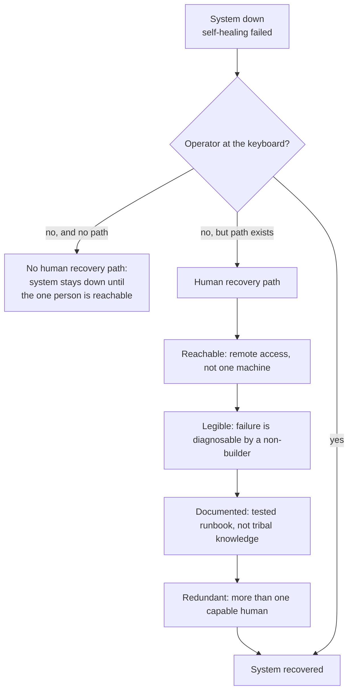

# Human Recovery Path

> **One-line intent:** An autonomous system needs a recovery path that a capable human can execute when the operator is not at the keyboard, and that path has to be real infrastructure, not the luck of the right person happening to be reachable.

## Pattern in 60 Seconds

_The entire pattern distilled into something anyone can read in under a minute. No jargon, no code. A CEO, an engineer, and an entrepreneur should all understand this section._

**The problem:** Your autonomous system goes down. You're not at your desk. Recovery requires knowledge and access that live in one person's head. If that person is unreachable, the system stays down.

**The insight:** Resilience isn't only about the system staying up. It's about whether a capable human can bring it back when it goes down, from wherever they are, with a path that's documented and tested rather than improvised.

**The key structure:**
- **Reachable access:** the recovery path works remotely, not only from the one machine in the basement
- **Legible failure:** the failure state is diagnosable by someone who isn't the person who built it
- **Documented steps:** a tested runbook, not tribal knowledge
- **No single point of human failure:** more than one person can execute it

**What broke when we got this wrong:** Forty-five minutes before a live demo, a bad config crashed the gateway. Eleven agents offline. The operator was in a parking lot. Recovery happened only because his daughter was home, understood the system, and could fix a malformed JSON file over the phone. That's not infrastructure. That's luck and family.

---

## Classification

| Property | Value |
|----------|-------|
| **Category** | Production Readiness |
| **Difficulty** | Intermediate |
| **Also Known As** | Off-Keyboard Recovery, The Someone-Else-Can-Fix-It Test, Human Failover |

---

## Motivation

Autonomous systems fail. That's not the interesting part. The interesting part is what recovery depends on when they do.

Most resilience thinking focuses on the system: redundancy, health checks, self-healing, backups. All necessary. But there's a failure mode underneath all of it that infrastructure alone doesn't cover: the moment when the system is down, self-healing didn't work, and the person who understands the system is not at the keyboard. In that moment, recovery depends entirely on whether a *human* recovery path exists, one that's reachable, legible, and executable by someone other than the builder.

At Cloud Nirvana this became concrete forty-five minutes before a live demo at Rev1 Ventures. A last-minute fix to the agent-onboarding module wrote a malformed config directly to the framework's JSON file. The gateway rejected it on startup and went down. Eleven agents offline. The operator was standing in the parking lot with no laptop and minutes on the clock.

The recovery worked. But look at *why* it worked. The operator's nineteen-year-old daughter was home. She understood the system well enough to SSH into the machine, find the malformed JSON, and correct it, over the phone, from a verbal walkthrough. The gateway came back up. The demo happened. The audience never knew.

Now change one variable. If she hadn't been home, the demo doesn't happen. The recovery didn't rest on infrastructure. It rested on a capable person being reachable, understanding the system, and having access, none of which was designed. It was luck and family.

That's the pattern, and it's uncomfortable precisely because the happy ending hides the gap. A system that can only be recovered by one person, from one location, with undocumented steps, is one bad afternoon away from staying down. The pattern is the discipline of making the human recovery path real: reachable remotely, diagnosable by more than one person, documented in a tested runbook, so that recovery is a procedure rather than a coincidence.

---

## Applicability

Use this pattern when:
- You run an autonomous or always-on system whose downtime has real cost (a live demo, production operations, customer-facing work)
- Recovery currently depends on one person's knowledge, access, or presence
- The system can enter states that self-healing won't resolve
- "It'll be fine, I can fix it" is your actual recovery plan

Do NOT over-invest in this pattern when:
- The system's downtime is genuinely inconsequential (a hobby project that can wait)
- Full automated failover already exists and is tested (then the human path is a backstop, not the primary plan)
- The cost of building and drilling the recovery path exceeds the cost of the outages it prevents

---

## Structure



_When self-healing fails and the operator is away, the only thing between "down" and "recovered" is whether a real human recovery path exists. Reachable, legible, documented, and executable by more than one person turns recovery from luck into procedure._

---

## Participants

| Participant | Role | Example |
|------------|------|---------|
| The system | The autonomous system that has failed in a way self-healing can't resolve | The AIOS gateway, down from a malformed config |
| The operator | The person who normally recovers it, and who in this scenario is unavailable | Sean, in a parking lot with no laptop |
| The capable recoverer | Any human who can execute the recovery path without being the builder | Emma, fixing the JSON over the phone |
| The recovery path | The reachable access, legible failure state, and documented steps that make recovery possible | SSH access, a known-good config, a tested runbook (the last of which did not exist) |

---

## How It Works

1. **Assume the operator is away when it breaks.** Design the recovery path for the case where the person who understands the system best is unreachable, because that's when you'll need it.
2. **Make access reachable, not local.** Recovery must be executable remotely. A system you can only fix from the one machine it runs on has no recovery path when you're not there.
3. **Make the failure legible.** A capable person who didn't build the system should be able to diagnose the common failure states. Cryptic failures are recoverable only by the author.
4. **Write and test the runbook.** Document the actual steps for the likely failures, and run a drill. An untested runbook is a hypothesis, not a recovery path.
5. **Remove the single point of human failure.** More than one person should be able to execute the recovery. If recovery lives in exactly one head, you have a bus-factor of one on your uptime.

### Code / Configuration Example

```text
# The deliverable is a tested runbook, not code. Example shape:

RECOVERY-RUNBOOK.md
  Failure: gateway down after bad config
    Access:   ssh <host>   (works from any network, key distributed to 2+ people)
    Diagnose: journal shows JSON parse error on openclaw.json
    Fix:      restore openclaw.json from last known-good (path: ...)
              restart gateway: <command>
    Verify:   all agents reconnect within 60s; check <dashboard>
    Drilled:  [ ] last drill date: __________   <-- if blank, this is a hypothesis
```

_The single most important line is the last one. If "last drill date" is blank, you don't have a recovery path, you have a document you hope is correct._

---

## Consequences

### Benefits
- **Turns recovery from luck into procedure.** The outcome no longer depends on the right person happening to be reachable.
- **Reduces bus-factor on uptime.** More than one person can bring the system back.
- **Surfaces hidden fragility.** Writing the runbook forces you to find the failures that are only recoverable by the builder.

### Liabilities
- **It's work that only pays off during rare events.** Easy to deprioritize until the afternoon it would have saved you.
- **A runbook rots.** Systems change; an untested, out-of-date runbook can be worse than none, because it's trusted.
- **Access distribution is a security tradeoff.** Making recovery reachable by more than one person widens the access surface; scope it deliberately.

### What Broke in Practice
_This section is mandatory. No pattern is accepted without honest failure modes._

- **Rev1 Ventures, June 16, 2026.** A last-minute fix wrote malformed JSON to the framework config 45 minutes before a live demo. The gateway went down, eleven agents offline, the operator in a parking lot with no laptop. Recovery happened only because the operator's daughter was home, understood the system, and could fix the JSON over the phone. Change that one variable, she isn't home, and the demo doesn't happen.
- **The recovery path didn't exist as infrastructure.** It worked by coincidence: the right person, reachable, with access and understanding, none of it designed. The `business-continuity-disaster-recovery` framework doc had been written in April 2026 marked "awaiting first disaster or drill validation." Rev1 was the disaster it anticipated, and the drill still hadn't been run.
- **The gap bites at all scales, not just catastrophes.** A separate lock-file incident (BUG-012, September 2026) required the operator to manually delete a lock file from the terminal, a small intervention, but the same shape: recovery depended on a person knowing the specific fix and having terminal access.

### Honest current state (2026-09)
There is still no real recovery-path infrastructure. Nightly database backups run and git versioning runs, but the quarterly restore drill has never been executed, no off-machine sync is confirmed running, and no step-by-step recovery runbook has been tested. Today, recovery is still "a capable human happened to be reachable." The Rev1 recovery worked because Emma was home. That's not infrastructure, that's luck and family, and if she hadn't been home, the operator doesn't go on stage.

---

## Implementation Notes

### Variations
- **Backstop vs. primary.** If you have tested automated failover, the human recovery path is a backstop for the cases automation misses. If you don't, it *is* your recovery plan, treat it accordingly.
- **Tiered recoverers.** A first tier who can execute the common runbooks, and a second tier (the builder) for novel failures. The goal is that common failures never require the builder.

### Common Pitfalls
- **Confusing backups with recovery.** Backups you've never restored from are an assumption. The restore drill is the pattern; the backup is just a prerequisite.
- **The happy ending hiding the gap.** A recovery that worked by luck feels like proof the system is resilient. It's the opposite, it's a near-miss that should trigger building the real path.
- **Bus-factor of one.** If exactly one person can recover the system, you haven't reduced risk, you've named it.

---

## Security Implications

### Attack Surface
- Distributing recovery access to more than one person widens who can reach the system. Scope credentials to recovery actions, rotate them, and audit their use.

### Data Sensitivity
- Recovery procedures often touch config, credentials, and data stores. The runbook itself can leak sensitive paths and access details; treat it as a sensitive document.

### Failure Modes
- Recovery access concentrated in one person (unavailable when needed) or distributed too widely (security exposure).
- Untested runbook that's wrong when it's finally needed.
- Recovery path that only works from one physical machine or network.

### Mitigations
- Distribute recovery access to a small, audited set of capable people, scoped to recovery.
- Drill the runbook on a schedule; a blank "last drilled" date is a red flag, not a formality.
- Ensure remote reachability so recovery doesn't depend on physical presence.

---

## Known Uses

| Organization | Context | Scale |
|-------------|---------|-------|
| Cloud Nirvana | Gateway recovery before the Rev1 demo executed by a family member over the phone; recovery path not yet built as tested infrastructure | Team |

---

## Related Patterns

| Pattern | Relationship |
|---------|-------------|
| Business Continuity & Disaster Recovery | The infrastructure framework this pattern's human path complements; that pattern's untested-restore gap is exactly the risk this one names |
| REM Cycle: Nightly Maintenance | Automated self-healing that handles what it can; Human Recovery Path is for what it can't |
| Operator Discipline | Companion human-side pattern: both name the human as part of the system's control surface, not outside it |
| Threshold-Gated Observability | Detects the failure that triggers the recovery path; observability without a recovery path just tells you you're down |

---

## Metadata

| Property | Value |
|----------|-------|
| **Contributor** | Sean Erikson & Lou, Cloud Nirvana |
| **Production Environment** | Cloud Nirvana AIOS, macOS, OpenClaw, small team |
| **First Published** | 2026-09-12 |
| **Last Updated** | 2026-09-12 |
| **Cloud Nirvana Event** | Q3 2026 — Transformation at Scale |
| **License** | CC BY 4.0 |
| **Status** | In-progress (the failure mode is proven; the recovery infrastructure is not yet built or drilled) |

---

## Revision History

| Date | Change | Author |
|------|--------|--------|
| 2026-09-12 | Initial pattern from the Rev1 incident (June 16, 2026) and the BUG-012 lock-file near-miss; honest note that no tested recovery infrastructure exists yet | Lou / Sean Erikson |
