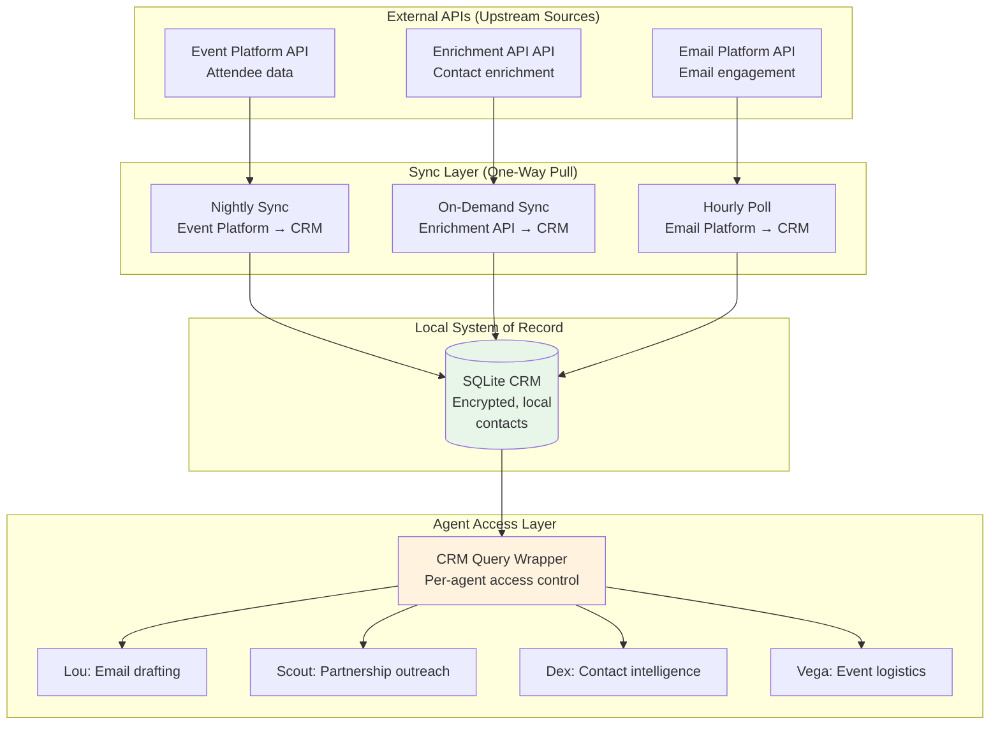

# Local-First Data Architecture

> **One-line intent:** Pre-sync external data to local storage so your agents don't fail when the network does.

## Pattern in 60 Seconds

**The problem:** Your agent needs contact data to draft an email. It calls an API. The API is rate-limited. The draft fails. The user waits. Repeat 10 times a day.

**The insight:** Most agent work doesn't need real-time data. Pre-sync external APIs to local storage. Agents query locally. Fast, reliable, offline-capable.

**The tradeoff:** Data is slightly stale (sync every 24h) but agents never block on network failures.

**What broke when we got this wrong:** Live demo at a conference. Venue WiFi flaked. Agent couldn't fetch attendee list from Event Platform. "Let me look that up..." → 30-second spinner → failure. Audience saw the system break in real time.

**What survived:** Local SQLite CRM with contacts pre-synced the night before. Demo pivoted to querying local data. Instant results. No network dependency. The demo recovered.

---

## Classification

| Property | Value |
|----------|-------|
| **Category** | Production Readiness |
| **Difficulty** | Intermediate |
| **Also Known As** | Offline-First, API-Independent Operations, Local System of Record |

---

## Motivation

Your multi-agent system processes email, manages partnerships, coordinates events. Every agent needs access to:
- Contact data (names, emails, companies, titles)
- Event attendance (who came to which events)
- Partner contracts (promo codes, tier levels)
- Historical interactions

**Option 1: Query APIs on demand**
```python
# Agent needs to draft an email
contact = enrichment_api.get_contact(email)  # 2-second API call
company = linkedin_api.get_company(domain)  # Rate limit hit, fails
# Draft blocked waiting for external API
```

**Problems:**
- API rate limits (typical enrichment APIs: 1-2s between calls, limited credits)
- Network failures (conference WiFi, ISP outages)
- Latency (every query waits for round-trip)
- Cost (pay per API call)
- Dependency hell (if Enrichment API is down, all agents block)

**Option 2: Cache in memory**
```python
# Store in session context or markdown files
contacts_cache = {...}  # Loses on restart
# No queryability (can't SQL: "show all contacts in Cincinnati")
```

**Problems:**
- Memory files aren't queryable (grep is not SQL)
- No persistence across sessions
- No relationships (can't join contacts → companies → events)
- Agents can't share cached data

**Option 3: Local-first architecture** (this pattern)
```python
# Nightly sync: Event Platform → local CRM, Enrichment API → local CRM
# Agents query local SQLite database
conn = get_crm_connection()
cursor.execute("SELECT name, title, company FROM contacts WHERE email = ?", [email])
# Instant. No network. No rate limits. Always available.
```

**When it works:**
- Data changes slowly (contacts, events, partnerships update daily, not second-by-second)
- Agents need fast, reliable access (email drafting, analytics, segmentation)
- Network failures are unacceptable (demos, live operations)
- API costs matter (Enrichment API charges per enrichment)

---

## Structure

### Architecture



### Data Flow

**Sync Direction:** One-way pull from external APIs into local CRM. Never push back.

**Why one-way:**
- Event Platform is the source of truth for attendee data (don't try to sync back)
- Enrichment API is read-only enrichment (no write API anyway)
- Email Platform tracks email engagement (we consume bounces/unsubs, don't push contacts back)

**Sync Frequency:**
- **Event Platform:** After each event (attendee list finalized)
- **Enrichment API:** On-demand when enriching a new contact (rate-limited, expensive)
- **Email Platform:** Daily poll for bounces, unsubscribes, engagement metrics

### Prerequisites: Multi-Source Identity Resolution

When you pre-sync data from multiple sources, the same person appears with different emails:

| Source | Email | Name | Company |
|--------|-------|------|---------|
| Event Platform (Event 1) | john@company1.com | John Smith | Company A |
| Event Platform (Event 2) | jsmith@company2.com | J. Smith | Company B |
| Enrichment API enrichment | john.smith@company2.com | John Smith | Company B LLC |

**Without identity resolution:** 3 separate contacts, engagement scores split, can't track the person across events.

**With identity resolution:**

**CRM Schema:**
```sql
CREATE TABLE contacts (
    email TEXT PRIMARY KEY,
    person_id TEXT,           -- Groups emails under one identity
    is_primary BOOLEAN,       -- Marks canonical email
    name TEXT,
    title TEXT,
    company_domain TEXT,
    seniority TEXT,
    created_at TEXT
);

-- person_id links emails
INSERT INTO contacts VALUES ('john@company1.com', 'person_001', FALSE, 'John Smith', ...);
INSERT INTO contacts VALUES ('jsmith@company2.com', 'person_001', FALSE, 'J. Smith', ...);
INSERT INTO contacts VALUES ('john.smith@company2.com', 'person_001', TRUE, 'John Smith', ...);
```

**Engagement query (correct):**
```sql
-- Count events attended by person_id, not email
SELECT person_id, COUNT(DISTINCT event_name) AS events_attended
FROM attendance
JOIN contacts ON attendance.email = contacts.email
GROUP BY person_id;
-- person_001: 12 events (not 6+4+2 split across 3 emails)
```

**Identity resolution process:**
1. Import data from source (Event Platform, Enrichment API)
2. Detect duplicates (fuzzy name match, same company domain)
3. Assign `person_id` (manual review or automated heuristics)
4. Mark `is_primary` email (most recent or most complete record)
5. Agents query by `person_id` for engagement, attendance, interactions

**What broke without this:**
- Super fan with 12 events appeared as 3 people with 4 events each
- Engagement tier wrong ("Active" instead of "Super Fan")
- Duplicate outreach (Scout emailed the same person at 2 different addresses)

**Tools:**
- Enrichment API enrichment helps (returns canonical email + company)
- Manual LinkedIn lookup for gaps
- CRM query: `SELECT email, name, company_domain FROM contacts WHERE name LIKE '%John Smith%'`

Identity resolution is a prerequisite for local-first architecture to work. Without it, your local CRM is full of duplicates and agents make bad decisions.

---

## Implementation

### Local Storage: SQLite with SQLCipher

**Why SQLite:**
- Single-file database (portable, backup-friendly)
- No server process (runs in-process)
- Supports SQL (queryable, relational)
- Fast for read-heavy workloads (agent queries)

**Why SQLCipher:**
- AES-256 encryption at rest
- Passphrase stored in macOS Keychain
- Encrypted backup to cloud (Dropbox, GitHub)
- No plaintext contact data on disk

**Setup:**
```bash
# Install SQLCipher
brew install sqlcipher

# Create encrypted CRM
sqlcipher crm.db
sqlite> PRAGMA key = 'passphrase-from-keychain';
sqlite> CREATE TABLE contacts (...);
```

**Python wrapper:**
```python
# scripts/crm_db.py
import subprocess
def get_crm_connection():
    passphrase = subprocess.check_output([
        'security', 'find-generic-password',
        '-a', os.getlogin(), '-s', 'crm-db-key', '-w'
    ]).decode().strip()
    
    conn = sqlite3.connect('crm.db')
    conn.execute(f"PRAGMA key = '{passphrase}'")
    return conn
```

### Sync Scripts

**Event Platform → CRM:**
```bash
# scripts/event_platform-import.sh <event_id>
EVENT_ID=$1
TOKEN="..."

# Fetch attendees with custom question answers (company data)
curl -H "Authorization: Bearer $TOKEN" \
  "https://www.event_platformapi.com/v3/events/$EVENT_ID/attendees/?expand=answers" | \
  python3 << 'PYEND'
import json, sys
from crm_db import get_crm_connection

data = json.load(sys.stdin)
conn = get_crm_connection()
cursor = conn.cursor()

for attendee in data['attendees']:
    email = attendee['profile']['email']
    name = attendee['profile']['name']
    
    # Extract company from custom question answers
    company = None
    for answer in attendee.get('answers', []):
        if answer['question'] == 'Company / Organization':
            company = answer.get('answer')
    
    cursor.execute("""
        INSERT OR REPLACE INTO contacts (email, name, company_domain, source)
        VALUES (?, ?, ?, 'event_platform')
    """, [email, name, company])

conn.commit()
PYEND
```

**Enrichment API enrichment (on-demand):**
```bash
# scripts/enrich-contact.sh <email>
EMAIL=$1
TOKEN="..."

# Rate limit: 2s between calls
curl -X POST https://api.enrichment.example/lookup \
  -H "Authorization: Bearer $TOKEN" \
  -d "email=$EMAIL" | \
  python3 << 'PYEND'
import json, sys
from crm_db import get_crm_connection

data = json.load(sys.stdin)
if 'person' in data:
    p = data['person']
    conn = get_crm_connection()
    cursor = conn.cursor()
    cursor.execute("""
        UPDATE contacts SET
          title = ?,
          company_domain = ?,
          seniority = ?
        WHERE email = ?
    """, [p['title'], p['organization']['domain'], p['seniority'], p['email']])
    conn.commit()
PYEND
```

**Email Platform bounce/unsub poll (daily):**
```bash
# scripts/email_platform-poll-bounces.sh
TOKEN="..."

curl -H "api-key: $TOKEN" \
  "https://api.email_platform.com/v3/contacts?limit=1000" | \
  python3 << 'PYEND'
import json, sys
from crm_db import get_crm_connection

data = json.load(sys.stdin)
conn = get_crm_connection()
cursor = conn.cursor()

for contact in data['contacts']:
    if contact.get('emailBlacklisted'):
        cursor.execute("""
            UPDATE contacts SET email_status = 'bounced' WHERE email = ?
        """, [contact['email']])

conn.commit()
PYEND
```

### Agent Access Wrapper

**Per-agent access control:**
```bash
# scripts/crm-query.sh <agent_id> <sql_query>
AGENT_ID=$1
QUERY=$2

python3 << PYEND
import sys
from crm_db import get_crm_connection

agent_id = "$AGENT_ID"
query = "$QUERY"

# Enforce table-level access (Per-Agent Data Access Control pattern)
allowed_tables = {
    'lou': ['contacts', 'companies', 'attendance', 'partner_contracts'],
    'scout': ['contacts', 'companies', 'partner_contracts'],
    'dex': ['contacts', 'companies', 'attendance'],
    'vega': ['contacts', 'attendance', 'events']
}

if agent_id not in allowed_tables:
    print(f"Error: {agent_id} not authorized for CRM access", file=sys.stderr)
    sys.exit(1)

# TODO: Parse query and verify table access
# For now: trust agent to stay within bounds (enforced via prompt)

conn = get_crm_connection()
cursor = conn.cursor()
cursor.execute(query)
for row in cursor.fetchall():
    print('\t'.join(map(str, row)))
PYEND
```

**Agent usage:**
```bash
# Lou drafting an email, needs contact title
bash scripts/crm-query.sh lou "SELECT title, company_domain FROM contacts WHERE email = 'contact@example.com'"
```

---

## What Broke in Practice

**Live demo failure (March 2026):**

Presenting Multi-agent system at a conference. Planned to show Lou pulling attendee data and generating a team breakdown on the fly.

**What happened:**
- Venue WiFi flaked (intermittent connectivity)
- Agent called `gog event_platform attendees <event_id>`
- Event Platform API timed out (30-second spinner)
- Retried → timed out again
- Audience watched the system fail in real-time

**Root cause:** Relying on live API calls during a demo with unreliable network.

**Immediate fix:** Pivoted to querying local CRM (pre-synced the night before). Instant results. Demo recovered.

**Long-term fix:** All demos now use local-first architecture. CRM pre-synced 24h before any presentation. API calls only for live updates (optional, not required).

**Enrichment API rate limit hell (February 2026):**

Enriching contacts from Event Platform imports. Enrichment API API requires 2-second delay between calls.

**Math:**
- contacts × 2 seconds = 5,134 seconds = 85 minutes
- Hit rate limit anyway (403 Forbidden after ~1,200 calls)
- Remaining contacts unenriched
- Agents drafting emails without title/company data

**Fix:** Batch enrichment overnight. Store results in local CRM. Agents query locally (instant, no rate limits).

**Enrichment API credits waste (March 2026):**

Burned ~500 Enrichment API credits enriching contacts who never attended an event (imported from old email lists).

**Root cause:** Enriching everyone before checking engagement. Should have filtered to attendees first.

**Fix:** Only enrich contacts with `attendance.event_count > 0`. Save credits for people who actually engage.

---

## Consequences

### Benefits

**Reliability:**
- Agents never block on network failures
- Demos work offline
- No dependency on external API uptime

**Performance:**
- Local SQLite queries: <1ms
- API calls: 500ms - 2000ms
- 100x - 2000x faster

**Cost:**
- Enrichment API enrichment: per-contact pricing (limited credits)
- Local CRM: $0 per query
- Savings: thousands of dollars for high-volume operations

**Queryability:**
- SQL joins across contacts → companies → events → attendance
- Complex analytics (engagement scoring, segmentation)
- Agents can ask: "Show me all Director+ contacts in Cincinnati who attended 2+ events"

### Drawbacks

**Data staleness:**
- CRM data is 0-24 hours stale (depending on sync frequency)
- Not suitable for real-time data (stock prices, live metrics)
- Agents can give outdated info if contact changed jobs yesterday

**Sync complexity:**
- Need scripts to pull data from each API
- Identity resolution required (same person, multiple emails)
- Sync failures need monitoring (cron + alerting)

**Storage:**
- SQLite file grows (contacts = ~5 MB encrypted)
- Backup/versioning needed (Git LFS, Dropbox)

---

## Known Uses

**Multi-agent system (production):**
- CRM: contacts, attendance records, events
- Synced from: Event Platform (attendance), Enrichment API (enrichment), Email Platform (engagement)
- Encrypted with SQLCipher, passphrase in macOS Keychain
- multiple agents query via wrapper scripts (per-agent access control)
- Used daily for email drafting, partnership outreach, event logistics

**What we sync:**
- Event Platform attendee lists (after each event)
- Enrichment API enrichment (on-demand, rate-limited)
- Email Platform bounces/unsubs (daily poll)
- Partner contracts (manual entry, version-controlled)

**What we DON'T sync:**
- Google Calendar (Sean's work calendar not accessible)
- Gmail (too large, privacy-sensitive, use API on-demand)
- Finance data (separate encrypted database, Ledger-only access)

---

## Related Patterns

**Per-Agent Data Access Control:**
Local CRM enables multi-agent access, but you need wrappers to enforce who can query what. See that pattern for authorization layer.

**Memory vs Persistence Boundary:**
Use this pattern to decide when data belongs in a database (local CRM) versus markdown files (memory). Contact data is queryable, relational, multi-agent → database.

**Hybrid Memory Retrieval:**
Local CRM stores structured data (contacts, events). Memory files store narrative context (decisions, emotions). Agents query both.

---

## Implementation Notes

### When to Use This Pattern

**Good fit:**
- Data changes slowly (daily updates acceptable)
- Agents need fast, reliable access
- Network failures are unacceptable
- API costs or rate limits matter
- You need SQL queryability (joins, aggregations)

**Bad fit:**
- Data changes second-by-second (stock prices, live metrics)
- You need real-time accuracy (fraud detection, emergency response)
- Storage constraints (TB-scale datasets)
- Compliance forbids local storage (healthcare, finance regulations)

### Variations

**Hybrid: Local + API fallback**
```python
# Try local first, fall back to API if not found
contact = crm.get_contact(email)
if not contact:
    contact = enrichment_api.enrich(email)
    crm.save(contact)
return contact
```

**Read-through cache:**
```python
# Query API, cache result locally for future queries
@cache(ttl='24h', storage='sqlite')
def get_contact(email):
    return enrichment_api.get(email)
```

**Write-back sync:**
```python
# Local writes queue for eventual sync to upstream API
# (Rare for agent systems; most external APIs are read-only)
crm.update_contact(email, title='VP Engineering')
sync_queue.enqueue('email_platform.update_contact', email, title)
```

### Testing Strategy

**Demo rehearsal:**
1. Disconnect from internet
2. Run agent operations (email drafting, analytics)
3. Verify everything works offline
4. Reconnect, verify sync still works

**Sync monitoring:**
```bash
# Cron job: sync + verify row counts
bash scripts/event_platform-import.sh <event_id>
BEFORE=$(sqlite3 crm.db "SELECT COUNT(*) FROM attendance")
# ... sync ...
AFTER=$(sqlite3 crm.db "SELECT COUNT(*) FROM attendance")
if [ $AFTER -le $BEFORE ]; then
  echo "Sync failed: row count decreased" | mail -s "CRM Sync Alert" admin@example.com
fi
```

---

## Future Directions

**Vector embeddings for semantic search:**
Store contact bios, talk abstracts as embeddings in local CRM. Agents query: "Find speakers who talked about AI governance."

**Conflict resolution:**
If we ever enable write-back to upstream APIs (Email Platform contact updates), need merge strategy for conflicting writes.

**Multi-tenant:**
One CRM per organization. Agents scoped to tenant_id. Enables AIOS-as-a-service.

---

**Pattern status:** Fully implemented in Multi-agent system (February 2026). Survived production use (contacts, multiple agents, daily operations). Identity resolution prerequisite validated in practice.
