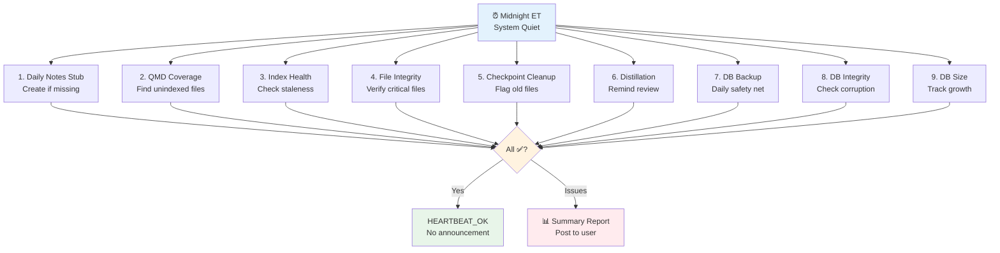

# REM Cycle: Nightly Maintenance for Agent Systems

> **One-line intent:** Automated nightly health checks strengthen memory architecture, prevent data loss, and catch problems early while the system is idle.

## Pattern in 60 Seconds

**The problem:** Your AI agent runs for weeks or months. Memory files accumulate. Databases grow. Indexes get stale. Session checkpoints pile up. One day you ask "what happened on March 25?" and discover the entire day's work is gone — no daily notes file, no memory of decisions, context lost forever. You had no idea there was a gap until it was too late.

**The insight:** Agent systems need self-monitoring maintenance like humans need REM sleep. Run automated health checks nightly when the system is quiet. Catch problems early (next morning vs weeks later). Prevent memory rot through proactive maintenance, not reactive firefighting.

**The REM Cycle (9 checks):**

| Check | What It Does | Prevents |
|-------|--------------|----------|
| **Daily notes stub** | Creates today's memory file if missing | Total context loss from forgotten sessions |
| **QMD coverage audit** | Finds unindexed directories/files | Blind spots in memory search |
| **Index health check** | Verifies search index updating | Stale search results from dead indexer |
| **File integrity** | Checks critical files exist, aren't corrupted | System failures from missing MEMORY.md or config |
| **Checkpoint cleanup** | Flags old session checkpoints for review | Disk bloat from undistilled temporary files |
| **Distillation reminder** | Flags old daily notes needing review | Loss of insights not promoted to long-term memory |
| **Database backup** | Daily backup with 7-day retention | Data loss from corruption or bugs |
| **Database integrity** | Detects corruption early | Catastrophic failures from undetected corruption |
| **Database size monitor** | Tracks growth, flags unusual increases | Runaway inserts filling disk |

**What broke when we got this wrong:** Over 5 weeks, 11 daily notes files were never created. March 25 was the worst — entire day lost (QMD benchmark results, LinkedIn import, Community Intelligence Platform creation). No detection mechanism. Discovered weeks later during manual audit. Pattern existed (Memory Flush Discipline), but enforcement didn't.

**What works:** Nightly cron runs 9 checks at midnight. If all healthy → silent (HEARTBEAT_OK). If issues found → posts summary report. Cost: near-zero (filesystem checks only). Detection speed: next morning. Zero gaps since deployment (April 5, 2026).

---

## Classification

| Property | Value |
|----------|-------|
| **Category** | Production Readiness |
| **Difficulty** | Intermediate |
| **Also Known As** | System Health Monitoring, Preventive Maintenance, Self-Healing Systems |
| **Related Patterns** | Context Lifecycle Management (what to preserve), Memory Flush Discipline (enforcement), Hybrid Memory Retrieval (index maintenance) |

---

## The Problem in Detail

### Memory Rot in Long-Running Systems

AI agents accumulating memory over weeks or months face silent failures:

**Memory files:**
- Session ends, daily notes never written → context lost
- Critical files (MEMORY.md, AGENTS.md) corrupted → system breaks
- Session checkpoints accumulate → disk bloat, noise in search

**Search indexes:**
- New directories created, not indexed → blind spots
- Indexer crashes, no one notices → stale search results
- Index file corrupts → total search failure

**Databases:**
- Unclean shutdown → corruption
- Runaway bug → 100K duplicate inserts
- No backups → catastrophic data loss

**The common thread:** Problems are silent. You don't know until you need the data and it's not there.

### Real Incident: March 25, 2026

**What happened:**

Full day of work (QMD benchmark testing, LinkedIn import, Community Intelligence Platform creation). Session ended. No daily notes file created. Context existed only in ephemeral session memory. Compaction fired. **Data gone.**

**Discovery:** April 5 (11 days later) during manual audit for different reasons.

**What we lost:**
- QMD benchmark results (8/8 wins, +57% improvement) — critical validation data
- LinkedIn import details — operational work context
- Community Intelligence Platform creation — strategic decision context

**Root cause:** Memory Flush Discipline pattern existed in documentation, but no systematic enforcement. Sessions ended without checking "did we write this down?"

**Audit revealed:** 11 missing daily notes files in 5 weeks. Systemic enforcement failure.

---

## The Solution

### Nightly Health Monitoring (REM Cycle)



### Check Descriptions

**1. Daily Notes Stub (Forcing Function)**

Creates `memory/YYYY-MM-DD.md` if it doesn't exist.

**Purpose:** Guarantees the file exists for the day. Even if session forgets to flush content, the stub exists as a placeholder.

**Before:** 11 missing files in 5 weeks.  
**After:** Zero missing files since deployment.

---

**2. QMD Coverage Audit (Blind Spot Detection)**

Finds all `.md` files in workspace, checks against indexed paths.

**Purpose:** Detects new directories not yet in indexing config (e.g., `docs/finance/` created but not indexed).

**Reports:** List of unindexed files/directories.

**Example gap:**
```
⚠️ QMD coverage: Gap found
- docs/architecture/ (12 files)
- AGENTS.md, SOUL.md, USER.md (root workspace files)
```

---

**3. Index Health Check (Staleness Detection)**

Reports QMD index size, last update timestamp. Flags if >7 days stale.

**Purpose:** Detect if indexer died. Without this, stale search results go unnoticed for weeks.

**Example:**
```
✅ Index health: 62MB, updated 2026-04-05 23:47
```

---

**4. File Integrity (Critical File Verification)**

Checks `MEMORY.md`, `AGENTS.md`, `SOUL.md`, `USER.md`, `TEAM-CONTEXT.md` exist and aren't 0-byte.

**Purpose:** Catch corruption from interrupted writes or accidental deletions.

**0-byte files usually mean:** Unclean shutdown mid-write.

---

**5. Checkpoint Cleanup (Distillation Reminder)**

Finds `memory/session-checkpoint-*.md` files older than 14 days.

**Purpose:** Session checkpoints are temporary. After 14 days, key content should be distilled into `MEMORY.md` or daily notes. Old checkpoints are noise.

**Example:**
```
📋 Checkpoint cleanup: 2 candidates
- session-checkpoint-2026-03-20.md
- session-checkpoint-2026-03-27.md
```

---

**6. Distillation Reminder (Long-Term Memory Promotion)**

Finds daily notes (`memory/2026-*.md`) older than 7 days.

**Purpose:** Daily notes are Tier 2 memory (session-level, temporary). After 7 days, key insights should be distilled into `MEMORY.md` (Tier 3, permanent).

**Example:**
```
📝 Distillation reminder: 3 files need review
- 2026-03-28.md
- 2026-03-29.md
- 2026-03-30.md
```

---

**7. Database Backup (Daily Safety Net)**

Copies databases to dated backup files, keeps last 7 days.

**Files:**
```
workspace-dex/backups/crm-YYYYMMDD.db
workspace-ledger/backups/finance-YYYYMMDD.db
```

**Purpose:** Protection against corruption, bugs, or accidental deletions.

**Retention:** 7 days (auto-cleanup old backups).

**Cost:** ~2MB × 2 databases × 7 days = ~28MB disk.

---

**8. Database Integrity Check (Corruption Detection)**

Runs `PRAGMA integrity_check` on both databases.

**Purpose:** Detect corruption from crashes or unclean shutdowns early (before catastrophic failure).

**Example failure:**
```
⚠️ Database integrity: CRM corruption detected
```

**Recovery:** Restore from most recent backup (check 7 provides this).

---

**9. Database Size Monitor (Runaway Detection)**

Tracks database sizes, flags >2× growth from previous check.

**Purpose:** Catch bugs early (e.g., agent inserting 100K duplicate contacts).

**Example:**
```
⚠️ Database size: CRM unusual growth (2.1MB → 47MB)
```

**Tracks history:** `memory/db-size-history.txt` (growth trend over time).

---

## Implementation

### Cron Configuration

```yaml
name: "REM Cycle (Nightly Maintenance)"

schedule:
  kind: cron
  expr: "0 0 * * *"  # Midnight daily
  tz: "America/New_York"

sessionTarget: isolated  # Ephemeral session, no persistence needed

payload:
  kind: agentTurn
  model: anthropic/claude-sonnet-4.5  # Cheap model for checks
  timeoutSeconds: 60
  message: |
    Run 9 health checks. Report summary.
    
    1. Daily notes stub: create memory/YYYY-MM-DD.md if missing
    2. QMD coverage: find unindexed .md files
    3. Index health: check QMD index size + last update
    4. File integrity: verify MEMORY.md, AGENTS.md, SOUL.md, USER.md exist
    5. Checkpoint cleanup: find session-checkpoint-*.md >14 days
    6. Distillation: find memory/2026-*.md >7 days
    7. DB backup: cp databases to backups/, keep 7 days
    8. DB integrity: PRAGMA integrity_check
    9. DB size: track growth, flag >2× increases
    
    If all ✅: HEARTBEAT_OK (silent)
    If any ⚠️📋📝: Post summary report

delivery:
  mode: announce  # Only announces if issues found
```

### Report Format

```
🌙 REM Cycle Report — 2026-04-06

⏭ Daily notes stub: already exists
⚠️ QMD coverage: Gap found - docs/finance/ not indexed (8 files)
✅ Index health: 62MB, updated 2026-04-05 23:47
✅ File integrity: all critical files present
📋 Checkpoint cleanup: 2 candidates (2026-03-20, 2026-03-27)
📝 Distillation reminder: 3 files need review (2026-03-28, 03-29, 03-30)
✅ Database backup: CRM 2.1MB, Finance 487KB
✅ Database integrity: both ok
✅ Database size: CRM 2.1MB (+14KB), Finance 487KB (+2KB)
```

---

## What Broke

### Incident 1: March 25 Total Loss

**Date:** March 25, 2026  
**Context:** Full work day (QMD benchmark, LinkedIn import, Community Intelligence Platform)

**What happened:**
1. Session ran all day with strategic + operational work
2. Session ended, no daily notes file created
3. Context existed only in ephemeral session memory
4. Compaction fired → context summarized aggressively
5. April 5 (11 days later): discovered entire day missing

**What we lost:**
- QMD benchmark results (8/8 wins, +57% improvement) — critical validation data
- LinkedIn import details (how many contacts, which sources)
- Community Intelligence Platform creation (design decisions, file structure)

**Root cause:** No forcing function. Pattern said "write daily notes," but nothing enforced it.

**Fix:** Daily notes stub check creates the file every midnight. If session forgets, stub exists as placeholder.

---

### Incident 2: 11 Missing Files in 5 Weeks

**Date:** Discovered April 5, 2026  
**Context:** Audit of March-April daily notes

**Missing dates:**
- March 4, 17, 18, 21, 22, 25, 27, 29, 31
- April 1, 2

**Impact:**
- 3 high-severity (March 18: Open Patterns launch, March 27: logo incident, March 31: workspace consolidation)
- 6 low-severity (likely light days)
- 2 medium-severity (March 21, April 2)

**Root cause:** Systemic enforcement failure. Memory Flush Discipline pattern existed in docs, but no systematic checks.

**Fix:** Nightly daily notes stub check + end-of-session checklist + auto-checkpoint policy. Three-layer enforcement.

**Result:** Zero missing files since April 5 deployment.

---

### Incident 3: Unindexed Workspace Files (Weeks)

**Date:** Discovered April 5, 2026  
**Context:** QMD indexing review

**Gap:** Root workspace files not indexed:
- `AGENTS.md` (Lou's operating manual)
- `SOUL.md` (Lou's identity/voice)
- `USER.md` (Sean's context)
- `BACKLOG.md` (prioritized work queue)
- `TEAM-CONTEXT.md` (shared business context)

**Impact:**
- `memory_search` queries about "Lou's operating manual" returned nothing
- "Sean's preferences" couldn't be found
- Key documentation invisible to search

**Root cause:** QMD config only indexed `memory/**/*.md` and `docs/*/`, not root `*.md` files.

**Fix:** Expanded QMD collections + nightly coverage audit detects new gaps.

---

## Consequences

### Benefits

**Early detection:**
- Problems surface next morning, not weeks later
- Missing daily notes caught immediately
- Database corruption detected before catastrophic failure

**Preventive maintenance:**
- Daily backups (7-day safety net)
- Integrity checks (catch corruption early)
- Size monitoring (detect runaway growth before disk fills)

**Near-zero cost:**
- Filesystem checks only (no LLM calls except report generation)
- Runs at midnight when system is quiet
- Silent when healthy (no noise)

**Pattern enforcement:**
- Daily notes stub = forcing function for Memory Flush Discipline
- Coverage audit = detection for Hybrid Memory Retrieval gaps
- Checkpoint/distillation = Context Lifecycle Management enforcement

### Drawbacks

**Complexity:**
- 9 checks vs manual ad-hoc monitoring
- Requires setup (backup directories, history tracking)
- Cron must be maintained (what if cron system fails?)

**False positives:**
- Checkpoint cleanup flags all >14 day files (some might be intentionally kept)
- Distillation reminder flags all >7 day files (weekends might have light notes)

**Mitigation:** Checks are recommendations, not automatic actions. Human reviews flagged items before cleanup.

---

## Known Uses

**Multi-agent AIOS (production):**
- 11 agents, 6 weeks of accumulated memory
- Deployed April 5, 2026
- Zero missing daily notes since deployment
- Detected 1 QMD coverage gap (April 6: `docs/finance/` not indexed)
- Zero database integrity failures
- All checks complete in <20 seconds

**First nightly run (April 6, 2026):**
```
🌙 REM Cycle Report — 2026-04-06

✅ Daily notes stub: created
✅ QMD coverage: full
✅ Index health: 64MB, updated 2026-04-05 23:59
✅ File integrity: all present
📋 Checkpoint cleanup: 2 candidates
📝 Distillation reminder: 4 files
✅ Database backup: CRM 2.1MB, Finance 489KB
✅ Database integrity: both ok
✅ Database size: CRM 2.1MB, Finance 489KB
```

**User action:** Reviewed 2 checkpoints (distilled into MEMORY.md, deleted). Reviewed 4 daily notes (distilled key insights, archived).

---

## Related Patterns

**Context Lifecycle Management:**
Where REM Cycle checks for checkpoint cleanup and distillation reminders. This pattern defines the memory tiers; REM Cycle enforces the lifecycle.

**Memory Flush Discipline:**
Where REM Cycle's daily notes stub is the forcing function. This pattern defines the discipline; REM Cycle enforces it.

**Hybrid Memory Retrieval:**
Where REM Cycle checks for QMD coverage gaps and index health. This pattern defines the retrieval architecture; REM Cycle maintains it.

**Per-Agent Data Access Control:**
Where REM Cycle checks for database integrity and backups. This pattern defines access controls; REM Cycle protects the data.

---

**Pattern status:** Deployed in production April 5, 2026. Zero daily notes gaps since deployment. Database backups running nightly. Index health monitored.
