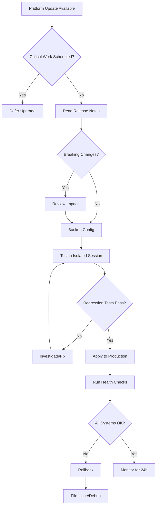

# System Hygiene for Agentic Systems

> **One-line intent:** Establish systematic pre/post-upgrade procedures, regression testing, and health validation to prevent production breakage when the underlying platform changes.

## Pattern in 60 Seconds

**The problem:** Platform upgrades (OpenClaw, dependencies, OS patches) can silently break agent functionality mid-operation with no warning.

**The insight:** Agents can't debug themselves when the platform breaks underneath them. System hygiene requires human-owned checklists and validation workflows.

**The key structure:**
- Pre-upgrade: Read release notes, backup config, identify breaking changes
- Test environment: Validate in isolated session before production
- Regression suite: Smoke tests for critical paths
- Post-upgrade: Health checks, error logs, functional spot-checks
- Rollback plan: How to revert if production breaks

**What broke when we got this wrong:** OpenClaw 2026.4.2 upgrade broke Gmail API queries during business hours. Agent couldn't access emails for 15+ minutes. No test environment, no validation, no rollback plan. Discovered mid-conversation when trying to draft urgent response.

---

## Classification

| Property | Value |
|----------|-------|
| **Category** | Production Readiness |
| **Difficulty** | Intermediate |
| **Also Known As** | Platform Maintenance, Upgrade Safety, Change Management for AI Systems |

---

## Motivation

You've built an AI agent system that runs your business. Eleven agents, email orchestration, calendar management, CRM operations. It works. Then you run a routine platform upgrade and suddenly:

Your agent can't read Gmail. Cron jobs stop firing. Tool calls return errors. The system that handled 100 emails yesterday can't process one today.

You're in the middle of drafting an urgent response. You ask your agent to check the inbox. It returns empty. You check Gmail yourself—the email is there. The agent just can't see it.

**This happened to us today.** April 6, 2026, 10:00 AM. OpenClaw released version 2026.4.2 with breaking config changes. We upgraded without reading the release notes. Gmail API queries stopped working. Lou couldn't access the AIOS/Lou - Orchestration folder where a time-sensitive intro email was waiting.

We had no test environment. No validation checklist. No rollback plan. We discovered the breakage mid-conversation, during business hours, with a demo scheduled for tonight.

**The failure mode:** Production AI systems depend on stable platforms. Upgrades without hygiene create unpredictable failures at the worst possible times.

---

## Applicability

Use this pattern when:
- AI agents run production workloads (not just experimentation)
- System availability matters (business hours, customer-facing, time-sensitive work)
- Platform updates happen regularly (weekly/monthly releases)
- Agents interact with external systems (APIs, databases, email, calendars)
- You have critical work scheduled (demos, launches, deadlines)

Do NOT use this pattern when:
- Experimental/hobby projects where downtime doesn't matter
- Platform is stable/frozen (no updates for months/years)
- Agent workload is fully asynchronous (can tolerate multi-hour delays)
- You have 24/7 ops team monitoring systems

---

## Structure



**Principle:** Never upgrade production without validation. Never validate without a way back.

---

## Participants

| Participant | Role | Example |
|------------|------|---------|
| **Release Notes** | Authoritative source of platform changes | OpenClaw GitHub releases, changelog |
| **Test Environment** | Isolated session for upgrade validation | Separate agent ID, fresh config, non-production credentials |
| **Regression Suite** | Critical path smoke tests | Can agent read email? Can cron fire? Can tools execute? |
| **Backup/Snapshot** | Pre-upgrade state capture | Config files, database snapshot, git commit |
| **Rollback Plan** | Documented reversion procedure | Restore config, downgrade package, restart gateway |

---

## How It Works

### Pre-Upgrade Checklist

**Before running any platform update:**

1. **Check calendar for critical work**
   - Demos, launches, deadlines within 48 hours → defer upgrade
   - Business-hours operation → upgrade off-hours
   - If urgent security patch → proceed with caution, test immediately

2. **Read release notes**
   - Identify breaking changes (config format, API changes, deprecated features)
   - Check migration guides (`openclaw doctor --fix`, config transforms)
   - Review known issues, workarounds

3. **Backup current state**
   ```bash
   # Config backup
   cp -r ~/.openclaw/config ~/.openclaw/config.backup-$(date +%Y%m%d)
   
   # Database snapshot (if applicable)
   cp workspace-dex/crm.db workspace-dex/crm.db.backup-$(date +%Y%m%d)
   
   # Git commit (if workspace is versioned)
   cd ~/.openclaw/workspace && git commit -am "Pre-upgrade snapshot $(date)"
   ```

4. **Document rollback plan**
   - How to downgrade package
   - How to restore config
   - How to restart gateway
   - Expected downtime

### Test Environment Setup

**Create isolated validation session:**

```yaml
# Test agent config (agents.yaml or via CLI)
agents:
  test-upgrade:
    enabled: true
    model: anthropic/claude-sonnet-4-5
    workspace: ~/.openclaw/workspace-test
    # Isolated workspace, non-production credentials
```

**Validation workflow:**
1. Upgrade test environment only
2. Start test agent session
3. Run regression suite (see below)
4. Check logs for errors
5. Only proceed to production if all tests pass

### Regression Suite

**Critical path smoke tests (customize for your system):**

```bash
#!/bin/bash
# regression-suite.sh — Run after every upgrade

echo "=== Agent Regression Tests ==="

# Test 1: Can agent read email?
echo "Test 1: Gmail API access..."
gog gmail messages list -n 5 >/dev/null 2>&1
if [ $? -eq 0 ]; then echo "✅ PASS"; else echo "❌ FAIL"; exit 1; fi

# Test 2: Can agent query CRM?
echo "Test 2: CRM database access..."
bash scripts/crm-query.sh main "SELECT COUNT(*) FROM contacts" >/dev/null 2>&1
if [ $? -eq 0 ]; then echo "✅ PASS"; else echo "❌ FAIL"; exit 1; fi

# Test 3: Can cron fire?
echo "Test 3: Cron scheduler..."
openclaw crons list >/dev/null 2>&1
if [ $? -eq 0 ]; then echo "✅ PASS"; else echo "❌ FAIL"; exit 1; fi

# Test 4: Can agent execute tool?
echo "Test 4: Tool execution (web_search)..."
# (Invoke agent with simple web_search task, check for tool result)

echo "=== All Tests Passed ==="
```

**Run this BEFORE and AFTER upgrade in test environment.**

### Production Upgrade Procedure

```bash
# 1. Final pre-flight check
bash regression-suite.sh

# 2. Backup (again, paranoia is healthy)
cp -r ~/.openclaw/config ~/.openclaw/config.backup-$(date +%Y%m%d-%H%M)

# 3. Upgrade
npm install -g openclaw@latest
# or: openclaw update (if auto-update enabled)

# 4. Run migration (if release notes mention it)
openclaw doctor --fix

# 5. Restart gateway
openclaw gateway restart

# 6. Wait for startup (check logs)
sleep 10
openclaw gateway logs --tail 20

# 7. Run regression suite
bash regression-suite.sh

# 8. Spot-check critical workflows
# - Send test email to agent
# - Check cron fired in last hour
# - Query CRM for known record
```

### Post-Upgrade Monitoring

**First 24 hours after production upgrade:**

- Monitor error logs: `openclaw gateway logs --tail 100 --follow`
- Check cron execution: All scheduled jobs fired successfully?
- Spot-check agent responses: Quality/accuracy still good?
- Watch for user reports: Anyone complaining about broken functionality?

**If issues arise:**
- Assess severity (cosmetic vs blocking)
- Minor issues: file bug, monitor, patch later
- Blocking issues: execute rollback plan immediately

### Rollback Plan

**When production upgrade breaks critical functionality:**

```bash
# 1. Stop gateway
openclaw gateway stop

# 2. Downgrade package
npm install -g openclaw@<previous-version>
# Example: npm install -g openclaw@2026.4.1

# 3. Restore config backup
rm -rf ~/.openclaw/config
mv ~/.openclaw/config.backup-YYYYMMDD ~/.openclaw/config

# 4. Restore database (if modified)
cp workspace-dex/crm.db.backup-YYYYMMDD workspace-dex/crm.db

# 5. Restart gateway
openclaw gateway start

# 6. Validate rollback worked
bash regression-suite.sh
```

**Document what broke, file issue with platform maintainer, wait for fix.**

---

## Consequences

### Benefits
- **Prevents production breakage** — Catch issues in test environment, not during business hours
- **Reduces downtime** — Rollback plan means minutes to recover, not hours/days
- **Builds confidence** — Team trusts upgrades won't break existing workflows
- **Creates audit trail** — Backups + logs document what changed and when
- **Enables automation** — Regression suite can run on every upgrade, no manual validation

### Liabilities
- **Slows upgrade velocity** — Can't just `npm install -g openclaw@latest` and go
- **Requires discipline** — Easy to skip steps when "this is just a minor update"
- **Test environment overhead** — Isolated configs, separate credentials, maintenance burden
- **False sense of security** — Tests can pass but edge cases still break

### What Broke in Practice

**April 6, 2026 — OpenClaw 2026.4.2 Upgrade Failure:**

**Timeline:**
- 03:04 — OpenClaw 2026.4.2 released (breaking config changes)
- ~09:00 — Sean upgraded without reading release notes
- 10:00 — Lou asked to draft response to Ben Baker intro email
- 10:05-10:22 — Lou couldn't access Gmail, email not visible via API
- Discovered breaking change in release notes (config aliases removed)
- No test environment, no validation, no rollback plan
- Upgrade happened morning of AI Tinkerers demo (5:30 PM same day)

**Impact:**
- 15+ minutes of blocked operation during business hours
- Time-sensitive intro email delayed
- Agent confidence undermined (Sean worried Lou was "broken")
- Demo prep interrupted at critical time

**Root causes:**
- Upgraded without reading release notes
- No pre-upgrade checklist
- No test environment or regression suite
- Bad timing (critical work scheduled same day)
- No rollback plan documented

**What we should have done:**
1. Deferred upgrade until after demo (critical work scheduled)
2. Read release notes (breaking changes documented)
3. Tested in isolated session first
4. Run `openclaw doctor --fix` before production
5. Validated Gmail API access before declaring upgrade successful

**Lesson:** Platform hygiene isn't optional when agents run production workloads. Every upgrade is a deployment.

---

## Implementation Notes

### Variations

**Minimal Hygiene (Small Teams):**
- Read release notes (5 min)
- Backup config (1 min)
- Test in current session with safe command (2 min)
- If it works, proceed; if not, rollback

**Standard Hygiene (Production Systems):**
- Full pre-flight checklist
- Test environment validation
- Automated regression suite
- Documented rollback plan
- 24-hour monitoring

**Enterprise Hygiene (Mission-Critical):**
- Dedicated staging environment (replica of production)
- Full integration test suite (100+ test cases)
- Canary deployments (upgrade one agent, monitor, then expand)
- Blue/green deployments (parallel environments, traffic switch)
- Automated rollback on error threshold

**Pick the level that matches your risk tolerance and team size.**

### Common Pitfalls

**"It's just a minor update":**
- Minor version bumps can include breaking changes
- Always read release notes, even for patches
- Trust but verify

**"We'll test in production":**
- Production testing = users discovering bugs
- Test environment pays for itself on first major issue prevented

**"Rollback is too slow":**
- Document rollback once, execute in minutes
- Undocumented rollback = hours of panic debugging

**"Regression suite is overkill":**
- Five-minute smoke test catches 80% of breaking changes
- Overkill is discovering breakage when user reports it

### Platform-Specific Notes

**OpenClaw:**
- Use `openclaw doctor --fix` after config-breaking upgrades
- Check `openclaw gateway logs` for startup errors
- Test cron scheduler explicitly (breaking change in 2026.4.2)

**LangChain/LangGraph:**
- API changes frequent in early versions
- Pin dependencies in production (`langchain==0.1.x`)
- Test chain execution, not just imports

**AutoGen/CrewAI:**
- Agent orchestration can break on dependency updates
- Test multi-agent workflows, not just single-agent

**Custom Platforms:**
- Document your own regression suite
- Focus on critical paths (data access, tool execution, orchestration)

---

## Security Implications

### Attack Surface
- Rushed upgrades skip security patches → vulnerabilities persist
- Broken rollback → forced to run vulnerable version
- Test environment with production credentials → credential leak risk

### Data Sensitivity
- Database backups contain sensitive data → encrypt at rest
- Test environment may log PII → scrub logs after testing
- Rollback restores old data → potential data loss if production modified post-upgrade

### Failure Modes
- Upgrade breaks authentication → agents lose access to secure systems
- Config restore fails → production down, no fallback
- Regression suite incomplete → security regression goes unnoticed

### Mitigations
- **Separate test credentials** — Never use production API keys in test environment
- **Encrypt backups** — Use same encryption as production databases
- **Security-focused regression** — Test authentication, authorization, credential refresh
- **Rapid rollback** — Prioritize rollback speed over perfect restoration
- **Audit upgrades** — Log what changed, when, by whom

---

## Known Uses

| Organization | Context | Scale |
|-------------|---------|-------|
| Cloud Nirvana AIOS | 11-agent email/CRM system on Mac Mini | Learned from April 6, 2026 upgrade failure |
| (Seeking contributions) | | |

---

## Related Patterns

| Pattern | Relationship |
|---------|-------------|
| REM Cycle (Nightly Maintenance) | Health checks catch post-upgrade issues early |
| Quality Gate Checkpoint | Pre-deployment validation, same principle for upgrades |
| Context Lifecycle Management | Backups preserve agent memory across upgrades/rollbacks |
| Files Over Databases | Config files easier to backup/restore than complex DB state |

---

## Metadata

| Property | Value |
|----------|-------|
| **Contributor** | Sean Erikson, CEO, Cloud Nirvana |
| **Production Environment** | OpenClaw + Mac Mini, 11 agents, Gmail/CRM/Calendar |
| **First Published** | 2026-04-06 (draft, born from production failure same day) |
| **Last Updated** | 2026-04-06 |
| **Cloud Nirvana Event** | AI Tinkerers Columbus (demo), 2026-04-07 |
| **License** | CC BY 4.0 |
| **Status** | Draft — ready for Open Patterns repo contribution |

---

## Revision History

| Date | Change | Author |
|------|--------|--------|
| 2026-04-06 | Initial draft from production upgrade failure | Sean Erikson / Lou |
