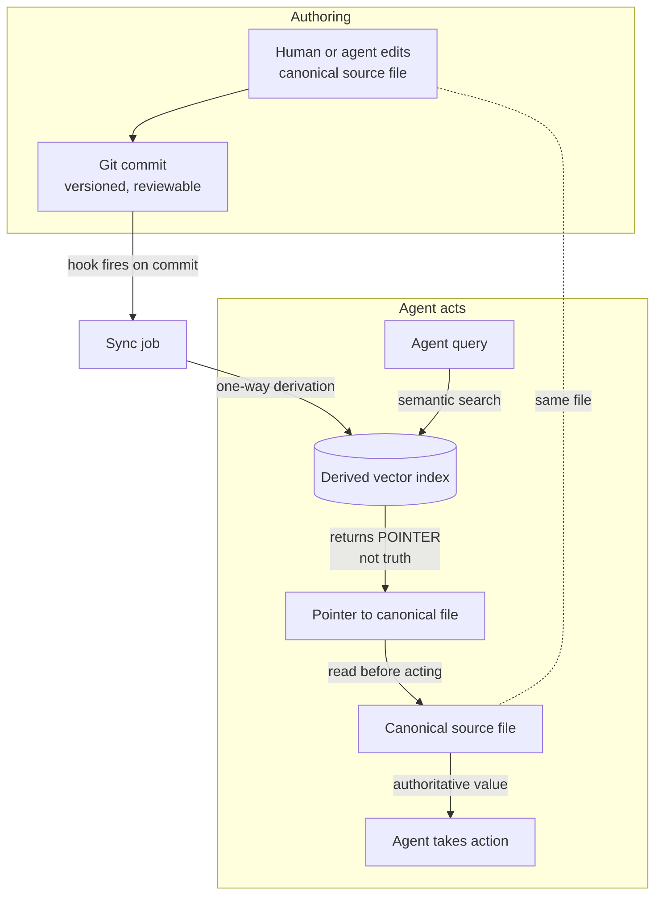
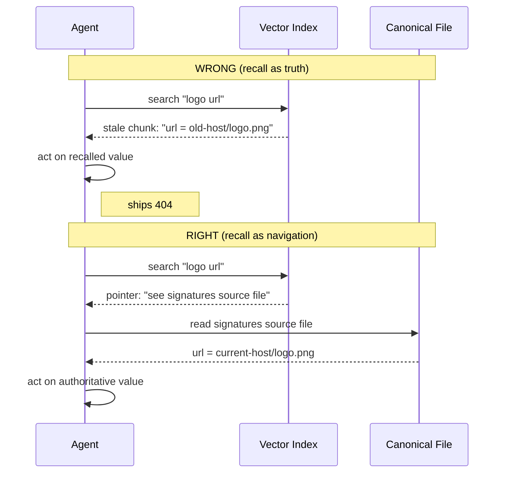

# Canonical Source Over Recall

> **One-line intent:** Treat agent memory and vector retrieval as a map to the truth, never the truth itself, by keeping an authoritative source store that agents must read before acting on any reusable fact.

## Pattern in 60 Seconds

**The problem:** An agent recalls a fact from memory or vector search and acts on it, but the fact has since changed. The recalled version was true when it was written and is now wrong. The agent never checked the authoritative source, so it ships a dead link, a superseded decision, or a stale config.

**The insight:** Recall and retrieval are navigation, not truth. A vector index tells you *where* the answer lives. The canonical file tells you *what is true right now*. These are two different jobs and they must live in two different places, with a one-way derivation from the canonical store to the index, never the reverse.

**The key structure:**

| Layer | Role | Authority | Example |
|-------|------|-----------|---------|
| **Canonical store** | Holds the truth, versioned and reviewable | Authoritative. The only thing an agent acts on. | Git-tracked source files (`seed-data/*.json`) |
| **Derived index** | Makes the truth findable by meaning | Navigational only. Never the basis for an action. | Vector DB built from the canonical store |
| **Sync** | Rebuilds the index from the canonical store | Deterministic, one-way, ideally hook-enforced | "On commit touching a source file, re-import it" |

**What broke when we got this wrong:** A peer system's agent recalled an email-signature logo URL from a six-week-old memory chunk, used it without reading the canonical signature file where the URL had been updated, and the image returned a 404 in front of the recipient. The current URL existed. The agent just trusted recall over the source.

---

## Classification

| Property | Value |
|----------|-------|
| **Category** | RAG & Knowledge |
| **Difficulty** | Intermediate |
| **Also Known As** | Source of Truth Over Recall, Navigational Memory vs Authoritative Data, Derived Index Pattern, Read-Before-Act |

---

## Motivation

You give an agent a long memory so it stops asking you the same questions. It works beautifully for a while. Then one day it confidently uses a fact that used to be true. Nobody lied to it. The fact simply changed after the memory was written, and the agent treated its recollection as gospel.

Vector search makes this worse, not better, because semantic similarity has no sense of time. A document from February that is *about* email signatures will out-score a one-line March note that *changed* the signature URL, because the February document is "more about signatures." The agent retrieves the confident, detailed, stale answer and skips the terse, current one. The retrieval was not broken. The assumption that retrieval returns truth was broken.

The same trap shows up with superseded decisions. An architecture decision gets reversed, but the original write-up is longer and richer, so it keeps winning the similarity contest. The agent re-implements something the team explicitly killed three weeks ago.

The fix is not a better embedding model. The fix is a discipline: the index is a card catalog, not the book. You search the catalog to find the shelf, then you walk to the shelf and read the actual book. For an agent that means: retrieval surfaces a pointer, and before the agent acts on any reusable asset (a URL, a routing rule, a schema, a decision, a credential reference), it reads the canonical source the pointer names.

---

## Applicability

Use this pattern when:
- Your agent has any long-lived memory or retrieval layer (vector DB, memory files, RAG corpus) that it queries before acting.
- The same facts are reused across sessions and can change over time (URLs, templates, routing rules, schemas, prices, decisions, config).
- Acting on a stale value has real cost (a broken customer-facing link, a reversed decision re-implemented, a wrong recipient).
- You can designate one authoritative, versioned store per fact (a file, a row, a record) that is cheap to read on demand.

Do NOT use this pattern when:
- The retrieved content is itself the deliverable and has no "current version" to drift from (e.g. summarizing a fixed historical document, brainstorming, exploratory chat).
- The cost of a re-read on every action exceeds the cost of occasional staleness, and the data rarely changes. In that case cache with a short TTL instead.
- There is no canonical store to point at yet. Then your first task is to create one (see *Related Patterns: Memory vs Persistence Boundary*), not to adopt this pattern on top of nothing.

---

## Structure



*The canonical file is written once and read in two roles: as the thing humans edit (top) and as the thing the agent reads before acting (bottom). The index sits in the middle as a finder. The arrow from index to action is deliberately broken; the agent must pass through the canonical file first.*



---

## Participants

| Participant | Role | Example |
|------------|------|---------|
| **Canonical store** | The single authoritative copy of each reusable fact. Versioned, ideally reviewable, cheap to read. | `seed-data/*.json` files in git; a Postgres row; a "signatures" markdown file |
| **Derived index** | A retrieval-optimized projection of the canonical store. Findable by meaning, never authoritative. | A vector collection embedded from the canonical files |
| **Sync mechanism** | A deterministic, one-way job that rebuilds index entries from the canonical store. | A commit hook that runs `import-seed-data` on changed files |
| **Version discipline** | A rule that updates rewrite in place and mark prior versions superseded, so search cannot surface a dead version as current. | Rewrite the chunk, set `status: superseded` on the old one, filter queries to `status: current` |
| **Read-before-act rule** | The agent contract that forbids acting on recalled content for reusable assets without reading the canonical source. | "For any reusable asset, always read the canonical file. Never trust recall." |

---

## How It Works

1. **Designate one canonical store per fact.** Every reusable fact has exactly one authoritative home, and that home is versioned so you can see what changed and when. In our system the canonical homes are git-tracked JSON files; git gives us review, history, and tamper evidence for free.
2. **Derive the index one way.** The vector index is built *from* the canonical store, never edited directly. The canonical files are the source of truth; the index is disposable and can be rebuilt at any time from them.
3. **Enforce sync with a forcing function, not a habit.** A commit hook re-imports any changed source file into the index automatically, so the index cannot silently fall behind the moment someone forgets to run the sync script. (See *Related Patterns: REM Cycle* for the time-based complement that catches drift no commit happens to touch.)
4. **Make superseded versions unfindable as current.** When a fact changes, rewrite its entry in place and mark the old version `status: superseded`. Agent queries filter to `status: current`. This directly defeats the "stale chunk out-scores the fresh one" failure, because the stale chunk is filtered out of the result set entirely.
5. **Query in tiers, authoritative first.** The agent consults the most authoritative layer first (the canonical files and core instructions), then the current-status index, then the historical archive. Lower tiers are for discovery and context, not for the value the agent will act on.
6. **Read before acting.** When retrieval surfaces a reusable asset, the agent treats the result as a pointer and reads the canonical source before using the value. Recall tells it *where to look*. The file tells it *what is true*.
7. **Degrade safely.** If the index is unavailable, the agent falls back to reading the canonical files directly. The system is slower without the index but never wrong, because truth never lived only in the index.

### Code / Configuration Example

```jsonc
// Canonical source file: seed-data/architecture--ai-pipeline-digest-summarizer.json
// This is the authoritative copy. Git-tracked, PR-reviewed, the only thing agents act on.
// Real shape: a strict two-key top level, { "metadata": {...}, "content": "..." }.
// Status, supersedes, domain, and subject live under metadata; content is a single string.
{
  "metadata": {
    "domain": "architecture",
    "subject": "Digest Summarizer model routing",
    "status": "current",            // queries filter on this
    "supersedes": "#1287",          // an issue or prior-point reference, format is system-dependent; null when none
    "last_updated": "2026-05-14T18:48:29Z"
  },
  "content": "Standard and premium digests run on Vertex Gemini 2.5 Flash Lite, with Bedrock Nova Lite as fallback."
}
```

```bash
# Illustrative only. The real trigger in our system is a Claude Code PostToolUse(Bash) hook event,
# not a conventional shell git hook, and it reads the committed HEAD rather than diffing two refs.
# All connection details (vector index host, port, credentials) are resolved at runtime from
# environment variables or a secrets manager. Do not hardcode them; the example uses placeholders only.
#
# Forcing function: on any commit that touches the canonical files, re-derive just those entries.
# One way, every time.
changed=$(git show --name-only --pretty=format: HEAD -- 'seed-data/*.json')
for f in $changed; do
  node scripts/import-seed-data.mjs --file "$(basename "$f")"   # rebuild index from source
done
```

```text
# Agent contract (system prompt / agent definition), the read-before-act rule:
#
#   Recalled memories reflect what was true when written. Verify before recommending.
#   For any reusable asset (URL, routing rule, schema, decision, credential reference),
#   the index result is a POINTER. Read the canonical source file it names before acting.
#   If the index is unreachable, read the canonical files directly. Never act on recall alone.
```

The canonical file carries a `status` field and a `supersedes` pointer in its metadata. The hook guarantees the index reflects the file. The agent contract guarantees the agent reads the file. Three small mechanisms, one invariant: the index is never the basis for an action.

---

## Consequences

### Benefits
- **Staleness stops causing wrong actions.** The worst outcome of a stale index becomes a wasted lookup, not a shipped error, because the agent always confirms against the source.
- **The index becomes disposable.** You can re-chunk, re-embed, swap embedding models, or rebuild from scratch with zero risk to correctness, because no truth lives only in the index.
- **Auditability and review come for free** when the canonical store is git-tracked. Every change to truth has an author, a timestamp, and a diff.
- **Safe degradation.** Index outage downgrades speed, not correctness.

### Liabilities
- **Extra reads.** Acting on a fact costs a retrieval plus a source read. For hot paths over rarely-changing data this is wasteful; cache with a short TTL there instead.
- **Discipline dependency.** The pattern relies on the agent actually obeying the read-before-act rule. Prompt-level rules are not enough on their own (see Pitfalls); the strong version needs structural enforcement.
- **You must designate canonical homes.** Facts with no single authoritative store cannot use this pattern until one is created, which is real upfront work.

### What Broke in Practice
_Honest failure modes, including one gap we still carry._

- **The stale logo URL (peer system, documented in this catalog).** An agent recalled a signature logo URL from a six-week-old chunk and shipped a 404 because it never read the canonical signatures file where the URL had been updated. This is the motivating incident; pure semantic recall returned a confident, stale answer and the agent trusted it. Our `status: superseded` filtering plus the read-before-act rule is the direct structural answer to exactly this failure.
- **Derived-index field drift (our system, observed in a session, not captured as a tracked incident).** During a routine session warmup, our derived archive collection returned search hits whose `title` and `content` fields came back null. This was a one-off session observation, not a logged or ticketed incident, so we offer it as an illustrative near-miss rather than a confirmed failure. The derived index had drifted from the shape of the canonical artifacts it was built from. No wrong action resulted, precisely because our protocol treats the index as navigation and re-reads canonical sources, but it exposed that **index integrity needs its own check**. A derived index can rot in ways that produce no error, only silence, and your read-before-act rule is the only thing standing between that silence and a bad decision.
- **What we would do differently starting over.** Two things. First, add a **time-based integrity sweep** for the index, not just the commit-triggered sync; commit hooks keep content fresh but do not catch shape drift or orphaned entries, because no commit event precedes that kind of rot. Second, add **keyword and recency signals to retrieval** so a superseded or older chunk is less likely to out-score the current one in the first place; `status: current` filtering helps, but defense in depth on the ranking side reduces how often the read-before-act rule has to save you.

---

## Implementation Notes

### Variations
- **Git-as-canonical (our choice).** Source files in version control. Free history, review, blame, and tamper evidence. Best when the facts are human-curated knowledge.
- **Database-as-canonical.** A relational row is the truth, the index is derived from it. Best when facts are operational and change frequently. Pairs naturally with *Memory vs Persistence Boundary*.
- **Pointer-only index.** Push it further: store only the pointer and a short summary in the index, never the full value, so it is structurally impossible to act on index content. The agent must open the source to get the value at all.

### Common Pitfalls
- **Editing the index directly.** The moment someone writes truth into the index that is not in the canonical store, the one-way derivation is broken and the index becomes a second, competing source of truth. Never write truth to the index.
- **Relying on the prompt alone.** "Always read the source" in a system prompt degrades under context pressure. Back it with structure: filter superseded versions out of results, prefer pointer-only entries, and add an integrity check. Make the wrong action hard, not just discouraged.
- **Leaving superseded versions `current`.** If you append a new version without demoting the old one, both are findable and semantic search may still pick the old one. Rewrite in place and demote, do not just add.
- **Forgetting the offline path.** If the agent cannot function when the index is down, you have smuggled truth into the index. The canonical store must be directly readable.

---

## Security Implications

### Attack Surface
- The derived index is a softer target than the canonical store. In many deployments the derived index runs on infrastructure with weaker controls than the canonical store: a service reachable inside a trust boundary, with lighter authentication on the read path than the reviewed source store enjoys, while the canonical store sits behind version-control review and access control. If an agent treats index content as truth, **poisoning the index becomes a way to manipulate agent behavior** without ever touching the reviewed, authoritative store.
- This pattern *shrinks* that attack surface: because the agent acts only on the canonical source, a poisoned index can at most misdirect a lookup, not inject a false value into an action.

### Data Sensitivity
- Keep secrets and high-sensitivity values out of the derived index entirely. The index should hold pointers and non-sensitive summaries, with the sensitive value living only in the access-controlled canonical store. This way a compromise of the weaker index layer does not leak the sensitive value.

### Failure Modes
- **Index poisoning:** mitigated as above; blast radius is a misdirected read, not a forged action.
- **Source/index divergence:** the index says one thing, the source another. With read-before-act the source wins, so divergence costs correctness nothing; it only wastes a lookup until the sweep reconciles it.
- **Silent index rot:** entries go null or empty (observed in a session in our system, not captured as a tracked incident). Detected by an integrity sweep, contained by read-before-act.

### Mitigations
- One-way derivation enforced by a hook, so the index cannot diverge through human forgetfulness.
- `status: current` filtering so demoted truth is unsearchable.
- Git as a tamper-evident canonical layer: every change to truth is signed history.
- A periodic integrity sweep over the index (count, shape, orphan, and freshness checks) to catch rot that produces no error.
- Direct-read fallback so an index outage never forces the agent to guess.

---

## Known Uses

| Organization | Context | Scale |
|-------------|---------|-------|
| Beside Care | Elder-care monitoring SaaS on Cloudflare Workers + Supabase. `seed-data/*.json` is the canonical source of truth; a Qdrant vector collection is the derived index; a commit hook re-imports changed files; agents query `status: current` and read canonical sources before acting. | Production, multi-agent delivery pipeline |
| Cloud Nirvana (motivating failures) | The stale-logo-URL incident (documented in this catalog's Context Lifecycle Management and Hybrid Memory Retrieval patterns) and the context-compaction failure (the "90% Wall," in Context Lifecycle Management) are the failures this pattern is designed to prevent. | Team |

---

## Related Patterns

| Pattern | Relationship |
|---------|-------------|
| Context Lifecycle Management | Parent. Its "Source of Truth over Recall" note explicitly calls for this pattern to exist as a standalone. |
| Memory vs Persistence Boundary | Prerequisite. Tells you which facts deserve a canonical home in the first place; this pattern governs how agents read from it. |
| Hybrid Memory Retrieval | The retrieval layer this pattern governs. Recency and keyword signals from that pattern reduce how often a superseded chunk out-scores the current one. |
| Multi-Source Memory Architecture | Complements. Defines the tiers; this pattern defines which tier is authoritative and the order to consult them. |
| REM Cycle: Nightly Maintenance | Complements. Provides the time-based integrity sweep that the commit hook cannot, catching index rot no commit event precedes. |

---

## Metadata

| Property | Value |
|----------|-------|
| **Contributor** | Brandon Smith, Beside Care (brandon.smith@besidecare.com) |
| **Production Environment** | Cloudflare Workers + Supabase (Postgres, RLS) + Qdrant vector index; elder-care SaaS |
| **First Published** | 2026-05-28 |
| **Last Updated** | 2026-05-28 |
| **Cloud Nirvana Event** | n/a |
| **License** | CC BY 4.0 |

---

## Revision History

| Date | Change | Author |
|------|--------|--------|
| 2026-05-28 | Initial draft contributed to Open Patterns | Brandon Smith, Beside Care |
