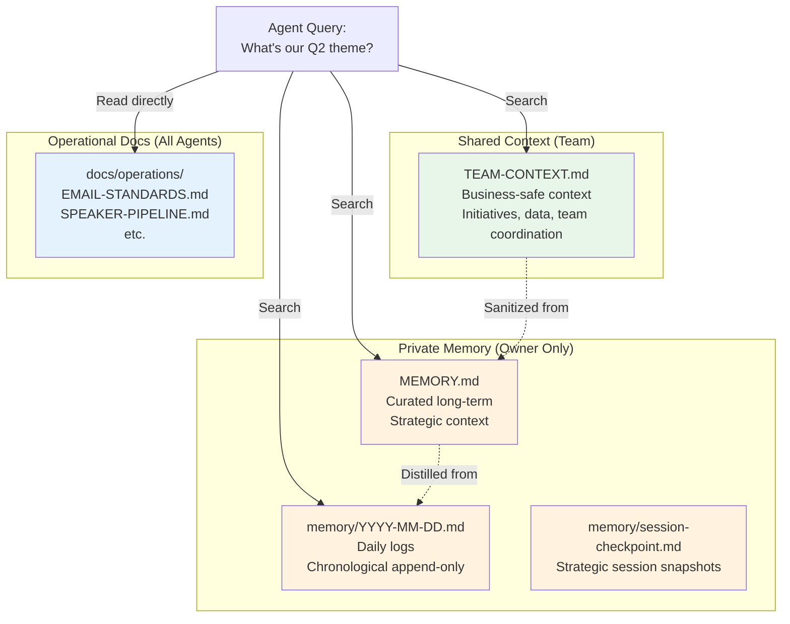

# Multi-Source Memory Architecture

> **One-line intent:** Structure agent memory across multiple sources with different lifetimes, audiences, and update patterns so agents can find the right information without drowning in noise.

## Pattern in 60 Seconds

**The problem:** You start with one memory file (`MEMORY.md`). Over months, it grows to 20,000 lines. Search degrades. Agents load everything into context. Important decisions are buried next to transient notes. Team members need business context but shouldn't see private strategic doubts.

**The insight:** Memory needs the same separation of concerns as code. Different information has different lifetimes (ephemeral vs permanent), different audiences (private vs team vs public), and different update patterns (append-only logs vs curated docs).

**The architecture (5 sources):**

| Source | Lifetime | Audience | Update Pattern | Purpose |
|--------|----------|----------|----------------|---------|
| **MEMORY.md** | Indefinite | Owner only | Curated edits | Long-term strategic memory, decisions, lessons learned |
| **Daily logs** | 7-30 days | Owner only | Append-only | Chronological record, raw capture, "what happened today" |
| **Shared context** | Indefinite | Team | Curated edits | Business-safe context, initiatives, data, team coordination |
| **Operational docs** | Indefinite | All agents | Version-controlled | Authoritative references, standards, templates, schemas |
| **Session checkpoints** | Days to weeks | Owner only | Snapshot writes | Strategic session state before compaction |

**What broke when we got this wrong:** `MEMORY.md` grew to 23,000 lines over 6 weeks. Search returned 50+ snippets for simple queries. Agents couldn't distinguish critical long-term context from transient daily notes. Team chat agent loaded private family context because everything was in one file.

---

## Classification

| Property | Value |
|----------|-------|
| **Category** | RAG & Knowledge |
| **Difficulty** | Intermediate |
| **Also Known As** | Tiered Memory, Memory Separation of Concerns, Multi-Tier Agent Memory |
| **Related Patterns** | Memory vs Persistence Boundary, Memory Access Control by Session Type, Context Lifecycle Management |

---

## Motivation

An agent operating over weeks or months accumulates context:
- Decisions made and why
- User preferences and quirks
- Ongoing projects and status
- Daily operational logs
- Strategic insights and lessons learned
- Business context for team coordination
- Authoritative references (email templates, routing rules, schemas)

**If all this lives in one file:**
- Search returns too many results (signal drowned by noise)
- Critical long-term context is buried in chronological logs
- No way to share business context without leaking private data
- Difficult to expire old content (how do you decide what to delete from a 20K-line file?)
- Agents load everything into context even when only a subset is relevant

**Example query failure:**
```
User: "What was our Q2 theme?"
Agent searches MEMORY.md → returns 50 snippets (theme mentioned in 10 daily logs, strategic discussions, team updates, event planning notes)
Agent: "I found many references... here's what I think is most relevant..."
```

The information is there, but retrieval quality degrades as the file grows.

---

## Structure

### The Five Sources



### Source #1: MEMORY.md (Curated Long-Term)

**Purpose:** Permanent strategic memory. Decisions, relationships, insights, lessons learned.

**Lifetime:** Indefinite (curated, not chronological)

**Audience:** Owner only (private)

**Update pattern:** Curated edits. Agent or owner adds/updates when something *changes long-term understanding*.

**Size target:** <10,000 lines (if it grows beyond, split into topics: `memory/relationships.md`, `memory/technical-decisions.md`)

**Content:**
- Key decisions and their rationale
- User preferences, quirks, values
- Relationship context (family, team, partners)
- Strategic insights ("practitioner identity is evolving, need to redefine")
- Lessons learned ("agents can't enforce policies via prompts alone")

**What NOT to include:**
- Daily operational logs (goes in daily files)
- Transient status (goes in operational docs or daily logs)
- Raw meeting notes (distill first, then write summary)

**Example entry:**
```markdown
## Cloud Nirvana Identity Work (March 26, 2026)

Sean recognized that "practitioner" may need redefining in the GenAI era. 
Pre-GenAI: hands-on cloud engineers. Post-GenAI: anyone building with AI tools 
could be a practitioner now.

Plan: 5 conversations with super fans about why they come back. Write belief 
statement from clarity, not anxiety. Then answer Tracy's CNAB email.

Key insight: operating on passion and borrowed vocabulary without true clarity. 
Fear: letting people down.
```

---

### Source #2: Daily Logs (Chronological Append-Only)

**Purpose:** Raw chronological capture. "What happened today."

**Lifetime:** 7-30 days (then archived or distilled into MEMORY.md)

**Audience:** Owner only (private)

**Update pattern:** Append-only. Write once at end of session or during key moments.

**File pattern:** `memory/YYYY-MM-DD.md`

**Content:**
- Events that happened (emails sent, decisions made, meetings held)
- Status updates (speaker pipeline changes, CRM imports)
- Open threads ("waiting to hear back from Tracy")
- Quick notes that might be distilled later

**What NOT to include:**
- Long-term strategic insights (distill and move to MEMORY.md)
- Authoritative references (belongs in docs/)

**Example entry:**
```markdown
# April 4, 2026

## Tracy Email - Cincinnati Speakers
- Tracy reached out to Chris Brock and Jason Hauer
- Updated speaker pipeline: both marked "outreach sent"
- Waiting to hear back

## Local LLM Email Triage
- Installed Ollama + Qwen 3 8B
- Built hybrid triage: deterministic rules → local LLM fallback
- 12/12 test emails classified correctly
- Deployed to cron at 12:30pm
```

**Lifecycle:**
- Daily logs live for 7-14 days
- Weekly: review and distill important content into MEMORY.md
- After distillation: archive to `memory/archive/YYYY-MM/` or delete if noise

---

### Source #3: Shared Context (Team-Safe Business Context)

**Purpose:** Business context safe for team visibility (group chat, shared sessions).

**Lifetime:** Indefinite (updated as business evolves)

**Audience:** Team members + owner

**Update pattern:** Curated edits (like MEMORY.md but sanitized)

**File:** `TEAM-CONTEXT.md`

**Content:**
- Event calendar (dates, venues)
- Community data (engagement tiers, attendance stats — anonymized/aggregated)
- Active initiatives and project status
- Partner relationships (public knowledge only)
- How to work with the agent system

**What NOT to include:**
- Personal/family context
- Financial details beyond public knowledge
- Strategic doubts, internal deliberations
- Anything that would violate trust if leaked

**Example entry:**
```markdown
## 2026 Event Calendar

### Q2 2026
- **Cleveland:** Monday, May 19, 2:00-6:00 PM ET
- **Columbus:** Tuesday, May 20, 2:00-6:00 PM ET  
- **Cincinnati:** Wednesday, May 21, 2:00-6:00 PM ET (CBTS venue)

### 2026 Theme
"From Fluency to Impact: The Practitioner Journey in Cloud & AI"

Four-phase progression:
1. Foundations & Fluency
2. Practice & Discipline
3. Transformation at Scale
4. Momentum & Trust
```

---

### Source #4: Operational Docs (Authoritative References)

**Purpose:** Single source of truth for repeatable operations. Templates, standards, schemas, routing rules.

**Lifetime:** Indefinite (version-controlled)

**Audience:** All agents (anyone who needs to execute operations)

**Update pattern:** Version-controlled edits. Update when process changes.

**Location:** `docs/operations/`

**Content:**
- Email templates and signatures (`EMAIL-SIGNATURES.md`)
- Email formatting standards (`EMAIL-STANDARDS.md`)
- Triage rules (`EMAIL-ROUTING.md`)
- Speaker pipeline tracker (`SPEAKER-PIPELINE-Q2-2026.md`)
- Partner contracts, event checklists, quality gates

**Critical rule:** Agents MUST read these files, never reconstruct from memory.

**Example file:** `docs/operations/EMAIL-SIGNATURES.md`
```markdown
### Lou 🔥
```html
<strong style="font-size: 15px;">Lou 🔥</strong><br>
<span style="color: #555;">Chief of Staff | Cloud Nirvana, LLC</span><br>
...
```
```

**Why this matters:** Logo URLs change. Signature formats evolve. If agents reconstruct from stale context, they use broken URLs or outdated formats.

---

### Source #5: Session Checkpoints (Strategic Session Snapshots)

**Purpose:** Preserve strategic session state before compaction.

**Lifetime:** Days to weeks (disposable after session concludes)

**Audience:** Owner only (private)

**Update pattern:** Snapshot writes when context crosses 50-60%.

**File pattern:** `memory/session-checkpoint-YYYY-MM-DD-HHMM.md`

**Content:**
- Open threads in this session
- Decisions made so far
- Emotional/strategic arc
- "Where we left off"

**Lifecycle:** After session ends and key insights are distilled into MEMORY.md or daily logs, checkpoint can be deleted.

---

## Implementation

### Directory Structure

```
workspace/
├── MEMORY.md                          # Curated long-term (private)
├── TEAM-CONTEXT.md                    # Shared business context (team-safe)
├── memory/
│   ├── 2026-04-04.md                 # Daily log (today)
│   ├── 2026-04-03.md                 # Daily log (yesterday)
│   ├── session-checkpoint-2026-04-04-1430.md
│   └── archive/
│       └── 2026-03/                   # Archived daily logs (optional)
├── docs/
│   ├── operations/
│   │   ├── EMAIL-SIGNATURES.md       # Authoritative reference
│   │   ├── EMAIL-STANDARDS.md
│   │   └── SPEAKER-PIPELINE-Q2-2026.md
│   └── patterns/
│       └── ...                        # Published patterns
```

### Agent Memory Loading Strategy

**Direct chat with owner (private session):**
1. Always load: MEMORY.md, USER.md, SOUL.md, AGENTS.md
2. Load recent: memory/YYYY-MM-DD.md (today + yesterday)
3. Search on demand: older daily logs, checkpoints

**Team group chat (shared session):**
1. Always load: TEAM-CONTEXT.md, USER.md (public subset), SOUL.md, AGENTS.md
2. NEVER load: MEMORY.md, memory/YYYY-MM-DD.md (private)
3. Load operational docs as needed

**Cron/isolated sessions:**
1. Load operational docs relevant to job
2. Load TEAM-CONTEXT.md if job involves team coordination
3. NEVER load MEMORY.md (private context not needed for automated tasks)

### Search Strategy

When agent searches for information:

1. **Semantic search across all accessible sources**
   - Query: "What's our Q2 theme?"
   - Search: MEMORY.md, memory/*.md (last 7 days), TEAM-CONTEXT.md
   - Return: Top 3-5 snippets with source attribution

2. **Source attribution in results**
   ```
   Found in MEMORY.md (line 234):
   "2026 Theme: From Fluency to Impact"
   
   Found in TEAM-CONTEXT.md (line 12):
   "Four-phase progression: 1. Foundations & Fluency..."
   ```

3. **Prefer authoritative sources for operational queries**
   - "What's Lou's email signature?" → Read `EMAIL-SIGNATURES.md` directly, don't search memory
   - "What's the promo code for a partner?" → Query CRM database, don't search memory

### Distillation Workflow

**Weekly (or after significant sessions):**

1. Review last 7 days of daily logs (`memory/2026-04-*.md`)
2. Identify content that changes long-term understanding
3. Write/update MEMORY.md with distilled insights
4. Archive or delete old daily logs
5. Update TEAM-CONTEXT.md if business context changed

**Example distillation:**

From `memory/2026-04-04.md`:
```markdown
## Local LLM Email Triage
- Installed Ollama + Qwen 3 8B
- 12/12 accuracy, $0 per classification
```

Distilled to `MEMORY.md`:
```markdown
## Email Triage Architecture (April 2026)
Hybrid: deterministic rules → local Qwen 3 8B → cloud model for execution.
Local LLM: $0 cost, thinking mode critical for reasoning quality over speed.
```

---

## What Broke

**MEMORY.md bloat (March 2026):**

`MEMORY.md` grew to 23,000 lines over 6 weeks. Every daily event, every email status, every small decision written chronologically.

**Problems:**
- Search returned 50+ snippets for simple queries
- Agent couldn't distinguish critical strategic context from transient daily logs
- Loading time increased (23K lines = ~180K tokens)
- Difficult to maintain (what's safe to delete?)

**Fix:** Split into daily logs (transient, 7-day retention) + curated MEMORY.md (permanent, distilled).

**Team chat privacy leak (April 2026):**

Agent loaded MEMORY.md in team group chat. Private family context leaked to team members.

**Root cause:** No separation between private (MEMORY.md) and team-safe (TEAM-CONTEXT.md) context.

**Fix:** Created TEAM-CONTEXT.md, updated system prompts to load different files based on session type.

**Stale signature URL (March 2026):**

Agent reconstructed email signature from memory. Used old logo URL (broke after migration).

**Root cause:** Signature lived only in context/memory, not in an authoritative file.

**Fix:** Created `docs/operations/EMAIL-SIGNATURES.md` as single source of truth. Agent must read file, not reconstruct from memory.

---

## Consequences

### Benefits

**Search quality:**
- Smaller files = better semantic search
- Source attribution helps agent pick the right snippet
- Distilled MEMORY.md has higher signal-to-noise

**Privacy:**
- Private context stays in MEMORY.md / daily logs
- Team context safe in TEAM-CONTEXT.md
- No accidental leaks to group chats

**Maintainability:**
- Daily logs have clear lifecycle (7-30 days)
- Operational docs are version-controlled
- Easy to delete old transient content

**Agent accuracy:**
- Authoritative sources (docs/) prevent stale recall
- Distillation process forces clarity

### Drawbacks

**Complexity:**
- 5 sources vs 1 file
- Agent must know where to look
- More files to manage

**Distillation discipline:**
- Requires weekly review and curation
- If you skip distillation, daily logs pile up

**Sync risk:**
- TEAM-CONTEXT.md can drift from MEMORY.md
- Operational docs can become stale if not updated

---

## Related Patterns

**Memory vs Persistence Boundary:**
When does information graduate from memory files to database? This pattern focuses on *within memory*, that pattern focuses on *memory vs structured storage*.

**Memory Access Control by Session Type:**
How do you enforce which memory sources load in which session types? That pattern covers enforcement; this pattern covers the architecture.

**Context Lifecycle Management:**
How do you manage context across working → session → long-term tiers? That pattern covers lifecycle; this pattern covers the multiple sources within each tier.

---

**Pattern status:** Fully implemented in production multi-agent system. Five sources in active use. Distillation workflow operational. Privacy separation validated.
