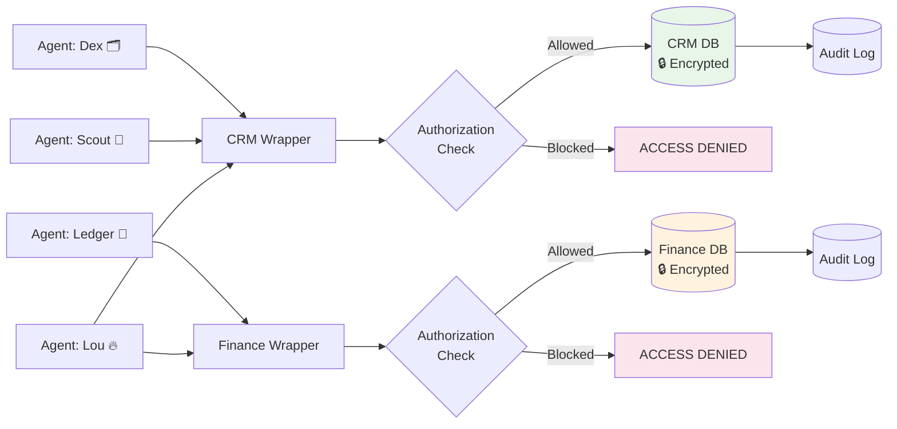

# Per-Agent Data Access Control

> **One-line intent:** Scope database access per AI agent using authorization wrappers, encrypted storage, and immutable audit logging.

## Pattern in 60 Seconds

**The problem:** You have multiple AI agents that need access to data, but not the same data. Your CRM agent needs to write contacts. Your finance agent needs to read invoices. Your partnership agent needs partner names but not dollar amounts. How do you give each agent exactly what it needs and nothing more?

**The insight:** Don't let agents talk to the database directly. Put a gatekeeper in between that checks who's asking, what they're asking for, and logs everything. The database is encrypted so even direct file access is useless without the key.

| Layer | What it does |
|-------|-------------|
| **Encrypted storage** | Database unreadable without passphrase (AES-256) |
| **Authorization wrapper** | Script checks agent ID against allowed tables/operations before executing |
| **Audit log** | Every query logged (who, what, when). Immutable; agents can write logs but not modify them. |
| **Credential isolation** | Each database has its own passphrase in a system keychain |

**What broke when we got this wrong:** All agents had direct `sqlite3` access to an unencrypted database. Any agent could read, write, or corrupt any data. A column-mapping bug during a data import corrupted 149 records before it was caught.

---

## Classification

| Property | Value |
|----------|-------|
| **Category** | Security & Compliance |
| **Difficulty** | Advanced |
| **Also Known As** | Agent Authorization Layer, Scoped Data Access, Principle of Least Privilege for Agents |

---

## Motivation

You've built a multi-agent system. It's working well. Each agent owns a domain: one handles partnerships, another manages finances, another tracks community data. They all need database access, but they don't all need the same access.

Your partnership agent doesn't need to see invoice amounts. Your finance agent doesn't need to browse community contact details. Your operations agent doesn't need access to financial data at all.

But right now, every agent has the same database connection string. Any agent can query any table. The database is a plaintext file on disk. If an agent hallucinates a creative query, misinterprets a prompt, or processes a manipulated input, it has unrestricted access to everything.

This pattern solves that by introducing three layers between the agent and the data: encryption at rest, authorization checks per query, and an immutable audit trail.

---

## Applicability

Use this pattern when:
- Multiple AI agents share a data layer but need different access levels
- Your data includes sensitive information (financial, PII, contractual)
- You need an audit trail for compliance, debugging, or trust-building
- You're operating agents without container-level sandboxing
- Different stakeholders have different data visibility requirements

Do NOT use this pattern when:
- You have a single agent with a single data source (simpler approaches exist)
- All data is non-sensitive and all agents need full access
- You have container-level sandboxing that enforces file system isolation (this pattern is still useful for audit, but less critical for access control)

---

## Structure



---

## Participants

| Participant | Role | Example |
|------------|------|---------|
| **AI Agent** | Requests data via wrapper script | CRM agent, finance agent, partnership agent |
| **Authorization Wrapper** | Validates agent identity against access rules before executing query | `crm-query.sh`, `finance-query.sh` |
| **Access Rules** | Defines which tables and operations each agent can perform | Per-agent case statement in wrapper script |
| **Encrypted Database** | Stores data encrypted at rest; requires passphrase to access | SQLCipher database with AES-256 |
| **Credential Store** | Holds database passphrases securely | macOS Keychain, HashiCorp Vault, AWS Secrets Manager |
| **Audit Log** | Immutable record of every query | `audit_log` table (INSERT only, no UPDATE/DELETE) |

---

## How It Works

### 1. Agent Calls Wrapper (Not Database)

The agent never executes SQL directly against the database. It calls a wrapper script with its agent ID and the query:

```bash
bash scripts/crm-query.sh scout "SELECT first_name, last_name, company FROM contacts WHERE email = 'test@example.com';"
```

### 2. Wrapper Authenticates and Authorizes

The wrapper:
1. Identifies the calling agent
2. Looks up the agent's permissions
3. Checks whether the requested tables and operation type (SELECT/INSERT/UPDATE/DELETE) are allowed
4. Blocks unauthorized requests with a clear error message

```bash
case "$AGENT_ID" in
    scout)
        ALLOWED_READ="contacts|companies|tags|events"
        ALLOWED_WRITE=""
        ;;
    dex)
        ALLOWED_READ="contacts|companies|attendance|tags|events"
        ALLOWED_WRITE="contacts|companies|attendance|tags"
        ;;
    ledger)
        # Ledger has NO access to the CRM
        echo "ERROR: Agent 'ledger' does not have access to the CRM."
        exit 1
        ;;
esac
```

### 3. Wrapper Logs to Audit Trail

Before executing the query, the wrapper writes an audit record:

```sql
INSERT INTO audit_log (agent_id, operation, table_name, query_summary)
VALUES ('scout', 'SELECT', 'contacts', 'SELECT first_name, last_name...');
```

The audit log is immutable: agents can INSERT but not UPDATE or DELETE audit records.

### 4. Wrapper Executes Query via Encrypted Connection

The wrapper reads the database passphrase from the credential store and opens an encrypted connection:

```bash
DB_KEY=$(security find-generic-password -a "openclaw" -s "crm-db-key" -w)
sqlcipher "$DB_PATH" "PRAGMA key = '$DB_KEY'; $QUERY"
```

### 5. Result Returned to Agent

The agent receives the query results. It never sees the passphrase, never touches the database file directly, and the audit log records what happened.

### Cross-Database Access

When an agent needs data from multiple databases (e.g., partner names from finance + contact details from CRM), the wrapper handles the join logic. The agent makes one request; the wrapper queries both databases with appropriate authorization for each.

### Access Matrix Configuration

```yaml
# Example access matrix
agents:
  dex:
    crm: {read: all, write: [contacts, companies, attendance, tags]}
    finance: {read: none, write: none}
  scout:
    crm: {read: [contacts, companies, tags, events], write: none}
    finance: {read: [partner_name, tier, status], write: none, blocked_fields: [amount]}
  ledger:
    crm: {read: none, write: none}
    finance: {read: all, write: [invoices, payments]}
  lou:
    crm: {read: all, write: all}
    finance: {read: all, write: all}
```

---

## Consequences

### Benefits
- **Principle of least privilege.** Each agent sees only what it needs. A partnership agent can't browse financial records. A finance agent can't browse community contacts.
- **Audit trail from day one.** Every query is logged with agent identity, timestamp, and operation type. Useful for debugging ("who updated this record?"), compliance, and trust-building.
- **Encryption at rest.** If the server is compromised, the database files are unreadable without the passphrase. Direct file system access is useless.
- **Graceful error messages.** Blocked agents get clear "ACCESS DENIED" messages that explain what they tried and why it was blocked. This helps with debugging prompt issues.

### Liabilities
- **Performance overhead.** Wrapper scripts add latency (passphrase lookup, authorization check, audit write) to every query. For high-frequency queries, this matters.
- **Maintenance.** Access rules need updating when new tables are added or agent responsibilities change.
- **Not bulletproof without sandboxing.** An agent with shell access can bypass the wrapper and call the database directly. The wrapper is a speed bump, not a wall. True enforcement requires container-level isolation.

### What Broke in Practice
- **Unencrypted database exposed to all agents.** Before implementing this pattern, every agent had direct `sqlite3` access to an unencrypted database file. A data import script with a column-mapping bug corrupted 149 records. Any agent could have done the same.
- **Shared database connection caused cross-agent contamination.** When agents shared a global API for a service (email drafts), one agent's data appeared in another's queue. Separate access paths eliminated this.
- **Dollar sign escaping in queries.** Agents constructing SQL queries in shell scripts lost dollar signs (e.g., `$5,442.50` became `,442.50`). Moving to HTML temp files and parameterized queries fixed this, but it highlighted why agents shouldn't construct raw SQL.

---

## Implementation Notes

### Variations

**Database-Level Users (PostgreSQL).** Instead of wrapper scripts, use database-level roles with per-user permissions. Each agent connects with its own credentials. The database enforces access natively.

**API Gateway.** Replace wrapper scripts with a REST API that authenticates agents via tokens. The agent calls an HTTP endpoint; the gateway checks permissions and executes the query. This is the natural evolution when you containerize agents.

**Field-Level Access Control.** The wrapper checks not just which tables an agent can access, but which columns. A partnership agent can see `partner_name` and `tier` but not `annual_amount`. Implemented by rewriting queries or using database views.

### Common Pitfalls

- **Hardcoding passphrases in scripts.** Use a credential store (Keychain, Vault, Secrets Manager). Never embed passphrases in config files, environment variables visible to agents, or wrapper script source code.
- **Mutable audit logs.** If agents can UPDATE or DELETE audit records, the trail is worthless. Make audit_log INSERT-only at the application level, and ideally at the database level (write-only user).
- **Forgetting to update access rules.** When you add a new table, every wrapper needs to be reviewed. Default to "deny" for new tables and explicitly grant access.
- **Trusting the agent to use the wrapper.** Without sandboxing, agents can bypass wrappers. Plan for this: monitor for direct database access attempts in your system logs.

### Enforcement Evolution

| Stage | Mechanism | Can agent bypass? |
|-------|-----------|-------------------|
| Wrapper scripts | Bash scripts check authorization | Yes (shell access) |
| Containerized agents + API | HTTP gateway, no file system access | No |
| Microservices | Dedicated data service, per-agent API keys | No |

Start with wrappers. They're pragmatic and give you the access pattern and audit trail. Evolve to containers and microservices when infrastructure supports it.

---

## Security Implications

### Attack Surface
- **Wrapper bypass.** An agent with shell access can call the database directly, bypassing authorization. Mitigate with container isolation or by removing shell tools from the agent's environment.
- **Passphrase extraction.** If an agent can read the credential store, it can extract the passphrase and access the database directly. Mitigate by scoping credential store access or using separate keystores per agent.
- **SQL injection via agent.** If an agent constructs SQL from untrusted input (email content, form submissions), it could inject malicious queries. Mitigate with parameterized queries and input validation in the wrapper.

### Data Sensitivity
- **Audit logs contain query summaries.** These reveal what agents are accessing and how often. Treat audit logs as sensitive operational data.
- **Access rules reveal boundaries.** An attacker who reads the wrapper scripts knows exactly what each agent can and cannot access. Store access rules securely.

### Failure Modes
- **Wrapper crash.** If the wrapper script fails, the agent gets no data (fail-closed). This is the correct failure mode.
- **Audit log full.** If the audit table grows unbounded, database performance degrades. Implement rotation or archival.
- **Credential store unavailable.** If the keychain or vault is unreachable, all database access fails. Monitor credential store availability.

### Mitigations
- Container isolation per agent (eliminates bypass)
- Separate passphrases per database (limits blast radius)
- Audit log analysis for anomalous patterns (agent querying tables it rarely uses)
- Regular access rule review when schema changes

---

## Known Uses

| Organization | Context | Scale |
|-------------|---------|-------|
| Cloud Nirvana | Multi-agent system with separate CRM and finance databases | Small team, 2,000+ community members |
| [Your implementation here] | [How you applied this pattern] | [Your scale] |

---

## Related Patterns

| Pattern | Relationship |
|---------|-------------|
| **Ladder of Trust** | Trust levels determine what access an agent earns. This pattern enforces those levels at the data layer. |
| **Hub-and-Spoke Orchestration** | The hub agent (Lou) often has elevated access. Spoke agents have scoped access. |
| **Files Over Databases** | An alternative coordination pattern where agents use isolated files instead of a shared database. Both patterns address the same problem (agent isolation) at different layers. |

---

## Metadata

| Property | Value |
|----------|-------|
| **Contributor** | Sean Erikson, CEO & Co-Founder, Cloud Nirvana |
| **Production Environment** | Multi-agent agentic AI system |
| **First Published** | March 2026 |
| **Last Updated** | March 23, 2026 |
| **Cloud Nirvana Event** | Seed pattern (pre-Q2 2026) |
| **License** | CC BY 4.0 |

---

## Revision History

| Date | Change | Author |
|------|--------|--------|
| 2026-03-23 | Initial publication | Sean Erikson / Lou 🔥 |
