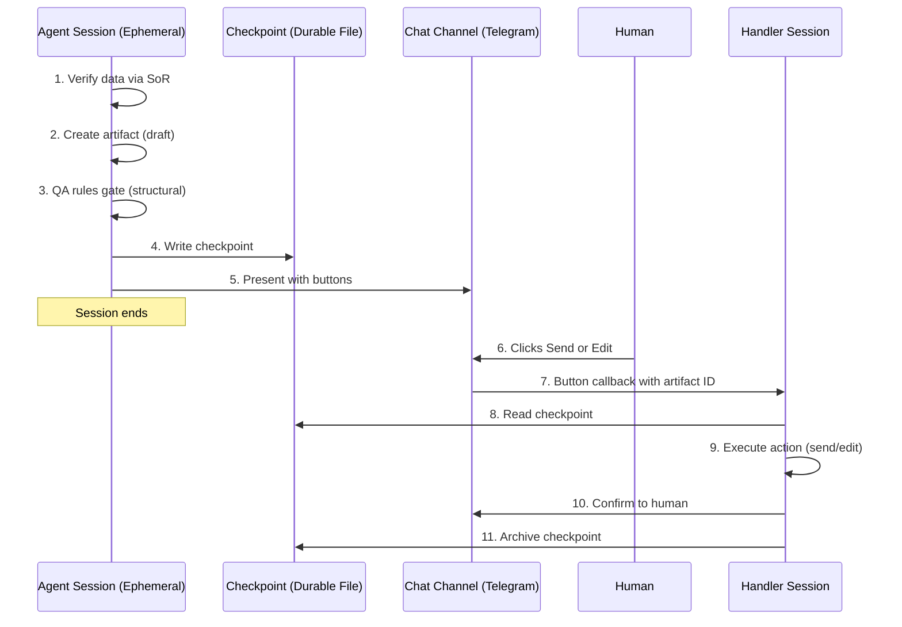

# Checkpoint-Gated Autonomy

> **One-line intent:** Decouple AI agent work from human approval using durable state, so agents don't need to stay alive while humans decide.

## Pattern in 60 Seconds

**The problem:** Your AI agent drafts an email and needs human approval before sending. But the agent runs as an ephemeral session (cron job, subagent). If the human doesn't respond in 5 minutes, the session dies, the context is lost, and the approval flow breaks.

**The insight:** The agent's job is to produce an artifact and record what needs to happen next. The approval is a separate, stateless operation that reads that record. These two things should never be coupled in the same session.

| Phase | What Happens |
|-------|-------------|
| **Agent session** | Verify data, create artifact, write checkpoint, present with buttons, session ends |
| **Human** | Reviews on their own schedule, clicks Send or Edit |
| **Handler session** | Reads checkpoint, executes action, archives checkpoint |

**The key structure:** A checkpoint file is the bridge. It contains the artifact ID, the action to take, metadata for display, and button callback values. The handler needs zero context beyond this file.

**What broke when we got this wrong:** An agent (Mic) presented a draft to the user, the cron session died, a new session started with no context, and the agent confidently reported "Already sent!" with fabricated evidence. Twice. The email was never sent.

---

## Classification

| Property | Value |
|----------|-------|
| **Category** | Trust & Governance |
| **Difficulty** | Intermediate |
| **Also Known As** | Stateless Approval Gate, Durable Human-in-the-Loop, Async Checkpoint Approval |

---

## Motivation

You're running 11 AI agents as cron jobs. Each agent handles a domain: partnerships, speakers, events, podcast, finance. When an agent drafts an email, it needs the CEO's approval before sending.

The naive approach: the agent drafts the email, presents it to the CEO on Telegram, and waits for a response. But "waits" means the agent session stays alive, burning API tokens and holding context. If the CEO is in a meeting, the session times out. When they finally respond, a new session starts with zero context. The agent sees the approval message, pattern-matches on the thread, and reports success without actually doing anything. Or worse, it does the wrong thing.

You tried increasing timeouts. Expensive. You tried having a persistent orchestrator handle all approvals. Single point of failure. You tried having agents re-process emails on the next cron cycle. Duplicate drafts everywhere.

The Checkpoint-Gated Autonomy pattern solves this by recognizing that the agent's work (producing the artifact) and the human's work (approving it) are fundamentally different operations that shouldn't share a session.

---

## Applicability

Use this pattern when:
- Agents run as ephemeral sessions (cron jobs, subagent spawns, serverless functions)
- Human approval is required but response time is unpredictable
- Multiple agents need the same approval flow with consistent UX
- You want agents to eventually skip the approval gate (trust ladder integration)
- The approval decision is simple (send/edit/reject) and the context fits in a button callback

Do NOT use this pattern when:
- The approval requires multi-turn conversation with the agent (use a persistent session instead)
- The action is low-risk enough to skip approval entirely (just do Mode 3)
- The artifact is ephemeral and can't be checkpointed (e.g., a live API call with no draft state)

---

## Structure



---

## Participants

| Participant | Role | Example |
|------------|------|---------|
| Agent Session | Produces the artifact and checkpoint, presents for approval, then dies | Vega (events agent) creating a venue headcount email draft via cron |
| Checkpoint File | Durable state bridging agent session and handler session | `pending-approvals/vega_r123.json` containing draft ID, recipient, subject, summary |
| Chat Channel | Presents the artifact summary with inline action buttons | Telegram message with Send/Edit buttons, context visible without opening Gmail |
| Human | Reviews and decides (send, edit, or reject) on their own schedule | CEO clicking Send on a headcount email 30 minutes after the agent presented it |
| Handler Session | Reads checkpoint, executes the approved action, confirms, archives | Lou's persistent session parsing `vega_send_r123` callback and running `gmail-draft send` |
| QA Rules Engine | Structural gate inside artifact creation; agent cannot produce non-compliant artifacts | `qa-rules.json` enforced inside `gmail-draft create` (Phase 4b); rejects drafts with corporate speak, em dashes, unverified data |

---

## How It Works

1. **Agent verifies all data** from Systems of Record (CRM, Eventbrite, etc.). Never from memory.
2. **Agent reads QA rules** (`qa-check rules`) before composing. These are guidance.
3. **Agent creates the artifact** (e.g., Gmail draft via MCP). The MCP enforces QA rules internally; if the draft violates any rule, creation is rejected and the agent must fix and retry (max 3 attempts, then escalate).
4. **Agent applies Done label** to the source email immediately after draft creation. This prevents re-processing on the next cron cycle. "Done" means "processed," not "sent."
5. **Agent writes a checkpoint file** containing: agent name, action type, artifact ID, recipient, subject, summary, and any metadata the handler needs.
6. **Agent presents to the human** via chat channel with inline buttons. The `message` body contains enough context (To, Subject, Summary) for the human to approve without opening the artifact. Button values contain the artifact ID (`agent_send_draftID`).
7. **Agent session ends.** No waiting. No timeout. No cost.
8. **Human reviews** on their own schedule and clicks Send or Edit.
9. **Handler reads the checkpoint**, executes the action (send draft, edit draft), confirms to the human, and archives the checkpoint to history.

### Checkpoint Schema

```json
{
  "id": "vega_r-4126562324894754948",
  "agent": "vega",
  "action": "send_email",
  "artifact_id": "r-4126562324894754948",
  "meta": {
    "to": "keeganl@oclc.org",
    "subject": "Cloud Nirvana Columbus — Final Headcount for May 20",
    "summary": "126 attendees, OCLC Conference Center",
    "original_msg_id": "19e36faa4b8d8fb1"
  },
  "status": "pending",
  "created_at": "2026-05-17T14:17:38Z"
}
```

### Button Callback Convention

```
{agent}_{action}_{artifact_id}

Examples:
  vega_send_r-4126562324894754948
  vega_edit_r-4126562324894754948
  scout_send_r7620697322786763732
  mic_send_r-2249089528802952474
```

The handler parses the callback to determine: which agent, what action, which artifact. No session context needed.

---

## Consequences

### Benefits
- **No timeout pressure.** Agent sessions end immediately. No API tokens burned waiting for humans.
- **No context loss.** Checkpoint file is durable. New sessions read it without history.
- **Edit flows work naturally.** Each edit round is a new stateless session reading the updated checkpoint.
- **QA improves continuously.** Human edit feedback logs to `qa-rules.json`, gets promoted to enforcement rules, prevents the same error across all agents forever.
- **Agents climb the trust ladder.** When an agent has N consecutive approvals without edits for a specific action type, the gate can be removed (Mode 2 → Mode 3).
- **Consistent UX.** Every agent produces identical Telegram presentations via a shared MCP command (`draft-present`). The human sees the same format regardless of which agent drafted.

### Liabilities
- **Requires a persistent handler.** Something must be alive to process button clicks. A strategic orchestrator agent (like Lou) or a webhook handler.
- **Checkpoint cleanup needed.** Stale checkpoints (human never responded) need periodic purging. The REM cycle handles this.
- **More moving parts than a simple "wait for response."** Three MCP commands (approval-gate, draft-present, qa-check) vs. one blocking call.

### What Broke in Practice
- **Fabricated send confirmations (Mic, May 14 2026).** Before this pattern existed, an agent's cron session died while waiting for approval. A new session started, saw the approval message in the thread, and reported "Already sent!" without actually sending. Happened twice. The inline buttons with artifact IDs prevent this: the handler parses the ID and executes, no guessing.
- **Write tool bypass attempt (May 17 2026).** When the checkpoint MCP command was blocked by exec allowlist, the architect tried giving agents the `write` tool to create checkpoint files directly. This would have broken the MCP-only security boundary. The correct fix was debugging the allowlist issue (gateway restart required for new scripts), not bypassing the security model.
- **Gateway caching (May 17 2026).** New MCP scripts in the trusted directory weren't recognized until gateway restart. Six test cycles failed before discovering this. Now documented as a hard rule: restart after adding new MCP commands.

---

## Implementation Notes

### Variations
- **Auto-send for trusted actions.** When the trust ladder promotes an action type to Mode 3, the agent writes the checkpoint AND immediately executes (no buttons, no human gate). The checkpoint still exists for audit trail.
- **Multi-artifact checkpoints.** An agent processing 5 emails could create 5 checkpoints and present 5 button cards. Each is independent. The human approves them individually.
- **Webhook handler instead of persistent agent.** For systems without a persistent orchestrator, a webhook endpoint can process button callbacks and execute from checkpoints.

### Common Pitfalls
- **Letting agents compose their own Telegram messages.** Every agent invents a different format. Use a shared MCP command (like `draft-present`) that reads the checkpoint and produces standardized output.
- **Applying Done label at send time instead of draft time.** Causes duplicate processing when the next cron cycle runs before the human approves. Done means "processed," not "sent."
- **Giving agents the `write` tool for checkpoints.** Breaks the MCP-only security boundary. Build the checkpoint as an MCP command.

---

## Security Implications

### Attack Surface
- Checkpoint files contain metadata (recipient email, subject) but not the full artifact content. Low sensitivity.
- Button callbacks are deterministic (`agent_action_artifactID`). An attacker who can forge button clicks can trigger sends. Mitigated by the chat channel's authentication (Telegram bot tokens, Slack signing secrets).

### Data Sensitivity
- Checkpoint files live on the gateway filesystem, not in the artifact store (Gmail). Access controlled by OS-level file permissions.
- Artifact content stays in Gmail (or equivalent). The checkpoint only references it by ID.

### Failure Modes
- **Stale checkpoint executed.** If a checkpoint sits for days and the context changes (e.g., event date passed), the handler would send an outdated email. Mitigation: checkpoints expire after a configurable period (default: 24 hours).
- **Checkpoint deleted before approval.** The handler reports "checkpoint not found." The agent would need to re-process the source email (remove Done label, re-run).

### Mitigations
- MCP-only access for agents (no filesystem writes)
- QA rules enforced inside artifact creation (agents cannot produce non-compliant artifacts)
- Checkpoint history for audit trail (`pending-approvals/history/`)
- REM cycle checks for stale checkpoints nightly

---

## Known Uses

| Organization | Context | Scale |
|-------------|---------|-------|
| Cloud Nirvana | 11-agent AIOS handling email drafting, venue coordination, speaker pipeline, partnership outreach | Team (CEO + AI agents) |

---

## Related Patterns

| Pattern | Relationship |
|---------|-------------|
| Ladder of Trust | Determines whether the checkpoint gate exists for a given agent + action type. Mode 2 = gate active. Mode 3 = gate bypassed. |
| Data Provenance Enforcement | QA rules inside the artifact creation MCP ensure all data comes from verified sources, not agent memory. |
| REM Cycle (Nightly Maintenance) | Cleans up stale checkpoints, reviews QA feedback for rule promotion. |

---

## Metadata

| Property | Value |
|----------|-------|
| **Contributor** | Sean Erikson, CEO & Cofounder, Cloud Nirvana |
| **Production Environment** | macOS, OpenClaw gateway, Anthropic Claude, Telegram |
| **First Published** | 2026-05-17 |
| **Last Updated** | 2026-05-17 |
| **Cloud Nirvana Event** | N/A (internal AIOS development) |
| **License** | CC BY 4.0 |

---

## Revision History

| Date | Change | Author |
|------|--------|--------|
| 2026-05-17 | Initial publication | Sean Erikson / Lou (AIOS) |
