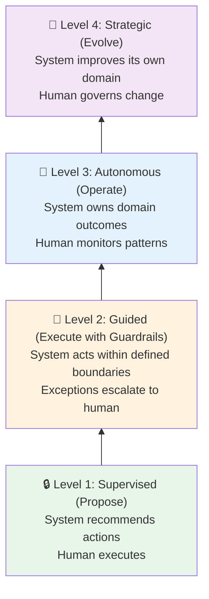
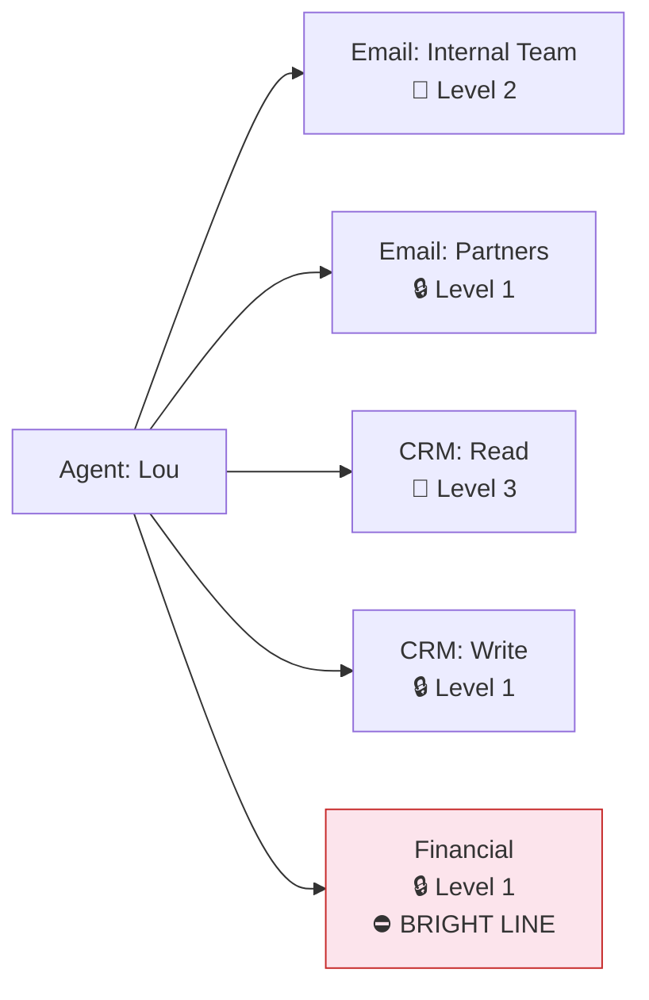
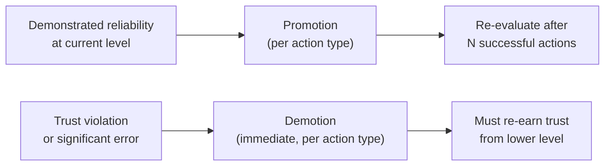
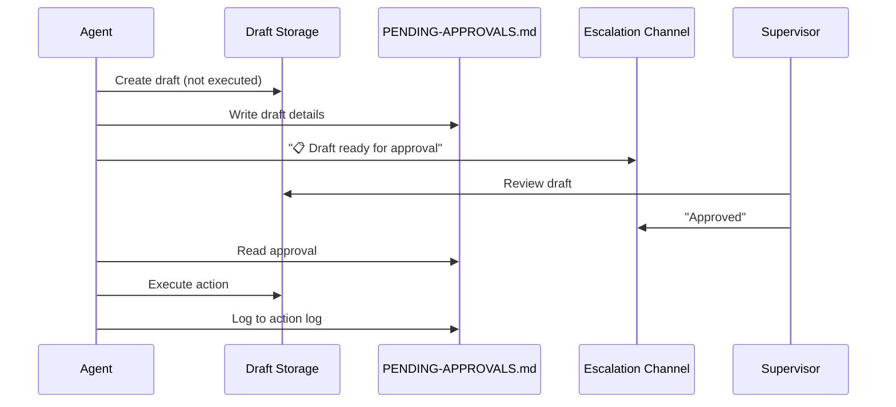

# Ladder of Trust

> **One-line intent:** Incrementally grant an AI system more autonomy by earning trust through demonstrated reliability at each level.

## Pattern in 60 Seconds

**The problem:** You've deployed an AI system that can act on your behalf. How much should you let it do alone?

**The insight:** Trust isn't binary (full autonomy or no autonomy). It's a ladder with four levels, and each level is earned, not granted.

| Level | What happens |
|-------|-------------|
| **Supervised** | AI recommends. Human decides and acts. |
| **Guided** | AI acts within clear boundaries. Anything outside those boundaries goes to a human. |
| **Autonomous** | AI owns its domain. Human watches patterns and intervenes on anomalies. |
| **Strategic** | AI improves its own domain. Human governs the changes. |

**The key rule:** Trust is per-action-type, not global. The same agent can be Supervised for financial transactions and Autonomous for data analysis. Some actions (bright lines) never leave Supervised, no matter how reliable the system becomes.

**What broke when we got this wrong:** An agent moved 107 emails on day two before earning the trust to do so. Nothing was lost, but it proved that skipping levels creates risk even when the system is technically capable.

---

## Classification

| Property | Value |
|----------|-------|
| **Category** | Trust & Governance |
| **Difficulty** | Foundational |
| **Also Known As** | Progressive Autonomy, Trust Escalation, Graduated Delegation |

---

## Motivation

You've just deployed an AI agent that can draft emails, update your CRM, and send messages on your behalf. It's capable. It's fast. And on day two, it moves 107 emails out of your inbox without understanding which ones needed a response.

Nothing was lost (you caught it in time), but the trust was damaged. Not the AI's trust in you; your trust in it. And now every action the system takes gets a second look, even the ones that were perfectly fine.

This is the core tension of AI autonomy: the system is often right, but "often" isn't "always," and the cost of being wrong varies wildly. A misclassified email is a minor annoyance. An unauthorized email sent to a partner is a reputation event.

The Ladder of Trust solves this by making autonomy something that's earned, not configured. Each level represents a degree of independence that the system graduates to only after demonstrating reliability at the current level.

---

## Applicability

Use this pattern when:
- Your AI system takes actions that affect real people, data, or reputation
- The cost of errors varies significantly across different action types
- You need stakeholder confidence before expanding AI capabilities
- You're deploying in an environment where trust must be built over time (not assumed)
- Multiple agents or systems need different trust levels for different domains

Do NOT use this pattern when:
- The system operates in a sandbox with no real-world consequences
- All actions are equally low-risk and easily reversible
- Speed of execution matters more than accuracy (rare, but exists)
- You have comprehensive test coverage that validates every action type

---

## Structure

### The Four Levels

> **Note:** Diagrams use Mermaid (renders on GitHub desktop/web). If viewing on mobile or a non-rendering environment, refer to the summary tables below each diagram.



Each level has a **relationship name** (how it feels) and a **behavior name** (what to build):

| Level | Relationship | Behavior | System Authority | Human Role |
|-------|-------------|----------|-----------------|------------|
| 1 | **Supervised** | **Propose** | Analysis + recommendation | Decision-maker + executor |
| 2 | **Guided** | **Execute with Guardrails** | Bounded execution | Boundary-setter + exception handler |
| 3 | **Autonomous** | **Operate** | Domain ownership | Pattern-watcher + strategist |
| 4 | **Strategic** | **Evolve** | Self-improvement within governance | Governor + approver of change |

### Cross-Context Examples

| Level | Email Agent | Inventory System | Code Pipeline | Decision Engine |
|-------|-----------|-----------------|--------------|----------------|
| 1. Propose | Drafts email, human sends | Suggests reorder quantities, human places order | Generates PR, human reviews and merges | Surfaces options with tradeoffs, human decides |
| 2. Execute with Guardrails | Sends routine replies; flags ambiguous ones | Auto-reorders below threshold; unusual patterns escalate | Auto-merges small passing PRs; large changes need review | Handles decisions within policy; novel situations escalate |
| 3. Operate | Owns inbox for its domain; human reviews weekly digest | Manages supply chain; human reviews dashboards | Owns CI/CD pipeline; human reviews architecture | Makes domain decisions; human sets strategy |
| 4. Evolve | Proposes new routing rules based on observed patterns | Proposes supplier changes based on performance data | Refactors its own pipelines, proposes architectural improvements | Identifies blind spots, recommends new decision criteria |

### Bright Lines

> **Guardrails are not bureaucracy. Guardrails are bright lines.**

Bright lines are actions that **never** change level regardless of earned trust. They are permanent constraints, not temporary training wheels.

There is a critical difference between two approaches:

- **Suffocating:** "Get approval before doing anything." This turns a high-performing team member into a very expensive assistant.
- **Empowering:** "Do whatever you think is right, except these three things." This creates space for judgment while maintaining non-negotiable safety.

Bright lines are defined per-system, but common examples include:
- Financial transactions above $X → always Level 1
- External communications involving legal, compliance, or regulatory matters → never above Level 2
- Data deletion → always Level 1
- Actions involving PII or sensitive data → never above Level 2

```yaml
bright_lines:
  financial_transactions:
    max_level: 1
    reason: "Human-only. No exceptions."
  
  external_legal_communications:
    max_level: 2
    reason: "Compliance risk requires human review"
  
  data_deletion:
    max_level: 1
    reason: "Irreversible. Always requires human confirmation"
```

### Trust is Per-Action-Type, Not Global

A single agent can (and should) operate at different levels for different action types simultaneously. "The agent is reliable" is too broad. "The agent is reliable for internal team emails" is actionable and auditable.



---

## Participants

| Participant | Role | Example |
|------------|------|---------|
| **AI Agent** | The system being granted progressive autonomy | An email-drafting agent, a CRM updater, a supply chain optimizer |
| **Human Supervisor** | The person granting or revoking trust at each level | CEO, ops lead, domain expert |
| **Action Log** | Record of all actions taken, used for trust evaluation | Done-logs, audit trails, PENDING-APPROVALS.md |
| **Trust Policy** | Documented rules defining what each level allows per action type | Agent charter, per-action trust config, bright lines registry |
| **Escalation Channel** | How the agent signals uncertainty or requests approval | Telegram notification, email alert, Slack message |
| **Bright Lines Registry** | Permanent constraints that never change regardless of level | Financial limits, compliance rules, data sensitivity boundaries |

---

## How It Works

### Level 1: Supervised (Propose)

The system recommends actions. Humans execute. Nothing changes in the real world without human action.

This is where every agent starts. Not because the agent isn't capable, but because trust at this stage hasn't been earned. The human is learning the agent's judgment; the agent is learning the domain's constraints.

### Level 2: Guided (Execute with Guardrails)

The system acts autonomously within defined boundaries. Everything inside the boundary is autonomous; everything outside escalates.

The key implementation detail: you need three things:
1. **Boundary definitions** (what's in scope, what's not)
2. **Execution engine** (how the system acts within boundaries)
3. **Escalation path** (how exceptions reach a human)

### Level 3: Autonomous (Operate)

The system manages its domain end-to-end. Oversight shifts from per-action to per-pattern. Humans monitor outcomes, not individual actions.

The distinction from Level 2: at Level 2, the system handles tasks. At Level 3, the system owns outcomes.

### Level 4: Strategic (Evolve)

The system improves its own domain. It proposes changes to its own boundaries, workflows, and capabilities. It doesn't just execute the playbook; it improves the playbook.

Critical constraint: evolution happens within governance. The system proposes changes; a human approves them. Self-modification without oversight is not Level 4; it's a failure mode.

### Promotion and Demotion



**Promotion criteria (define BEFORE promoting):**
- N consecutive successful actions with minimal revisions
- No escalations triggered by errors (escalations by design are fine)
- Time at current level (minimum dwell time prevents premature promotion)

**Demotion triggers (define BEFORE promoting):**
- Incorrect data in a sent communication → drop to Level 1 for that action type
- Action taken outside defined domain → drop to Level 1 globally
- Unauthorized disclosure of sensitive data → drop to Level 1 globally + incident review
- Cost overrun beyond threshold → drop to Level 1 for that action type

Trust is earned slowly and lost quickly.

### Configuration Example

```yaml
# Agent trust configuration
agent: lou
trust_levels:
  email_internal_team:
    level: 2  # guided: execute with guardrails
    promoted_on: 2026-03-10
    evidence: "30 consecutive correct drafts, zero revisions needed"
    demotion_trigger: "incorrect data in sent email"
    demotion_target: 1
  
  email_partners:
    level: 1  # supervised: propose
    bright_line: false
    reason: "External reputation risk; all partner emails require approval"
  
  email_community:
    level: 1  # supervised: propose
    reason: "Brand voice must be consistent"
  
  crm_read:
    level: 3  # autonomous: operate
    reason: "Read-only, no risk"
  
  crm_write:
    level: 1  # supervised: propose
    reason: "Data integrity matters"
  
  financial_transactions:
    level: 1  # supervised: propose
    bright_line: true  # NEVER above Level 1
    reason: "Human-only. No exceptions."

# Demotion policy
demotion_policy:
  - trigger: "incorrect data in sent communication"
    action: "drop to Level 1 for that action type"
    recovery: "10 consecutive correct actions"
  
  - trigger: "action taken outside defined domain"
    action: "drop to Level 1 globally"
    recovery: "manual review required"
  
  - trigger: "cost overrun beyond 2x expected"
    action: "drop to Level 1 for that action type"
    recovery: "root cause analysis + 5 correct actions"
```

### Approval Flow Example (Level 1: Supervised)



---

## Consequences

### Benefits
- **Zero catastrophic errors.** In 4 weeks of operation across 11 agents, zero reputation-damaging actions taken, zero data shared inappropriately.
- **Measurable trust building.** Promotion decisions based on evidence: "this agent has drafted 200 emails with a 95% first-draft approval rate." Not feelings.
- **Stakeholder confidence.** When the CEO can say "every external email requires my approval," partners and community trust the system.
- **Graceful capability expansion.** New capabilities start at Level 1 automatically. No one has to remember to add guardrails.
- **Organizational clarity.** Building the ladder forces teams to answer questions they've been avoiding: What do we own? What do we influence? What is not ours? What are our non-negotiables? AI exposes ambiguity instantly.

### Liabilities
- **Speed.** Level 1 operations are bottlenecked by human availability. If the supervisor is in meetings all day, proposals pile up.
- **Supervisor fatigue.** Reviewing 50 proposals per day is unsustainable. Promotion to Level 2 for low-risk actions is necessary for scale.
- **False confidence.** A long streak of correct actions doesn't guarantee the next one is correct. Edge cases surface on their own timeline, not yours.

### What Broke in Practice

- **Day 2: Mass email move.** Agent operated at Level 2 for email organization before earning it. Moved 107 emails without understanding response requirements. Demoted to Level 1 for all email operations. **Lesson:** the default level for new capabilities should always be Level 1. Always.

- **$200 overnight.** All agents left running overnight without cost optimization. No fit-for-purpose model selection, no efficiency tuning. $200 in token charges by morning. **Lesson:** trust isn't just about accuracy; it's about discipline. Cost control is a trust dimension. The system needed the same budget consciousness you'd expect from a human team.

- **Draft contamination.** When agents shared a global drafts pool, one agent's approved draft could be accidentally sent by another. **Lesson:** isolation between agents is a trust requirement, not a convenience.

- **Calendar assumptions.** Agent drafted meeting responses with calendar availability it couldn't verify (no access to work calendar). **Lesson:** if an agent can't verify data, it should use a placeholder, not guess. Trust includes knowing what you don't know.

### What Survived in Practice

- **Per-agent data access control.** We implemented encrypted databases with per-agent authorization wrappers. Each agent has a defined access matrix: which tables it can read, which it can write, and which are completely off-limits. A partnership agent can see partner names but not dollar amounts. A finance agent can read invoices but not community contacts. Every query is logged to an immutable audit trail. This is Level 2 (Guided: Execute with Guardrails) enforcement at the data layer, and it works. See the companion pattern: [Per-Agent Data Access Control](../security-compliance/per-agent-data-access-control.md).

- **The capability gap.** A team member asked the system for event attendance numbers. The system didn't yet have access to the event platform. Instead of failing silently or making up data, it responded honestly that it didn't have access, then sent the supervisor a request for the API key. Once provided, it wired up the integration, learned the data structure, retrieved the numbers, and completed the task. **Lesson:** this is Level 1 working correctly. The agent recognized a gap, escalated appropriately, expanded its capability within guardrails, and completed the work. Trust was reinforced, not eroded.

---

## Implementation Notes

### Variations

**Per-Domain Trust:** Different levels for different business domains within the same agent. Email communication might be Level 1 while data analysis is Level 3. This is the recommended default; global trust levels are too coarse.

**Time-Boxed Promotion:** Grant Level 2 for a defined period (1 week), then evaluate. If no issues, make it permanent. If issues surface, revert. Useful for cautious organizations.

**Peer Review:** Instead of supervisor approval, another agent reviews the proposal. Useful when the supervisor is unavailable but reduces the human-in-the-loop guarantee.

**Bright Line Registry:** Maintain a documented list of actions that can never exceed a certain level without explicit policy change. Prevents scope creep and makes the non-negotiables visible to everyone.

### Enforcement: Prompt-Level vs System-Level

A critical implementation question: **who enforces trust levels?**

| Enforcement Model | Mechanism | Strength | Weakness |
|-------------------|-----------|----------|----------|
| **Prompt-level** | Agent instructions say "don't do this" | Zero infrastructure cost, fast to implement | Agent can hallucinate, be manipulated, or creatively reinterpret instructions |
| **Tool wrappers** | Wrapper scripts check authorization before executing | Catches accidental violations | Agent with shell access can bypass |
| **Credential-based** | Each agent gets separate DB users/API keys with matching permissions | Database enforces it, not the agent | Requires infrastructure (not available in SQLite) |
| **Sandbox/runtime** | Container-level restrictions on file system, tools, network | True enforcement; agent literally cannot access what it's not authorized for | Requires Docker or equivalent; significant infrastructure |

**Where most teams start:** Prompt-level. It's pragmatic and works when Level 1 (Supervised) is the default, because the human gate catches violations.

**Where teams should aim:** Sandbox/runtime enforcement. The agent shouldn't be trusted to enforce its own constraints. That's like asking an employee to manage their own access permissions.

**Recommended layered approach:**
1. Prompt-level trust for Level 1 actions (human gate makes it safe regardless)
2. Tool wrappers for high-risk operations (data mutations, external API calls) that check authorization before executing
3. Audit logging for all operations so violations are detected even if not prevented
4. Sandbox/container enforcement as the production target for Level 2+ operations
5. Credential-based isolation (separate DB users, scoped API keys) for systems that support it

**Key insight:** Prompt-level enforcement is acceptable at Level 1 because the human gate is the real control. At Level 2 and above, system-level enforcement becomes critical. The higher the autonomy, the less you should rely on the agent to police itself.

### Common Pitfalls

- **Promoting too fast.** The temptation after 10 successful actions is to jump two levels. Don't. Edge cases take time to surface. Trust is earned slowly and lost quickly.
- **Promoting globally instead of per-action-type.** "The agent is reliable" is too broad. "The agent is reliable for internal team emails" is actionable and auditable.
- **No demotion criteria defined.** Define what triggers a demotion BEFORE promoting. If you wait until something goes wrong to decide the consequences, emotion drives the decision instead of policy.
- **Treating guardrails as bureaucracy.** If your team sees the trust ladder as overhead rather than empowerment, you've framed it wrong. Bright lines create freedom; they don't restrict it.
- **Forgetting that AI exposes ambiguity.** If the trust ladder is hard to define, the problem isn't the ladder. The problem is that your organization hasn't clarified its own roles, boundaries, and non-negotiables. Fix that first.

---

## Security Implications

### Attack Surface
- **Prompt injection at Level 2+:** If an agent processes external input (email content, form submissions, API responses), a crafted input could manipulate the agent into taking actions beyond its trust level. Higher levels = higher risk.
- **Trust level escalation:** A compromised or manipulated agent could attempt to perform actions above its assigned level. Without system-level enforcement, prompt-based trust relies on the agent's own compliance.
- **Credential exposure:** Agents at Level 2+ may have access to API keys, database connections, or communication channels. A trust violation could expose these credentials.

### Data Sensitivity
- **Action logs contain operational intelligence.** Done-logs, classification logs, and pending-approvals files reveal what the system processes, how it routes decisions, and what it prioritizes. Treat these as sensitive.
- **Trust configuration reveals boundaries.** An attacker who reads the trust config knows exactly what the system can and cannot do, including where enforcement is weakest.

### Failure Modes
- **Silent trust violation:** An agent acts above its level without detection. Blast radius depends on the action type (email sent to wrong person vs data deleted).
- **Trust config tampering:** If an agent can modify its own trust-config file, it can self-promote. Trust configuration should be read-only for agents, writable only by supervisors.
- **Demotion bypass:** Agent continues operating at a pre-demotion level because the demotion wasn't enforced at the system level.

### Mitigations
- **Layered enforcement:** Don't rely solely on prompt-level trust. Add tool wrappers, audit logging, and (when infrastructure supports it) sandbox/container-level restrictions.
- **Immutable trust config:** Agents read trust levels but cannot modify them. Changes require human action on a separate control plane.
- **Audit everything:** Log all actions with trust level, agent identity, and action type. Review anomalies (agent acting at a level higher than configured).
- **Rotate credentials:** Agents at Level 1 shouldn't need the same credentials as Level 3 agents. Scope credentials to match trust level.
- **Input validation:** Agents processing external input should sanitize before acting, regardless of trust level.

---

## Known Uses

| Organization | Context | Scale |
|-------------|---------|-------|
| Cloud Nirvana AIOS | Multi-agent system for community operations | Small team, 2,000+ community members |
| [Your implementation here] | [How you applied this pattern] | [Your scale] |

---

## Related Patterns

| Pattern | Relationship |
|---------|-------------|
| **Hub-and-Spoke Orchestration** | The hub agent often manages trust level transitions for spoke agents |
| **Files Over Databases** | Agent isolation (separate workspaces) is a prerequisite for meaningful trust boundaries |
| **Email Triage Priority Chain** | The Named Agent Rule is a trust mechanism (sender chooses who they trust) |
| **Bright Lines Registry** | A companion pattern that documents permanent constraints |
| **Per-Agent Data Access Control** | Enforces trust levels at the data layer with encrypted storage, authorization wrappers, and audit logging |

---

## Metadata

| Property | Value |
|----------|-------|
| **Contributor** | Sean Erikson, CEO & Co-Founder, Cloud Nirvana |
| **Production Environment** | Multi-agent agentic AI system |
| **First Published** | March 2026 |
| **Last Updated** | March 19, 2026 |
| **Cloud Nirvana Event** | Columbus Q1 2026 (presented live) |
| **License** | CC BY 4.0 |

---

## Revision History

| Date | Change | Author |
|------|--------|--------|
| 2026-03-19 | v1: Initial 5-rung technical draft | Lou 🔥 |
| 2026-03-19 | v2: Narrative rewrite from Columbus keynote | Sean Erikson / Lou 🔥 |
| 2026-03-19 | v3: Final version. Four-level dual-naming (Supervised/Propose, Guided/Execute with Guardrails, Autonomous/Operate, Strategic/Evolve). Cross-context examples. Bright lines principle. Per-action-type trust. Demotion criteria. Merged best elements from v1 and v2. | Sean Erikson / Lou 🔥 |
