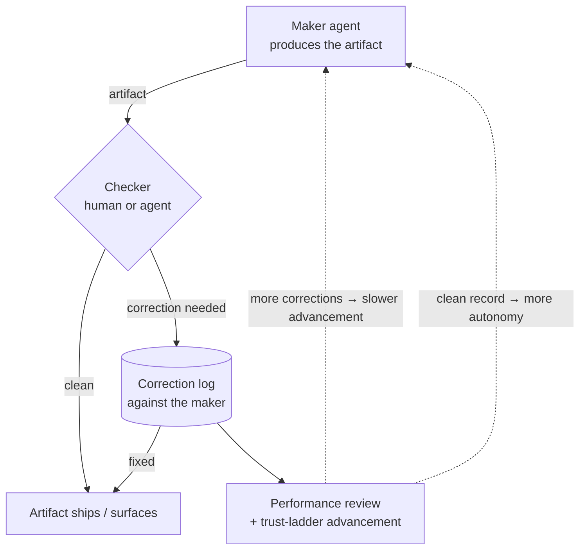

# Maker / Checker for Agents

> **One-line intent:** One agent produces the work and a second agent (or a human) reviews it before it ships — and the corrections that review produces are logged, so quality becomes measurable and trust becomes earned rather than assumed.

## Pattern in 60 Seconds

_The entire pattern distilled into something anyone can read in under a minute. No jargon, no code. A CEO, an engineer, and an entrepreneur should all understand this section._

**The problem:** When a single agent both produces and ships work, quality drifts silently. Nothing fails loudly. The output is "mostly fine" — right up until it isn't, and by then it's already in someone's inbox.

**The insight:** Separate the maker from the checker. The agent that does the work is not the one that clears it. The checker can be a human (human-in-the-loop) or another agent (agent-in-the-loop), and the corrections it produces are logged against the maker's record — so "probably fine" stops being the quality bar and advancement up the trust ladder has to be earned.

**The key structure:**
- **Maker:** the agent that produces the artifact (draft, provisioned agent, report)
- **Checker:** a separate reviewer — human or agent — that clears it before it ships or surfaces
- **Correction log:** every correction the checker makes is recorded against the maker
- **Feedback loop:** logged corrections feed performance review and trust-ladder advancement

**What broke when we got this wrong:** For months, a strategy agent (Lou) did operational work directly instead of routing it to the execution agent (Lou-i), because it had the tools and routing took a second. Most of it worked, so nothing flagged it. Then in late July 2026 a workflow surfaced a raw execution error straight to the owner's phone — the bypassed checks finally showed. That's when "the strategy agent does not execute operational work" became a hard rule.

---

## Classification

| Property | Value |
|----------|-------|
| **Category** | Trust & Governance |
| **Difficulty** | Intermediate |
| **Also Known As** | Four-Eyes for Agents, Producer/Reviewer Separation, Agent-in-the-Loop Review |

---

## Motivation

The dangerous failure in an agent system is rarely the loud one. It's the quiet one: work that is "mostly fine" for long enough that nobody looks closely.

At Cloud Nirvana, the strategy agent (Lou) was designed with broad access — reading across every agent workspace, querying the CRM, pulling context from memory — because that access is appropriate for strategy work. But broad access plus a fast path is a temptation. Routing a task to the execution agent (Lou-i) takes a second. Lou had the email tools already. So, repeatedly, over months, Lou just did the operational work itself: sent the email, wrote to the CRM. Each individual result looked fine. Nothing failed in a way that raised a hand.

What was actually happening is that a whole layer of safeguards was being bypassed — the MCP verification path, the signature checks, the threading validation, the CC-list logic. Not maliciously. Efficiently. Which turns out to be just as dangerous, because efficiency with the guardrails off produces exactly the "mostly fine" that hides the drift.

The forcing event came in late July 2026, in the Todd Federman workflow (logged as BUG-008). The execution agent's error handling was broken; a style-check failure produced a raw execution error; and that raw error surfaced directly to the owner's Telegram, dressed as a normal agent message. The bypassed checks had finally produced a visible failure. That was the moment the soft preference — "route operational work to the execution agent" — became a hard rule written into the agents' charters: the strategy agent does not execute operational tasks.

Maker/Checker is the generalization of that lesson. The agent that makes the work must not be the only thing standing between that work and the outside world. Someone else clears it. And because the point isn't just to catch this one artifact but to raise quality over time, the corrections are logged — turning review from a gate into a measurement, and turning trust from an assumption into something an agent earns.

---

## Applicability

Use this pattern when:
- An agent produces artifacts that leave the system or commission other agents (emails, CRM writes, published docs, newly provisioned agents)
- "Mostly fine" is not good enough because the cost of a bad artifact is real (a partner relationship, a compliance obligation, a corrupted agent)
- You want agent quality to be measurable over time, not just spot-checked
- You are building toward earned autonomy (a trust ladder) and need an enforcement mechanism for advancement

Do NOT use this pattern when:
- The output is internal, disposable, and low-stakes (the review cost exceeds the risk)
- A single well-enforced approval gate already provides the check you need and a second agent adds latency without adding safety
- You cannot yet log corrections meaningfully — in which case start with a human checker and add the logging before you claim the feedback loop

---

## Structure



_The maker never clears its own work. The checker — human or agent — clears it, and each correction is logged against the maker. Those logs feed advancement, so an agent that consistently needs correction does not earn more autonomy, and an agent that consistently ships clean does._

---

## Participants

| Participant | Role | Example |
|------------|------|---------|
| Maker | The agent that produces the artifact. Never clears its own output. | Lou-i drafts an outbound email; Lou conducts a new-agent onboarding interview in Prelude |
| Checker | A separate reviewer that clears the artifact before it ships or surfaces. May be a human (human-in-the-loop) or an agent (agent-in-the-loop). | In Prelude, Lou reviews the onboarding output before an agent is commissioned. In the email pipeline today, the human owner is the checker via the approval gate. |
| Correction log | The record of every correction the checker makes, attributed to the maker. | Corrections captured against Lou-i's record per the email-approval pattern |
| Feedback loop | Turns the log into advancement: reviews and trust-ladder tiers respond to the maker's correction history. | Monthly performance review feeding trust-ladder advancement (defined in charters) |

---

## How It Works

1. **The maker produces the artifact** — a draft, a provisioned agent, a report — and does not ship it.
2. **A checker reviews it.** The checker is deliberately not the maker. It may be a human (the approval gate) or a second agent (Prelude review).
3. **A clean artifact ships or surfaces.** A flawed one is corrected, and the correction is logged against the maker.
4. **Corrections accumulate into a record.** Over time this record is the maker's quality signal — not a vibe, a measurement.
5. **The record drives advancement.** An agent that consistently needs correction does not climb the trust ladder. An agent that consistently ships clean earns more autonomy. The checker is therefore not just a quality gate; it is the enforcement mechanism for earned trust.

### Code / Configuration Example

```yaml
# Maker/Checker as a pipeline policy, not a suggestion.
pipeline: outbound_email
  maker: lou-i                 # produces the draft
  checker: human_approval_gate # clears it before it ships (human-in-the-loop today)
  on_correction:
    log_against: lou-i         # correction recorded against the maker
    feeds: [performance_review, trust_ladder]

pipeline: agent_onboarding      # Prelude
  maker: lou                   # conducts the onboarding interview
  checker: lou-review          # a second agent clears the output (agent-in-the-loop)
  on_correction:
    log_against: lou
    feeds: [performance_review]
```

_The maker and checker are named separately and cannot be the same identity. Corrections are attributed, so the record that governs advancement is built automatically from real review outcomes._

---

## Consequences

### Benefits
- **Catches silent quality drift** — the "mostly fine" failure mode that has no error signal.
- **Makes quality measurable.** Logged corrections turn review into data, which turns trust into something earned.
- **Gives the trust ladder teeth.** Advancement has an evidence base instead of a gut feel.
- **Separation of duties.** The producer of work is never its sole clearer — a governance property auditors already understand.

### Liabilities
- **Latency and cost** of a second reviewer on every artifact. Reserve it for work where the stakes justify the step.
- **The checker can become the bottleneck** — especially a human checker at volume.
- **Logging is load-bearing.** Without the correction log and the feedback loop, you have review but not earned trust; you're spot-checking, not measuring.

### What Broke in Practice
_This section is mandatory. No pattern is accepted without honest failure modes._

- **The maker was also the shipper, for months, invisibly.** The strategy agent did operational work directly because it had the tools and routing took a second. The MCP verification, signature checks, threading validation, and CC-list logic were all bypassed. Most of it worked, so nothing flagged it — quality degradation with no visible failure signal.
- **The forcing failure was late July 2026 (Todd Federman workflow, BUG-008):** broken error handling in the execution agent surfaced a raw execution error straight to the owner's Telegram as a normal agent message. That visible failure is what turned a preference into a hard rule.
- **Honest current state:** the agent-to-agent version is live in Prelude (one agent reviews another's onboarding output before commissioning). In the email pipeline, the checker is currently the *human* at the approval gate, not a reviewing agent — the agent-in-the-loop email review is design intent, not yet implemented. And the "strategy agent does not execute operational work" rule is a **prompt rule** in the agents' charters, not architectural enforcement. It's a well-committed speed bump, not a wall. The wall — a tool policy that structurally excludes the send — is deliberately the second step. The rule came first because we had to learn what the constraint needed to be before hardcoding it.

---

## Implementation Notes

### Variations
- **Human-in-the-loop:** the checker is a person at an approval gate. Simplest, and the right starting point. (This is the email pipeline today.)
- **Agent-in-the-loop:** a second agent is the checker. Scales past human review capacity. (This is Prelude today.)
- **Hybrid / graduated:** agent-checks-agent for routine artifacts, escalating to a human for high-stakes or low-confidence cases — the human checker's load shrinks as the maker's clean record grows.

### Common Pitfalls
- **Same identity as maker and checker.** If the reviewer shares the maker's context or incentives, it isn't a real check. Keep them distinct.
- **Reviewing without logging.** Catching a bad artifact is good; not recording the correction means trust never becomes measurable and advancement stays a guess.
- **Calling the rule a wall.** If "the maker won't ship directly" is a prompt instruction, it's a speed bump. Say so, and build the architectural wall as the next step — don't describe the intent as the implementation.

---

## Security Implications

### Attack Surface
- A maker with direct shipping ability that is only *told* not to use it retains the capability. The speed-bump version depends on the maker's compliance; the wall version removes the capability entirely. Prefer the wall for anything that can leave the system.

### Data Sensitivity
- The checker sees everything the maker produces, including sensitive outbound content. The checker (human or agent) inherits the data-sensitivity requirements of the artifacts it reviews.

### Failure Modes
- Maker bypasses the checker because the capability still exists (the speed-bump gap).
- Checker rubber-stamps under load, so review exists on paper but not in effect.
- Correction log is incomplete, so advancement decisions rest on partial evidence.

### Mitigations
- Move from prompt rule to architected boundary: remove the maker's direct-ship capability so bypass is structurally impossible (pairs with **Per-Agent Data Access Control**).
- Enforce the checker as a required pipeline stage, not an optional courtesy.
- Attribute and store every correction; make the log the input to trust-ladder advancement (pairs with **Ladder of Trust**).

---

## Known Uses

| Organization | Context | Scale |
|-------------|---------|-------|
| Cloud Nirvana | Prelude agent onboarding — one agent reviews another's onboarding output before an agent is commissioned (agent-in-the-loop, live). Email pipeline — human approval gate as checker today, agent review as design intent. | Team |

---

## Related Patterns

| Pattern | Relationship |
|---------|-------------|
| Ladder of Trust | Maker/Checker is the enforcement mechanism for the trust ladder — logged corrections govern advancement |
| Checkpoint-Gated Autonomy | The approval gate that surfaces a maker's artifact for clearing is often the checkpoint boundary |
| Per-Agent Data Access Control | The architectural wall that turns the speed-bump rule ("maker won't ship directly") into a structural guarantee |
| Agentic Identity & Lifecycle | Maker and checker are distinct identities; the lifecycle governs how a maker earns its way to less oversight |
| Memory vs. Authority Boundary | A common thing the checker verifies: that outbound facts were sourced from the System of Record, not memory |

---

## Metadata

| Property | Value |
|----------|-------|
| **Contributor** | Sean Erikson & Lou, Cloud Nirvana |
| **Production Environment** | Cloud Nirvana AIOS, macOS, OpenClaw, small team |
| **First Published** | 2026-09-12 |
| **Last Updated** | 2026-09-12 |
| **Cloud Nirvana Event** | Q3 2026 — Transformation at Scale |
| **License** | CC BY 4.0 |

---

## Revision History

| Date | Change | Author |
|------|--------|--------|
| 2026-09-12 | Initial pattern — written from verified operational ground truth (Todd Federman / BUG-008 origin; Prelude live, email agent-review aspirational; speed-bump not wall) | Lou / Sean Erikson |
