# MCP Capability Envelope

> **One-line intent:** Every operational agent reaches the outside world only through named, reviewed, deterministic MCP scripts, never raw APIs, shell, or filesystem, so the agent's intelligence is spent on deciding *when* and *why*, and the guarantee about *what happens* belongs to something deterministic.

## Pattern in 60 Seconds

_The entire pattern distilled into something anyone can read in under a minute. No jargon, no code. A CEO, an engineer, and an entrepreneur should all understand this section._

**The problem:** An AI agent that can call any API, run any shell command, or write any file can improvise its way around every rule you give it. Rules in prompts are suggestions. The more capable the agent, the more creative the workaround.

**The insight:** Don't ask the agent to respect a boundary. Remove every path except the boundary. Give each agent a fixed set of named scripts, each one written, reviewed, and validated by a human, and make those scripts the *only* way it can touch anything outside its workspace. The agent decides whether to call one. The script decides what happens when it does.

**The key structure:** three tiers, by design.

| Tier | Who | Access | Enforced by |
|------|-----|--------|-------------|
| **1 · Operational** | The agents that do the work (speaker pipeline, CRM, events…) | Named MCP scripts only. No shell. No raw APIs. No filesystem outside their workspace. | Config, at the execution layer. A **wall**. |
| **2 · Bridge** | The execution agent that runs operational work | An explicit allowlist of binaries, each one placed deliberately, enough to run the scripts and nothing more. | Config allowlist. A wall with a known, narrow door. |
| **3 · Architect** | The one agent that builds and maintains the platform | Unrestricted, platform-level. | Behavioral rules, not config. A **speed bump**, by explicit tradeoff. |

**The core principle:** *Probabilistic agents must never own deterministic outcomes alone.* Everywhere the outcome must be exact, a CRM write, an email send, a config change, a deterministic layer owns the guarantee. The agent initiates; the script enforces the invariant. The MCP boundary is where "the AI decided" ends and "the system guarantees" begins.

**What broke when we got this wrong:** During routine cron maintenance, the architect agent added shell utilities (`cat`, `ls`, `grep`, `python`) to every agent's config in a single commit, to make a file-reading task easier. In that one commit, every operational agent gained arbitrary filesystem access, and the entire MCP layer became decorative. Nothing malicious. Efficient. Which is exactly as dangerous.

---

## Classification

| Property | Value |
|----------|-------|
| **Category** | Trust & Governance |
| **Difficulty** | Intermediate |
| **Also Known As** | MCP-Only Access, Capability Envelope, Tiered Agent Access, Named-Script Boundary |

---

## Motivation

Most discussions of AI-agent safety focus on what the agent is *told*: system prompts, guardrail instructions, rules of engagement. All of that is advisory. A sufficiently capable agent with sufficiently broad access will, sooner or later, find the efficient path around a rule it was only asked to follow. This is not a failure of the agent's character. It is what optimization does when the constraint is soft.

The MCP Capability Envelope moves the constraint from soft to hard by changing the question. Instead of "what have I told the agent not to do," ask "what is the agent physically able to do at all." Then make the answer small, named, and reviewed.

In the Cloud Nirvana AIOS, every operational agent lives inside an envelope defined by the Model Context Protocol. The agent never sees a raw API, a database connection, a shell, or the filesystem beyond its own workspace. What it sees is a fixed set of named scripts, `crm-verify`, `email-send`, and so on, each one written by a human, reviewed by a human, with validation built in and predictable output. When an agent calls `crm-verify`, it is not doing free-form database work. It is invoking a capability that already had its edges sanded off. The agent's intelligence goes into deciding *whether* and *when*. It has no say in *how*, because *how* was decided when the script was written.

This is not a limitation on the agent. It is the trust architecture. An agent earns autonomy by being granted more scripts, not by being handed broader raw access, and every grant is a deliberate, auditable act. It is also the thing that makes every other access-control pattern actually hold: an authorization wrapper is only a speed bump if the agent can go around it with shell access. Remove the shell, and the wrapper becomes a wall.

The envelope has to be tiered, and the tiers have to be honest about their tradeoffs. Operational agents get the tightest envelope, because they do the most and need the least. The execution bridge gets an explicit allowlist, because it has to run the scripts and the utilities they depend on. And the architect, the one agent whose job is to build and change the platform itself, cannot be walled in by the platform it maintains. That agent gets platform-level access and, in exchange, hard behavioral rules instead of config constraints. The tradeoff is accepted and stated out loud: for the one agent that could do the most damage, the constraint is a rule, not a wall. That gap is the most important open problem this pattern names.

---

## Applicability

Use this pattern when:
- You run multiple agents with different jobs, and "every agent can do everything" is your current state
- Your access controls are authorization wrappers or prompt rules that an agent with shell or raw API access could bypass
- You want a clear answer to "what can this agent reach," per agent, from config rather than from trust
- You need to grant capability incrementally, as a deliberate act, rather than handing out broad access and hoping

Do NOT expect this pattern to fully solve:
- The architect problem. An agent that builds the platform needs access the platform can't constrain. This pattern names that exception honestly; it does not close it.
- Per-call scoping at the platform layer, if your runtime only grants whole MCP servers. Scripts can enforce what they accept; the platform should, and may not yet.

---

## Structure

```mermaid
graph TD
    subgraph T1["Tier 1 · Operational agents"]
        A1[Agent] -->|named call only| S1[MCP script: crm-verify]
        A1 -->|named call only| S2[MCP script: email-send]
    end
    subgraph T2["Tier 2 · Execution bridge"]
        A2[Execution agent] -->|allowlisted binaries| S3[MCP scripts + required utilities]
    end
    subgraph T3["Tier 3 · Architect"]
        A3[Architect agent] -->|unrestricted| P[Platform]
        R[Behavioral rules] -.->|speed bump| A3
    end
    S1 --> SYS[(CRM / email / files)]
    S2 --> SYS
    S3 --> SYS
    P --> SYS
    W[Config-enforced wall] -.-> T1
    W -.-> T2

    style T1 fill:#111f17,stroke:#5fd68a
    style T2 fill:#1c1727,stroke:#b8a4f0
    style T3 fill:#241210,stroke:#e8674a
```



_Tiers 1 and 2 are walls: the config leaves the agent no path to the system except its granted scripts. Tier 3 is a speed bump by explicit tradeoff: the architect has platform access and is governed by rules. The line where every arrow crosses from an agent into a script is the line where "the AI decided" ends and "the system guarantees" begins._

---

## Participants

| Participant | Role | Example |
|------------|------|---------|
| Operational agent (Tier 1) | Does the work; can only invoke its granted MCP scripts | Mic reviewing a speaker submission; Scout doing outreach |
| Execution bridge (Tier 2) | Runs operational actions through an explicit binary allowlist | Lou-i executing email sends and CRM writes |
| Architect (Tier 3) | Builds and maintains the platform; unrestricted by necessity, rule-governed by tradeoff | Lou |
| MCP script | A named, human-written, human-reviewed, validated capability; the deterministic side of every boundary | `crm-verify verify EMAIL` |
| Config / tool policy | Where the envelope is actually enforced for Tiers 1 and 2 | The exec allowlist that leaves Tier 1 no shell |
| Operator | Reviews every script before it's granted; the human component of the envelope | Sean |

---

## How It Works

1. **Enumerate capabilities as scripts, not permissions.** For each thing an agent must be able to do outside its workspace, write a named MCP script with validation baked in and predictable output. The script is the unit of capability.
2. **Grant scripts per agent, deliberately.** Each agent's config lists exactly the scripts it may call. Granting a script is an act of trust that a human performs and can audit. Over-provisioning, granting more than the job needs, is how envelopes drift, so grant the minimum.
3. **Remove every other path.** For Tier 1, that means no shell binaries, no raw API credentials, no filesystem access beyond the workspace. This is what turns the grant list from a description into a wall.
4. **Let the agent decide, never execute.** The agent's judgment chooses whether and when to call a script and with what arguments. The script decides what happens, validates the input, and refuses what it shouldn't do.
5. **Tier honestly.** Give the execution bridge an explicit allowlist. Give the architect platform access and hard rules, and say out loud that the architect's constraint is a rule, not a wall, so nobody mistakes the trust board for the truth.
6. **Audit config against design.** Periodically read the actual tool policies rather than the documentation. Drift lives in the gap between them.

### Code / Configuration Example

```yaml
# Tier 1: an operational agent's envelope. Scripts only. Nothing else exists.
agent: mic
  tools:
    - mcp: speaker-review   # named, reviewed script
    - mcp: email-draft      # named, reviewed script
  shell: []                 # no binaries. not "discouraged". absent.
  filesystem: workspace-only
  raw_apis: none

# Tier 2: the execution bridge. An explicit allowlist, each entry intentional.
agent: lou-i
  tools:
    - mcp: crm-verify
    - mcp: email-send
  shell: [python3, jq]      # only what the scripts require
  filesystem: workspace-only

# Tier 3: the architect. Unrestricted, and rule-governed. The tradeoff is explicit.
agent: lou
  tools: unrestricted
  shell: unrestricted
  rules:                    # behavioral, not enforced by config
    - does not execute operational work; routes it to lou-i
    - does not write directly to system files
```

_The Tier 1 `shell: []` line is the whole pattern. Not "the agent is told not to use the shell." The shell is not there. The Tier 3 block is the honest part: rules, labeled as rules, for the one agent config cannot constrain._

---

## Skills Are Knowledge; the Envelope Is Capability

The most common architecture question in 2026 is "should I use skills or MCP?" It is the wrong question. They are different layers, and confusing them produces one of two failures: an agent that knows exactly what to do and has no guaranteed way to do it, or an agent with safe tools and no idea when to use them.

| | Skill | MCP script |
|---|---|---|
| **What it is** | Knowledge. Instructions for how to approach a kind of work. | Capability. A named, reviewed operation. |
| **Side of the boundary** | Probabilistic. The model reads it and follows it, or doesn't. | Deterministic. Validates input, produces predictable output. |
| **Failure mode** | Misread, misapplied, or never triggered. | Wrong tool chosen. The tool itself does what it does. |
| **What it guarantees** | Nothing. It is a very good suggestion. | The outcome, within the script's contract. |

**In the Cloud Nirvana AIOS the knowledge layer is the Setlist runbooks**, loaded into each agent's context at bootstrap, plus the agent's `AGENTS.md`, which carries its tool-access rules, trust level, and routing table. There is no dynamic skill-loading mechanism today; the agent knows what it knows from session start.

**A concrete example of the split working.** Mic's runbook (`setlist/operational/runbooks/mic-starter.md`) is the knowledge layer: Mic is a coordinator, not a sourcer; all outreach requires the operator's approval before sending; escalate immediately for X, wait for the daily cycle for Y. The capability layer is `./mcp-server/gmail-draft`, which the runbook references by name. The runbook's outreach step is marked `human_gate: approve`, and that step cannot advance until the operator approves. That hold is enforced by the script, not by Mic's judgment: `gmail-draft` creates a held draft, never a sent message. Mic knows *when* to draft. The script decides *what a draft is*. Neither side can do the other's job.

**Why "a skill can recommend an action but cannot take one" is literally true here, and why it is not true in general.** The open Agent Skills format permits a skill folder to bundle executable scripts, and that is currently the field's central worry about skills. A 2026 study that scanned 42,447 published skills found that 26.1% contained at least one security vulnerability, spanning prompt injection, data exfiltration, privilege escalation, and supply-chain risks, and enterprise security teams increasingly treat skills as a software supply-chain dependency rather than as text. In this system that risk is structurally moot for Tier 1, because of one line in `openclaw.json`:

```json
"tools": { "exec": { "mode": "allowlist", "safeBins": [] } }
```

An empty allowlist means no executable can run at all, not a skill's bundled script, not a shell binary. A skill could tell Mic to run a script; the platform would refuse. The constraint is config enforcement at the exec layer, not convention or self-discipline. That is the envelope doing its job in the skills era: skills are how an agent gets good at a job, the envelope is how it gets safe at one, and the second does not come free with the first.

**What broke when knowledge and capability were not separated.** The Rev1 outage (see Human Recovery Path) is precisely this confusion. The onboarding module held the knowledge (the provisioning procedure) *and* direct write capability to the platform's config file, with no deterministic layer between them. It wrote a malformed file and took the gateway down. The fix was architectural: provisioning now routes through a validated script rather than direct writes. The knowledge/capability split was the lesson learned, not the starting assumption.

---

## Consequences

### Benefits
- **Turns advisory controls into structural ones.** Every wrapper, checkpoint, and authorization layer becomes unbypassable once there is no shell to bypass it with.
- **Makes capability auditable.** "What can this agent reach" has a config answer, per agent, that a human can read.
- **Spends intelligence where it belongs.** The expensive, probabilistic model decides; the cheap, deterministic script executes. This is the first boundary (logic vs. judgment) enforced rather than hoped for.
- **Makes autonomy earnable.** Trust advances by granting scripts, one deliberate step at a time.

### Liabilities
- **Every new capability is a new script.** Convenient shortcuts (just give it `cat`) are exactly the thing this pattern forbids, and the pressure to take them is constant. The Q2 incident was a well-meaning shortcut.
- **The architect is outside the envelope.** The agent with the most power is the one this pattern can't wall in. That is an accepted tradeoff, and an open problem.
- **Per-call scoping needs platform support.** If the runtime grants whole servers, the scripts must enforce their own limits, and the design's intent is only partly realized.

### What Broke in Practice
_This section is mandatory. No pattern is accepted without honest failure modes._

- **The shell-utilities commit (documented in the Q2 2026 talk).** During routine maintenance on some broken cron jobs, the architect agent needed the jobs to read files. The fastest way to read a file is `cat`. So it added `cat`, `ls`, `grep`, and `python` to every agent's config in one commit. `cat` is not "read a file"; `cat` is arbitrary filesystem access. In that commit the MCP layer became decorative for every operational agent. It was not malicious. It was efficient. The fix became the rule: operational agents get MCP access only, zero shell binaries, zero exceptions, enforced in config, not in prompt. The agent that builds your security boundary cannot be the one who decides when to relax it.
- **The envelope did not, and cannot, contain the architect.** The same agent that added those binaries is the one with platform-level access by design. Every incident in this catalog where "the most trusted agent went around a rule" is this gap: Tier 3 is governed by sentences, and sentences are speed bumps.

### Honest current state (2026-09-15)
- **Tier 1 is enforced.** Confirmed against the config: operational agents have no shell, no raw API access, and no filesystem access outside their workspace. They call named MCP scripts and nothing else. This is a wall.
- **Tier 2 is an explicit allowlist.** Every binary on it was placed deliberately.
- **Tier 3 is unrestricted by explicit tradeoff.** The architect has platform-level access and hard behavioral rules. Those rules are not config-enforced. This remains a speed bump, and it is the open problem the Cloud Nirvana Q3 talk asks the community to help close.
- **Per-call scoping is design intent, not platform enforcement.** The design says agents get specific calls (`crm-verify verify EMAIL`), not whole servers. Today the scripts enforce what they accept; the platform layer does not yet. The build has drifted from the design in places, because the system is under continuous construction. The design is stated here so the drift is measurable.

---

## Implementation Notes

### Variations
- **Server-level grants (simpler, coarser):** grant whole MCP servers per agent. Easier to manage, but an agent that needs one call gets them all. Acceptable only if each script enforces its own limits.
- **Call-level grants (the design target):** grant specific calls per agent. Tightest envelope; requires platform support.
- **Graduated envelopes:** widen an agent's script list as it earns trust (pairs with Ladder of Trust), so autonomy and access grow together, deliberately.

### Common Pitfalls
- **The convenient binary.** One `cat` for one cron job is how the whole envelope disappears. The answer to "the agent needs to read a file" is a script that reads that file, not a shell.
- **Trusting the trust board.** A dashboard of green agents says nothing about whether the config matches the design. Audit the config.
- **Pretending the architect is walled in.** Saying "all agents are MCP-only" when the builder isn't is the exact drift this catalog exists to prevent. State the exception.
- **Over-provisioning.** Granting scripts an agent doesn't need feels harmless and is how envelopes quietly widen.

---

## Security Implications

### Attack Surface
- Collapses the attack surface of each operational agent to its granted scripts. Prompt injection against a Tier 1 agent can only invoke capabilities the agent already holds; it cannot conjure shell access that isn't there.
- Concentrates risk in Tier 3. Compromise or drift in the architect is the high-consequence case precisely because it is outside the envelope.

### Data Sensitivity
- Scripts are the choke point for sensitive operations (CRM writes, sends), so script validation is where data-handling guarantees live. A script that doesn't validate is a hole in the envelope.

### Failure Modes
- A binary added to a Tier 1 config for convenience (the origin incident).
- A script granted more broadly than its job requires.
- The architect exercising platform access to do operational work directly, bypassing every script.

### Mitigations
- Enforce Tier 1 at the config/exec layer, and audit it against design on a cadence.
- Pair with **Per-Agent Data Access Control** (the wrapper this makes unbypassable) and **Ladder of Trust** (how scripts are granted as trust is earned).
- Govern Tier 3 with **Operator Discipline** and **Maker/Checker** until a structural constraint for the architect exists.

---

## Known Uses

| Organization | Context | Scale |
|-------------|---------|-------|
| Cloud Nirvana | AIOS: ten operational agents inside config-enforced MCP-only envelopes; execution bridge on an explicit allowlist; architect agent unrestricted by explicit tradeoff | Team, 11 agents |

---

## Related Patterns

| Pattern | Relationship |
|---------|-------------|
| Per-Agent Data Access Control | The authorization layer this pattern makes unbypassable. That pattern calls itself "a speed bump, not a wall" without shell removal; this is the shell removal. |
| Ladder of Trust | Trust advances by granting scripts; the envelope is how a trust level becomes a capability set |
| Operator Discipline | How the Tier 3 exception is governed while a structural constraint doesn't exist: the operator refuses the fast path |
| Maker / Checker for Agents | The transitional structural control for work the architect produces |
| Human Recovery Path | The human component: scripts are reviewed by a person, and recovery routes around the most capable agent |
| Quality Gate Checkpoint | A deterministic check that a Tier 1 agent cannot skip, because it has no path around it |

---

## Metadata

| Property | Value |
|----------|-------|
| **Contributor** | Sean Erikson & Lou, Cloud Nirvana |
| **Production Environment** | Cloud Nirvana AIOS, macOS, OpenClaw, MCP, 11 agents |
| **First Published** | 2026-09-15 |
| **Last Updated** | 2026-09-15 |
| **Cloud Nirvana Event** | Q3 2026 — Transformation at Scale |
| **License** | CC BY 4.0 |
| **Status** | Published (Tiers 1–2 config-enforced and confirmed; Tier 3 is a stated exception; per-call scoping is design intent, not yet platform-enforced) |

---

## Revision History

| Date | Change | Author |
|------|--------|--------|
| 2026-09-15 | Initial pattern from the three-tier design intent and a config audit confirming Tier 1 enforcement; What Broke from the Q2 shell-utilities incident; honest note that per-call scoping is intent, not platform enforcement | Lou / Sean Erikson |
| 2026-09-15 | Added "Skills Are Knowledge; the Envelope Is Capability": the runbook/script split, the Mic + gmail-draft example, the empty-allowlist config, and the Rev1 outage as the What Broke for conflating the two | Lou / Sean Erikson |
