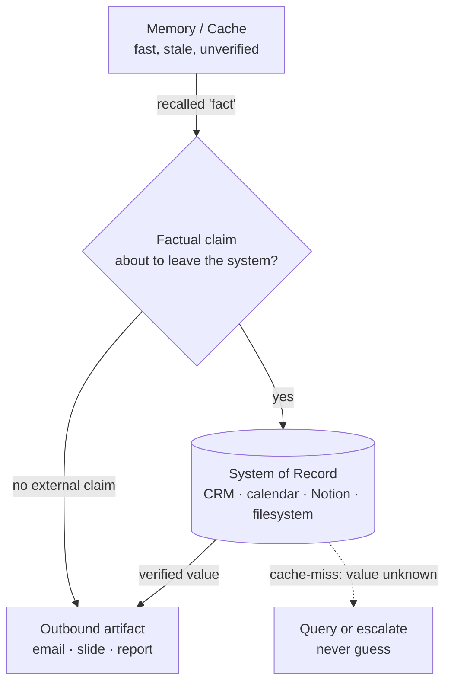

# Memory vs. Authority Boundary

> **One-line intent:** Agents must treat memory as a hypothesis and datastores as truth — every factual claim in an external communication must be verified against the System of Record before use.

## Pattern in 60 Seconds

_The entire pattern distilled into something anyone can read in under a minute. No jargon, no code. A CEO, an engineer, and an entrepreneur should all understand this section._

**The problem:** An AI agent confidently uses a "fact" it learned in a prior session — a person's title, a company name, a date — in an outbound email. The fact is wrong. It changed. Nobody caught it.

**The insight:** Memory is a cache with no expiry and no integrity check. Datastores are the source of truth. Any factual claim that leaves the system must be sourced from the datastore, not from memory.

**The key structure:**
- **Memory (cache):** What the agent "knows" — fast, stale, unverified
- **System of Record (authority):** CRM, calendar, Notion, filesystem — slow, current, verified
- **Boundary rule:** Every factual claim in an external communication → verify against SoR before use
- **Cache-miss is safe:** If you don't know, query. Guessing is never acceptable.

**What broke when we got this wrong:** Agent called a CISO a "founder" in an outbound email because a prior session had stored that context. The contact's role had changed. The CRM had the correct title. The agent never queried it.

---

## Classification

| Property | Value |
|----------|-------|
| **Category** | Trust & Governance |
| **Difficulty** | Foundational |
| **Also Known As** | Cache Invalidation for Agents, SoR-First Verification, Hypothesis-Before-Claim |

---

## Motivation

On April 9, 2026, a Cloud Nirvana AI agent drafted an outbound email referencing a contact as a "founder." The agent had encountered this label in an earlier session — perhaps from a LinkedIn summary, a prior email, or a note someone had written. By the time the draft reached review, the contact had been a CISO at a different company for over a year. The CRM had the correct title. The agent never asked.

The failure wasn't hallucination in the traditional sense. The agent didn't invent the title from thin air — it retrieved something it had genuinely learned. But learned knowledge has no expiry date in most agent architectures. Memory is written once and read indefinitely. The world moves on. The cache doesn't.

This pattern captures the architectural discipline required to prevent this class of failure: agents operating in high-stakes communication contexts must treat every piece of recalled "knowledge" as a hypothesis pending verification, not a fact ready for use. The System of Record — CRM, calendar, task database, filesystem — is the arbiter. Memory is context. Authority is data.

The distinction matters most when the claim is going somewhere it can't be taken back: an email, a slide, a report, a published document. Once a wrong title reaches a CISO's inbox, the trust damage is done. Verification is cheap. Recovery is not.

---

## Applicability

Use this pattern when:
- An agent composes external communications (email, documents, slides) that assert facts about people, companies, dates, or commitments
- Your agents carry context across sessions via memory, notes, or summaries that can age
- You have a System of Record (CRM, calendar, Notion, filesystem) that holds the current, authoritative version of those facts
- The cost of a wrong fact leaving the system is high (trust, compliance, a damaged relationship)

Do NOT use this pattern when:
- The agent's output is internal, disposable, and clearly marked as unverified (brainstorming, a first-pass summary a human will fact-check anyway)
- There is no System of Record to verify against — in which case the fix is to build one, not to trust memory
- The "fact" is genuinely static and owned by memory itself (the system's own design principles, say), with no external SoR that could contradict it

---

## Structure



_Recalled knowledge is a hypothesis. Before any factual claim leaves the system, it is checked against the System of Record. A cache-miss routes to a fresh query or an escalation — never to a guess._

---

## Participants

| Participant | Role | Example |
|------------|------|---------|
| Memory (cache) | Holds recalled context from prior sessions. Fast to read, but has no expiry and no integrity guarantee. | A session note that once recorded a contact as "founder" |
| System of Record | The authoritative, current store for a given fact class. The only valid source for a claim that leaves the system. | The CRM row showing the contact is now a CISO |
| Verification step | The gate that sits between recall and outbound use. Forces an SoR lookup for every external factual claim. | Pre-send check: resolve every asserted title/company/date against the CRM |
| Outbound artifact | Anything leaving the system that asserts facts — the thing that makes verification non-optional. | The drafted email awaiting approval |

---

## How It Works

1. **The agent drafts** using whatever it recalls — memory is fine as a starting point for *shape* and *context*.
2. **Before the artifact leaves the system, every factual claim is extracted** — names, titles, companies, dates, commitments, amounts.
3. **Each claim is resolved against the System of Record**, not against memory. The SoR value wins, always.
4. **On a match, proceed.** On a mismatch, the SoR value replaces the recalled one. On a cache-miss (SoR has no answer), the agent queries further or escalates — it never fills the gap with a guess.
5. **Only verified claims ship.** Memory supplied the draft; authority supplied the facts.

### Code / Configuration Example

```python
# Memory is a hypothesis. The System of Record is truth.
def prepare_outbound(draft, contact_ref):
    # WRONG: trust the recalled context
    # title = memory.get(contact_ref, "title")

    # RIGHT: verify every external claim against the SoR
    record = crm.lookup(contact_ref)          # System of Record
    if record is None:
        escalate("No CRM record for contact; refusing to assert a title.")
        return HOLD                            # cache-miss is safe: never guess
    draft = draft.replace_claim("title", record.title)
    draft = draft.replace_claim("company", record.company)
    return draft
```

_The agent may compose from memory, but no asserted fact reaches the outbound artifact until the CRM has confirmed it. A missing record halts the send rather than licensing a guess._

---

## Consequences

### Benefits
- **Prevents a whole class of confident-but-wrong errors** that pure-hallucination guards miss, because the fact was genuinely learned, just stale.
- **Cheap insurance.** A verification query costs far less than the trust damage of a wrong title in a partner's inbox.
- **Composes with everything.** Any pattern that produces outbound communication inherits the safety when this boundary is enforced.

### Liabilities
- **Latency and query cost** on every external claim. Real, but small relative to the downside, and verification queries don't need frontier models.
- **A hard SoR dependency.** If the System of Record is itself stale or wrong, verification launders bad data into "verified." Garbage in the SoR is still garbage out.
- **Discipline to enforce structurally.** As a prompt instruction it's a speed bump the agent can skip; as an architected pre-send gate it's a wall. The value is in the wall.

### What Broke in Practice
_This section is mandatory. No pattern is accepted without honest failure modes._

- An agent called a CISO a "founder" in an outbound email. The title had changed; the CRM had the correct data; the agent never queried it.
- The trust damage from a wrong title in an external email is unrecoverable once sent — you can't un-send a first impression.
- Memory entries have no TTL. Stale data can persist indefinitely without structural enforcement, and every future session inherits it.

---

## Implementation Notes

### Variations
- **Prompt-level (speed bump):** instruct the agent to verify before asserting. Cheap to add, easy to skip. Acceptable only as a stopgap.
- **Architected pre-send gate (wall):** a verification step the outbound path cannot bypass. This is the version worth having.
- **Claim typing:** tag claim classes (person-title, date, amount) and route each to its correct SoR, so verification knows *which* store is authoritative for each fact.

### Common Pitfalls
- **Verifying against memory-of-the-SoR** instead of the live SoR. A cached copy of the CRM is still a cache.
- **Silent cache-miss handling.** If "no record found" quietly falls through to the recalled value, you've rebuilt the original bug. Cache-miss must halt or escalate.
- **Over-scoping.** Don't force SoR verification on internal, disposable output; you'll add cost and train people to bypass the gate. Reserve the wall for what leaves the system.

---

## Security Implications

### Attack Surface
- If memory can be poisoned (a malicious note, a crafted inbound email that gets summarized into memory), unverified recall becomes an injection path into outbound communication. The boundary blunts this by refusing to ship unverified claims.

### Data Sensitivity
- Verified facts about people (roles, employers, contact details) are personal data. The SoR lookup and the outbound artifact both handle sensitive information and should be access-controlled accordingly.

### Failure Modes
- Poisoned memory asserting a false fact that, absent verification, ships to an external party.
- A compromised or wrong SoR value passing verification and being treated as truth.

### Mitigations
- Enforce verification as an architected gate, not a prompt (pairs with **Ladder of Trust**: higher autonomy tiers still cannot bypass the boundary).
- Constrain which sources may write to memory, so summaries of untrusted inbound content can't silently become "facts."
- Keep the SoR itself governed and current; treat SoR data quality as part of this pattern's dependency surface.

---

## Known Uses

| Organization | Context | Scale |
|-------------|---------|-------|
| Cloud Nirvana | AIOS agent email drafting — CRM verification mandatory before any external communication | Team |

---

## Related Patterns

| Pattern | Relationship |
|---------|-------------|
| Ladder of Trust | The trust ladder defines verification requirements per autonomy tier; no tier is exempt from the boundary |
| Cron as Task Runner, Not Task Definer | Task parameters from the WMS are System of Record — the agent reads them fresh each run, never from session memory |
| Per-Agent Data Access Control | The verification path is an enforced access path to the SoR; going around it is going around the safeguards |
| Context Lifecycle Management | Governs how long context lives in memory, which is the root cause this boundary defends against |

---

## Metadata

| Property | Value |
|----------|-------|
| **Contributor** | Sean Erikson & Lou, Cloud Nirvana |
| **Production Environment** | Cloud Nirvana AIOS, macOS, small team |
| **First Published** | 2026-05-29 |
| **Last Updated** | 2026-09-12 |
| **Cloud Nirvana Event** | Q3 2026 — Transformation at Scale |
| **License** | CC BY 4.0 |

---

## Revision History

| Date | Change | Author |
|------|--------|--------|
| 2026-05-29 | Inception stub — origin story, 60 seconds, classification, motivation | Lou / Sean Erikson |
| 2026-09-12 | Completed applicability, structure, participants, how-it-works, consequences, implementation, security; promoted from draft for Q3 | Lou / Sean Erikson |
