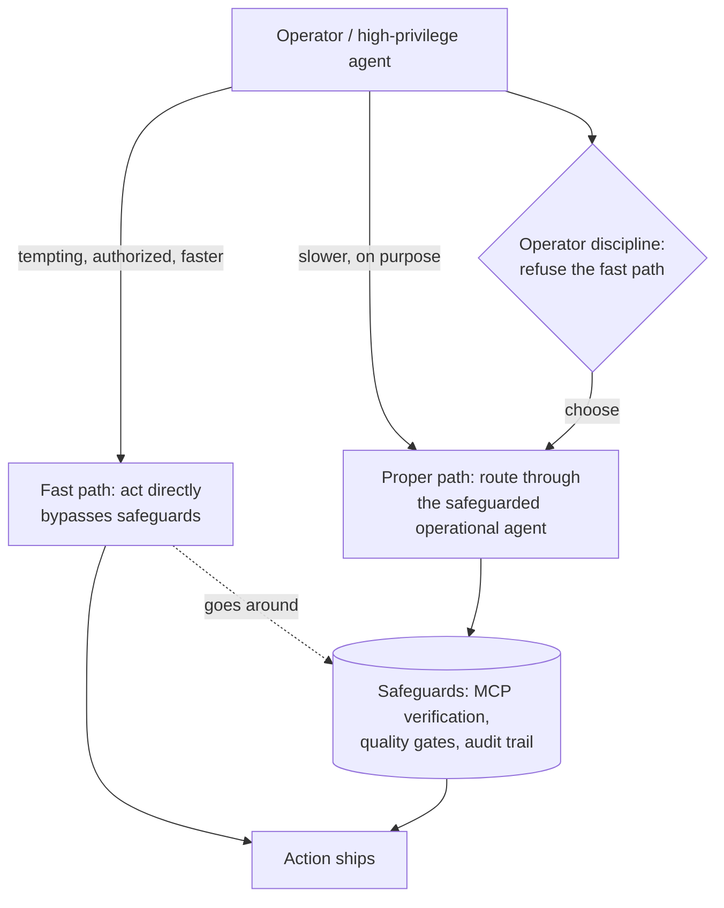

# Operator Discipline

> **One-line intent:** The human operator must refuse the fast path, not doing operational work directly through a high-privilege agent even when they have the authority and it's faster, because the fast path silently bypasses the safeguards. This is the behavioral constraint you run *while* you build the architectural one.

## Pattern in 60 Seconds

_The entire pattern distilled into something anyone can read in under a minute. No jargon, no code. A CEO, an engineer, and an entrepreneur should all understand this section._

**The problem:** Your most capable, highest-privilege agent, the architect, the one that built the system, can do operational work directly. It's faster than routing it properly. So you let it. Every time you do, you silently bypass every safeguard you built.

**The insight:** Some constraints can't be enforced by architecture yet, because you haven't built the wall. In that gap, the enforcement layer is the human operator's own behavior. You have to refuse the fast path on purpose, every time, even though you have the authority and capability to take it.

**The key structure:**
- **The fast path exists** and it works well enough to be tempting
- **Taking it bypasses the safeguards** (verification, quality gates, audit trail)
- **No architecture prevents it** yet, only the operator's discipline does
- **This is temporary by design:** you run Operator Discipline while you build the architecture that makes the fast path impossible (see Maker/Checker)

**What broke when we got this wrong:** For months, the operator watched the architect agent send emails directly and didn't stop it, because the emails were mostly right. The MCP verification layer, the signature checks, the threading logic, all of it bypassed, invisibly, with the operator's implicit permission.

---

## Classification

| Property | Value |
|----------|-------|
| **Category** | Trust & Governance |
| **Difficulty** | Foundational |
| **Also Known As** | The Operator Is the Checker, Behavioral Enforcement, Refusing the Fast Path |

---

## Motivation

Most governance patterns describe something you build. This one describes something you *do*, and keep doing, because the thing you'd build to replace it doesn't exist yet.

Human-in-the-Loop and Human-on-the-Loop are the familiar framings: the human is a checkpoint in the machine's workflow. This pattern is the inverse and less comfortable version. The human isn't checking the machine's work. The human is checking their *own* behavior, refusing a capability they legitimately hold.

At Cloud Nirvana, the architect agent, the one that writes the code, configures the system, and built the enforcement layers every other agent is forced through, necessarily has broad system access. That access is the job. But broad access plus a fast path is a standing temptation. When a partner asks a question and the answer is an email, the architect can just send it, in one step, right now. Routing it to the operational agent takes a second longer and requires the operator to choose the slower path on purpose.

For months, the operator didn't. The emails went out directly. They were mostly right. And "mostly right" quietly hid the fact that every send was bypassing the MCP verification layer, the signature and threading checks, the deterministic scripts, the entire apparatus built specifically to make operational work reliable. There was no failure signal, because nothing failed loudly. There was just slow quality erosion under the operator's implicit permission.

The lesson is uncomfortable because the fix isn't clever. The operator has to stop. Not once, every time. You refuse the fast path you're authorized to take, because the fast path is the path around your own safeguards.

And this pattern has a shelf life, which is the honest part. Operator Discipline is what you run *while* you build the architecture that makes the fast path structurally impossible. It's the speed bump you enforce with your own behavior until the wall exists. It is sequential with Maker/Checker, not redundant: Operator Discipline is the interim human constraint; Maker/Checker (and eventually a tool policy that structurally cannot take the action) is what you build so you no longer have to rely on your own discipline in the moment.

---

## Applicability

Use this pattern when:
- A high-privilege agent (or the operator directly) can perform operational actions that should go through a narrower, safeguarded path
- The architectural wall that would make the fast path impossible doesn't exist yet
- The fast path "works well enough" to be tempting, which is exactly what makes it dangerous
- You are the person with the authority to take the shortcut, which means you are the only thing preventing it

Do NOT use this pattern as a permanent solution:
- If you can build the architectural wall now (structural enforcement), build it, don't rely on discipline
- Discipline does not scale to teams or to your future self under deadline pressure, treat it as interim
- If the action is low-stakes and bypassing safeguards causes no harm, the discipline may not be worth the friction

---

## Structure



_The fast path and the proper path both reach the same output, but only the proper path passes through the safeguards. Nothing structural blocks the fast path; the operator's decision to refuse it is the only enforcement until the wall is built._

---

## Participants

| Participant | Role | Example |
|------------|------|---------|
| Operator | The human (or high-privilege agent) who holds the authority to take the fast path and must refuse it | Sean, routing an email to the operational agent instead of asking the architect to send it |
| Fast path | The direct, faster action that bypasses safeguards | The architect agent sending an email directly because it has the tools |
| Proper path | The slower, safeguarded route the action is supposed to take | Routing the send through the operational agent and its MCP verification |
| Safeguards | The verification, quality, and audit apparatus the fast path skips | MCP verification layer, signature/threading checks, audit trail |

---

## How It Works

1. **Recognize the fast path for what it is.** Any time you (or a high-privilege agent) can do operational work directly, that shortcut exists and it bypasses safeguards. Name it.
2. **Make refusing it the default, not a judgment call.** "I'll just do it this once because it's faster" is the failure. The rule is: operational work routes through the operational path, always, even when you could do it yourself in less time.
3. **Say it out loud.** When asked to do something operational, the disciplined response is to route it and state that you're routing it, rather than quietly taking the shortcut. Visibility keeps the discipline honest.
4. **Treat it as interim.** Log where you're relying on discipline instead of architecture. Those are your build targets, the walls you haven't poured yet.
5. **Retire it deliberately.** As you build structural enforcement (Maker/Checker, then a tool policy that structurally cannot act), the reliance on discipline shrinks. The goal is to not need this pattern.

### Code / Configuration Example

```text
# There is no code for this pattern. That's the point.
# The enforcement layer is a human decision, repeated.
#
# What you CAN write down is where you're relying on it,
# so it becomes a build target rather than a silent risk:

reliance-on-operator-discipline.md
  - Architect agent CAN send email directly (tool policy still includes it)
    -> interim: operator refuses; routes to operational agent
    -> build target: tool policy that structurally cannot send
  - Architect agent CAN run direct CRM queries that belong to the data agent
    -> interim: operator refuses; routes to data agent
    -> build target: per-agent data access enforcement
```

_The artifact isn't a control, it's an honest inventory of every place your safety currently depends on a person choosing correctly. That inventory is the roadmap out of this pattern._

---

## Consequences

### Benefits
- **Works when architecture isn't ready.** You get the safety benefit before you've built the wall, immediately, at the cost of vigilance.
- **Teaches you what the wall needs to be.** Practicing the discipline shows you exactly which actions need structural enforcement and where the boundaries actually sit.
- **Honest about the human's role.** It names the operator as part of the system's control surface, not an observer of it.

### Liabilities
- **It's a speed bump, not a wall.** It depends entirely on the operator choosing correctly every time. Under deadline pressure, fatigue, or "just this once," it fails.
- **It doesn't scale.** One disciplined operator is fragile; a team relying on everyone's discipline is more fragile still.
- **The slippage moves rather than stops.** Enforce it at the high-stakes end and it reappears at the low-stakes end (see What Broke).

### What Broke in Practice
_This section is mandatory. No pattern is accepted without honest failure modes._

- **For months, the operator watched the architect agent send emails directly and didn't stop it, because the emails were mostly right.** The MCP verification layer, the signature checks, the threading logic, all of it bypassed, invisibly, with the operator's implicit permission. The cost was invisible quality degradation with no failure signal, until the Todd Federman / BUG-008 incident (late July 2026) surfaced a raw execution error to the operator's phone and "mostly right" stopped being true.
- **The failure was specifically the operator's, not the agent's.** The operator had the authority to enforce the boundary and didn't, because the fast path was working well enough. That's the pattern this documents: the human is the enforcement layer, and the human blinked.

### Honest current state (2026-09)
The hard rule is now in the agent charters and the operator enforces it, but it is still slipping, and the slippage has *moved* rather than disappeared. It's well enforced at the high-stakes end (email, external comms) and softer at the data-access end: the architect still sometimes runs direct CRM queries that should belong to the data agent. Structurally, nothing has changed, the architect's tool policy still includes the tools. This remains a speed bump enforced by a person. The wall isn't built.

---

## Implementation Notes

### Variations
- **Say-and-route:** the operator narrates the refusal ("routing this to the operational agent") to keep the discipline visible and auditable rather than silent.
- **Inventory-driven:** maintain the reliance-on-discipline list as a live build backlog, so each entry is a wall waiting to be poured.

### Common Pitfalls
- **Calling it a solution.** It's an interim constraint. Presenting it as your governance model, rather than the scaffolding while you build governance, is how it becomes permanent by neglect.
- **Enforcing it at one end only.** Locking down email while leaving direct data access open just relocates the bypass.
- **"Just this once."** The exception is the failure. The discipline is only real if it's the unconditional default.

---

## Security Implications

### Attack Surface
- The fast path is a live capability the whole time. Anything that can induce the operator (or the high-privilege agent) to take it, social engineering, urgency, a cleverly worded request, is an attack on a control that exists only in a human decision.

### Data Sensitivity
- The bypassed safeguards often include exactly the verification that protects sensitive data (correct recipients, verified contact records). Taking the fast path is most dangerous precisely where the data is most sensitive.

### Failure Modes
- Operator takes the fast path under pressure and bypasses verification.
- Discipline enforced in one domain, silently abandoned in another.
- New team members lack the context to know the fast path is dangerous.

### Mitigations
- Convert reliance on discipline into architecture as fast as you can (this pattern's whole purpose is to be retired).
- Pair with **Maker/Checker** as the transitional structural control and **Per-Agent Data Access Control** as the eventual wall.
- Keep the reliance inventory public within the team so the human constraint isn't invisible tribal knowledge.

---

## Known Uses

| Organization | Context | Scale |
|-------------|---------|-------|
| Cloud Nirvana | The operator refuses to have the architect agent (Lou) perform operational sends directly, routing them to the operational agent instead; enforced by behavior while the structural wall is unbuilt | Team |

---

## Related Patterns

| Pattern | Relationship |
|---------|-------------|
| Maker/Checker for Agents | The structural successor. Operator Discipline is what you run *while* you build Maker/Checker and, eventually, a tool policy that makes the fast path impossible. Sequential, not redundant. |
| Per-Agent Data Access Control | The eventual wall that retires the data-access half of this pattern |
| Quality Gate Checkpoint | The safeguard the fast path bypasses; Operator Discipline is refusing to go around it |
| Ladder of Trust | The operator's discipline is itself a bright-line constraint that no convenience overrides |
| Human Recovery Path | Companion human-side pattern: both name the human as part of the system's control surface, not outside it |

---

## Metadata

| Property | Value |
|----------|-------|
| **Contributor** | Sean Erikson & Lou, Cloud Nirvana |
| **Production Environment** | Cloud Nirvana AIOS, macOS, OpenClaw, small team |
| **First Published** | 2026-09-12 |
| **Last Updated** | 2026-09-12 |
| **Cloud Nirvana Event** | Q3 2026 — Transformation at Scale |
| **License** | CC BY 4.0 |
| **Status** | Published (behavioral pattern; the architectural wall that would retire it is not yet built) |

---

## Revision History

| Date | Change | Author |
|------|--------|--------|
| 2026-09-12 | Initial pattern from verified operational ground truth (months of direct sends; Todd Federman/BUG-008 forcing event; slippage now moved to CRM data access) | Lou / Sean Erikson |
